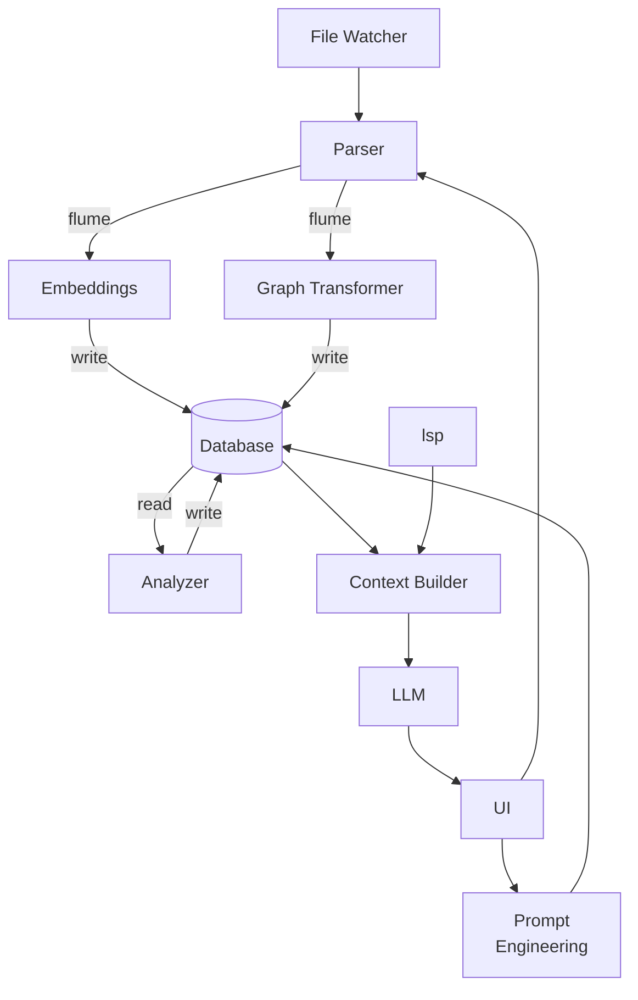

# ploke Project Architecture (WIP)

 ## 1. Project Vision
 ploke aims to be a powerful RAG (Retrieval-Augmented Generation) system for code generation and refactoring. It provides developers with context-aware code suggestions by analyzing their codebase and using that knowledge to enhance LLM-based code generation. The core value proposition is more accurate, contextually relevant code generation that respects existing patterns and conventions in the user's codebase.

 ## 2. Overview
 This document serves as the working design document for the `ploke` project
 workspace.

 The ploke project is an RAG for code generation and refactoring. The project
 should parse a user's repository and (optionally) dependencies into a hybrid
 vector-graph database. The RAG processes user requests for code generation and
 refactoring, querying the database for relevant code snippets to include as
 context for the augmented query sent to the LLM.

 ## 3. Core Concepts

 - **RAG (Retrieval-Augmented Generation)**: A technique that enhances LLM outputs by first retrieving relevant information from a knowledge base, then using that information to augment the prompt sent to the LLM.
 
 - **Vector-Graph Database**: A hybrid database that combines vector embeddings (for semantic similarity search) with graph relationships (for structural understanding). In our case, we use CozoDB which supports both paradigms.
 
 - **Code Graph**: A structured representation of code that captures relationships between different elements (functions, types, modules, etc.). Our implementation uses the `CodeGraph` structure which contains:
   - Functions defined in the code
   - Types (structs, enums) defined in the code
   - All observed types, including nested and generic types
   - Implementation blocks
   - Traits defined in the code
   - Relationships between these elements

 - **AST (Abstract Syntax Tree)**: A tree representation of the abstract syntactic structure of source code. We use the `syn` crate to parse Rust code into ASTs.

 ## 4. System Architecture

 ### 4.1 File System Structure

 ```
 ploke/
 ├── Cargo.toml                # Workspace configuration
 ├── crates/
 │   ├── core/            󱃜    # Core types and traits (NodeId ..)
 │   ├── error/           󱃜    # Cross-crate error types
 │   ├── ingest/               # Core processing Pipeline
 │   │   ├── syn_parser/  🚀   # core traversal + parsing logic....syn
 │   │   ├── lsp/         💤   # LSP data processing
 │   │   ├── embed/       💤   # Vector embeddings.................cozo
 │   │   └── graph/       💤   # AST ➔ CozoDB transformations......cozo
 │   ├── io/              💤   # Input/Output pipeline
 │   │   ├── watcher/     💤   # watches for events (ide, file, lsp)
 │   │   └── writer/      💤   # write code, message ide, commands
 │   ├── database/        💤   # Query processing & ranking........cozo
 │   ├── context/         💤   # aggregate data for llm
 │   ├── llm/             💤   # Local LLM integration
 │   ├── prompt/          💤   # prompt engineering
 │   ├── ui/              💤   # CLI/GUI entrypoints...............egui
 │   └── analyze/         🚀   # Static analysis of parsed data
 ├── examples/                 # Documentation examples
 └── benches/                  # Performance benchmarks

 💤 Asynchronous (tokio)
 🚀 Multithreaded (rayon)
 🚀 <--> flume <--> 💤
 󱃜  Send + Sync (Not tied to tokio or rayon runtime)
 ```

### 4.2 Data Flow Diagrams
 <!-- TODO: Add formal data flow diagrams showing how information moves through th 
 system -->

 Current flow notes:



### 4.3 Implementation Status

| Component | Status | Description |
|-----------|--------|-------------|
| syn_parser | ✅ Implemented | Core parsing logic using syn, visitor pattern, and code graph generation |
| serialization | ✅ Implemented | RON serialization of CodeGraph |
| channel | ✅ Implemented | Flume-based communication between components |
| parallel processing | ✅ Implemented | Rayon-based parallel file processing |
| embed | 🚧 Planned | Vector embeddings for code snippets |
| graph | 🚧 Planned | Transformation of AST to graph database format |
| database | 🚧 Planned | CozoDB integration for hybrid vector-graph storage |
| watcher | 🚧 Planned | File system watcher for code changes |
| writer | 🚧 Planned | Code generation and modification |
| context | 🚧 Planned | Context building for LLM prompts |
| llm | 🚧 Planned | LLM integration for code generation |
| prompt | 🚧 Planned | Prompt engineering of user prompt |
| ui | 🚧 Planned | User interface (CLI/GUI) |
| analyze | 🚧 Planned | Static analysis of parsed code |

### 4.4 Processing Pipeline

1. `watcher` notices change that requires parsing:
   - file changes
   - user input
   - ide event

2. `watcher` calls (messages?) `ingest`

3. `ingest` processes data/file
   - `parser` handles rust source files
   - `lsp` processes lsp messages
   - `embed` handles:
     - code:
       - snippets obtained from parser go to `embed` for further processing
       if necessary, e.g. text pre-processing.
       - code embedding mostly handled by cozo for now, but could add more embedding options later
     - natural language:
       - encoded through interface with embedding llm. Potentially separate from graph database.
   - intermediate data types transformed into suitable form by `graph` using CozoScript or through cozo methods.
     - Intermediate types used in parsing (e.g. `TypeKind`, `RelationKind`), not sent directly.
       - Allows more flexibility for tokio inside parser.
     - Sent types are all `Send + Sync` cozo-native types.

4. `database` receives pre-processed data ready for insertion to embedded cozo db
   - enters new code data to database through either cozo methods or CozoScript

 ## 5. Component Details

### 5.1 Parser Component

**Responsibilities**:
- Parse Rust source code into a structured `CodeGraph` representation
- Extract information about functions, types, traits, implementations, and their relationships
- Maintain type information and visibility details

**Current Implementation**:
- Complete visitor pattern implementation for traversing Rust AST
- Comprehensive type system tracking with support for generics, references, and complex types
- Extraction of documentation, attributes, and visibility information
- Support for functions, structs, enums, traits, implementations, and modules
- Thread-safe implementation with proper concurrency support

**Key Techniques**:
- Uses the `syn` crate to parse Rust source code into ASTs
- Implements a visitor pattern to traverse the AST and extract relevant information
- Maintains a type system that tracks relationships between types

**Data Flow**:
- Receives file paths to parse
- Processes files using syn to generate AST
- Traverses AST to build CodeGraph
- Outputs complete CodeGraph with all code relationships

**External Dependencies**:
- `syn`: For parsing Rust source code
- `quote`: For handling Rust token streams
- `proc-macro2`: For working with procedural macros

**Data Structures**:
- `CodeGraph`: The main structure containing all parsed code information
- `FunctionNode`, `StructNode`, `EnumNode`, etc.: Represent different code elements
- `TypeNode`: Represents type information with relationships to other types
- `Relation`: Represents relationships between nodes in the code graph

### 5.2 Serialization Component

**Responsibilities**:
- Serialize the `CodeGraph` to persistent storage formats
- Currently supports RON (Rusty Object Notation) format

**Current Implementation**:
- RON serialization of complete CodeGraph
- Thread-safe serialization support with Arc<CodeGraph>
- Human-readable output format for debugging and inspection

**External Dependencies**:
- `ron`: For serializing to Rusty Object Notation

## 6. API Contracts

### 6.1 Parser API

**Main Entry Point**:
```rust
pub fn analyze_code(file_path: &Path) -> Result<CodeGraph, syn::Error>
```

**Inputs**:
- `file_path`: Path to a Rust source file

**Outputs**:
- `Result<CodeGraph, syn::Error>`: A result containing either:
  - `CodeGraph`: The parsed code graph containing all extracted information
  - `syn::Error`: An error from the syn parser if parsing fails

**Error Conditions**:
- File not found or cannot be read
- Invalid Rust syntax in the source file
- Internal parsing errors

### 6.2 Serialization API

**RON Serialization**:
```rust
pub fn save_to_ron(code_graph: &CodeGraph, output_path: &Path) -> std::io::Result<()>
```

**Inputs**:
- `code_graph`: Reference to a CodeGraph to serialize
- `output_path`: Path where the RON file should be saved

**Outputs**:
- `std::io::Result<()>`: Success or an I/O error

**Error Conditions**:
- Cannot create or write to the output file
- Serialization errors (rare with RON format)

## 7. Concurrency Model

### Understanding Tokio vs Rayon

**Understanding the Conflict**

- **Tokio** is an asynchronous runtime for I/O-bound tasks. It excels at handling many concurrent operations that spend time waiting (file I/O, network requests, etc.).

- **Rayon** is designed for CPU-bound parallelism. It provides work-stealing thread pools that efficiently distribute computational work across available cores.

The conflict concerns come from their different concurrency models:
- Tokio uses async/await (non-blocking concurrency)
- Rayon uses threads (parallel execution)

### Divided Architecture

Here's how we structure the system:

1. **Clear boundary between I/O and computation domains**
   - I/O domain: File watching, database operations (Tokio)
   - Computation domain: Code parsing, analysis (Rayon)

2. **For core data structures**:
   - Make them `Send + Sync` but don't tie them to either runtime
   - Use `Arc<RwLock<_>>` from `parking_lot` or standard library (not Tokio's locks)
   - Consider `dashmap` for concurrent hash maps

3. **Processing pipeline architecture**:
   ```
   File Watcher (Tokio) → Parser Coordinator → Parallel Parsing (Rayon) → Database Writer (Tokio)
   ```

4. **Channel-based communication**:
   - Use `flume` to communicate between domains
   - This allows clean separation between the async and parallel components

### Concurrency Model Implementation

The project currently implements the following aspects of the concurrency model:

1. **Parser with Rayon**: The `analyze_files_parallel` function uses Rayon to process multiple files in parallel.

2. **Thread-safe Data Structures**: Core data structures like `CodeGraph` and type maps use thread-safe containers.

3. **Flume Channels**: Communication between components is implemented using Flume channels, particularly in the `ParserMessage` enum and channel creation functions.

4. **Clear Domain Boundaries**: The architecture maintains separation between async I/O operations and parallel computation.


## 8. Cross-Cutting Concerns

### 8.1 Error Handling Strategy
<!-- TODO: Document the project-wide approach to error handling -->

### 8.2 Logging and Observability
<!-- TODO: Define logging standards and observability mechanisms -->

### 8.3 Testing Approach

The project uses a comprehensive testing approach:

1. **Unit Tests**: Test individual functions and methods in isolation
 
2. **Integration Tests**: Test interactions between components
 
3. **Fixture-based Testing**: Uses sample Rust code files as fixtures to test parsing functionality:
   - `structs.rs`: Tests parsing of various struct types (regular, tuple, unit, generic)
   - `enums.rs`: Tests parsing of enums with different variants
   - `functions.rs`: Tests parsing of functions with different signatures
   - `traits.rs`: Tests parsing of traits with different methods
   - `modules.rs`: Tests parsing of module structures
   - `macros.rs`: Tests parsing of macro definitions
   - `visibility.rs`: Tests handling of different visibility modifiers

4. **Helper Functions**: Common test utilities are provided in the `common` module:
   - `parse_fixture()`: Parses a fixture file and returns the resulting CodeGraph
   - `find_struct_by_name()`, `find_enum_by_name()`, etc.: Find specific nodes in the graph

### 8.4 Performance Considerations

**Parser Performance**:
- Uses efficient AST traversal with the visitor pattern
- Maintains maps of existing types to avoid duplication
- Designed to handle large codebases with complex type relationships

**Serialization Performance**:
- Uses RON format which provides a good balance of human readability and performance
- Serializes only the necessary information to reduce file size

**Future Optimizations**:
- Incremental updates to the code graph when files change
- Optimized type deduplication for large codebases

## 9. API Usage Examples

### Parsing a Single File
```rust
use syn_parser::parser::visitor::analyze_code;
use std::path::Path;

fn main() -> Result<(), Box<dyn std::error::Error>> {
    let file_path = Path::new("src/main.rs");
    let code_graph = analyze_code(file_path)?;
    println!("Found {} functions", code_graph.functions.len());
    Ok(())
}
```

### Parallel Processing of Multiple Files
```rust
use syn_parser::parser::visitor::analyze_files_parallel;
use std::path::PathBuf;

fn main() -> Result<(), Box<dyn std::error::Error>> {
    let file_paths = vec![
        PathBuf::from("src/main.rs"),
        PathBuf::from("src/lib.rs"),
    ];
    let code_graphs = analyze_files_parallel(file_paths, 4)?;
    println!("Processed {} files", code_graphs.len());
    Ok(())
}
```

### Using Parser Channels
```rust
use syn_parser::parser::channel::{create_parser_channel, ParserMessage};
use std::path::PathBuf;
use std::thread;

fn main() {
    let (sender, receiver) = create_parser_channel();
    
    // Spawn worker thread
    let worker_sender = sender.clone();
    thread::spawn(move || {
        // Process messages
        while let Ok(msg) = receiver.recv() {
            match msg {
                ParserMessage::ParseFile(path) => {
                    // Parse file and send result back
                    // ...
                },
                ParserMessage::Shutdown => break,
                _ => {}
            }
        }
    });
    
    // Send parse request
    sender.send(ParserMessage::ParseFile(PathBuf::from("src/main.rs"))).unwrap();
    
    // Shutdown when done
    sender.send(ParserMessage::Shutdown).unwrap();
}
```

## 10. Next Steps

1. **Database Integration**: Implement CozoDB integration for storing and querying the code graph.

2. **Embedding Generation**: Develop the embedding component to generate vector representations of code snippets.

3. **File Watcher**: Implement the file watcher component to detect code changes.

4. **Context Builder**: Create the context builder to prepare relevant code snippets for LLM prompts.

5. **Basic UI**: Develop a minimal CLI interface for interacting with the system.

## 11. Decision Records
<!-- TODO: Document key architectural decisions, alternatives considered, and rationale for choices made -->

## 12. Development Roadmap
<!-- TODO: Include prioritization of components and a phased implementation plan -->

## 13. Examples
<!-- TODO: Add concrete examples of how the system would process typical user requests from end to end -->

[`flume` across boundaries]:/home/brasides/code/second_aider_dir/ploke/docs/design/concurrency/boundary_flume_example.m
 Flume example: [`flume` across boundaries]
