# ploke Project Architecture (WIP)


 ## 1. Project Vision
 ploke aims to be a powerful RAG (Retrieval-Augmented Generation) system for code generation and refactoring. It provides developers with context-aware code suggestions by analyzing their codebase and using that knowledge to enhance LLM-based code generation. Our goal is to empower users with a tool to facilitate human-AI collaboration on even mid-to-large size projects by providing LLMs with the context required to be useful to capable rust developers by leveraging our custom built and highly granular code graph to provide LLMs with relevant code snippets to produce good rust code that integrates with your code base, correctly uses rapidly-developing dependencies, and adheres to project style and idioms.

The longer-term vision of the `ploke` project is to leverage a combination of static analysis, detailed queries, and extensive user configuration options to find new ways for developers to utilize AI-generated code in new and engaging ways. We want to help contribute to a future in which developer-AI collaboration can extend a developer's capacity for high-quality, well-architected code. Many of the most popular developer tools today have created fluid experiences of engaging with AI, but have also uncovered problems that might degrade the quality, maintainability, and safety of generated code. 

### Misalignments of currently available tooling

Our hypothesis is that these issues are deeply rooted in design decisions that may not be aligned with some users' goals or development style: 

1. **General over Specific ASTs**: Most code-gen tools focus on the generality of solutions for context management (e.g. using TreeSitter for AST traversal in RAGs). This results in LLMs failing to leverage the inherent strengths of a statically-typed language with unique features like Rust.

2. **Solving isolated tasks**: The emphasis is often placed on solving isolated tasks (as seen similarly in many LLM testing benchmarks) over integration into a larger project and correct usage of previously existing code structures. This often results in the LLM either hallucinating or assuming the existence of code structures that exist, failing to utilize pre-existing structures, or departing from desired programming patterns readily seen throughout the code base. While some tools hope to solve this issue with a `Conventions.md` document or similar, we believe more can be done to maintain consistent style by utilizing the implicit patterns already present in an existing code base.

3. **Minimal exposure of complexity to developers at the cost of innovation**: While this design philosophy is a valid and appropriate choice for many use-cases and professional environments, we believe this approach may limit or simply not prioritize innovative, inherently complex features that hold great potential for developer experience, productivity, and control.

While we aim to provide a stream-lined developer experience, we also aim to make available new, powerful features that will empower those developers who want to push the edge of what can be accomplished with AI collaboration without compromising on their project vision, code quality, or complexity. As such, our future development aims to invite developers to leverage their understanding of larger, more complex projects in new ways. Our design principles are:

### Our Solution and Approach to Design

1. **Built for Rust**: Our custom parser, built with a visitor structure implemented using `syn`, captures all of the 17 distinct rust items detailed in the rust reference as unique node types, generates edges that encode syntatically accurate relationships, and stores details of rust-specific features and strengths, with support for all rust types (as detailed in the rust reference, including lifetimes), track unsafe and async usage along with cfgs, attributes, and (in progress) generic bounds for types, traits, and lifetimes.

2. **Focus on interconnectedness of project**: Our internal metrics for feature development will prioritize LLM-generated code that emphasizes the deeply interconnected structure of more mature projects. As we are under rapid development we do not have these metrics yet, but are committed to developing them for our MVP. While we will provide results for more widely accepted benchmarks on LLM performance using `ploke`, these metrics are unlikely to drive design decisions and feature development. Instead, we focus on metrics that help measure the quality of accepted solutions: is the solution similar to other code in the user's crate (measurable with graph analysis), how efficient is the solution, does it introduce rust anti-patterns?

3. **Expose New, Engaging, and Intuitive Controls to the Developer**: In addition to excellent built-in configuration to enhance LLM performance, we place an emphasis on user customization through engaging, intuitive UI beyond the CLI interface to invite users to: write their own custom queries using `cozo`'s built-in datalog and include the results in the LLM's prompt, provide a query builder for exploration of their code base and our schema's representation of it, modify and customize detailed settings for LLMs using our `egui` UI config or a .toml file, add local or unusual models with their own configs, and more. We aspire to be for LLM-generated code what `nvim` is for IDEs. Our stretch goal (which may not make it into the MVP, pending development time, but which is a high priority) is to add a visual, interactive representation of the code graph (see below).

<details>
  <summary>
    Interactive Visual Code Graph
  </summary>

  For the interactive visual representation we plan to use `egui` possibly integrating `bevy` (pending development time), to promote user exploration of their code graph and transparently expose which parts of the code graph are included in the user's query, 

  - variable granularity of displayed nodes depending on zoom
  - visual indicators (highlighting, animation) of the traversal performed while generating the augmented prompt with our RAG pipeline.
    - LLM responses can take time! We want to make static analysis fun and give you something pretty to look at while you wait.
  - nodes will be clicked on to display a popup of their source code, highlight connections to the nth degree, and more pending feedback/dev time.
  - different filters available to view: Module dependency graph, call graph, possibly more (depending on user feedback)
  - highlighting of unsafe and async nodes
  - quick and easy methods for manual selections of nodes or clusters to include in user query
  - time-travel (`cozo`-powered) navigation to peer back at earlier stages of your code graph, potentially with animations to show its growth over time, and prompt the LLM to report on insights regarding the changing structure of the project.
  - (stretch) visual indicators of test coverage, LLM-generated code, and performance estimates
  - (stretch) query panel for quick questions to the LLM on selected code or the structure of the code graph
  - more developments to come. We believe this feature could significantly improve developer interaction with LLMs by providing a clear 
</details>

 ## 2. Overview
 This document serves as the working design document for the `ploke` project
 workspace.

 The ploke project is an RAG for code generation and refactoring. The project
 should parse a user's repository and (optionally) dependencies into a hybrid
 vector-graph database. The RAG processes user requests for code generation and
 refactoring, querying the database for relevant code snippets to include as
 context for the augmented query sent to the LLM.

 ## 3. Core Concepts

 - **RAG (Retrieval-Augmented Generation)**: A technique that enhances LLM outputs by first retrieving relevant information from a knowledge base, then using that information to augment the prompt sent to the LLM.
 
 - **Vector-Graph Database**: A hybrid database that combines vector embeddings (for semantic similarity search) with graph relationships (for structural understanding). In our case, we use CozoDB which supports both paradigms.
 
 - **Code Graph**: A structured representation of code that captures relationships between different elements (functions, types, modules, etc.). Our implementation uses the `CodeGraph` structure which contains:
   - Functions defined in the code
   - Types (structs, enums) defined in the code
   - All observed types, including nested and generic types
   - Implementation blocks
   - Traits defined in the code
   - Relationships between these elements

 - **AST (Abstract Syntax Tree)**: A tree representation of the abstract syntactic structure of source code. We use the `syn` crate to parse Rust code into ASTs for traversal using an implementation of `syn::Visitor`.

 ## 4. System Architecture

 ### 4.1 File System Structure

 ```
 ploke/
 ├── Cargo.toml                     # Workspace configuration
 ├── crates/
 │   ├── core/                 󱃜    # Core types and traits (NodeId..)
 │   ├── error/                󱃜    # Cross-crate error types
 │   ├── ingest/                    # Core processing Pipeline
 │   │   ├── syn_parser/       󰆧    # AST traversal + parsing (Rayon)
 │   │   ├── ploke-lsp/        󰚩    # LSP data processing (Tokio)
 │   │   ├── ploke-embed/      󰚩    # Vector embeddings (Rayon)
 │   │   └── ploke-graph/      󰆧    # AST ➔ CozoDB (Rayon)
 │   ├── io/                   󰚩    # Input/Output pipeline (Tokio)
 │   │   ├── watcher/          󰚩    # File watching (Tokio)
 │   │   └── writer/           󰚩    # Code writing (Tokio)
 │   ├── ploke-db/             󰚩    # Query processing (Tokio)
 │   ├── context/              󰚩    # LLM context (Tokio)
 │   ├── llm/                  󰚩    # Local LLM integration (Tokio)
 │   ├── prompt/               󰚩    # Prompt engineering (Tokio)
 │   ├── ploke-tui/            󰚩    # Terminal UI (Tokio)
 │   └── analyze/              󰆧    # Static analysis (Rayon)
 ├── examples/                      # Documentation examples
 └── benches/                       # Performance benchmarks

 󰚩    Asynchronous (tokio)
 󰆧    Multithreaded (rayon)
 Rayon Domain (󰆧 ) ↔ Flume Channel ↔ Tokio Domain (󰚩 )
 󱃜  Send + Sync (Not tied to tokio or rayon runtime)
 ```

### 4.2 Data Flow Diagrams
 <!-- TODO: Add formal data flow diagrams showing how information moves through th 
 system -->

 Current flow notes:

```mermaid
flowchart TD
    watcher["File Watcher<br>󰚩 Tokio"] --> parser
    ui["UI<br>󰚩 Tokio"] --> parser["Parser<br>󰆧 Rayon"]
    parser -->|flume| embed["Embeddings<br>󰆧 Rayon"]
    parser -->|flume| grraphT["Graph Transformer<br>󰆧 Rayon"]
    embed -->|write| db["Database<br>󰚩 Tokio"]
    grraphT -->|write| db
    db -->|read| analyze["Analyzer<br>󰆧 Rayon"]
    analyze -->|write| db
    db -->|Query Results| context["Context Builder<br>󰚩 Tokio"]
    lsp["LSP<br>󰚩 Tokio"] --> context
    ui --> prompt["Prompt<br>󰚩 Tokio"]
    context --> llm["LLM<br>󰚩 Tokio"]
    llm --> ui
    prompt --> db
    ploke_grraph["Schema<br>󱃜 Thread-safe"] -->|Schema| db
```

<!--Note: The word "graph" is a keyword for mermaid and should not be used inside the mermaid diagram code block-->

### 4.3 Implementation Status

| Component | Status | Description |
|-----------|--------|-------------|
| core | ✅ Implemented | Core data types (NodeId, TrackingHash, TypeId..) |
| syn_parser | ✅ Implemented | Core parsing logic using syn, visitor pattern, and code graph generation |
| Incremental updates | 👷 Partial | Incremental parsing and updates to cozo database |
| channel | 👷 Partial, pending others | Flume-based communication between components |
| parallel processing | ✅ Implemented | Rayon-based parallel file processing |
| embed | 🚧 Planned | Vector embeddings for code snippets |
| transform | ✅ Implemented | Transformation of intermediate AST representation to graph database format |
| database | ✅ Implemented | CozoDB integration for hybrid vector-graph storage (34 schema implemented and tested) |
| watcher | 🚧 Planned | File system watcher for code changes |
| writer | 🚧 Planned | Code generation and modification |
| context | 🚧 Planned | Context building for LLM prompts |
| llm | 🚧 Planned | LLM integration for code generation |
| prompt | 🚧 Planned | Prompt engineering of user prompt |
| ui | 👷 In Progress | User interface (primary CLI, tools/customizations GUI) |
| analyze | 🚧 Planned   Post-MVP | Static analysis of parsed code |
| ploke-lsp | 🚧 Planned   Post-MVP   | User interface (CLI/GUI) |

### 4.4 Processing Pipeline

1. `watcher` notices change that requires parsing:
   - file changes
   - user input
   - ide event

2. `watcher` calls (messages?) `ingest`

3. `ingest` processes data/file
   - `parser` handles rust source files
   - `lsp` processes lsp messages
   - `embed` handles:
     - code:
       - snippets obtained from parser go to `embed` for further processing
       if necessary, e.g. text pre-processing.
       - code embedding mostly handled by cozo for now, but could add more embedding options later
     - natural language:
       - encoded through interface with embedding llm. Potentially separate from graph database.
   - intermediate data types transformed into suitable form by `graph` using CozoScript or through cozo methods.
     - Intermediate types used in parsing (e.g. `TypeKind`, `RelationKind`), not sent directly.
       - Allows more flexibility for tokio inside parser.
     - Sent types are all `Send + Sync` cozo-native types.

4. `database` receives pre-processed data ready for insertion to embedded cozo db
   - enters new code data to database through either cozo methods or CozoScript

 ## 5. Component Details

### 5.1 Parser Component

**Responsibilities**:
- Parse Rust source code into a structured `CodeGraph` representation
- Extract information about functions, types, traits, implementations, and their relationships
- Maintain type information and visibility details

**Current Implementation**:
- Complete visitor pattern implementation for traversing Rust AST
- Comprehensive type system tracking with support for generics, references, and complex types
- Extraction of documentation, attributes, and visibility information
- Support for functions, structs, enums, traits, implementations, and modules
- Thread-safe implementation with proper concurrency support

**Key Techniques**:
- Uses the `syn` crate to parse Rust source code into ASTs
- Implements a visitor pattern to traverse the AST and extract relevant information
- Maintains a type system that tracks relationships between types

**Data Flow**:
- Receives file paths to parse
- Processes files using syn to generate AST
- Traverses AST to build CodeGraph
- Outputs complete CodeGraph with all code relationships

**External Dependencies**:
- `syn`: For parsing Rust source code
- `quote`: For handling Rust token streams
- `proc-macro2`: For working with procedural macros

**Data Structures**:
- `CodeGraph`: The main structure containing all parsed code information
- `FunctionNode`, `StructNode`, `EnumNode`, etc.: Represent different code elements
- `TypeNode`: Represents type information with relationships to other types
- `Relation`: Represents relationships between nodes in the code graph

### 5.2 ploke-db Component

**Responsibilities**:
- Provides text-oriented query interface to CozoDB
- Manages efficient retrieval of code snippets with location metadata
- Handles hybrid (graph + vector) searches
- Optimizes for bulk text context retrieval

**Key Design Principles**:
1. **Text-First Output**: All results returned as strings with source locations
2. **Location Awareness**: Tracks and queries by source spans
3. **Change Detection**: Supports incremental updates via span tracking

**Implementation Focus**:
```rust
pub struct CodeSnippet {
    pub text: String,
    pub file_path: PathBuf,
    pub span: (usize, usize), // byte offsets
    pub surrounding_context: String,
    pub metadata: HashMap<String, String>,
}

impl Database {
    /// Retrieve snippets matching semantic query
    pub fn semantic_search(&self, query: &str) -> Vec<CodeSnippet>;
    
    /// Find all usages of a type (as text)
    pub fn find_type_usages(&self, type_name: &str) -> Vec<CodeSnippet>;
    
    /// Get snippets by source location
    pub fn get_by_location(&self, file: &Path, span: (usize, usize)) -> Option<CodeSnippet>;
}
```

### 5.3 ploke_graph Component

**Responsibilities**:
- Transforms CodeGraph into database relations
- Manages direct database insertions
- Handles schema versioning/migrations
- Provides embedding interface abstraction

**Current Implementation**:
- Comprehensive schema covering all major Rust code elements
- Efficient transformation of syn_parser types to database relations
- Support for functions, structs, enums, traits, impls, modules, types, values and macros
- Detailed type system representation

**Key Features**:
- Complete schema definition for code elements
- Efficient bulk insertion operations  
- Schema migration support
- Integration with embedding services
- Thread-safe transformation pipeline

**Remaining Work**:
- Improved generic parameter handling
- Enhanced attribute processing
- Better import/export relationship tracking
- Advanced type feature support
(See current_progress/ploke_graph_coverage.md for details)

### 5.4 Serialization Component

**Responsibilities**:
- Serialize the `CodeGraph` to persistent storage formats
- Currently supports RON (Rusty Object Notation) format

**Current Implementation**:
- RON serialization of complete CodeGraph
- Thread-safe serialization support with Arc<CodeGraph>
- Human-readable output format for debugging and inspection

**External Dependencies**:
- `ron`: For serializing to Rusty Object Notation

## 6. API Contracts

### 6.1 Parser API

**Main Entry Point**:
```rust
pub fn analyze_code(file_path: &Path) -> Result<CodeGraph, syn::Error>
```

**Inputs**:
- `file_path`: Path to a Rust source file

**Outputs**:
- `Result<CodeGraph, syn::Error>`: A result containing either:
  - `CodeGraph`: The parsed code graph containing all extracted information
  - `syn::Error`: An error from the syn parser if parsing fails

**Error Conditions**:
- File not found or cannot be read
- Invalid Rust syntax in the source file
- Internal parsing errors

### 6.2 Serialization API

**RON Serialization**:
```rust
pub fn save_to_ron(code_graph: &CodeGraph, output_path: &Path) -> std::io::Result<()>
```

**Inputs**:
- `code_graph`: Reference to a CodeGraph to serialize
- `output_path`: Path where the RON file should be saved

**Outputs**:
- `std::io::Result<()>`: Success or an I/O error

**Error Conditions**:
- Cannot create or write to the output file
- Serialization errors (rare with RON format)

## 7. Concurrency Model

### Clear Separation of Concerns:

- **I/O Domain** (󰚩 Tokio/async):
  - File watching
  - Database operations
  - Network requests
  - UI interactions
  - Uses non-blocking I/O

- **Compute Domain** (󰆧 Rayon/parallel):
  - Code parsing
  - AST processing
  - Graph transformations
  - Vector embeddings
  - CPU-bound workloads

- **Core Data Structures** (󱃜 Thread-safe):
  - `Send + Sync` types
  - Runtime-agnostic (`parking_lot` or stdlib sync primitives)
  - `DashMap` for concurrent collections

### Crossing Boundaries:

1. **Flume Channels**:
   - Unbounded or bounded as needed
   - All messages are `Send + Sync`
   - Example flow:
     ```
     Tokio Domain → Flume → Rayon Domain → Flume → Tokio Domain
     ```

2. **Processing Pipeline**:
   ```mermaid
   flowchart LR
       A["File Watcher<br>󰚩 Tokio"] -->|flume| B["Parser\n󰆧 Rayon"]
       B -->|flume| C["DB Writer\n󰚩 Tokio"]
       C --> D["Database\n󰚩 Tokio"]
   ```

3. **Rules**:
   - No shared locks across domains
   - Minimal data copying between domains
   - Prefer message passing over shared state

### Concurrency Model Implementation

The project currently implements the following aspects of the concurrency model:

1. **Parser with Rayon**: The `analyze_files_parallel` function uses Rayon to process multiple files in parallel.

2. **Thread-safe Data Structures**: Core data structures like `CodeGraph` and type maps use thread-safe containers.

3. **Flume Channels**: Communication between components is implemented using Flume channels, particularly in the `ParserMessage` enum and channel creation functions.

4. **Clear Domain Boundaries**: The architecture maintains separation between async I/O operations and parallel computation.


## 8. Potential Risks and Mitigations

### 8.1 Transaction Management
**Risk**: Failed inserts could leave database in inconsistent state  
**Mitigation**:
- Implement transactional inserts in ploke_graph
- Add batch operations with rollback capability
- Design idempotent insertion operations

### 8.2 Schema Evolution
**Risk**: Database schema changes may break existing installations  
**Mitigation**:
- Version all schema definitions
- Implement migration system in ploke_graph
- Maintain backward compatibility where possible

### 8.3 Performance Bottlenecks
**Risk**: Large codebases may experience slow inserts/queries  
**Mitigation**:
- Design batched insert operations
- Implement query performance monitoring
- Add caching layer for frequent queries

## 9. Cross-Cutting Concerns

### 8.1 Error Handling Strategy
<!-- TODO: Document the project-wide approach to error handling -->

### 8.2 Logging and Observability
<!-- TODO: Define logging standards and observability mechanisms -->

### 8.3 Testing Approach

The project uses a comprehensive testing approach:

1. **Unit Tests**: Test individual functions and methods in isolation
 
2. **Integration Tests**: Test interactions between components
 
3. **Fixture-based Testing**: Uses sample Rust code files as fixtures to test parsing functionality:
   - `structs.rs`: Tests parsing of various struct types (regular, tuple, unit, generic)
   - `enums.rs`: Tests parsing of enums with different variants
   - `functions.rs`: Tests parsing of functions with different signatures
   - `traits.rs`: Tests parsing of traits with different methods
   - `modules.rs`: Tests parsing of module structures
   - `macros.rs`: Tests parsing of macro definitions
   - `visibility.rs`: Tests handling of different visibility modifiers

4. **Helper Functions**: Common test utilities are provided in the `common` module:
   - `parse_fixture()`: Parses a fixture file and returns the resulting CodeGraph
   - `find_struct_by_name()`, `find_enum_by_name()`, etc.: Find specific nodes in the graph

### 8.4 Performance Considerations

**Parser Performance**:
- Uses efficient AST traversal with the visitor pattern
- Maintains maps of existing types to avoid duplication
- Designed to handle large codebases with complex type relationships

**Serialization Performance**:
- Uses RON format which provides a good balance of human readability and performance
- Serializes only the necessary information to reduce file size

**Future Optimizations**:
- Incremental updates to the code graph when files change
- Optimized type deduplication for large codebases

## 9. API Usage Examples

### Parsing a Single File
```rust
use syn_parser::parser::visitor::analyze_code;
use std::path::Path;

fn main() -> Result<(), Box<dyn std::error::Error>> {
    let file_path = Path::new("src/main.rs");
    let code_graph = analyze_code(file_path)?;
    println!("Found {} functions", code_graph.functions.len());
    Ok(())
}
```

### Parallel Processing of Multiple Files
```rust
use syn_parser::parser::visitor::analyze_files_parallel;
use std::path::PathBuf;

fn main() -> Result<(), Box<dyn std::error::Error>> {
    let file_paths = vec![
        PathBuf::from("src/main.rs"),
        PathBuf::from("src/lib.rs"),
    ];
    let code_graphs = analyze_files_parallel(file_paths, 4)?;
    println!("Processed {} files", code_graphs.len());
    Ok(())
}
```

### Using Parser Channels
```rust
use syn_parser::parser::channel::{create_parser_channel, ParserMessage};
use std::path::PathBuf;
use std::thread;

fn main() {
    let (sender, receiver) = create_parser_channel();
    
    // Spawn worker thread
    let worker_sender = sender.clone();
    thread::spawn(move || {
        // Process messages
        while let Ok(msg) = receiver.recv() {
            match msg {
                ParserMessage::ParseFile(path) => {
                    // Parse file and send result back
                    // ...
                },
                ParserMessage::Shutdown => break,
                _ => {}
            }
        }
    });
    
    // Send parse request
    sender.send(ParserMessage::ParseFile(PathBuf::from("src/main.rs"))).unwrap();
    
    // Shutdown when done
    sender.send(ParserMessage::Shutdown).unwrap();
}
```

## 10. Next Steps

 1. **Database Integration**: Implement CozoDB integration for storing and querying the code graph.

 2. **Context Builder**: Create the context builder to prepare relevant code snippets for LLM prompts.

 3. **File Watcher**: Implement the file watcher component to detect code changes.

 4. **Basic UI**: Develop a minimal CLI interface for interacting with the system.

 5. **Embedding Generation**: Develop the embedding component to generate vector representations of code snippets.

## 11. Decision Records
<!-- TODO: Document key architectural decisions, alternatives considered, and rationale for choices made -->

## 12. Development Roadmap
<!-- TODO: Include prioritization of components and a phased implementation plan -->

## 13. Examples
<!-- TODO: Add concrete examples of how the system would process typical user requests from end to end -->

[`flume` across boundaries]:ploke/docs/design/concurrency/boundary_flume_example.md
 Flume example: [`flume` across boundaries]

x - test
test_input
