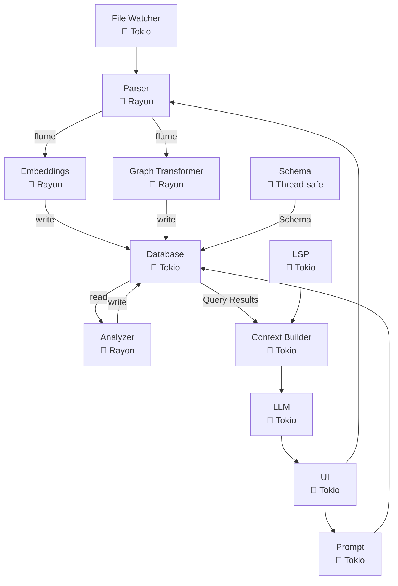

# ploke

**ploke** aims to be a powerful LLM interface in the terminal (think `aider`) for Rust code generation and refactoring, backed by a Retrieval-Augmented Generation (RAG) system designed specifically for Rust code generation and refactoring. It analyzes your codebase to provide context-aware code suggestions, enhancing LLM outputs for more accurate and relevant results that respect your project's existing patterns. **ploke**'s emphasis on a comprehensive code graph and static analysis integration has potential to make LLMs useful on larger, complex projects, and our processing of dependencies into the graph means you will be able to use rapidly developing crates that might be outside the LLM's training window.

For a detailed overview of the project's architecture, components, and current status, please refer to the **[Proposed Architecture Document (PROPOSED_ARCH_V3.md)](./PROPOSED_ARCH_V3.md)**.

To see our policy on AI-collaboration on the use of AI in developing `ploke`, see the [Policy on AI Collaboration](https://github.com/josephleblanc/ploke?tab=readme-ov-file#policy-on-ai-collaboration) below.
<!-- To see some of our design philosophy, see our ADR directory, design documentation, or detailed planning and testing documents. -->


## Project Vision
 ploke aims to be a powerful RAG (Retrieval-Augmented Generation) system for code generation and refactoring. It provides developers with context-aware code suggestions by analyzing their codebase and using that knowledge to enhance LLM-based code generation. Our goal is to empower users with a tool to facilitate human-AI collaboration on even mid-to-large size projects by providing LLMs with the context required to be useful to capable rust developers by leveraging our custom built and highly granular code graph to provide LLMs with relevant code snippets to produce good rust code that integrates with your code base, correctly uses rapidly-developing dependencies, and adheres to project style and idioms.

The longer-term vision of the `ploke` project is to leverage a combination of static analysis, detailed queries, and extensive user configuration options to find new ways for developers to utilize AI-generated code in new and engaging ways. We want to help contribute to a future in which developer-AI collaboration can extend a developer's capacity for high-quality, well-architected code. Many of the most popular developer tools today have created fluid experiences of engaging with AI, but have also uncovered problems that might degrade the quality, maintainability, and safety of generated code. 

#### Misalignments of currently available tooling

Our hypothesis is that these issues are deeply rooted in design decisions that may not be aligned with some users' goals or development style: 

1. **General over Specific ASTs**: Most code-gen tools focus on the generality of solutions for context management (e.g. using TreeSitter for AST traversal in RAGs). This results in LLMs failing to leverage the inherent strengths of a statically-typed language with unique features like Rust.

2. **Solving isolated tasks**: The emphasis is often placed on solving isolated tasks (as seen similarly in many LLM testing benchmarks) over integration into a larger project and correct usage of previously existing code structures. This often results in the LLM either hallucinating or assuming the existence of code structures that exist, failing to utilize pre-existing structures, or departing from desired programming patterns readily seen throughout the code base. While some tools hope to solve this issue with a `Conventions.md` document or similar, we believe more can be done to maintain consistent style by utilizing the implicit patterns already present in an existing code base.

3. **Minimal exposure of complexity to developers at the cost of innovation**: While this design philosophy is a valid and appropriate choice for many use-cases and professional environments, we believe this approach may limit or simply not prioritize innovative, inherently complex features that hold great potential for developer experience, productivity, and control.

While we aim to provide a stream-lined developer experience, we also aim to make available new, powerful features that will empower those developers who want to push the edge of what can be accomplished with AI collaboration without compromising on their project vision, code quality, or complexity. As such, our future development aims to invite developers to leverage their understanding of larger, more complex projects in new ways. Our design principles are:

#### Our Solution and Approach to Design

1. **Built for Rust**: Our custom parser, built with a visitor structure implemented using `syn`, captures all of the 17 distinct rust items detailed in the rust reference as unique node types, generates edges that encode syntatically accurate relationships, and stores details of rust-specific features and strengths, with support for all rust types (as detailed in the rust reference, including lifetimes), track unsafe and async usage along with cfgs, attributes, and (in progress) generic bounds for types, traits, and lifetimes.

2. **Focus on interconnectedness of project**: Our internal metrics for feature development will prioritize LLM-generated code that emphasizes the deeply interconnected structure of more mature projects. As we are under rapid development we do not have these metrics yet, but are committed to developing them for our MVP. While we will provide results for more widely accepted benchmarks on LLM performance using `ploke`, these metrics are unlikely to drive design decisions and feature development. Instead, we focus on metrics that help measure the quality of accepted solutions: is the solution similar to other code in the user's crate (measurable with graph analysis), how efficient is the solution, does it introduce rust anti-patterns?

3. **Expose New, Engaging, and Intuitive Controls to the Developer**: In addition to excellent built-in configuration to enhance LLM performance, we place an emphasis on user customization through engaging, intuitive UI beyond the CLI interface to invite users to: write their own custom queries using `cozo`'s built-in datalog and include the results in the LLM's prompt, provide a query builder for exploration of their code base and our schema's representation of it, modify and customize detailed settings for LLMs using our `egui` UI config or a .toml file, add local or unusual models with their own configs, and more. We aspire to be for LLM-generated code what `nvim` is for IDEs. Our stretch goal (which may not make it into the MVP, pending development time, but which is a high priority) is to add a visual, interactive representation of the code graph (see below).

For a detailed overview of the project's architecture, components, and current status, please refer to the **[Proposed Architecture Document (PROPOSED_ARCH_V3.md)](./PROPOSED_ARCH_V3.md)**.

<details>
  <summary>
    Interactive Visual Code Graph
  </summary>

  For the interactive visual representation we plan to use `egui` possibly integrating `bevy` (pending development time), to promote user exploration of their code graph and transparently expose which parts of the code graph are included in the user's query, 

  - variable granularity of displayed nodes depending on zoom
  - visual indicators (highlighting, animation) of the traversal performed while generating the augmented prompt with our RAG pipeline.
    - LLM responses can take time! We want to make static analysis fun and give you something pretty to look at while you wait.
  - nodes will be clicked on to display a popup of their source code, highlight connections to the nth degree, and more pending feedback/dev time.
  - different filters available to view: Module dependency graph, call graph, possibly more (depending on user feedback)
  - highlighting of unsafe and async nodes
  - quick and easy methods for manual selections of nodes or clusters to include in user query
  - time-travel (`cozo`-powered) navigation to peer back at earlier stages of your code graph, potentially with animations to show its growth over time, and prompt the LLM to report on insights regarding the changing structure of the project.
  - (stretch) visual indicators of test coverage, LLM-generated code, and performance estimates
  - (stretch) query panel for quick questions to the LLM on selected code or the structure of the code graph
  - more developments to come. We believe this feature could significantly improve developer interaction with LLMs by providing a clear 
</details>

## Project Status

⚠️ **Work in Progress:** This project is currently under active development. The architecture and implementation details are evolving. To see more details on project architecture, including descriptions of the project components, processing pipeline, and concurrency strategy, check the **[Proposed Architecture Document (PROPOSED_ARCH_V3.md)](./PROPOSED_ARCH_V3.md)**.


| Component | Status | Description |
|-----------|--------|-------------|
| core | ✅ Implemented | Core data types (NodeId, TrackingHash, TypeId..) |
| syn_parser | ✅ Implemented | Core parsing logic using syn, visitor pattern, and code graph generation |
| Incremental updates | 👷 Partial | Incremental parsing and updates to cozo database |
| channel | 👷 Partial, pending others | Flume-based communication between components |
| parallel processing | ✅ Implemented | Rayon-based parallel file processing |
| embed | 🚧 Planned | Vector embeddings for code snippets |
| transform | ✅ Implemented | Transformation of intermediate AST representation to graph database format |
| database | ✅ Implemented | CozoDB integration for hybrid vector-graph storage (34 schema implemented and tested) |
| watcher | 🚧 Planned | File system watcher for code changes |
| writer | 🚧 Planned | Code generation and modification |
| context | 🚧 Planned | Context building for LLM prompts |
| llm | 🚧 Planned | LLM integration for code generation |
| prompt | 🚧 Planned | Prompt engineering of user prompt |
| ui | 👷 In Progress | User interface (primary CLI, tools/customizations GUI) |
| analyze | 🚧 Planned   Post-MVP | Static analysis of parsed code |
| ploke-lsp | 🚧 Planned   Post-MVP   | User interface (CLI/GUI) |

## Architecture Overview

 ### File System Structure

 ```
 ploke/
 ├── Cargo.toml                     # Workspace configuration
 ├── crates/
 │   ├── core/                 󱃜    # Core types and traits (NodeId..)
 │   ├── error/                󱃜    # Cross-crate error types
 │   ├── ingest/                    # Core processing Pipeline
 │   │   ├── syn_parser/       󰆧    # AST traversal + parsing (Rayon)
 │   │   ├── ploke-lsp/        󰚩    # LSP data processing (Tokio)
 │   │   ├── ploke-embed/      󰚩    # Vector embeddings (Rayon)
 │   │   └── ploke-transform/  󰆧    # AST ➔ CozoDB (Rayon)
 │   ├── io/                   󰚩    # Input/Output pipeline (Tokio)
 │   │   ├── watcher/          󰚩    # File watching (Tokio)
 │   │   └── writer/           󰚩    # Code writing (Tokio)
 │   ├── ploke-db/             󰚩    # Query processing (Tokio)
 │   ├── context/              󰚩    # LLM context (Tokio)
 │   ├── llm/                  󰚩    # Local LLM integration (Tokio)
 │   ├── prompt/               󰚩    # Prompt engineering (Tokio)
 │   ├── ui/                   󰚩    # CLI/GUI (Tokio/EGUI)
 │   └── analyze/              󰆧    # Static analysis (Rayon)
 ├── examples/                      # Documentation examples
 └── benches/                       # Performance benchmarks

 󰚩    Asynchronous (tokio)
 󰆧    Multithreaded (rayon)
 Rayon Domain (󰆧 ) ↔ Flume Channel ↔ Tokio Domain (󰚩 )
 󱃜  Send + Sync (Not tied to tokio or rayon runtime)
 ```

### Data Flow Diagrams



## Policy on AI Collaboration

We are deeply committed to creating a project that has clean, idiomatic rust that is reliable, safe, and easily maintained. In order to uphold our personal standards for rust development while using AI-generated code, we quickly found that it was necessary to introduce strict design principles and decision tracking to avoid compromising on the quality of our code base. Here are some of the steps we have taken and lessons learned to both keep our code high quality and rapidly develop this project with AI assistance (see our github insights for churn, and our commit history for merged branches)

1. **Investing in Upfront Design**: While our first prototyping of the parsing crate in our project was rapid, it introduced technical debt which later required significant effort to correct. We have found that prioritizing robust design documentation promoted thoughtful and effective long-term project architecture. This requires significant design effort, but due to LLM-assisted code generation, once a design is thoroughly documented, the implementation can be extremely rapid.
  - See [uuid_refactor] directory, including: [00_overview].., [01_phase1].., [02_phase2].., [03a_phase3].., and other planning documents in same directory.

2. Importance of Testing: We have found thorough testing to be extremely important in LLM-assisted coding. 

<details>
  <summary>
    Details
  </summary>

  As the sole developer of this project, I needed to both rapidly learn many new and highly technical, niche details of the rust language and ensure complete accuracy of implemented features for the parsing section of this project to avoid taking on technical debt when developing downstream consumers of the intermediate code graph structures. After the project's first major refactor, which was due in part to errors introduced at a design level due to unthinking acceptance of LLM-suggestions, heavy emphasis was places on constant and thorough testing, test planning and design, and test review and coverage.
  - See [02b_phase2_testing].. for test planning and tracking. This document thoroughly details test coverage following a significant early refactor that replaced all previous tests and test fixtures (which were redundant, verbose, and used outdated methods following rapid development of new features). As such careful and comprehensive coverage was critical for ensuring future development was built on a firm foundation of correctness.
  - See [02a_phase2_error_analysis] for a review of some AI-induced errors and analysis.
  - See [module_node_tests] for an example of test coverage documentation.
</details>

3. Human Review is Critical: While testing is important, without human review of AI-generated testing, silent errors can easily be introduced into the code base. 

<details>
  <summary>
    Details
  </summary>
  As an anecdote, while having a model generate a nearly 800-line comprehensive set of tests, I noticed that there was something off in the test methodology. The tests were supposed to check the uniqueness of generated Uuids created to track each node. However, rather than test for uniqueness, the LLM was generating tests that used the `.find()` iterator method to stop searching for the target Uuid after the first occurance, without checking remaining Ids. This kind of detail could easily have been overlooked in the massive block of code the AI was generating, and if it had, then a quiet error would have been introduced, which could have led to problems downstream, and been extremely difficult to pinpoint because all earlier tests would have failed to catch the problem. This point cannot be emphasized enough - **You must watch the LLM like a hawk** or it **will** introduce errors. Extensive testing helps, but especially in the case of AI-generated tests, human oversight must be extremely thorough and capable of comprehending everything the LLM is doing to avoid significant technical debt.
</details>

4. **Leveraging Type Safety and "Howard-Curry Correspondence"**: Carefully considered project architecture (i.e. make invalid states unrepresentable) can enable rapid development of high quality, correct code with LLM assistance. 


<details>
  <summary>
    Details
  </summary>

  When dealing with an LLM, it is not uncommon for suggested code to compile, but fail to behave in an expected way. The burden placed on the developer to read and understand all LLM-generated code thoroughly, and not simply at a superficial level, becomes the bottleneck to more rapid development, or else subtle bugs and technical debt is introduced. By leaning on type-safe design patterns, and architecting code structures thoughtfully it becomes possible to make invalid states impossible (ideally) or at least very difficult to express. While an important consideration in producing a project structure that reflects the ideas the project attempts to model, this approach to systems design takes on greater significance when utilizing extensive LLM-generated code. If a given code structure cannot be expressed in a valid form, Rust's comprehensive developer tooling (`rust-analyzer`, `rustc`) will almost always catch this in a clearly identifiable way through linting errors even before the developer attempts to compile the code. This creates a profound effect on the confidence with which a developer can rapidly develop systems using LLM-generated code, as it significantly reduces the requirements for them to catch tiny mistakes, and allows them to confidently move forward with greater assurance that their systems are correct.

  - See the following [adrs]:
    - ADR-012-state-bearing-types.md
    - ADR-013-typed-node-ids.md
    - ADR-014-strict-private-typed-ids.md
  - Note that rust has a perhaps underappreciated `PhantomData` type which greatly helps with leveraging type safety to support code validity while keeping data structures lean and efficient.
</details>


5. Decision Tracking: Decision tracking can be very helpful for a developer, but it is necessary when working with an LLM. 


<details>
  <summary>
    Details
  </summary>

  One of the primary pain points in managing atomic conversations is needing to constantly be bringing the LLM up to speed on the wider context within which it is working. One concise way of tracking changes over time is using ADRs. When structured appropriately, these documents can be invaluable references as short, targeted guidance on what is being worked on now, what has already been done, and the reasoning behind the changes. Having an LLM produce these documents when making major changes, and then reading and editing them to ensure alignment with developer expectations, helps keep generated code aligned with the project's wider design philosophy. 
  - See [adrs] directory.
</details>


6. Central design document: Managing atomic conversations with LLMs is significantly improved by maintaining an up-to-date, high-level project description. 


<details>
  <summary>
    Details
  </summary>

  Keeping a central document that ties the different parts of a larger document together can be very helpful in reducing repetition in bringing LLMs up to speed and maintaining a continuous work flow while keeping LLM-generated code relevant to the project's overall goals. Providing details on the interaction between, for this project, the several crates, can be important for managing context windows and helping an LLM to design or implement the parts of a project that cross crate boundaries. However, please note that this is not perfect, and an LLM will often begin to ignore a design document like [PROPOSED_ARCH_V3] unless specifically reminded with some frequency, and developers must notice when the LLM begins to suffer from design drift in its implemented code or conversation and be prepared to remind and correct it, resetting the conversation when necessary.
  - See [PROPOSED_ARCH_V3]
</details>

7. AI guidance on style and the AI contract: Having a few explicit documents that dictate your style guidelines is important for ongoing collaboration that has a consistent style, but it is not perfect. 


<details>
  <summary>
    Details
  </summary>

  To maintain a unified code style, it helps to have a document which explicitly states the expectations you have for the AI's performance, when you want it to question you, when you want it to provide alternative suggestions, and what it should absolutely always or never do. However, there are still difficulties with the LLM failing to provide helpful suggestions when provided with too many restrictions to follow, e.g. a long bulletpointed list, as well as an extensive style document, as well as an extensive testing style document, etc, can be more harm than good and clutter the context window. One way to mitigate these difficulties is actually to converse with the LLM regarding these style guidance documents, ask if there are conflicts, question which rules it considers important or less important, and how likely it assesses itself to follow the guidelines. This may provide helpful feedback (e.g. pointing out conflicting guidelines), but must be taken with a large dose of salt, and then continuously be evaluated and refined by the developer moving forward. 
  - See [idiomatic_rust]

</details>

8. Providing appropriate context of rapidly-developing technologies: Using rapidly developing dependencies, especially those with breaking changes, is possible but requires some setup.

<details>
  <summary>
    Details
  </summary>

  LLM training times mean that their knowledge is essentially ancient compared to tech that lives on the cutting edge. Two years is usually the training cutoff date, and even when using an LLM that was made public within the week, there are still issues with having good advice on recently updated crates. This is one area where the Rust language's emphasis on open source, strong documentation, and strong developer tooling to view the source code of dependencies can be extremely helpful. Opening the source code relevant to the dependency the LLM is having trouble with, and adding those files to the chat, then having the LLM create summaries of `do`'s and `don't`s is a helpful workaround, as is cloning open source projects and similarly spending some time creating summaries of problematic methods or breaking changes can significantly improve LLM performance in this area. However, it is not perfect, and the developer must be capable of seeing misapplications of these updated crates and be ready and willing to step in to correct them. Similarly, the AI-generated summaries must be read and understood thoroughly to be helpful.
</details>

9. Error handling: Good practice always, but particularly relevant for LLM-assisted development.

<details>
  <summary>
    Details
  </summary>

  Informative error handling, which the LLMs will almost never do without prompting and continued reinforcement, is a significant help in catching the errors that do inevitably slip through all other methods of prevention. Being able to quickly debug is always useful, but when working with an LLM, takes on greater importance. The rust language's emphasis on error handling, propagating errors, and homomorphic programming patterns streamline this process significantly. 
  - See [parser_error_handling]
</details>

## Current Focus: CLI

Our immediate focus is on the CLI that forms the primary user-facing interface with the LLM.

[uuid_refactor]:./docs/plans/uuid_refactor
[00_overview]:./docs/plans/uuid_refactor/00_overview_batch_processing_model.md
[01_phase1]:./docs/plans/uuid_refactor/01_phase1_discovery_implementation.md
[02_phase2]:./docs/plans/uuid_refactor/02_phase2_parallel_parse_implementation.md
[03a_phase3]:./docs/plans/uuid_refactor/03a_phase3_known_limitations.md
[02b_phase2_testing]:./docs/plans/uuid_refactor/02b_phase2_testing.md
[02a_phase2_error_analysis]:./docs/plans/uuid_refactor/02a_phase2_error_analysis.md 
[module_node_tests]:./crates/ingest/syn_parser/tests/uuid_phase2_partial_graphs/nodes/modules.rs
[PROPOSED_ARCH_V3]:./PROPOSED_ARCH_V3.md
[adrs]:./docs/design/adrs 
[idiomatic_rust]:./docs/design/reference/IDIOMATIC_RUST.md
[parser_error_handling]:./crates/ingest/syn_parser/src/error.rs

