# ploke

`ploke` aims to be a powerful LLM interface in the terminal for Rust code generation and refactoring, backed by a Retrieval-Augmented Generation (RAG) system with a code graph built by parsing from your Rust crate.


<details>
  <summary>
    Note on LLM-generated docs
  </summary>
 None of the text descriptions in this document were generated by LLMs.

  However,
  the control flow diagram of the project's components was generated with LLM
  assistance.

  Our goal is to only have human-written documentation, but internally we often
  use LLM-generated descriptions and lists to manage tasks and explore ideas.
  If you are interested in collaborating, or just want to poke around within
  the project, _you might run across these documents_. However, as far as
  public-facing documentation, we want to have everything be clearly and
  human-written. We believe this is important.
</details>

### When can I use it!?
~~1-2 weeks: Early testing build ready (aiming for July 12th, 2025)~~

You can use it now!

#### Quickstart

Go ahead and clone the repo, and you can run it with the following commands:
```bash
git clone https://github.com/josephleblanc/ploke
cd ploke
cargo run
```

This will open the terminal user interface. To use it to chat with LLMs, you'll
just need an Openrouter API key in your environment under OPENROUTER_API_KEY
(support for other endpoints coming soon), for example before using `cargo run`, enter
```
export OPENROUTER_API_KEY="your_key_here"
```

##### ❗ WARNING ❗
Under development, this may crash if it tries to parse a crate with an error, or in certain [known limitations](./docs/plans/uuid_refactor/02c_phase2_known_limitations.md) or unknown limitations.

Currently, you can demo the project after using `cargo run` using following command within the terminal user interface. Note that we use vim-like bindings by default right now, so you can enter "Insert Mode" by pressing `i`, then type

```
/index start <absolute path to target crate>
```

If you would like to try a quick example using our `fixture_tracking_hash`, you can enter:

```
/index start /path/to/ploke/tests/fixture_crates/fixture_tracking_hash
```

Then the indexer will run, and you can chat with the LLM, and our RAG will find code to include as context in the background.

```
/index start /path/to/ploke/tests/fixture_crates/fixture_nodes
```

For a larger example that takes a little longer (1-2 minutes) to process into vector embeddings, but with more examples of code items to search in the graph, you can use another fixture crate that has examples of all the different types of nodes included within our parsing capabilities:

command, and `ploke` will process a fixture. Once this is complete, you can ask questions in the LLM chat and our RAG semantic search will work to provide the LLM with context automatically in the background.

## 🚧 Under Construction 🚧

ploke is in rapid development, and can be considered in a prototype or alpha state. The core functionality works right now:
- [x] facilitate LLM calls
- [x] parse your code into a vector-graph database
#### 7/17/2025
- [x] automatically query your code base using our RAG (basic prototype queries, naive rag)
- [x] parse a target rust crate (must have `Cargo.toml` and `src/lib.rs` or `src/main.rs`) into the database/rag pipeline
#### 7/18/2025
- [x] Select models that can be used as the LLM endpoint
  - [x] Default model endpoint settings
  - [ ] (deferred) Reasoning Support
  - [ ] (deferred) User-defined config file
#### 7/19/2025
- [x] Better help messages `/help`
  - [x] Normal Mode help: typing `?` normal mode should bring up the normal mode commands somehow. Think `whichkey`
  - currently puts `/help` into the input buffer
- [x] Show the cursor in input at correct offset
- [x] Improve item selection UI
- [x] Support for some hotkeys in vim-like "Normal" mode (see `/help`, or `h` in "Normal" mode)
- [x] Add `/model list` command to show available models
- [x] Show currently selected model in top right of screen
  - [x] Ensure current model updates on model switch (`/model <name>`)
  - [x] Add `SysInfo` message when model changes
#### 7/20/2025
- [x] Fix race condition & file bug report in [squashed](./docs/bugs/squashed.md)
#### 7/21/2025
- [ ] Better support for API keys
  - [ ] toml file support

### Coming Soon
- **Minimum Expected Features**
- [ ] (deferred from 7/18) User-defined config file
  - [x] .env support
  - [ ] yaml file support
  - [ ] ron file support
  - [ ] command line support
  - [ ] in-application support (for some settings)
- [ ] In-app options window
  - [ ] with model settings like temp, etc, with valid choices by model
- [ ] (deferred from 7/18) Reasoning Support
- [ ] Add liteLLM support for model settings
- [ ] Better info for user commands (pt. 2)
  - [ ] feedback to the user while waiting for the LLM response
    - [ ] ploki going left and right across the screen
- [ ] add a key command in Normal mode for user to see shortcuts
  - [ ] e.g. typing `?` normal mode should bring up the normal mode commands somehow. Think `whichkey`
    - [ ] currently puts `/help` into the input buffer, change to add a popup message instead
  - [ ] include a separate command for only keybindings as well
- [ ] Support for other API endpoints beyond OpenRouter
  - [ ] OpenAI
  - [ ] Anthropic
  - [ ] Google/Vertex
  - [ ] xAI
  - [ ] Groq
  - [ ] Others
- [ ] Improved `/index` command behavior to select target directory for embedding
- [ ] Sane default embedding model (we can do better than sentence-transformers)
  - [ ] GPU support for embedding processing
  - [ ] remote API support for embedding
<details>
  <summary>Better integrations</summary>

- [ ] git integration
  - [ ] automatic commit messages
  - [ ] "undo" via git
- [ ] #someday_maybe `rust-analyzer` integration for code snippets in LLM response
  - analyzed as though they were already in the position the model wants to add them to.
  - [ ] jump to definition support from conversation message (is this possible?)
</details>

<details>
  <summary>MCP Support</summary>

- [ ] Simple MCP integration
  - [ ] User Config
  - [ ] Tests
- [ ] Interface menu with toggle-able MCP server settings
  - [ ] Automatic installation upon selection for certain Rust-oriented MCP servers.
  - [ ] Basic file read/writes by MCP server until we get a better solution figured out.
</details>

<details>
  <summary>Better model support</summary>

  - [ ] Token tracking, including system prompts, user chat history, and code snippets
  - [ ] Cost tracking of $/token
  - [ ] Subtle, toggle-able indicator bar on right of screen with how full context window is.
</details>
<details>
  <summary>Better conversation UX</summary>

  - [ ] Branching conversations: Select message and click right/left or h/l in Normal mode to switch conversation branches.
    - [ ] Multiple tabs with branched conversations
    - [ ] Add a pop-up window or alternate buffer to display conversation tree
    - [ ] Batch send for generating multiple responses simultaneously, each on its own branch
      - [ ] Per-receiver configuration for provider, temperature, etc
  - [ ] Add editor support for switching to vim (other editors as requested for now)
  - [ ] Add forwarding to command line with `!` or similar, e.g. `!ls -la` or `!tree`
  - [ ] Custom key commands in normal mode - e.g. `<leader>t` for `!tree<ret>`
  - [ ] Enter Insert mode in previous messages to edit them
    - [ ] Enter an editor buffer with previous message content
    - [ ] Enter an editor buffer with conversation history
  - [ ] Conversation summarization support
  - [ ] Save/load conversation
</details>
  <details>
  <summary>Better Query Control</summary>

  - [ ] Add subtle `+` symbol in conversation to expand and see query used in database, with option to view results.
    - [ ] open results of query included in augmented prompt in an editor buffer.
  - [ ] #someday_maybe Add vim/editor plugins that highlights lines of code added to model context window.
  </details>
  <details>
  <summary>Better File Selection</summary>

  - [ ] Add
  - [ ] Add a way to force inclusion of entire files in context window
    - [ ] Read-only mode
    - [ ] Edit mode
  - [ ] Add a way to exclude files from being included in the RAG results
  </details>
  <details>
  <summary>Better RAG</summary>

  - [ ] Use pre-existing RAG framework to create good queries
    - [ ] Cozo built-ins: find sane defaults for HNSW settings (Centrality, L2, Cosine similarity)
    - [ ] Find sane defaults for traversal of edges in graph to retrieve code snippets
    - [ ] Add dynamic + iterative quries to generate more responses for sparse queries
  - [ ] Add support for other embedding backends
    - [ ] CodeBERT
    - [ ] Jina(?)
    - [ ] Do research to find other SOTA modals
    - [ ] Add user config options to set up their own embedding model choice.
  - [ ] Support for Query Expansion
    - [ ] Add support for a weak model to provide query expansion for intent discovery
    - [ ] Add UI to show user a `+` or similar to see expanded query, enable/disable expansion
    - [ ] Review SOTA research on query expansion and write blog post for [ploke website]
    - [ ] Evaluate and write report on query expansion quality by models + prompts
  - [ ] Process messages into vector embeddings for RAG
    - [ ] Connect to edges in graph where database changes near that conversation
    - [ ] Add sentiment analysis(?) or some way to determine strength of edge to be added to code graph with this message
    - [ ] Add user option to delete/save/load vector embeddings from previous convsations, with sane defaults.
  - [ ] Holistic RAG
    - [ ] Include curated Rust documentation, e.g. The Rust Book (check licensing), in a store of vector-embedded documents for RAG
    - [ ] Add user options to include specific files/documentation for RAG text processing
    - [ ] Add user options to have ploke search current directory for text files to include in RAG embedding processing
</details>
<details>
<summary>Better Parser</summary>

- [ ] Assess and identify all current gaps in parsing capability
    - [ ] Add comprehensive "Known Limitations"
- [ ] Implement more tests for module tree resolution
    - [ ] Review the [syn_parser test strategy](crates/ingest/syn_parser/tests/TESTING_STRATEGY.md)
    - [ ] Review the [tree merging process](crates/ingest/syn_parser/src/resolve/module_tree.rs)
    - [ ] Develop some initial unit tests
    - [ ] Develop a test macro
    - [ ] Write crate-level integration tests
    - [ ] Find edge cases + where current implementation fails
      - [ ] Test identical items under mutually exclusive cfgs
      - [ ] Test items in known limitations in [phase 2](docs/plans/uuid_refactor/02c_phase2_known_limitations.md) and [phase 3](docs/plans/uuid_refactor/03a_phase3_known_limitations.md)
- [ ] #shallow_task Add support for cfg-specific parsing
  - [ ] Based on default cfg settings
  - [ ] Based on user-specified cfg settings
- [ ] #deep_task Add support for type resolution
- [ ] #deep_task Add support for `syn::Expr` parsing
</details>

However, there are many features we are working on adding

❗**It is possible the program may crash**❗

If you do run into a crash, please consider opening a PR, and we'll be more
than happy to work on it with you. Our goal is to triage and either fix or
document every issue as they come.

If you want to check out the project before then, you can download and run the `feature/ploke-ui` crate to test out the `cozo` database on the test fixtures (might break on larger projects), or the `feature/ploke-tui-concurrent` branch to see an early functioning version of the working terminal user interface (Accepts OpenRouter API keys as global shell variable only).


### Intro

**ploke** aims to be a powerful LLM interface in the terminal for Rust code generation and refactoring, backed by a Retrieval-Augmented Generation (RAG) system designed specifically for Rust code generation and refactoring. It analyzes your codebase to provide context-aware code suggestions, enhancing LLM outputs for more accurate and relevant results that respect your project's existing patterns. **ploke**'s emphasis on a comprehensive code graph and static analysis integration has potential to make LLMs useful on larger, complex projects, and our processing of dependencies into the graph means you will be able to use rapidly developing crates that might be outside the LLM's training window.

For a detailed overview of the project's architecture, components, and current status, please refer to the **[Proposed Architecture Document (PROPOSED_ARCH_V3.md)](./PROPOSED_ARCH_V3.md)**.

To see our policy on AI-collaboration on the use of AI in developing `ploke`, see the [Policy on AI Collaboration](https://github.com/josephleblanc/ploke?tab=readme-ov-file#policy-on-ai-collaboration) below.
<!-- To see some of our design philosophy, see our ADR directory, design documentation, or detailed planning and testing documents. -->
### 👷  Current Progress 👷
| Component | Status | Description |
|-----------|--------|-------------|
| ploke-core | ✅ Implemented | Core data types (NodeId, TrackingHash, TypeId..) |
| syn_parser | ✅ Prototype Implemented | Core parsing logic using syn, visitor pattern, and code graph generation |
| channel | 👷 Partial, pending others | Flume-based communication between components (switching to tokio) |
| ploke-embed | ✅ Alpha | Vector embeddings for code snippets |
| ploke-transform | ✅ Implemented | Transformation of intermediate AST representation to graph database format (34 schema implemented and tested) |
| ploke-db | ✅ Implemented | CozoDB query management for hybrid vector-graph storage |
| ploke-io | ✅ Alpha | I/O handler for reads/writes to file, including during vector embedding |
| context | ✅ Alpha | Context building for LLM prompts (partial, within `ploke-tui`) |
| llm | 👷  Partial | LLM integration for code generation<br>(Partial, graph working but no code editing) |
| prompt | 👷 Partial | Prompt engineering of user prompt<br>(Basic setup for now, needs config) |
| ploke-tui | ✅ alpha prototype | User interface (primary TUI) |
| ploke-gui | ✅ Dev tool only<br>See ploke-ui branches | Dev tool to experiment with `Datalog` queries on underlying `cozo` database |
| analyze | 🚧 Planned<br>  Post-MVP | Static analysis of parsed code |
| ploke-lsp | 🚧 Planned<br>  Post-MVP   | User interface (CLI/GUI) |
| ploke-mcp | 🚧 Planned<br>  Post-MVP   | MCP protocol integration |

### Project Vision

 ploke aims to be a powerful RAG (Retrieval-Augmented Generation) system for code generation and refactoring. It provides developers with context-aware code suggestions by analyzing their codebase and using that knowledge to enhance LLM-based code generation. Our goal is to empower users with a tool to facilitate human-AI collaboration on even mid-to-large size projects by providing LLMs with the context required to be useful to capable rust developers by leveraging our custom built and highly granular code graph to provide LLMs with relevant code snippets to produce good rust code that integrates with your code base, correctly uses rapidly-developing dependencies, and adheres to project style and idioms.

The longer-term vision of the `ploke` project is to leverage a combination of static analysis, detailed queries, and extensive user configuration options to find new ways for developers to utilize AI-generated code in new and engaging ways. We want to help contribute to a future in which developer-AI collaboration can extend a developer's capacity for high-quality, well-architected code. Many of the most popular developer tools today have created fluid experiences of engaging with AI, but have also uncovered problems that might degrade the quality, maintainability, and safety of generated code.

#### Misalignments of currently available tooling

Our hypothesis is that these issues are deeply rooted in design decisions that may not be aligned with some users' goals or development style:

1. **General over Specific ASTs**: Most code-gen tools focus on the generality of solutions for context management (e.g. using TreeSitter for AST traversal in RAGs). This results in LLMs failing to leverage the inherent strengths of a statically-typed language with unique features like Rust.

2. **Solving isolated tasks**: The emphasis is often placed on solving isolated tasks (as seen similarly in many LLM testing benchmarks) over integration into a larger project and correct usage of previously existing code structures. This often results in the LLM either hallucinating or assuming the existence of code structures that exist, failing to utilize pre-existing structures, or departing from desired programming patterns readily seen throughout the code base. While some tools hope to solve this issue with a `Conventions.md` document or similar, we believe more can be done to maintain consistent style by utilizing the implicit patterns already present in an existing code base.

3. **Minimal exposure of complexity to developers at the cost of innovation**: While this design philosophy is a valid and appropriate choice for many use-cases and professional environments, we believe this approach may limit or simply not prioritize innovative, inherently complex features that hold great potential for developer experience, productivity, and control.

While we aim to provide a stream-lined developer experience, we also aim to make available new, powerful features that will empower those developers who want to push the edge of what can be accomplished with AI collaboration without compromising on their project vision, code quality, or complexity. As such, our future development aims to invite developers to leverage their understanding of larger, more complex projects in new ways. Our design principles are:

#### Our Solution and Approach to Design

1. **Built for Rust**: Our custom parser, built with a visitor structure implemented using `syn`, captures all of the 17 distinct rust items detailed in the rust reference as unique node types, generates edges that encode syntatically accurate relationships, and stores details of rust-specific features and strengths, with support for all rust types (as detailed in the rust reference, including lifetimes), track unsafe and async usage along with cfgs, attributes, and (in progress) generic bounds for types, traits, and lifetimes.

2. **Focus on interconnectedness of project**: Our internal metrics for feature development will prioritize LLM-generated code that emphasizes the deeply interconnected structure of more mature projects. As we are under rapid development we do not have these metrics yet, but are committed to developing them for our MVP. While we will provide results for more widely accepted benchmarks on LLM performance using `ploke`, these metrics are unlikely to drive design decisions and feature development. Instead, we focus on metrics that help measure the quality of accepted solutions: is the solution similar to other code in the user's crate (measurable with graph analysis), how efficient is the solution, does it introduce rust anti-patterns?

3. **Expose New, Engaging, and Intuitive Controls to the Developer**: In addition to excellent built-in configuration to enhance LLM performance, we place an emphasis on user customization through engaging, intuitive UI beyond the CLI interface to invite users to: write their own custom queries using `cozo`'s built-in datalog and include the results in the LLM's prompt, provide a query builder for exploration of their code base and our schema's representation of it, modify and customize detailed settings for LLMs using our `egui` UI config or a .toml file, add local or unusual models with their own configs, and more. We aspire to be for LLM-generated code what `nvim` is for IDEs. Our stretch goal (which may not make it into the MVP, pending development time, but which is a high priority) is to add a visual, interactive representation of the code graph (see below).

For a detailed overview of the project's architecture, components, and current status, please refer to the **[Proposed Architecture Document (PROPOSED_ARCH_V3.md)](./PROPOSED_ARCH_V3.md)**.

<details>
  <summary>
    Interactive Visual Code Graph
  </summary>

  For the interactive visual representation we plan to use `egui` possibly integrating `bevy` (pending development time), to promote user exploration of their code graph and transparently expose which parts of the code graph are included in the user's query,

  - variable granularity of displayed nodes depending on zoom
  - visual indicators (highlighting, animation) of the traversal performed while generating the augmented prompt with our RAG pipeline.
    - LLM responses can take time! We want to make static analysis fun and give you something pretty to look at while you wait.
  - nodes will be clicked on to display a popup of their source code, highlight connections to the nth degree, and more pending feedback/dev time.
  - different filters available to view: Module dependency graph, call graph, possibly more (depending on user feedback)
  - highlighting of unsafe and async nodes
  - quick and easy methods for manual selections of nodes or clusters to include in user query
  - time-travel (`cozo`-powered) navigation to peer back at earlier stages of your code graph, potentially with animations to show its growth over time, and prompt the LLM to report on insights regarding the changing structure of the project.
  - (stretch) visual indicators of test coverage, LLM-generated code, and performance estimates
  - (stretch) query panel for quick questions to the LLM on selected code or the structure of the code graph
  - more developments to come. We believe this feature could significantly improve developer interaction with LLMs by providing a clear
</details>

## Project Status

⚠️ **Work in Progress:** This project is currently under active development. The architecture and implementation details are evolving. To see more details on project architecture, including descriptions of the project components, processing pipeline, and concurrency strategy, check the **[Proposed Architecture Document (PROPOSED_ARCH_V3.md)](./PROPOSED_ARCH_V3.md)**.


## Architecture Overview

 ### File System Structure

 ```
 ploke/
 ├── Cargo.toml                     # Workspace configuration
 ├── crates/
 │   ├── core/                 󱃜    # Core types and traits (NodeId..)
 │   ├── error/                󱃜    # Cross-crate error types
 │   ├── ingest/                    # Core processing Pipeline
 │   │   ├── syn_parser/       󰆧    # AST traversal + parsing (Rayon)
 │   │   ├── ploke-lsp/        󰚩    # LSP data processing (Tokio)
 │   │   ├── ploke-embed/      󰚩    # Vector embeddings (Rayon)
 │   │   └── ploke-transform/  󰆧    # AST ➔ CozoDB (Rayon)
 │   ├── io/                   󰚩    # Input/Output pipeline (Tokio)
 │   │   ├── watcher/          󰚩    # File watching (Tokio)
 │   │   └── writer/           󰚩    # Code writing (Tokio)
 │   ├── ploke-db/             󰚩    # Query processing (Tokio)
 │   ├── context/              󰚩    # LLM context (Tokio)
 │   ├── llm/                  󰚩    # Local LLM integration (Tokio)
 │   ├── prompt/               󰚩    # Prompt engineering (Tokio)
 │   ├── ui/                   󰚩    # CLI/GUI (Tokio/EGUI)
 │   └── analyze/              󰆧    # Static analysis (Rayon)
 ├── examples/                      # Documentation examples
 └── benches/                       # Performance benchmarks

 󰚩    Asynchronous (tokio)
 󰆧    Multithreaded (rayon)
 Rayon Domain (󰆧 ) ↔ Flume Channel ↔ Tokio Domain (󰚩 )
 󱃜  Send + Sync (Not tied to tokio or rayon runtime)
 ```

### Data Flow Diagrams

```mermaid
flowchart TD
    watcher["File Watcher<br>󰚩 Tokio"] --> parser
    ui["UI<br>󰚩 Tokio"] --> parser["Parser<br>󰆧 Rayon"]
    parser -->|flume| embed["Embeddings<br>󰆧 Rayon"]
    parser -->|flume| grraphT["Graph Transformer<br>󰆧 Rayon"]
    embed -->|write| db["Database<br>󰚩 Tokio"]
    grraphT -->|write| db
    db -->|read| analyze["Analyzer<br>󰆧 Rayon"]
    analyze -->|write| db
    db -->|Query Results| context["Context Builder<br>󰚩 Tokio"]
    lsp["LSP<br>󰚩 Tokio"] --> context
    ui --> prompt["Prompt<br>󰚩 Tokio"]
    context --> llm["LLM<br>󰚩 Tokio"]
    llm --> ui
    prompt --> db
    ploke_grraph["Schema<br>󱃜 Thread-safe"] -->|Schema| db
```



## Policy on AI Collaboration

We are deeply committed to creating a project that has clean, idiomatic rust that is reliable, safe, and easily maintained. In order to uphold our personal standards for rust development while using AI-generated code, we quickly found that it was necessary to introduce strict design principles and decision tracking to avoid compromising on the quality of our code base. Here are some of the steps we have taken and lessons learned to both keep our code high quality and rapidly develop this project with AI assistance (see our github insights for churn, and our commit history for merged branches)

1. **Investing in Upfront Design**: While our first prototyping of the parsing crate in our project was rapid, it introduced technical debt which later required significant effort to correct. We have found that prioritizing robust design documentation promoted thoughtful and effective long-term project architecture. This requires significant design effort, but due to LLM-assisted code generation, once a design is thoroughly documented, the implementation can be extremely rapid.
  - See [uuid_refactor] directory, including: [00_overview].., [01_phase1].., [02_phase2].., [03a_phase3].., and other planning documents in same directory.

2. Importance of Testing: We have found thorough testing to be extremely important in LLM-assisted coding.

<details>
  <summary>
    Details
  </summary>

  As the sole developer of this project, I needed to both rapidly learn many new and highly technical, niche details of the rust language and ensure complete accuracy of implemented features for the parsing section of this project to avoid taking on technical debt when developing downstream consumers of the intermediate code graph structures. After the project's first major refactor, which was due in part to errors introduced at a design level due to unthinking acceptance of LLM-suggestions, heavy emphasis was places on constant and thorough testing, test planning and design, and test review and coverage.
  - See [02b_phase2_testing].. for test planning and tracking. This document thoroughly details test coverage following a significant early refactor that replaced all previous tests and test fixtures (which were redundant, verbose, and used outdated methods following rapid development of new features). As such careful and comprehensive coverage was critical for ensuring future development was built on a firm foundation of correctness.
  - See [02a_phase2_error_analysis] for a review of some AI-induced errors and analysis.
  - See [module_node_tests] for an example of test coverage documentation.
</details>

3. Human Review is Critical: While testing is important, without human review of AI-generated testing, silent errors can easily be introduced into the code base.

<details>
  <summary>
    Details
  </summary>
  As an anecdote, while having a model generate a nearly 800-line comprehensive set of tests, I noticed that there was something off in the test methodology. The tests were supposed to check the uniqueness of generated Uuids created to track each node. However, rather than test for uniqueness, the LLM was generating tests that used the `.find()` iterator method to stop searching for the target Uuid after the first occurance, without checking remaining Ids. This kind of detail could easily have been overlooked in the massive block of code the AI was generating, and if it had, then a quiet error would have been introduced, which could have led to problems downstream, and been extremely difficult to pinpoint because all earlier tests would have failed to catch the problem. This point cannot be emphasized enough - **You must watch the LLM like a hawk** or it **will** introduce errors. Extensive testing helps, but especially in the case of AI-generated tests, human oversight must be extremely thorough and capable of comprehending everything the LLM is doing to avoid significant technical debt.
</details>

4. **Leveraging Type Safety and "Howard-Curry Correspondence"**: Carefully considered project architecture (i.e. make invalid states unrepresentable) can enable rapid development of high quality, correct code with LLM assistance.


<details>
  <summary>
    Details
  </summary>

  When dealing with an LLM, it is not uncommon for suggested code to compile, but fail to behave in an expected way. The burden placed on the developer to read and understand all LLM-generated code thoroughly, and not simply at a superficial level, becomes the bottleneck to more rapid development, or else subtle bugs and technical debt is introduced. By leaning on type-safe design patterns, and architecting code structures thoughtfully it becomes possible to make invalid states impossible (ideally) or at least very difficult to express. While an important consideration in producing a project structure that reflects the ideas the project attempts to model, this approach to systems design takes on greater significance when utilizing extensive LLM-generated code. If a given code structure cannot be expressed in a valid form, Rust's comprehensive developer tooling (`rust-analyzer`, `rustc`) will almost always catch this in a clearly identifiable way through linting errors even before the developer attempts to compile the code. This creates a profound effect on the confidence with which a developer can rapidly develop systems using LLM-generated code, as it significantly reduces the requirements for them to catch tiny mistakes, and allows them to confidently move forward with greater assurance that their systems are correct.

  - See the following [adrs]:
    - ADR-012-state-bearing-types.md
    - ADR-013-typed-node-ids.md
    - ADR-014-strict-private-typed-ids.md
  - Note that rust has a perhaps underappreciated `PhantomData` type which greatly helps with leveraging type safety to support code validity while keeping data structures lean and efficient.
</details>


5. Decision Tracking: Decision tracking can be very helpful for a developer, but it is necessary when working with an LLM.


<details>
  <summary>
    Details
  </summary>

  One of the primary pain points in managing atomic conversations is needing to constantly be bringing the LLM up to speed on the wider context within which it is working. One concise way of tracking changes over time is using ADRs. When structured appropriately, these documents can be invaluable references as short, targeted guidance on what is being worked on now, what has already been done, and the reasoning behind the changes. Having an LLM produce these documents when making major changes, and then reading and editing them to ensure alignment with developer expectations, helps keep generated code aligned with the project's wider design philosophy.
  - See [adrs] directory.
</details>


6. Central design document: Managing atomic conversations with LLMs is significantly improved by maintaining an up-to-date, high-level project description.


<details>
  <summary>
    Details
  </summary>

  Keeping a central document that ties the different parts of a larger document together can be very helpful in reducing repetition in bringing LLMs up to speed and maintaining a continuous work flow while keeping LLM-generated code relevant to the project's overall goals. Providing details on the interaction between, for this project, the several crates, can be important for managing context windows and helping an LLM to design or implement the parts of a project that cross crate boundaries. However, please note that this is not perfect, and an LLM will often begin to ignore a design document like [PROPOSED_ARCH_V3] unless specifically reminded with some frequency, and developers must notice when the LLM begins to suffer from design drift in its implemented code or conversation and be prepared to remind and correct it, resetting the conversation when necessary.
  - See [PROPOSED_ARCH_V3]
</details>

7. AI guidance on style and the AI contract: Having a few explicit documents that dictate your style guidelines is important for ongoing collaboration that has a consistent style, but it is not perfect.


<details>
  <summary>
    Details
  </summary>

  To maintain a unified code style, it helps to have a document which explicitly states the expectations you have for the AI's performance, when you want it to question you, when you want it to provide alternative suggestions, and what it should absolutely always or never do. However, there are still difficulties with the LLM failing to provide helpful suggestions when provided with too many restrictions to follow, e.g. a long bulletpointed list, as well as an extensive style document, as well as an extensive testing style document, etc, can be more harm than good and clutter the context window. One way to mitigate these difficulties is actually to converse with the LLM regarding these style guidance documents, ask if there are conflicts, question which rules it considers important or less important, and how likely it assesses itself to follow the guidelines. This may provide helpful feedback (e.g. pointing out conflicting guidelines), but must be taken with a large dose of salt, and then continuously be evaluated and refined by the developer moving forward.
  - See [idiomatic_rust]

</details>

8. Providing appropriate context of rapidly-developing technologies: Using rapidly developing dependencies, especially those with breaking changes, is possible but requires some setup.

<details>
  <summary>
    Details
  </summary>

  LLM training times mean that their knowledge is essentially ancient compared to tech that lives on the cutting edge. Two years is usually the training cutoff date, and even when using an LLM that was made public within the week, there are still issues with having good advice on recently updated crates. This is one area where the Rust language's emphasis on open source, strong documentation, and strong developer tooling to view the source code of dependencies can be extremely helpful. Opening the source code relevant to the dependency the LLM is having trouble with, and adding those files to the chat, then having the LLM create summaries of `do`'s and `don't`s is a helpful workaround, as is cloning open source projects and similarly spending some time creating summaries of problematic methods or breaking changes can significantly improve LLM performance in this area. However, it is not perfect, and the developer must be capable of seeing misapplications of these updated crates and be ready and willing to step in to correct them. Similarly, the AI-generated summaries must be read and understood thoroughly to be helpful.
</details>

9. Error handling: Good practice always, but particularly relevant for LLM-assisted development.

<details>
  <summary>
    Details
  </summary>

  Informative error handling, which the LLMs will almost never do without prompting and continued reinforcement, is a significant help in catching the errors that do inevitably slip through all other methods of prevention. Being able to quickly debug is always useful, but when working with an LLM, takes on greater importance. The rust language's emphasis on error handling, propagating errors, and homomorphic programming patterns streamline this process significantly.
  - See [parser_error_handling]
</details>
=======

2. Importance of Testing: We have found thorough testing to be extremely important in LLM-assisted coding.

<details>
  <summary>
    Details
  </summary>

  As the sole developer of this project, I needed to both rapidly learn many new and highly technical, niche details of the rust language and ensure complete accuracy of implemented features for the parsing section of this project to avoid taking on technical debt when developing downstream consumers of the intermediate code graph structures. After the project's first major refactor, which was due in part to errors introduced at a design level due to unthinking acceptance of LLM-suggestions, heavy emphasis was places on constant and thorough testing, test planning and design, and test review and coverage.
  - See [02b_phase2_testing].. for test planning and tracking. This document thoroughly details test coverage following a significant early refactor that replaced all previous tests and test fixtures (which were redundant, verbose, and used outdated methods following rapid development of new features). As such careful and comprehensive coverage was critical for ensuring future development was built on a firm foundation of correctness.
  - See [02a_phase2_error_analysis] for a review of some AI-induced errors and analysis.
  - See [module_node_tests] for an example of test coverage documentation.
</details>

3. Human Review is Critical: While testing is important, without human review of AI-generated testing, silent errors can easily be introduced into the code base.

<details>
  <summary>
    Details
  </summary>
  As an anecdote, while having a model generate a nearly 800-line comprehensive set of tests, I noticed that there was something off in the test methodology. The tests were supposed to check the uniqueness of generated Uuids created to track each node. However, rather than test for uniqueness, the LLM was generating tests that used the `.find()` iterator method to stop searching for the target Uuid after the first occurance, without checking remaining Ids. This kind of detail could easily have been overlooked in the massive block of code the AI was generating, and if it had, then a quiet error would have been introduced, which could have led to problems downstream, and been extremely difficult to pinpoint because all earlier tests would have failed to catch the problem. This point cannot be emphasized enough - **You must watch the LLM like a hawk** or it **will** introduce errors. Extensive testing helps, but especially in the case of AI-generated tests, human oversight must be extremely thorough and capable of comprehending everything the LLM is doing to avoid significant technical debt.
</details>

4. **Leveraging Type Safety and "Howard-Curry Correspondence"**: Carefully considered project architecture (i.e. make invalid states unrepresentable) can enable rapid development of high quality, correct code with LLM assistance.


<details>
  <summary>
    Details
  </summary>

  When dealing with an LLM, it is not uncommon for suggested code to compile, but fail to behave in an expected way. The burden placed on the developer to read and understand all LLM-generated code thoroughly, and not simply at a superficial level, becomes the bottleneck to more rapid development, or else subtle bugs and technical debt is introduced. By leaning on type-safe design patterns, and architecting code structures thoughtfully it becomes possible to make invalid states impossible (ideally) or at least very difficult to express. While an important consideration in producing a project structure that reflects the ideas the project attempts to model, this approach to systems design takes on greater significance when utilizing extensive LLM-generated code. If a given code structure cannot be expressed in a valid form, Rust's comprehensive developer tooling (`rust-analyzer`, `rustc`) will almost always catch this in a clearly identifiable way through linting errors even before the developer attempts to compile the code. This creates a profound effect on the confidence with which a developer can rapidly develop systems using LLM-generated code, as it significantly reduces the requirements for them to catch tiny mistakes, and allows them to confidently move forward with greater assurance that their systems are correct.

  - See the following [adrs]:
    - ADR-012-state-bearing-types.md
    - ADR-013-typed-node-ids.md
    - ADR-014-strict-private-typed-ids.md
  - Note that rust has a perhaps underappreciated `PhantomData` type which greatly helps with leveraging type safety to support code validity while keeping data structures lean and efficient.
</details>


5. Decision Tracking: Decision tracking can be very helpful for a developer, but it is necessary when working with an LLM.


<details>
  <summary>
    Details
  </summary>

  One of the primary pain points in managing atomic conversations is needing to constantly be bringing the LLM up to speed on the wider context within which it is working. One concise way of tracking changes over time is using ADRs. When structured appropriately, these documents can be invaluable references as short, targeted guidance on what is being worked on now, what has already been done, and the reasoning behind the changes. Having an LLM produce these documents when making major changes, and then reading and editing them to ensure alignment with developer expectations, helps keep generated code aligned with the project's wider design philosophy.
  - See [adrs] directory.
</details>


6. Central design document: Managing atomic conversations with LLMs is significantly improved by maintaining an up-to-date, high-level project description.


<details>
  <summary>
    Details
  </summary>

  Keeping a central document that ties the different parts of a larger document together can be very helpful in reducing repetition in bringing LLMs up to speed and maintaining a continuous work flow while keeping LLM-generated code relevant to the project's overall goals. Providing details on the interaction between, for this project, the several crates, can be important for managing context windows and helping an LLM to design or implement the parts of a project that cross crate boundaries. However, please note that this is not perfect, and an LLM will often begin to ignore a design document like [PROPOSED_ARCH_V3] unless specifically reminded with some frequency, and developers must notice when the LLM begins to suffer from design drift in its implemented code or conversation and be prepared to remind and correct it, resetting the conversation when necessary.
  - See [PROPOSED_ARCH_V3]
</details>

7. AI guidance on style and the AI contract: Having a few explicit documents that dictate your style guidelines is important for ongoing collaboration that has a consistent style, but it is not perfect.


<details>
  <summary>
    Details
  </summary>

  To maintain a unified code style, it helps to have a document which explicitly states the expectations you have for the AI's performance, when you want it to question you, when you want it to provide alternative suggestions, and what it should absolutely always or never do. However, there are still difficulties with the LLM failing to provide helpful suggestions when provided with too many restrictions to follow, e.g. a long bulletpointed list, as well as an extensive style document, as well as an extensive testing style document, etc, can be more harm than good and clutter the context window. One way to mitigate these difficulties is actually to converse with the LLM regarding these style guidance documents, ask if there are conflicts, question which rules it considers important or less important, and how likely it assesses itself to follow the guidelines. This may provide helpful feedback (e.g. pointing out conflicting guidelines), but must be taken with a large dose of salt, and then continuously be evaluated and refined by the developer moving forward.
  - See [idiomatic_rust]

</details>

8. Providing appropriate context of rapidly-developing technologies: Using rapidly developing dependencies, especially those with breaking changes, is possible but requires some setup.

<details>
  <summary>
    Details
  </summary>

  LLM training times mean that their knowledge is essentially ancient compared to tech that lives on the cutting edge. Two years is usually the training cutoff date, and even when using an LLM that was made public within the week, there are still issues with having good advice on recently updated crates. This is one area where the Rust language's emphasis on open source, strong documentation, and strong developer tooling to view the source code of dependencies can be extremely helpful. Opening the source code relevant to the dependency the LLM is having trouble with, and adding those files to the chat, then having the LLM create summaries of `do`'s and `don't`s is a helpful workaround, as is cloning open source projects and similarly spending some time creating summaries of problematic methods or breaking changes can significantly improve LLM performance in this area. However, it is not perfect, and the developer must be capable of seeing misapplications of these updated crates and be ready and willing to step in to correct them. Similarly, the AI-generated summaries must be read and understood thoroughly to be helpful.
</details>

9. Error handling: Good practice always, but particularly relevant for LLM-assisted development.

<details>
  <summary>
    Details
  </summary>

  Informative error handling, which the LLMs will almost never do without prompting and continued reinforcement, is a significant help in catching the errors that do inevitably slip through all other methods of prevention. Being able to quickly debug is always useful, but when working with an LLM, takes on greater importance. The rust language's emphasis on error handling, propagating errors, and homomorphic programming patterns streamline this process significantly.
  - See [parser_error_handling]
</details>

## Current Focus: RAG & TUI Integration

Our immediate focus is on integrating the RAG and TUI.

## 📜 License

Ploke is licensed under a **dual-license model**:

- **Open Source License**: You may use, modify, and redistribute Ploke under the terms of the [GNU General Public License v3.0 (GPL-3.0)](https://www.gnu.org/licenses/gpl-3.0.en.html).
- **Commercial License**: If you would like to use Ploke as part of a proprietary product, SaaS offering, or any commercial service without complying with GPL-3.0, you must obtain a commercial license.

To inquire about commercial licensing, please contact:
📩 **team@ploke.dev**

[uuid_refactor]:./docs/plans/uuid_refactor
[00_overview]:./docs/plans/uuid_refactor/00_overview_batch_processing_model.md
[01_phase1]:./docs/plans/uuid_refactor/01_phase1_discovery_implementation.md
[02_phase2]:./docs/plans/uuid_refactor/02_phase2_parallel_parse_implementation.md
[03a_phase3]:./docs/plans/uuid_refactor/03a_phase3_known_limitations.md
[02b_phase2_testing]:./docs/plans/uuid_refactor/02b_phase2_testing.md
[02a_phase2_error_analysis]:./docs/plans/uuid_refactor/02a_phase2_error_analysis.md
[module_node_tests]:./crates/ingest/syn_parser/tests/uuid_phase2_partial_graphs/nodes/modules.rs
[PROPOSED_ARCH_V3]:./PROPOSED_ARCH_V3.md
[adrs]:./docs/design/adrs
[idiomatic_rust]:./docs/design/reference/IDIOMATIC_RUST.md
[parser_error_handling]:./crates/ingest/syn_parser/src/error.rs
[ploke]:https://ploke.dev/
