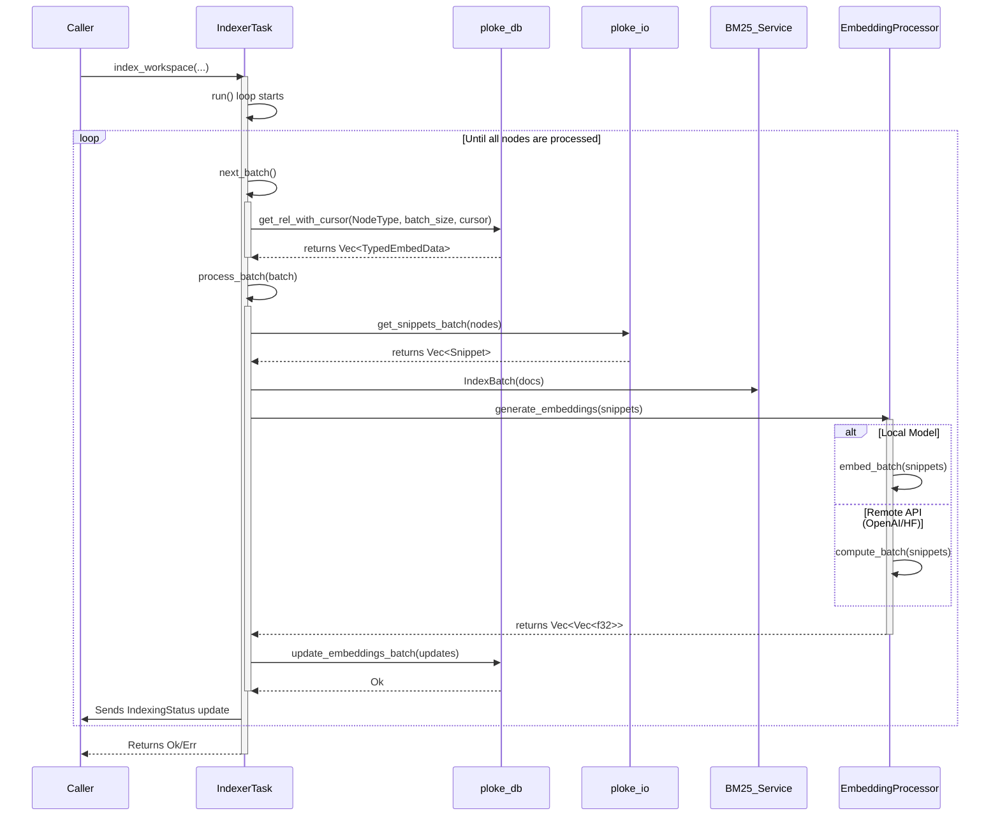

# `ploke-embed`

The `ploke-embed` crate is a core component of the Ploke ecosystem, responsible for generating vector embeddings for source code. These embeddings are the foundation for semantic search, Retrieval-Augmented Generation (RAG), and other AI-powered code understanding features.

The crate is designed as a standalone, concurrent processing pipeline that reads code metadata from a `ploke-db` instance, generates dense vector embeddings (and seeds sparse vector indexes), and writes the results back to the database.

## Core Components

-   **`IndexerTask`**: The main actor that orchestrates the entire indexing process for a workspace. It manages state, fetches data in batches, delegates to the `EmbeddingProcessor`, and reports progress. This is the primary public API for consumers of this crate.
-   **`EmbeddingProcessor`**: The engine responsible for the actual embedding generation. It abstracts over different `EmbeddingSource`s.
-   **`EmbeddingSource`**: An enum that defines the backend used for embedding.
    -   **`Local`**: Uses a local sentence-transformer model (e.g., `all-MiniLM-L6-v2`) running on-device via the `candle` ML framework. Supports CPU and CUDA.
    -   **`HuggingFace`**: Uses the Hugging Face Inference API.
    -   **`OpenAI`**: Uses the OpenAI Embeddings API.
    -   **`Cozo`**: A placeholder for a potential future Cozo-native embedding service.

## High-Level Process Flow

The diagram below shows the high-level architecture of the embedding process. A caller (like `ploke-tui`) initiates the process, and the `IndexerTask` drives the interactions between the database, I/O, and the chosen embedding backend.

```mermaid
graph TD
    subgraph Caller Crate (e.g., ploke-tui)
        A[Initiate Indexing]
    end

    subgraph ploke-embed
        B[IndexerTask]
        D[EmbeddingProcessor]
        E{EmbeddingSource}
        F[LocalEmbedder]
        G[HuggingFaceBackend]
        H[OpenAIBackend]
    end

    subgraph External Systems
        I[ploke-db: Database]
        J[ploke-io: Snippet Fetcher]
        K[ploke-db: BM25 Service]
    end

    A --> B
    B -- Fetches unembedded nodes --> I
    B -- Gets code snippets --> J
    B -- Sends snippets --> D
    B -- Sends doc data --> K
    D -- Uses --> E
    E -->|Local| F
    E -->|HuggingFace| G
    E -->|OpenAI| H
    D -- Returns embeddings --> B
    B -- Updates embeddings --> I
    B -- Reports progress --> A
```

## Detailed Dataflow

This sequence diagram provides a more fine-grained look at the dataflow within a running `IndexerTask`.



## Usage

To use the indexer, you construct its dependencies (`Database`, `IoManagerHandle`), choose an `EmbeddingProcessor`, and then create and run the `IndexerTask`. The task is controlled and monitored via Tokio channels.

See `crates/ingest/ploke-embed/src/indexer/unit_tests.rs` for detailed, working examples. A simplified setup looks like this:

```rust,ignore
// 1. Set up dependencies
let db = Arc::new(Database::new(...));
let io = IoManagerHandle::new();
let (cancellation_token, _) = CancellationToken::new();
let (bm25_tx, _) = bm25_service::start(Arc::clone(&db), 0.0)?;

// 2. Configure the embedding processor
let local_embedder = LocalEmbedder::new(Default::default())?;
let source = EmbeddingSource::Local(local_embedder);
let embedding_processor = Arc::new(EmbeddingProcessor::new(source));

// 3. Create the IndexerTask
let indexer_task = IndexerTask::new(
    db,
    io,
    embedding_processor,
    cancellation_token,
    8, // batch_size
)
.with_bm25_tx(bm25_tx);

// 4. Set up communication channels
let (progress_tx, mut progress_rx) = tokio::sync::broadcast::channel(100);
let (control_tx, control_rx) = tokio::sync::mpsc::channel(4);

// 5. Spawn the task
let task_handle = tokio::spawn(async move {
    indexer_task.run(Arc::new(progress_tx), control_rx).await
});

// 6. Monitor progress and control the task
while let Ok(status) = progress_rx.recv().await {
    println!("Indexing progress: {:?}", status);
    if status.status == IndexStatus::Completed {
        break;
    }
}
```

## Future Improvements & Areas for Attention

1.  **Most Utility if Extended**:
    *   **Incremental Indexing**: The `update_embeds` feature flag and `partial` module are placeholders for this. Fully implementing incremental/partial indexing based on file changes (`TrackingHash`) is the highest-priority feature to avoid costly full re-indexing.
    *   **More Backends**: Implementing the `CozoBackend` placeholder and adding other popular providers (e.g., Cohere, Google Gemini) would increase flexibility.
    *   **Model Management**: A more robust system for downloading, caching, and selecting between multiple local models would be beneficial.

2.  **Most in Need of Tests**:
    *   **Remote Backend Integration**: The current tests primarily cover the `LocalEmbedder`. Integration tests (even if using mocks) are needed for the `OpenAIBackend` and `HuggingFaceBackend` to validate request/response handling.
    *   **Error Recovery**: Tests should simulate failures (e.g., network errors, snippet fetch failures) to ensure the `IndexerTask` handles them gracefully, logs them in `IndexingStatus.errors`, and continues processing.
    *   **`partial/index.rs`**: This module is currently untestable due to `todo!()`. It will require a full test suite once implemented.

3.  **Most in Need of Design Attention/Refactoring**:
    *   **Unified Configuration**: Configuration is currently split between `config.rs` and `local/mod.rs`. A single, unified configuration entry point for the crate would simplify setup for consumers.
    *   **`index_workspace` function**: This function in `indexer/mod.rs` is very complex and seems to serve more as a test harness than a clean public API. It should be refactored into a simpler, more ergonomic entry point for external callers like the TUI.
    - **`IndexerTask` Responsibilities**: The `IndexerTask` is a large and complex struct. Its data-fetching logic (`next_batch`) could potentially be extracted into a separate `DataProvider` component to improve separation of concerns.
