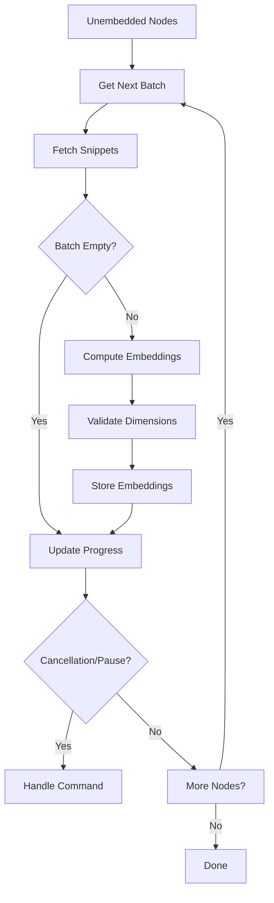

# Test Coverage Plan for Embeddings Pipeline

## Overview
This document outlines comprehensive test coverage requirements for the embeddings pipeline, prioritizing:
1. Reliability on consumer hardware (CPU-focused workflows)
2. Clean error propagation to terminal UI
3. Performance optimization (memory/CPU efficiency)
4. Network-handling resilience (for HuggingFace/OpenAI providers)

## Priority Levels
- **P0**: Critical path, required for production readiness
- **P1**: Important functionality, should be implemented
- **P2**: Nice-to-have optimizations, implement if possible

## Embedding Pipeline Diagram


---

## Unit Tests (P0) - Critical Function Coverage

### Embedding Processor
1. `generate_embeddings()`
   - Techniques: State simulation (mocked providers), Error injection
   - Validate each provider type handles:
     - Empty snippets vector
     - Mixed-length snippets
     - Embedding dimension mismatches
2. `dimensions()`
   - Techniques: Boundary tests for dimension reporting
   - Verify dimensions match provider config

### Local Embedder
1. `process_batch()`
   - Techniques: Golden tests with known inputs/outputs
   - Validate:
     - Tokenization edge cases (UTF-8, control chars)
     - Attention mask application
     - Pooling/aggregation correctness
2. `load_model()`
   - Techniques: Negative testing (invalid paths)
   - Validate:
     - Model fallback logic (safetensors -> pytorch)
     - GPU/CUDA allocation failures
     - HW auto-detection behaviour
3. `embed_batch()`
   - Techniques: Parameterized tests (batch sizes 1-64)
   - Verify:
     - Batch splitting logic
     - Memory scaling characteristics

### HuggingFace Provider
1. `compute_batch()`
   - Techniques: Mock-HTTP tests (wiremock)
   - Validate:
     - Token injection (API keys)
     - Batch chunking logic
     - HTTP/429 exponential backoff
2. Error mapping:
   - Map HTTP 401 -> AuthError
   - Map HTTP 429 -> RateLimitError

### OpenAI Provider
1. `compute_batch()`
   - Techniques: State machine testing
   - Validate:
     - Request serialization
     - Response deserialization
     - Token accounting (cost calculation)
   - Test error types:
     - Invalid JSON
     - Dimension mismatches
     - Truncated responses

### Batch Processing
1. `next_batch()`
   - Techniques: Fault-injection tests
   - Validate cursor tracking
   - Simulate cancellation mid-batch
2. `process_batch()`
   - Techniques: Data-driven tests
   - Verify:
     - Partial embedding updates
     - Error aggregation/reporting
     - Progress reporting granularity

### Cancellation Token
1. Integration tests
   - Test token propagation depth
   - Measure cancellation latency (<100ms)
   - Validate watchdog timers

### Error Handling
1. `truncate_string()`
   - Techniques: Property-based tests
   - Validate correctness invariants:
     - Output length <= max_len+1
     - Contains ellipsis when truncated
     - Always valid UTF-8
2. Error conversions
   - Validate EmbedError -> UiEvent mapping

---

## Integration Tests (P0-P1) - Critical Workflows

### Local Embedder Pipeline
1. Component integration points:
   - Tokenizer ⇨ Model ⇨ Pooling
   - Hardware detection ⇨ Model loading
2. Failure scenarios:
   - Out-of-VRAM recovery
   - Partial model downloads

### Remote Provider E2E Flow
1. Mock server integration:
   - Verify payload schema compliance
   - Test timeout handling (5s+,30s+)
   - Validate authentication headers
2. Parallelism control:
   - Test semaphore-based concurrency limiting
   - Connection pool exhaustion recovery

### Storage Integration Flow
1. Data integrity checks:
   - Validate DB write atomicity
   - Test embedding vector alignment
2. Progress tracking:
   - Verify consistent state reporting
   - Test resume-after-crash

### Cancellation Flow
1. Control plane tests:
   - Measure cancellation propagation speed
   - Validate ETCD-like state management
   - Test pause/resume state transitions

---

## Performance Testing (P1)

### Local Embedder
1. Metrics collection:
   - TP90/TP99 latency per batch size
   - Memory usage vs input length
   - CPU/GPU utilization %
2. Benchmarks:
   - Cold start vs warm start
   - Per-thread scaling characteristics

### Remote Providers
1. Network simulation:
   - Use tc-netem for packet loss/latency
   - Measure throughput under constraint
2. Load testing:
   - Parallel request saturation (100+ conn)
   - Automatic batch sizing (adaptivity)

### Pipeline End-to-End
1. Resource monitoring:
   - File I/O contention
   - DB write amplification
   - Inter-process communication
2. Regression benchmarks:
   - Per-component telemetry
   - CI regression detection

---

## Network Testing Matrix (P1)

| Condition         | Sim Method        | Success Criteria          |
|-------------------|-------------------|---------------------------|
| High Latency (300ms) | tc-netem       | 80% baseline throughput   |
| Packet Loss (3%)  | tc-netem         | No crashes, loss recovery |
| Intermittent Conn | Manual disconnect | Autoreconnect attempts    |
| Rate Limits       | Mock 429s        | Exponential backoff       |

### Transition Strategies
1. Local fallback:
   - Measure failover time
   - Test seamless transition UX
2. Graceful degradation:
   - Verify degraded-mode restrictions
   - Test notification systems

---

## Edge Cases (P2)

### Input Validation
1. Test:
   ```rust
   // Verify empty snippet handling
   assert!(processor.compute(&[""]).is_err());
   
   // Test whitespace-only inputs
   assert_eq!(processor.compute(&["   \n"])?.len(), DIM);
   ```
2. Tools:
   - cargo-fuzz for snippet content

### Hardware Constraints
1. Teardown tests:
   - OOM killer simulation (cgroups)
   - Crash during save recovery
2. Low-resource profiles:
   - Memory-constrained batch sizing
   - Thread reduction behaviors

### Compatibility Matrix
1. Validation targets:
   ```markdown
   | Model            | Dims | Status |
   |------------------|------|--------|
   | all-MiniLM-L6-v2 | 384  | ✅     |
   | text-embedding   | 768  | ✅     |
   | custom-model     | ?    | 🚧     |
   ```
2. Cache purging tests:
   - Verify stale model removal logic
   - Validate cache size limits
