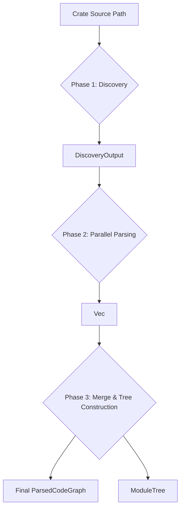
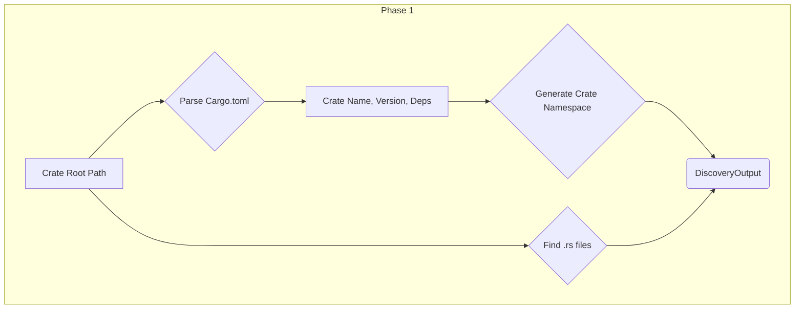
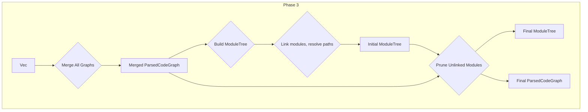

# `syn_parser`

`syn_parser` is a powerful Rust crate designed to parse and analyze Rust source code. It performs a multi-phase analysis to build a comprehensive and queryable representation of a crate's structure, including its modules, items, and their relationships. The primary outputs are a `ParsedCodeGraph`, which represents the syntactic elements of the code, and a `ModuleTree`, which provides a resolved view of the crate's module hierarchy.

## Core Concepts

-   **`ParsedCodeGraph`**: A collection of all nodes (functions, structs, enums, etc.) and syntactic relations found in the source files. Initially, one graph is created per file, which are then merged into a single crate-wide graph.
-   **`ModuleTree`**: A hierarchical representation of the crate's modules, built from the merged `ParsedCodeGraph`. It resolves `mod` declarations, handles `#[path]` attributes, and understands the visibility and accessibility of items.
-   **Node Identifiers**: The system uses UUID-based identifiers for all nodes.
    -   **Synthetic IDs**: Generated during the initial parsing phase. They are deterministic based on the item's name, kind, file path, and module path.
    -   **Canonical IDs (`CanonId`)**: Stable, resolved IDs generated after the module tree is built. They are based on the item's canonical path within the crate, making them resilient to file restructuring.

## Processing Pipelines

The main analysis is performed through a unified pipeline that can be invoked via `run_phases_and_merge`. This pipeline consists of several distinct phases.

### High-Level Pipeline Diagram



---

### Phase 1: Discovery

This initial phase scans the file system to gather information about the target crate.

-   **Input**: Path to the crate's root directory.
-   **Process**:
    1.  Parses the `Cargo.toml` file to extract crate name, version, dependencies, and features.
    2.  Generates a deterministic, version-specific UUID namespace for the crate.
    3.  Recursively finds all `.rs` source files within the `src` directory.
-   **Output**: A `DiscoveryOutput` struct containing a `CrateContext` for the crate, which includes the list of source files and manifest data.

#### Diagram: Discovery Phase


---

### Phase 2: Parallel Parsing

This phase takes the file list from the discovery output and parses each file into a graph representation in parallel.

-   **Input**: `DiscoveryOutput`.
-   **Process**:
    1.  Uses `rayon` to process each source file concurrently.
    2.  For each file, `syn` is used to parse the content into an Abstract Syntax Tree (AST).
    3.  A `CodeVisitor` traverses the AST.
    4.  During traversal, it creates nodes (for functions, structs, etc.) and relations (e.g., `Contains`).
    5.  **Synthetic `NodeId`s** are generated for each item. These IDs are deterministic based on the file path, module path within the file, item name, and kind.
-   **Output**: A `Vec<ParsedCodeGraph>`, where each `ParsedCodeGraph` corresponds to a single parsed file.

#### Diagram: Parallel Parsing Phase
```mermaid
graph TD
    subgraph Phase 2
        A[DiscoveryOutput] --> B{For each file in parallel};
        B --> C{syn::parse_file};
        C --> D[AST];
        D --> E{CodeVisitor Traversal};
        E --> F[ParsedCodeGraph (per file)];
    end
```

---

### Phase 3: Merge & Tree Construction

This phase consolidates the individual file graphs into a single, coherent crate-wide structure.

-   **Input**: `Vec<ParsedCodeGraph>`.
-   **Process**:
    1.  **Merge**: All `ParsedCodeGraph` instances are merged into a single graph containing all nodes and relations from the entire crate.
    2.  **Build Module Tree**: A `ModuleTree` is constructed from the merged graph. This critical step involves:
        -   Linking `mod foo;` declarations to their corresponding file or inline module definitions.
        -   Resolving `#[path]` attributes to correctly map module paths.
        -   Building an index of all items by their canonical path.
    3.  **Prune**: After the tree is built, any file-based modules that could not be linked to the tree (i.e., orphaned files not declared via a `mod` statement) are pruned from both the `ModuleTree` and the `ParsedCodeGraph`.
-   **Output**: A `ParserOutput` struct containing the final, pruned `ParsedCodeGraph` and the fully resolved `ModuleTree`.

#### Diagram: Merge & Tree Construction Phase


---

### Downstream Processing: ID Resolution

While not part of the main `run_phases_and_merge` pipeline, a key downstream activity is the resolution of synthetic IDs into stable, canonical IDs.

-   **Input**: `ParsedCodeGraph` and `ModuleTree`.
-   **Process**: The `CanonIdResolver` uses the `ModuleTree` to determine the canonical path of every item in the `ParsedCodeGraph`. It then generates a **`CanonId`** for each item, which is a stable UUIDv5 hash based on the crate's namespace and the item's canonical path and kind.
-   **Output**: A mapping from synthetic `NodeId`s to `CanonId`s. This allows for durable, long-term identification of code elements, even if file locations change.
