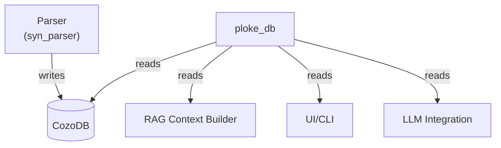

# ploke-db

High-performance text retrieval system for ploke's RAG pipeline, optimized for LLM code generation and refactoring.

## Core Purpose

**Retrieve relevant code snippets as text** from ploke's hybrid vector-graph database to:
- Provide context for LLM prompts
- Enable semantic code search
- Track changes across code versions

## Design Principles

1. **LLM-Optimized Output**:
   - Returns raw code strings with surrounding context
   - Preserves formatting, comments and documentation
   - Never converts back to Rust types (text-only interface)

2. **Hybrid Retrieval**:
   - **Graph queries**: "Find all public functions calling parse_json()"
   - **Semantic search**: "Find code similar to error handling examples"
   - **Keyword search**: "Find code containing the term 'BM25'"
   - Combined ranking of graph and vector results

3. **Location-Aware**:
   - Tracks exact file locations (path + byte spans)
   - Maintains version history for change detection
   - Provides surrounding context (3-5 lines around snippets)

## Key Features

`ploke-db` provides several mechanisms for retrieving code data:

- **Dense Vector Search (HNSW)**: Find semantically similar code using embeddings.
- **Sparse Keyword Search (BM25)**: Find code based on keyword relevance.
- **Direct Graph Queries (CozoScript)**: Perform complex traversals and pattern matching on the code graph.
- **Helper Methods**: High-level functions for common tasks like fetching nodes that need embedding or retrieving node data by ID.

```rust
use ploke_db::{search_similar_args, Database, EmbedDataVerbose, NodeType, SimilarArgs};
use uuid::Uuid;

// Assume `db` is an initialized `Database` instance and `vector_query` is a `Vec<f32>`.

// 1. Semantic/vector search for functions similar to a query vector
let args = SimilarArgs {
    db: &db,
    vector_query: &vector_query,
    k: 5,
    ef: 100,
    ty: NodeType::Function,
    max_hits: 5,
    radius: 0.5,
};
let EmbedDataVerbose { typed_data, dist } = search_similar_args(args)?;

// 2. After getting node IDs from a search, retrieve their full data
let node_ids: Vec<Uuid> = typed_data.v.iter().map(|d| d.id).collect();
let node_data = db.get_nodes_ordered(node_ids)?; // -> Vec<EmbeddingData>

// 3. Use raw CozoScript for a custom graph query
let query = r#"
    ?[name, path] := *function{name}, *module{id: module_id}, *file_mod{owner_id: module_id, file_path: path}
"#;
let results = db.raw_query(query)?; // -> QueryResult
```

## Architecture Position



**Role**: The primary interface for reading from the code graph database (`CozoDB`). It provides retrieval capabilities needed by the RAG pipeline, UI, and other components. It does not handle parsing or schema creation directly.

## Core Components

1.  **`Database` Struct**: The main entry point. It wraps a `cozo::Db` instance and provides methods for raw queries (`raw_query`, `raw_query_mut`) and various helper queries (`get_unembedded_node_data`, `get_nodes_ordered`, etc.).

2.  **Dense Vector Search**: The crate provides `search_similar_args` for dense vector retrieval using HNSW indexes.

3.  **`bm25_index` Module**: Implements sparse retrieval using a BM25 index. It includes a `CodeTokenizer` tailored for source code and a `bm25_service` actor for managing the index and handling search requests.

4.  **`QueryResult` Struct**: A generic wrapper around `cozo::NamedRows` returned by queries. It provides helper methods to convert the raw data into more structured types like `Vec<EmbeddingData>` or `Vec<CodeSnippet>`.

5.  **`QueryBuilder`**: A **work-in-progress** fluent interface for constructing CozoScript queries. It is currently limited and will be expanded in the future.

## Relationship to Other Crates

- **`ploke-transform`**: Defines the database schema (`function`, `struct`, `syntax_edge` relations, etc.) that `ploke-db` queries against.
- **`syn-parser`**: Populates the database with data that `ploke-db` reads.
- **`ploke-core`**: Defines core data structures like `EmbeddingData` and `TrackingHash` that are used for query inputs and results.
- **`ploke-embed`**: Generates the vector embeddings that are stored in the database and used by the `hnsw` module for semantic search.

## Development Status

Current focus areas:
- [x] Raw CozoScript query execution.
- [x] HNSW vector search implementation.
- [x] BM25 keyword search implementation.
- [x] Helper methods for core RAG workflows (getting unembedded nodes, updating embeddings).
- [ ] Expanding the fluent `QueryBuilder` to cover more use cases.
- [ ] Implementing high-level hybrid search strategies.
- [ ] Performance optimization and caching.

See `PROPOSED_ARCH_V3.md` in the workspace root for the overall system architecture.
