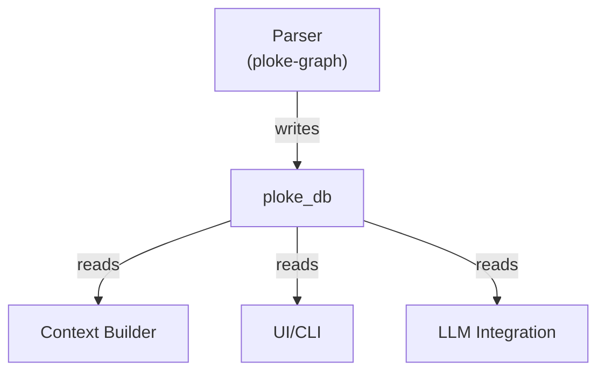

# ploke-db

High-level query interface for retrieving contextual code snippets from ploke's code graph database.

## Primary Responsibility

**Code Snippet Retrieval**:
- Locate and return relevant, executable code examples
- Preserve full context including:
  - Surrounding module hierarchy
  - Type definitions
  - Documentation
  - Usage patterns
- Support both exact matches and fuzzy/contextual searches

## Supporting Responsibilities

1. **Query Construction**:
   - Builder pattern for constructing complex graph queries
   - Type-safe query building with compile-time validation
   - Support for both exact and semantic searches

2. **Context Enrichment**:
   - Augment snippets with related type definitions
   - Include documentation and usage examples
   - Show calling patterns and trait implementations

3. **Database Abstraction**:
   - Unified interface over CozoDB's hybrid vector-graph storage
   - Schema versioning and migration support
   - Connection pooling and performance optimization

## Architecture Position



## Key Features

- **Graph Traversal**:
  ```rust
  db.query()
     .function("my_function")
     .with_relations(RelationKind::Calls)
     .execute()
  ```

- **Semantic Search**:
  ```rust
  db.semantic_search("parse JSON")
     .with_threshold(0.8)
     .limit(5)
  ```

- **Type-Safe Results**:
  ```rust
  let functions: Vec<Function> = db.find_functions()
     .with_return_type("String")
     .collect()?;
  ```

## Core Components

1. **Query Builder**:
   - Fluent interface for constructing queries
   - Supports all relation types from ploke-graph schema
   - Composable filter conditions

2. **Node Types**:
   - Strongly-typed representations of:
     - Functions
     - Structs/Enums/Unions
     - Traits/Impls
     - Modules

3. **Hybrid Search**:
   - Combine exact graph patterns with vector similarity
   - Configurable ranking algorithms
   - Result explanation/debugging

## Example Usage

```rust
use ploke_db::{Database, QueryBuilder};

// Find all public functions using a specific type
let db = Database::new(cozo_db);
let results = db.query()
    .functions()
    .with_visibility(Visibility::Public)
    .using_type("serde_json::Value")
    .with_documentation()
    .execute()?;

// Semantic search for similar code
let similar = db.semantic_search("parse JSON config")
    .in_functions()
    .with_min_score(0.7)
    .execute()?;
```

## Relationship to Other Crates

- **ploke-graph**:
  - Provides database schema and write operations
  - Defines the node and relation types we query

- **syn-parser**:
  - Shares type definitions for code elements
  - Provides parsing logic that creates our data

- **ploke-embed**:
  - Handles vector embeddings we use for semantic search
  - Manages embedding model integration

## Development Status

Current focus areas:
- [x] Basic query execution
- [ ] Query builder implementation
- [ ] Node type conversions
- [ ] Hybrid search integration
- [ ] Performance optimization

See [PROPOSED_ARCH_V3.md](../../PROPOSED_ARCH_V3.md) for overall system architecture.
