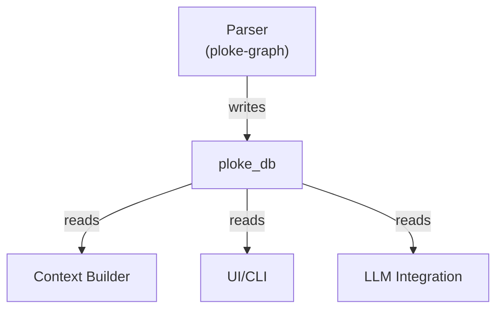

# ploke-db

High-performance text retrieval system for ploke's RAG pipeline, optimized for LLM code generation and refactoring.

## Core Purpose

**Retrieve relevant code snippets as text** from ploke's hybrid vector-graph database to:
- Provide context for LLM prompts
- Enable semantic code search
- Track changes across code versions

## Design Principles

1. **LLM-Optimized Output**:
   - Returns raw code strings with surrounding context
   - Preserves formatting, comments and documentation
   - Never converts back to Rust types (text-only interface)

2. **Hybrid Retrieval**:
   - **Exact queries**: "Find all public functions calling parse_json()"
   - **Semantic search**: "Find code similar to error handling examples"
   - Combined ranking of graph and vector results

3. **Location-Aware**:
   - Tracks exact file locations (path + byte spans)
   - Maintains version history for change detection
   - Provides surrounding context (3-5 lines around snippets)

## Key Features

```rust
// 1. Exact graph pattern matching
db.query()
   .functions()
   .called_by("main")
   .with_docs()
   .execute()?; // → Vec<CodeSnippet>

// 2. Semantic/vector search  
db.semantic_search("async database client")
   .in_files("src/db/")
   .limit(3) // → Vec<CodeSnippet>

// 3. Change detection
db.query()
   .modified_since("a1b2c3d")
   .execute()?;
```

## Architecture Position

```mermaid
flowchart LR
    parser["Parser (AST)"] --> graph["ploke-graph\n(Schema)"]
    graph --> db[(CozoDB)]
    ploke_db --> db
    ploke_db --> context["Context Builder"]
    context --> llm[(LLM)]
    
    style ploke_db stroke:#f66,stroke-width:2px
```

**Role**: Sole interface between:
- Database storage (ploke-graph)
- LLM context building
- Never handles ASTs or type information directly

## Performance Considerations

- Optimized for bulk text retrieval
- Efficient location-based queries
- Caching of common snippet patterns

## Architecture Position



## Key Features

- **Graph Traversal**:
  ```rust
  db.query()
     .function("my_function")
     .with_relations(RelationKind::Calls)
     .execute()
  ```

- **Semantic Search**:
  ```rust
  db.semantic_search("parse JSON")
     .with_threshold(0.8)
     .limit(5)
  ```

- **Type-Safe Results**:
  ```rust
  let functions: Vec<Function> = db.find_functions()
     .with_return_type("String")
     .collect()?;
  ```

## Core Components

1. **Query Builder**:
   - Fluent interface for constructing queries
   - Supports all relation types from ploke-graph schema
   - Composable filter conditions

2. **Node Types**:
   - Strongly-typed representations of:
     - Functions
     - Structs/Enums/Unions
     - Traits/Impls
     - Modules

3. **Hybrid Search**:
   - Combine exact graph patterns with vector similarity
   - Configurable ranking algorithms
   - Result explanation/debugging

## Example Usage

```rust
use ploke_db::{Database, QueryBuilder};

// Find all public functions using a specific type
let db = Database::new(cozo_db);
let results = db.query()
    .functions()
    .with_visibility(Visibility::Public)
    .using_type("serde_json::Value")
    .with_documentation()
    .execute()?;

// Semantic search for similar code
let similar = db.semantic_search("parse JSON config")
    .in_functions()
    .with_min_score(0.7)
    .execute()?;
```

## Relationship to Other Crates

- **ploke-graph**:
  - Provides database schema and write operations
  - Defines the node and relation types we query

- **syn-parser**:
  - Shares type definitions for code elements
  - Provides parsing logic that creates our data

- **ploke-embed**:
  - Handles vector embeddings we use for semantic search
  - Manages embedding model integration

## Development Status

Current focus areas:
- [x] Basic query execution
- [ ] Query builder implementation
- [ ] Node type conversions
- [ ] Hybrid search integration
- [ ] Performance optimization

See [PROPOSED_ARCH_V3.md](../../PROPOSED_ARCH_V3.md) for overall system architecture.
