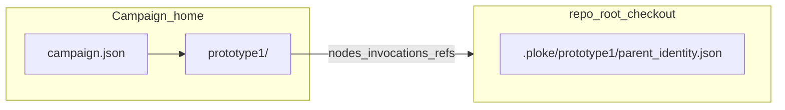

# Parent/child `ploke-eval loop` path — operator appendix

Purpose: catalogue **where files live**, what they **mean**, which **trait-shaped** I/O seams exist, and how **scheduler generations** relate to **History** — without treating this document as authority. **Sealed History and Crown transitions** remain the correctness boundary; monitors and previews are projections only (see [`evidence.rs`](evidence.rs) module docs and AGENTS guidelines).

Canonical file-map labels remain in `cli_facing.rs` (`prototype1_monitor_locations`) for local diagnostics.

## Two trees to keep straight (anchors)

Campaign eval home defaults to **`$PLOKE_EVAL_HOME/campaigns/<campaign-id>/`** (when unset: `~/.ploke-eval/…`; see [`layout.rs`](../../layout.rs) `campaigns_dir`). The **`campaign.json`** next to **`prototype1/`** is the path anchor for helpers like `prototype1_scheduler_path`.

**`--repo-root`** points at the **active parent artifact checkout**. That checkout carries **`.ploke/prototype1/parent_identity.json`** ([`identity.rs`](identity.rs)) — swapped or updated across handoffs. During a live run, open campaign **`prototype1/`** for scheduler and node files; open the **artifact checkout** for git state and parent identity.

Child evaluation often uses **`prototype1/nodes/<node-id>/worktree/`** (ephemeral artifact surface), not long-lived campaign files.

## Command fan-in

| Subcommand | Role |
|------------|------|
| `loop prototype1` | Legacy/high-level controller; may write **`prototype1/prototype1-loop-trace.json`**. Prefer typed path for live handoff. |
| `loop prototype1-state` | Typed **parent**: materialise, build, spawn, History seal, successor handoff; writes under campaign **`prototype1/`** + identity in **`--repo-root`**. |
| *(removed)* `loop prototype1-runner` | Leaf execution is now reached through the typed `prototype1-state` runtime path. |
| *(removed)* `loop prototype1-monitor` | Read-only monitor command surface removed; use `history` / evidence projections and on-disk inspection. |

## Files under `campaigns/<id>/prototype1/` (relative to manifest parent)

Aligned with current typed runtime paths plus **History** paths from **`FsBlockStore::for_campaign_manifest`** ([`history.rs`](history.rs)).

| Path | Volatility | Contents / contract |
|------|-------------|---------------------|
| `../campaign.json` | Setup/edits | Resolved campaign manifest; anchor for path helpers ([`campaign.rs`](../../campaign.rs)). |
| `scheduler.json` | Overwritten | **`Prototype1SchedulerState`**: policy, **`frontier_node_ids`**, completed/failed, **`nodes[]`**, **`last_continuation_decision`** ([`scheduler.rs`](../../intervention/scheduler.rs)). |
| `branches.json` | Overwritten | Branch registry (`Prototype1BranchRegistry`) ([`branch_registry.rs`](../../intervention/branch_registry.rs)). |
| `prototype1-loop-trace.json` | Legacy | Legacy loop trace from older controller (`run_prototype1_loop_controller`). |
| `transition-journal.jsonl` | Append-only | Typed **`JournalEntry`** stream · **`PrototypeJournal`** implements **`RecordStore`** ([`journal.rs`](journal.rs), [`algebra`](../../intervention/algebra/mod.rs)). |
| `evaluations/<branch-id>.json` | Per branch | **`Prototype1BranchEvaluationReport`** inputs to metrics/selection/evidence (**not** History). |
| `nodes/<node-id>/node.json` | Mutable mirror | **`Prototype1NodeRecord`** including **`generation`**, **`branch_id`**, workspace/binary paths. |
| `nodes/.../runner-request.json` | Mutable | **`Prototype1RunnerRequest`** (CLI argv payload for runner). |
| `nodes/.../runner-result.json` | Latest | **`Prototype1RunnerResult`**. |
| `nodes/.../invocations/<runtime-id>.json` | Per attempt | **`Invocation`** — Child vs Successor bootstrap contract ([`invocation.rs`](invocation.rs)). |
| `nodes/.../results/<runtime-id>.json` | Per attempt | Attempt result mirror for tooling. |
| `nodes/.../successor-ready/<runtime-id>.json` | Handoff | **`SuccessorReadyRecord`**. |
| `nodes/.../successor-completion/<runtime-id>.json` | Terminal successor | **`SuccessorCompletionRecord`**. |
| `nodes/.../channels/<runtime-id>/*.jsonl` | Append | **`FileTransport`** under **`Transport`** trait — `parent-to-child.jsonl`, `child-to-parent.jsonl` ([`channel.rs`](channel.rs)). Migration/staging; see **Channel vs journal** below. |
| `nodes/.../worktree`, `bin/`, `target/` | Temporary | Build/eval workspaces; discard after cleanup. |
| **`history/`** subtree | Append + indexes | **`FsBlockStore`** / **`BlockStore`**: `blocks/segment-000000.jsonl`, `index/by-hash.jsonl`, `by-lineage-height.jsonl`, `heads.json`. **Heads are projections** of the sealed block stream ([`history.rs`](history.rs) comments). |

Optional: **`PLOKE_PROTOTYPE1_TRACE_JSONL`** enables observation JSONL via [`tracing_setup.rs`](../../tracing_setup.rs).

## History directory visibility

History files under **`prototype1/history/{blocks,index}/…`** are inspected directly on disk or via `history`/preview CLI that reads **`FsBlockStore`** layout.

## Glossary — “generation” and related terms

| Term | Meaning here | Wrong inference |
|------|----------------|----------------|
| **`Prototype1NodeRecord.generation`** / scheduler **`next_generation`** | **Search-wave / graph-expansion coordinate** from [`scheduler.rs`](../../intervention/scheduler.rs) (`prototype1_node_id` mixes branch id + generation). | Equals sealed block height or global loop counter. |
| **Scheduler frontier / continuation** | **Which candidate nodes run next** (`Prototype1ContinuationDecision`). | Equals Crown lineage choice by itself — selection informs parents; **History seal** admits authority. |
| **History lineage / sealed block / `FsBlockStore`** | Tamper-evident **authority substrate** for one lineage’s Crown epochs ([`history.rs`](history.rs), [`mod.rs` rustdoc](mod.rs)). **`append`** consumes expected **`LineageState`**. | Same document as **`scheduler.json`**. Scheduler is a **mutable operational projection**. |
| **Crown epoch** | Time window where **`Parent<Ruling>`** admits entries before **lock/seal**. | Equal to **`scheduler.generation`** field on a node row. |

Code explicitly warns **generation is not block height** (see **`mod.rs`** and **`history.rs`** crate docs).

## Channel files vs transition journal — debugging handoff

| Surface | Trait / type | Typical use today |
|---------|----------------|-------------------|
| **`channels/.../parent-to-child.jsonl`** and **`child-to-parent.jsonl`** | **`Channel` + `FileTransport`** ([`channel.rs`](channel.rs)) · module notes **staging / migration**. | Inspect when debugging typed channel envelopes **if** transitions wrote them for this runtime id. |
| **`transition-journal.jsonl`** | **`RecordStore` + `JournalEntry`** ([`journal.rs`](journal.rs)) | **Primary replay** seam for spawn/materialize/observe statuses; **`status`** projections fold journal ([`status.rs`](status.rs)). **`journal`** module notes legacy vs structural naming — still the durable stream many paths append to. |

If handoff disagrees between channel and journal, **treat journal + invocation FS + History seal** as the authority chain referenced by live parent code paths until channel migration completes; channels are supplementary evidence.

## Trait-shaped vs plain file I/O

| Abstraction | Role | Backend here |
|-------------|------|--------------|
| **`RecordStore`** | Append transitions | **`PrototypeJournal` → transition-journal.jsonl** |
| **`BlockStore`** | Append sealed blocks (only **`append`** advances head contractually) | **`FsBlockStore` → prototype1/history/** |
| **`Transport`** | Parent/child bytes | **`FileTransport` → channels/*.jsonl** |
| **Evidence preview (`FsEvidenceStore`)** | Typed read grouping for monitors | See [`history_preview.rs`](history_preview.rs) — **explicitly not** sealed History authority [**`evidence.rs`**](evidence.rs) |

Most scheduler/registry/node JSON uses **direct serde + `fs`** in [`intervention/`](../../intervention/) and CLI loaders.

## Process arc (one lineage step)

Conceptual ordering: **`prototype1-state`** updates scheduler → writes **`invocation`** (and optionally channel roots) → evaluates child runtime via the typed path → child writes **`results` / runner-result** → parent scores/selects → may **`FsBlockStore::append`** sealed block → **successor-ready / completion** files → **`prototype1-state --handoff-invocation`** on advanced **`repo_root`** with updated **parent identity**.

---
*Descriptive appendix only.* For inner eval core continuation see [`inner/HANDOFF.md`](../../inner/HANDOFF.md).
