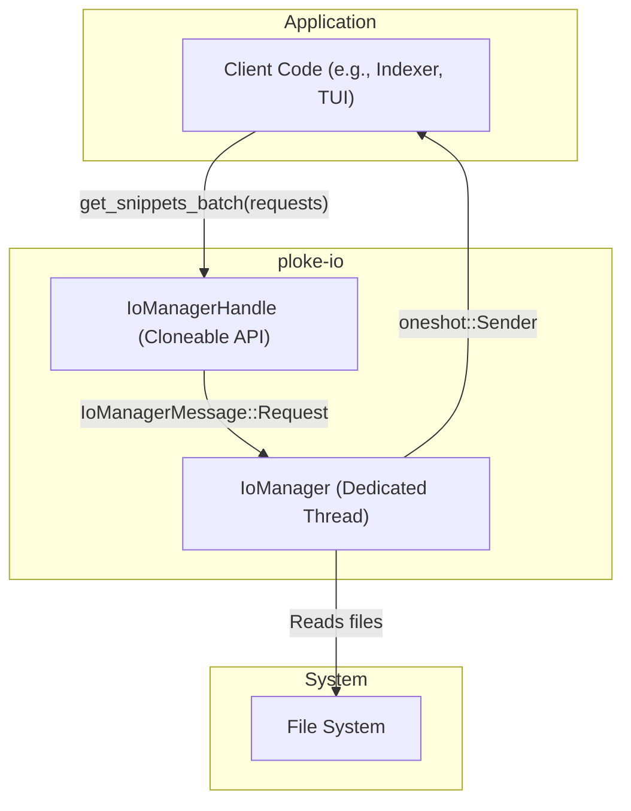

# `ploke-io`: Asynchronous File I/O Actor

`ploke-io` provides a non-blocking I/O actor system for reading file snippets concurrently. It is designed for applications that need to read from many files without blocking, ensuring that file content has not changed since it was last indexed.

## Architecture

The crate uses an actor model to isolate file I/O from the main application logic. This prevents blocking the caller's thread, which is critical in applications with their own async runtimes (like a TUI or web server).

### High-Level Diagram



### Detailed Data Flow (`get_snippets_batch`)

```mermaid
sequenceDiagram
    participant Client
    participant Handle as IoManagerHandle
    participant Actor as IoManager
    participant FS as File System

    Client->>+Handle: get_snippets_batch(requests)
    Handle->>Handle: Creates oneshot channel
    Handle->>Actor: Sends IoManagerMessage::Request(ReadSnippetBatch)
    Note over Actor: Receives message in main loop

    Actor->>Actor: Groups requests by file_path
    loop For each file
        Actor->>Actor: Spawns tokio task to process_file()
    end

    par For each file
        Actor->>Actor: Acquires Semaphore permit
        Actor->>FS: Reads entire file content
        FS-->>Actor: Returns file bytes
        Actor->>Actor: Verifies content hash against request
        Note right of Actor: If hash mismatches, returns ContentMismatch error
        Actor->>Actor: Extracts all requested snippets
        Actor->>Actor: Releases Semaphore permit
    end

    Actor->>Actor: Collects and re-orders results
    Actor->>Client: Sends Vec<Result<String, PlokeError>> via oneshot channel
    Handle-->>-Client: Returns results
```

## API Usage

The primary entry point is `IoManagerHandle`, which can be cloned and shared across threads.

### Initialization

Create a handle to spawn the background I/O actor.

```rust
use ploke_io::IoManagerHandle;

let io_manager = IoManagerHandle::new();
```

### Reading Snippets

To read one or more code snippets, create a `Vec<EmbeddingData>` and pass it to `get_snippets_batch`. The results are returned in the same order as the requests.

```rust
# use ploke_core::{EmbeddingData, TrackingHash};
# use std::path::PathBuf;
# use uuid::Uuid;
# use ploke_io::IoManagerHandle;
#
# async fn example() {
# let io_manager = IoManagerHandle::new();
# let file_path = PathBuf::from("src/lib.rs");
# let content = "fn hello() {}";
# let file_tracking_hash = TrackingHash::generate(Uuid::nil(), &file_path, &content.parse().unwrap());
let requests = vec![
    EmbeddingData {
        id: Uuid::new_v4(),
        file_path: file_path.clone(),
        file_tracking_hash,
        start_byte: 3,
        end_byte: 8,
        // ... other fields
#       name: "hello".into(),
#       namespace: Uuid::nil(),
#       node_tracking_hash: file_tracking_hash,
    },
    // ... more requests
];

match io_manager.get_snippets_batch(requests).await {
    Ok(results) => {
        for result in results {
            match result {
                Ok(snippet) => println!("Retrieved snippet: {}", snippet),
                Err(e) => eprintln!("Failed to get snippet: {:?}", e),
            }
        }
    }
    Err(e) => eprintln!("Batch request failed: {:?}", e),
}
# }
```

### Scanning for Changes

To check if files have been modified since they were last indexed, use `scan_changes_batch`. It returns a list of files whose content hash has changed.

```rust
# use ploke_core::{FileData, TrackingHash};
# use std::path::PathBuf;
# use uuid::Uuid;
# use ploke_io::IoManagerHandle;
#
# async fn example() {
# let io_manager = IoManagerHandle::new();
# let file_path = PathBuf::from("src/lib.rs");
# let content = "fn hello() {}";
# let file_tracking_hash = TrackingHash::generate(Uuid::nil(), &file_path, &content.parse().unwrap());
let files_to_check = vec![
    FileData {
        file_path,
        file_tracking_hash,
        namespace: Uuid::nil(),
    },
    // ... more files
];

match io_manager.scan_changes_batch(files_to_check).await {
    Ok(Ok(changed_files)) => {
        for changed in changed_files.into_iter().flatten() {
            println!("File changed: {}", changed.file_path.display());
        }
    }
    _ => eprintln!("Failed to scan for changes"),
}
# }
```

### Shutdown

To gracefully shut down the actor, call `shutdown()` and await its completion.

```rust
# use ploke_io::IoManagerHandle;
# async fn example() {
# let io_manager = IoManagerHandle::new();
io_manager.shutdown().await;
# }
```

## Analysis and Future Development

### 1. Areas for Expansion

-   **Write Operations**: The crate is currently read-only. Adding methods to write changes to files (e.g., `apply_patch`) would be a critical feature for automated refactoring.
-   **Content Caching**: To improve performance, the `IoManager` could cache file contents and tracking hashes in memory (e.g., in an LRU cache) to avoid redundant disk reads and parsing for frequently accessed files.
-   **Configuration**: The semaphore limit is determined automatically. Exposing configuration options (e.g., via a builder pattern for `IoManagerHandle`) would offer more control to consumers.

### 2. Impact of a File Watcher

Integrating a file watcher (e.g., using the `notify` crate) would enable proactive change detection, shifting the system from a pull-based model (`scan_changes_batch`) to a push-based one.

-   The `IoManager` would need to manage the watcher and translate its events into system-wide notifications (e.g., "file X has changed").
-   This would allow for real-time updates to the code graph and embeddings, making the RAG system more responsive.
-   The `scan_changes_batch` method might become obsolete or serve as a fallback for systems without efficient file watching.

### 3. Areas for Refactoring

-   **`process_file` Complexity**: The `process_file` function in `src/lib.rs` is overly complex, handling file reading, parsing, hash verification, and snippet extraction in one large block with multiple exit points. It should be broken down into smaller, testable functions.
-   **Hash Verification Logic**: The current implementation verifies the content hash against the hash from the *first* request in a batch for a given file (`requests[0]`). This is a potential bug if requests for the same file have different hashes. The logic should be made more robust.
-   **Error Handling**: The conversion from the internal `IoError` to the workspace-wide `ploke_error::Error` is verbose and could be streamlined. Error propagation within `process_file` is also repetitive and could be simplified using the `?` operator.

## Project Plan and Implementation Logs

To move ploke-io to production readiness, see the phased roadmap and procedures:

- Production Plan: crates/ploke-io/docs/production_plan.md
- Implementation Logs (2-log window): crates/ploke-io/docs/implementation-log-000.md (newest first; keep only the latest two logs)

Implementation process guidelines:

- Each cohesive change should add a new implementation-log-NNN.md documenting rationale, summary of changes, verification, and next steps (referencing the plan).
- Maintain a two-log window by removing the oldest log whenever a new one is added.
- Keep PRs small, add/update tests with each change, and update docs alongside code.
