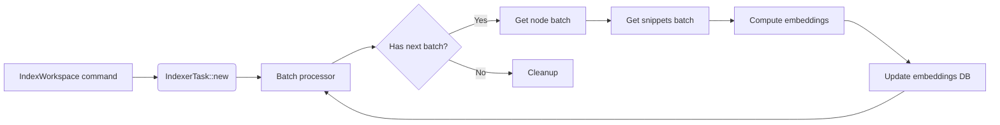

# Todo

**Architecture recommendation:**

```mermaid
graph LR
A[IndexWorkspace command] --> B(IndexerTask::new)
B --> C[Batch processor]
C --> D{Has next batch?}
D -- Yes --> E[Get node batch]
E --> F[Get snippets batch]
F --> G[Compute embeddings]
G --> H[Update embeddings DB]
H --> C
D -- No --> I[Cleanup]

```
