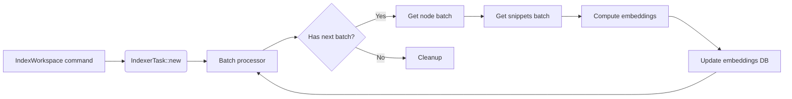

# Todo

## **Architecture recommendation:**

## Indexer Task will

1. calling the database to get the non-indexed nodes in the graph using
   `get_nodes_for_embedding`
2. calling the `get_snippets_batch` function to retrieve the code snippets from
   the target location
3. then either:
     a. processing the embeddings locally, likely using `candle` or an
     alternative
     b. sending the embeddings to a remote API that can process the code
     snippets into embeddings.
4. calling the `index_embeddings` function to create the hnsw index for the
   embeddings.
5. return here and likely sending some kind of event to alert the rest of the
   systems, either through events or by changing state, that the embeddings are
   finished.

- Note that we will want to ensure there are some other features built in as
well, such as a progress bar in the TUI that shows the ongoing progress of the
embeddings and ways to fail gracefully if the program is terminated early, and
ways to save our progress in processing the embeddings if possible, perhaps
through some kind of streaming mechanism or something, I don't know very much
about how vector embeddings are handled remotely or locally, and don't know if
there are streaming options available for vector embeddings services
specifically or through the `candle` crate, which I've never used.

---

### Questions on implementing vector embeddings

- Note: These 

Based on the supplied code, here are key questions to resolve for implementing the `IndexerTask` in [`crates/ingest/ploke-embed/src/indexer.rs`](crates/ingest/ploke-embed/src/indexer.rs):

1. **Batch Acquisition Mechanism**
   How will `next_batch()` fetch batched nodes requiring embeddings? Currently undefined. Need to decide between:
   - Paginating DB queries with `OFFSET/LIMIT`
   - Cursor-based iteration without offsets
   - Pulling all nodes upfront and slicing into batches (memory-intensive)

2. **Cancellation Handling**
   The `CancellationToken` exists but is unused. How should it interrupt:
   - Between batches?
   - Mid-batch processing?
   - Needs integration with the `run()` loop and cancellation checks

3. **State Management**
   Should state be maintained between batches? Currently stateless. Considerations:
   - Tracking processed node IDs to prevent overlap
   - Progress persistence across runs
   - Resume capability after interruptions

4. **Node Filtering Requirements**
   How to handle nodes failing validation? Current `process_batch()` skips:
   - Snippet read failures
   - Dimension mismatches
   Need strategy for irreversible errors vs. retries

5. **Pagination API Shape**
   Must define the `get_nodes_for_embedding` method's pagination parameters:
   - Limit/offset parameters?
   - Continuation token?
   - Implicit "next cursor"?

6. **Distributed Context**
   How should `run()` behave if invoked concurrently?
   - Coordinate via DB locks?
   - Partition work explicitly?
   - Assume single-instance indexing?

7. **Progress Reporting Granularity**
   How frequently should progress be reported? Currently per-node:
   - Whole batches?
   - Larger intervals?
   - Integration with higher-level UI

Key dependencies:
- Pagination needs new DB query logic ([`ploke-db/src/database.rs`](crates/ploke-db/src/database.rs))
- Cancellation requires token implementation
- State design affects DB storage

Which aspect should we prioritize first? I'll prepare a solution draft after clarification.
