# ploke-rag

This crate provides the core Retrieval-Augmented Generation (RAG) services for the Ploke ecosystem. It combines dense vector search, sparse keyword search, and graph-based queries to retrieve relevant code context for LLM prompts.

## Current Functionality

The `ploke-rag` crate currently provides a `RagService` that orchestrates hybrid search capabilities.

-   **`RagService`**: The main entry point for performing searches. It requires handles to `ploke-db` and `ploke-embed`.
-   **BM25 Sparse Search**: Implements keyword-based search using a BM25 index. The service can build the index and perform searches against it.
-   **Hybrid Search**: Combines the results of dense vector search (from `ploke-db`) and sparse BM25 search to provide more relevant results than either method alone.

This service is used by `ploke-tui` to power the `/bm25 search` and `/hybrid search` commands.

## Planned Flow

The long-term vision for `ploke-rag` is a more sophisticated, multi-stage pipeline that leverages LLMs for query understanding and result reranking.

#### crate flow

```mermaid
---
config:
  layout: dagre
---
flowchart TD
 subgraph subGraph0["Strategy Options"]
        D1["Translate to CozoScript - e.g., Qwen2 8B, Gemma2 9B"]
        D2["Classify for Pre-scripted Query - e.g., Traverse nearest n edges"]
        D3["Use Sub-Prompt Directly - For semantic search"]
  end
 subgraph subGraph1["Phase 1: Query Understanding & Generation"]
        B{"Prompt Decomposition - Small LLM"}
        A["User Enters Prompt"]
        C["Generated Sub-Prompts"]
        D{"Query Generation Strategy"}
        subGraph0
  end
 subgraph subGraph2["Phase 2: Unified Retrieval"]
        E{"Unified CozoDB Query<br>Batch Requests"}
        E_detail["Graph Traversal (CPG) + Semantic Search (Vectors)"]
        F["Initial Query Results"]
  end
 subgraph subGraph3["Reranking Methods"]
        H1["Option A: Single LLM - Handles all top-k results"]
        H2["Option B: Parallel LLMs - Multiple small models"]
  end
 subgraph subGraph4["Prompt Components"]
    direction TB
        J1["Original User Prompt"]
        J2["Top-k Reranked Snippets"]
        J3["LLM-Generated Metadata"]
        J4["Application System Prompts"]
        J5["User System Prompts"]
  end
 subgraph subGraph5["Phase 3: Reranking & Context Assembly"]
        G{"Rerank Results"}
        subGraph3
        I["Augmented Prompt Stitching"]
        subGraph4
  end
 subgraph subGraph6["Phase 4: Final Generation"]
        K["Final Structured Prompt"]
        L{"Main LLM API Call"}
        M["Response to User"]
  end
    A --> B
    B --> C
    C --> D
    D --> D1 & D2 & D3
    D1 --> E
    D2 --> E
    D3 --> E
    E == Single query performs both ==> E_detail
    E_detail --> F
    F --> G
    G -.-> H1 & H2
    H1 -.-> J2
    H2 -.-> J2
    J1 --> I
    J2 --> I
    J3 --> I
    J4 --> I
    J5 --> I
    I --> K
    K --> L
    L --> M
    style B fill:#303030,stroke:#BB86FC,stroke-width:2px
    style D fill:#303030,stroke:#BB86FC,stroke-width:2px
    style E fill:#424242,stroke:#03DAC6,stroke-width:2px
    style G fill:#303030,stroke:#BB86FC,stroke-width:2px
    style I fill:#303030,stroke:#BB86FC,stroke-width:2px
    style L fill:#303030,stroke:#BB86FC,stroke-width:2px
```

### Planned flow
1. User enters prompt
2. Prompt Decomposition: A small LLM expands the user’s prompt into several sub-prompts that each ask a part of the question implicit in the user’s prompt
3. Each sub-prompt given to either
    1. A single smaller but not too small LLM (Gemini flash or similar)
    2. Another small LLM to be translated into CozoScript/Datalog for query (likely a single small model, e.g. QwQ 8B or Gemma 32B, or a specialized model of similar size)
    3. Classified into a pre-defined bucket of prompt categories with corresponding pre-scripted queries for, e.g. traversing nearest n edges
    4. Both
4. Query performed
    1. Because `cozo` is fucking amazing, we can do a single query with both semantic search and graph traversal in a single query. Honestly not a huge efficiency win, but its cool af.
5. Results reranked, using structured output (json likely), by either
    1. A single LLM that can keep entire returned top k queries in context
    2. Multiple small LLMs running in parallel (depending on free/price and rate limits/speed)
6. Augmented prompt stitched together into structured prompt from
    1. User’s original prompt
    2. (maybe) Expanded prompt
    3. returned top k query results
    4. file locations of code snippets
    5. (possibly) metadata, such as an LLM-generated summary of the role of each file in the overall project?
    6. application-defined (i.e. by me) system prompts (e.g. “You are a rust expert”, “prioritize answering questions about the code base”, “you may only edit X files”, etc)
    7. user-defined system prompts, e.g. OpenAI Codex’s AGENTS.md or gemini cli’s GEMINI.md, user-defined code conventions basically.
