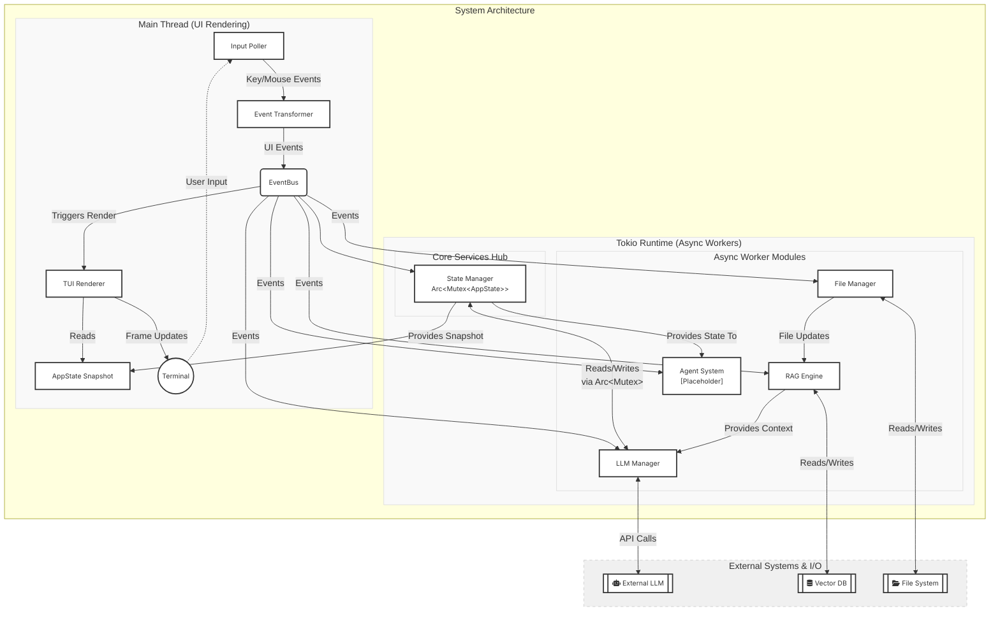

# ploke-tui

Let's break this down:

#### Concurrency Model Analysis (Mermaid Diagram)

## Detailed Concerns

We have reviewed the project files and the initial concurrency plan. The following is
a summary of the current state and what remains to be done, broken down by file.

                              Summary of What We've Done

 1 Identified weaknesses in the concurrency plan, particularly around state contention
   and event bus design.
 2 Clarified the purpose of the application (a Rust coding assistant with principles
   of transparency, control, and engagement).
 3 Designed solutions for:
    • State segmentation (using RwLock for different components)
    • Event bus with priority channels
    • Conversation persistence in markdown format
    • Error handling pipeline
 4 Defined next steps for refactoring and implementation.

                                 Current File Review

                             crates/ploke-tui/Cargo.toml

 • Review: Includes necessary dependencies for TUI, async, serialization, etc.
   workspace = true for tokio and log is good.
 • To Do:
    • Add dirs for configuration file paths.
    • Add env_logger or similar for logging.
    • Add governor for rate limiting (as per LLM plan).

                              crates/ploke-tui/README.md

 • Review: Contains the Mermaid diagram and overview of the architecture. The diagram
   is consistent with our design.
 • To Do:
    • Update the diagram to reflect the refined state design (granular locks) and
      event bus (multiple channels for priorities).
    • Document the purpose and principles of the application.

                             crates/ploke-tui/src/app.rs

 • Review:
    • Defines the App struct with UI state and event handling.
    • Implements the main run loop and drawing.
    • Handles key events and navigation in the conversation tree.
 • To Do:
    • Refactor to use segmented state (AppState with chat, config, etc.).
    • Replace direct ChatHistory access with state manager commands (via channel).
    • Implement error toasts for user feedback (using the error channel from the event
      bus).
    • Add performance optimizations (frame timing, hiding cursor during heavy draws).

                          crates/ploke-tui/src/app_state.rs

 • Review:
    • Defines AppState and state commands.
    • Implements the state manager as an async task.
    • Handles commands like AddMessage and UpdateMessage.
 • To Do:
    • Refactor AppState to have granular RwLock fields (chat, config, system).
    • Implement conversation persistence (call persist on updates?).
    • Enhance error propagation: when commands fail, send error events.
    • Define more state commands (e.g., for configuration changes).

                         crates/ploke-tui/src/chat_history.rs

 • Review:
    • Defines the branching ChatHistory and Message structures.
    • Implements message updates and validation.
    • Provides navigation methods.
 • To Do:
    • Complete persist method for markdown output (with atomic write using temp file
      and rename).
    • Fix the timestamp (use chrono or time crate for formatting).
    • Handle MessageRole in the persistence.

                             crates/ploke-tui/src/llm.rs

 • Review:
    • Defines events, parameters for LLM.
    • Has a rate limiter and a burst limiter.
    • Implements an asynchronous manager for LLM requests.
 • To Do:
    • Complete the call_llm_api function (integration with an actual LLM API).
    • Use the governor rate limiter appropriately in the API calls.
    • Implement sending of partial responses (streaming) to update the UI
      progressively.

                             crates/ploke-tui/src/main.rs

 • Review:
    • Sets up the tokio runtime, event bus, and state manager.
    • Defines the EventBus with realtime and background channels.
    • Main entry point.
 • To Do:
    • Implement the priority event handling in the UI (realtime vs. background).
    • Properly handle the shutdown signal (e.g., when the UI quits, propagate to async
      tasks).
    • Setup logging with log and env_logger.

                   crates/ploke-tui/src/utils/layout.rs and mod.rs

 • Review:
    • Currently has a helper for splitting the status line.
 • To Do:
    • Add more layout helpers as needed (for conversation tree, input area, etc.).

                          What Remains to Be Done (Overall)

 1 Refactor State Management: Break AppState into granular components (chat, config,
   system) and switch to RwLock.
 2 Enhance EventBus: Implement the multi-priority channels and integrate into the
   state manager and UI.
 3 Conversation Persistence: Complete the markdown writer and trigger on relevant
   commands.
 4 Error Handling: Create error events and display them in the UI (toasts or status
   bar).
 5 UI Performance: Optimize rendering to meet 60-120 FPS.
 6 LLM Integration: Complete the API calls and streaming response handling.
 7 Configuration: Implement config file loading and saving with dirs and toml.

                               Priority Order of Tasks

 1 Refactor state and event bus (critical for stability and performance).
 2 Implement persistence and error handling (core functionality).
 3 Optimize UI rendering.
 4 Complete LLM integration.

Would you like a detailed breakdown of the first task (state and event bus
refactoring)?

## Summary

### Review Summary and Progress
We've analyzed your concurrency architecture and identified key improvements aligned with your principles of transparency, control, and engagement. Here's a breakdown per file showing your current implementation status versus outstanding work:

---

### **Current Implementation Status**
| File | Key Implementations | Key Missing Elements |
|------|---------------------|----------------------|
| `Cargo.toml` | - Tokio async runtime - Ratatui UI - Basic event handling deps | - Governor rate limiter - Chrono timestamp handling - Error logging framework |
| `README.md` | - Mermaid architecture diagram | - Updated diagram showing granular locking - EventBus priority channels |
| **`app.rs`** | - Basic UI rendering - Key handling - Navigation logic | - Granular state access - Error toasts - Frame rate controls - Agent integration points |
| **`app_state.rs`** | - StateCommand enum - Basic state manager | - RwLock segmentation - Dedicated error channel - Shutdown protocol - Persistence triggers |
| **`chat_history.rs`** | - Branching message tree - Parent/child relationships | - Persistent file writer - Atomic write safeguards - Chrono timestamp formatting |
| **`llm.rs`** | - LLM parameters definition - Event structure | - Governor rate limiter - API call integration - Streaming partial updates |
| **`main.rs`** | - EventBus structure - Priority channels | - Error handling pipeline - Signal for immediate UI termination when frozen |

---

### **Completed Design Work**
1. **Concurrency Blueprint**
   - Granular RwLock design for state segmentation
   - Priority-based event bus architecture
   - Worker lifecycle protocols

2. **Transparency Features**
   - Conversation history file format (Markdown + metadata)
   - Structured error event pipeline
   - Progressive LLM response rendering

3. **Control Mechanisms**
   - Configurable rate limiter
   - Frame budget enforcement
   - Atomic file write operations

---

### **Pending Implementation Work**
**Phase 1: Critical Foundations**
1. **State Segmentation (2-3 hours)**
   - Implement granular `RwLock` for `AppState` components
   - Verify lock-free UI rendering paths

2. **EventBus Upgrade (2 hours)**
   - Add error channel to `EventBus`
   - Implement backpressure strategy for background tasks

3. **Persistence Layer (1 hour)**
   - Complete Markdown writer in `chat_history.rs`
   - Add atomic write via tempfile + rename

**Phase 2: User Experience**
4. **Error Handling Pipeline (1.5 hours)**
   - Visual toast system
   - Error serialization to log files

5. **Performance Optimization (Ongoing)**
   - Frame timing instrumentation
   - Render fallback on over-budget frames

**Phase 3: Integration**
6. **LLM Worker Completion (3 hours)**
   - Governor rate limiter integration
   - Streaming API response handling

---

### **Concerns Requiring Final Decisions**
1. **Frame Budget Allocation**
   - Hard threshold for frame rendering (8ms for 120fps?)
   - Degradation strategy (skip effects vs lower quality)

2. **Error Visual Hierarchy**
   - Distinction between transient errors vs persistent failures
   - Top-bar annuity vs ephemeral toasts

3. **Persistence Triggers**
   - Auto-save interval configuration
   - Manual save shortcuts (Ctrl+S)

