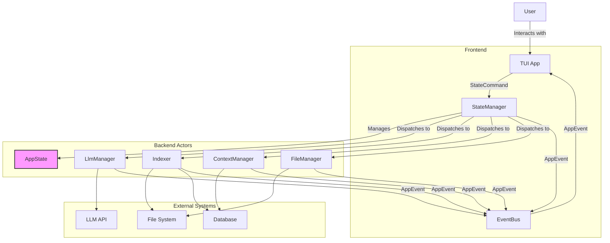
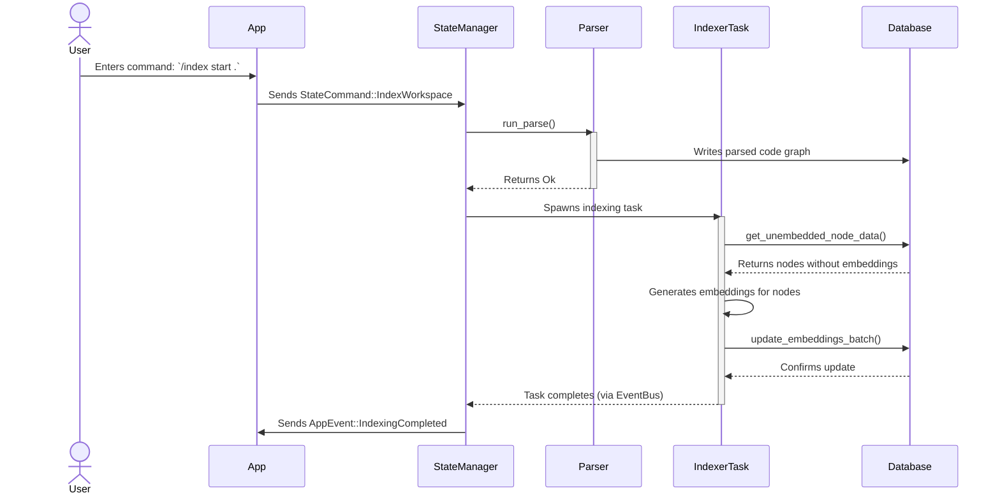
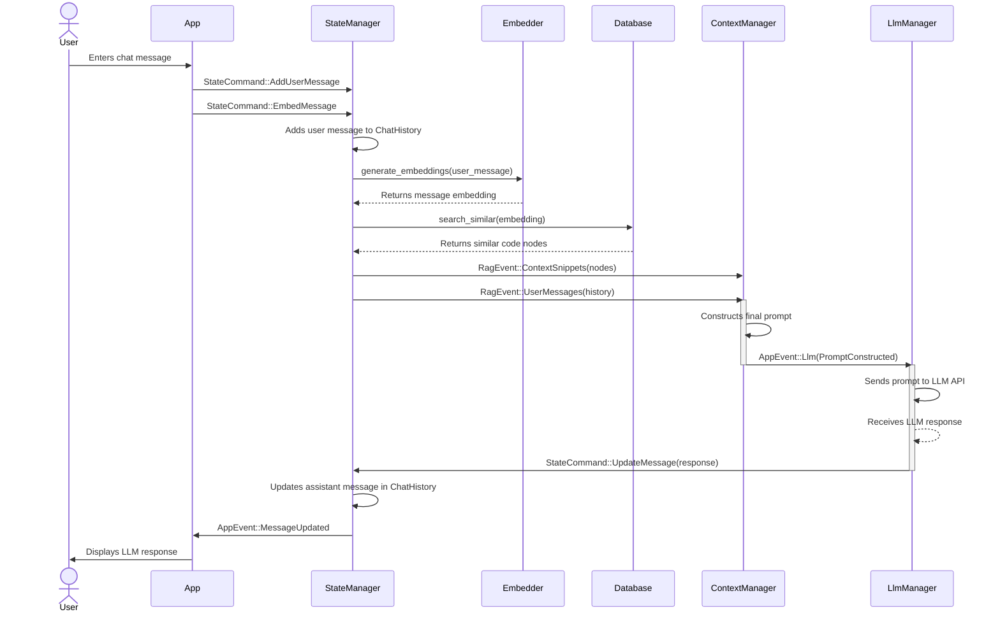
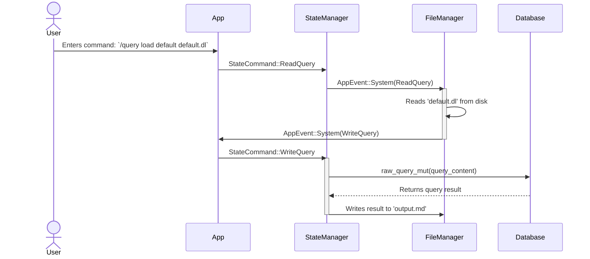

# Ploke TUI

Ploke TUI is a terminal-based AI assistant designed for software engineers, with a special focus on the Rust programming language. It provides a conversational interface to an LLM that is augmented with context from your local codebase. This allows for more accurate, relevant, and helpful interactions, such as code generation, explanation, and refactoring suggestions.

The application is built with a robust, concurrent architecture to handle background tasks like code parsing and indexing without blocking the user interface, ensuring a smooth and responsive experience.

## Core Concepts

The application is designed around a few central components that manage state, communication, and background processing.

-   **`AppState`**: The single source of truth for all shared application data. It is wrapped in an `Arc` and uses `RwLock` and `Mutex` for thread-safe access from multiple concurrent tasks.
-   **`StateManager`**: An actor that is the sole mutator of `AppState`. It processes `StateCommand`s from a channel, ensuring that all state changes are serialized and atomic. This follows a CQRS-like pattern.
-   **`EventBus`**: A central broadcast system for communicating events between different parts of the application. It uses `tokio::sync::broadcast` channels to decouple components. Events are prioritized into `Realtime` (for UI updates) and `Background` categories.
-   **Actors**: Long-running, independent tasks that handle specific responsibilities, such as `LlmManager` (communicating with LLM APIs), `IndexerTask` (embedding code), `FileManager` (disk I/O), and `ContextManager` (assembling prompts).

## System Architecture

At a high level, the application consists of a responsive frontend TUI that communicates with a set of backend actors via commands and events. These actors, in turn, interact with external systems like the file system, a database, and LLM APIs.

## Processing Pipelines

Ploke TUI supports several key workflows, each implemented as a data processing pipeline that flows through the system's actors.

### Code Indexing Pipeline

This pipeline is responsible for parsing a Rust workspace, storing its structure in a database, and generating vector embeddings for semantic search. It is typically initiated by the user with the `/index start` command.

### Chat and RAG Pipeline

This is the primary user interaction pipeline. It takes a user's chat message, finds relevant code context using Retrieval-Augmented Generation (RAG), sends it to the LLM, and displays the response.

### File-based Query Pipeline

This pipeline allows developers to run raw Datalog queries against the code graph database from a file. This is a powerful debugging and inspection tool.

## Getting Started

To use the application, run it from your terminal. You can interact with it using a multi-modal, vim-like interface.

-   Press `i` to enter **Insert Mode** to type your messages.
-   Press `Esc` to return to **Normal Mode** for navigation.
-   In Normal Mode, press `:` to enter **Command Mode** to issue commands like `/index start` or `/model list`.

For a full list of commands and keyboard shortcuts, use the `/help` command.
