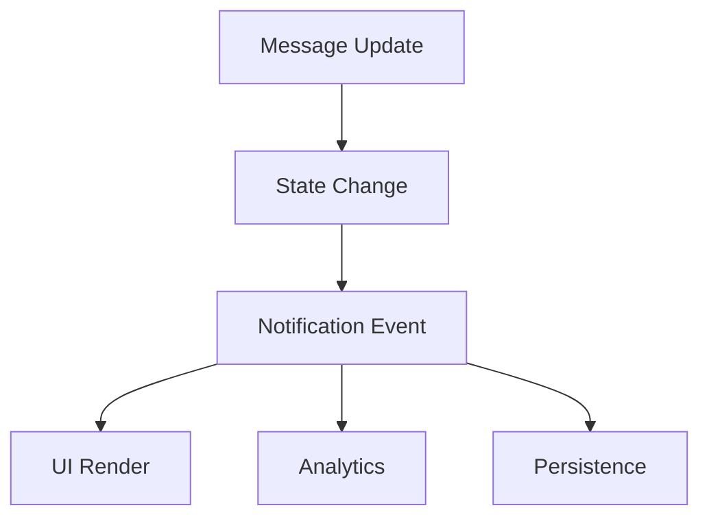
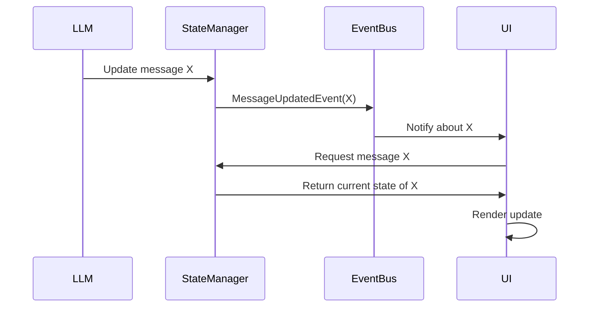

# ploke-tui

## Message Event Flow

```mermaid
graph TD
A[Message Update] --> B[State Change]
B --> C[Notification Event]
C --> D[UI Render]
C --> E[Analytics]
C --> F[Persistence]
```

```mermaid
sequenceDiagram
participant LLM
participant StateManager
participant EventBus
participant UI

LLM->>StateManager: Update message X
StateManager->>EventBus: MessageUpdatedEvent(X)
EventBus->>UI: Notify about X
UI->>StateManager: Request message X
StateManager->>UI: Return current state of X
UI->>UI: Render update
```
