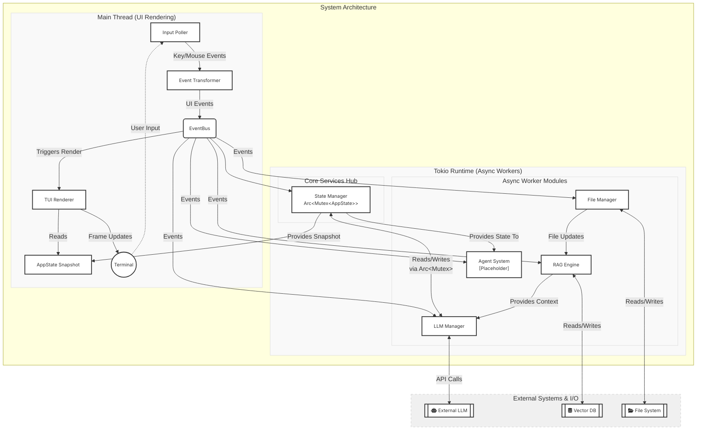

# ploke-tui

Let's break this down:

#### Concurrency Model Analysis (Mermaid Diagram)

### **Pending Implementation Work**
**Phase 1: Critical Foundations**
1. **State Segmentation (2-3 hours)**
   - Implement granular `RwLock` for `AppState` components
   - Verify lock-free UI rendering paths

2. **EventBus Upgrade (2 hours)**
   - Add error channel to `EventBus`
   - Implement backpressure strategy for background tasks

3. **Persistence Layer (1 hour)**
   - Complete Markdown writer in `chat_history.rs`
   - Add atomic write via tempfile + rename

**Phase 2: User Experience**
4. **Error Handling Pipeline (1.5 hours)**
   - Visual toast system
   - Error serialization to log files

5. **Performance Optimization (Ongoing)**
   - Frame timing instrumentation
   - Render fallback on over-budget frames

**Phase 3: Integration**
6. **LLM Worker Completion (3 hours)**
   - Governor rate limiter integration
   - Streaming API response handling

---

### **Concerns Requiring Final Decisions**
1. **Frame Budget Allocation**
   - Hard threshold for frame rendering (8ms for 120fps?)
   - Degradation strategy (skip effects vs lower quality)

2. **Error Visual Hierarchy**
   - Distinction between transient errors vs persistent failures
   - Top-bar annuity vs ephemeral toasts

3. **Persistence Triggers**
   - Auto-save interval configuration
   - Manual save shortcuts (Ctrl+S)

