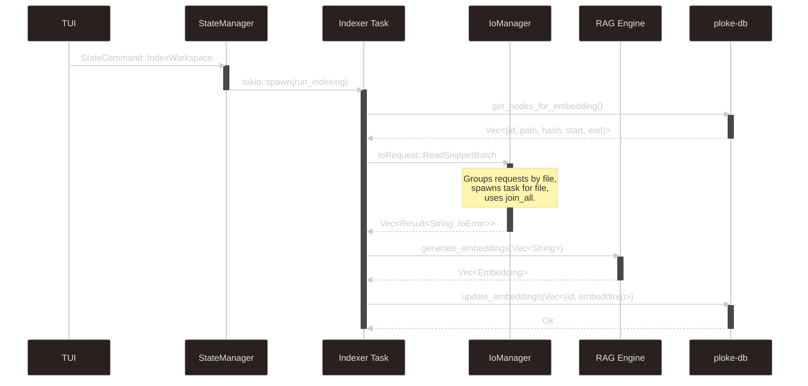

# Intro

This document contains both the architectural planning documentation (see Implementation and Crate Overview) and a record of the project and its Implementation History.

### Details

This serves the dual purpose of providing a high-level architectural document and recording progress on the implementation of that architecture.

Once this part of the project has been fully implemented, it may be desirable to archive the recorded progress and keep the high level architecture. The recorded progress will be valuable to reference for understanding as to why a given design decision was taken.

If someone looks at the project (either our team or a future OSS contributor) and thinks, “Wow, that’s dumb. Why did they do it this way?”, then either:

1. There will be a good reason in the record of progress, in which case time is saved and the team member/contributor learns about the code base.
2. There will be a bad reason in the record of progress, in which case the project can be improved.
3. There will be no record as to why, in which case we can more confidently make changes knowing that we are not retreading covered ground.

Further, the detailed record of progress will be helpful with the future features for “holistic RAG” that incorporates both the direct code base as well as surrounding documentation, to provide the developer, the non-technical team member, and the AI with valuable information about the project.

### Prototype Status

The code snippets are not currently stored directly in the code graph due to a desire to minimize the memory footprint of the project. This is still an area of experimentation, and we may decide later to include the code snippets themselves directly in the graph.

As it stands, the code snippets will be retrieved from the byte start/end of the locations stored in the code graph. The file for the given node will be determined by using a database query to identify the containing file of the node in question.

## Goals

- [ ]  The immediate goal is to have a prototype that allows for concurrent, batch processing of file contents for the code snippets corresponding to the node items in the code graph.
- [ ]  The longer-term goal is to implement a robust and performant embeddings data pipeline that is robust to user behavior.

### Current Progress

- [x]  `ploke-io` created
    - [x]  Architected
    - [x]  Tested
    - [x]  Connected to `ploke-tui`
    - [x]  Connected to `ploke-embed`
- [x]  Create `ploke-embed`
    - [x]  Update `ploke-db`

### Record of Progress

[Initial plan](https://www.notion.so/Initial-plan-224a8c42adc180a38230fe146d0c8a05?pvs=21)

[Connecting the Crates](https://www.notion.so/Connecting-the-Crates-224a8c42adc1801a9307e7c1b5420da1?pvs=21)

## Implementation

- [x]  Trigger (in `ploke-tui`):
    - A user command (e.g., :index) or an automatic trigger on startup sends a new
    `StateCommand::IndexWorkspace` to the state_manager.
- [ ]  Orchestration (in `state_manager`):
    - [x]  The state_manager receives the `IndexWorkspace` command.
    - [x]  Recognizing this as a long-running operation, it spawns a new Tokio task to
    act as an "Indexer." This is critical to prevent blocking the state_manager,
    which must remain responsive to other commands.
    - The Indexer task is given clones of the necessary handles: a ploke-db
    handle, an IoManagerHandle, and a ploke-rag handle.
- [ ]  Database Query (Indexer Task -> `ploke-db`):
    - The Indexer task sends a single, batched query to ploke-db to fetch all
    nodes that require an embedding.
    - The query returns a `Vec<(Uuid, PathBuf, usize, usize)>` containing the node
    ID, file path, and byte offsets for every relevant code item.
- [ ]  Batch Snippet Retrieval (Indexer Task -> `ploke-io`)
    - The Indexer task transforms the list from the database into a single
    Io Request::ReadSnippetBatch containing the vector of paths and offsets.
    - It sends this one request to the IoManager and .awaits a single response
    containing a Vec<Result<String, IoError>>.
- [x]  Concurrent I/O (Inside `IoManager`):
    - [x]  The IoManager receives the ReadSnippetBatch request.
    - [x]  It intelligently groups all snippet requests by file path.
    - [x]  It then spawns a single Tokio task per file, not per snippet. This is
    a key optimization that ensures a file is opened only once, even if we
    need multiple snippets from it.
    - [x]  It uses futures::future::join_all to run all these file-processing
    tasks concurrently.
    - [x]  Once all tasks are complete, it reassembles the results into a single
    `Vec`, preserving the original request order, and sends it back to
    the IndexerTask.
    - [ ]  Update current placeholder hash in `SnippetRequest` to use `Uuid` from graph.
        - [ ]  Evaluate if this makes sense
        - [ ]  Implement/discard
    - [ ]  Handle possibility of Memory Overload
        - [ ]  Guardrail: `embed_batch_size` confgurable (default 100 nodes/batch)
        - [ ]  Implement smart batching per token count
    - [ ]  Gracefully Handle Partial Failures
        - [ ]  Add recovery checkpoint ever N nodes
        - [ ]  Include operation resume capability
- [ ]  Embedding Generation (Indexer Task -> `ploke-rag`):
    - The Indexer receives the vector of code snippets.
    - It sends this entire batch of snippets to the ploke-rag engine for
    embedding.
- [ ]  Database Update (`ploke-rag` -> `ploke-db`):
    - The ploke-rag engine generates the vector embeddings for the snippets.
    - It then performs a final batched write to ploke-db, updating all the
    relevant nodes with their new vector embeddings.
