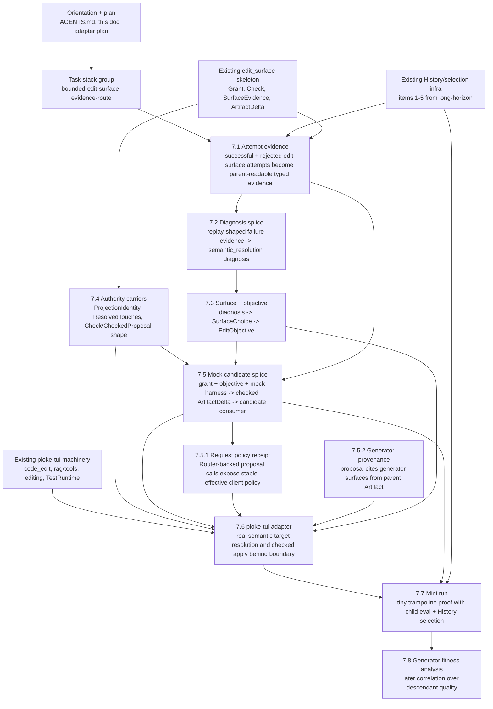

# 2026-05-08 Bounded Edit Surface Implementation Orientation

## Purpose

This is the short operational orientation for sub-agents working on the bounded
edit-surface plan. It ties the core docs, invariants, code anchors, and task
stack entries together so implementation agents can start from a small packet
instead of rediscovering the whole Prototype 1 design thread.

Use this document before implementing any slice of the plan.

## Current Target

The current target is Item 6 of
[`2026-05-05_long-horizon.md`](../todo/2026-05-05_long-horizon.md):

```text
bounded ploke-tui edit surface
  -> checked child Artifact patch
  -> child runtime evaluation
  -> provenance-bearing History selection
```

Items 1-5 of the long-horizon note are mostly prerequisite infrastructure now:
History evidence, HyperAgents-style traversal direction, provenance/traversal
model, successor-selection registry direction, and enough evaluation machinery
to proceed. The bounded edit-surface work should consume those pieces, not
rebuild them.

## Core Operating Flow

```text
History evidence
  -> Diagnosis
  -> SurfaceChoice
  -> EditObjective
  -> SurfaceGrant over artifact-bound Γ_a
  -> harness proposal
  -> SurfaceCheck / CheckedProposal
  -> ArtifactDelta
  -> child Runtime evaluation
  -> History-backed selection
```

`ploke-eval` grants, checks, admits, records, hydrates, and selects.
`ploke-tui` or another harness proposes, resolves, stages, previews, and
mechanically applies when authorized.

## Core Docs

- [`edit-surface/harness-adapter-plan.md`](../../workflow/evalnomicon/drafts/edit-surface/harness-adapter-plan.md)
  Main plan. Read first. Contains the target end state, stable core
  vocabulary, slice discipline, validation strategy, first worked route, and
  implementation phases.
- [`formal/edit-surface.md`](../../workflow/evalnomicon/drafts/formal/edit-surface.md)
  Minimal formal surface algebra. Read when touching grants, touches,
  containment, projection identity, or checked apply.
- [`edit-surface/model.md`](../../workflow/evalnomicon/drafts/edit-surface/model.md)
  Conceptual model for `Surface(operator, substrate, mode, policy)`,
  `SurfaceGrant`, proposal/check/apply, and TUI-as-harness boundaries.
- [`2026-05-08_bounded-edit-surface-handoff.md`](2026-05-08_bounded-edit-surface-handoff.md)
  Restart spine with known code state from earlier scouts, available graph
  relations, blocker status, and next questions.

## Background Docs

Read these only as needed for the slice:

- [`2026-05-05_long-horizon.md`](../todo/2026-05-05_long-horizon.md)
  Strategic program. Useful for understanding how this plan fits the longer
  single-ruler and future multi-ruler trajectory.
- [`history-blocks-v2.md`](../../workflow/evalnomicon/chat-history/history-blocks-v2.md)
  Current History/Crown authority model. Read before changing History,
  selection evidence, candidate admission, or cross-generation provenance.
- [`runtime/loop.md`](../../workflow/evalnomicon/drafts/runtime/loop.md)
  Runtime/trampoline model. Read before touching child materialization,
  child self-evaluation, successor handoff, or generation transitions.
- [`runtime/authority.md`](../../workflow/evalnomicon/drafts/runtime/authority.md)
  Role/state authority model. Read before changing Parent/Child/Successor
  surfaces, channel writes, or execution-path admission.
- [`README.md`](../../../README.md)
  Current product overview of `ploke-tui`: parsed code graph, semantic search,
  staged edits, approvals, managed cargo test tooling, and user-facing command
  model.

## Code Anchors

Sub-agents should inspect exact line ranges before editing; do not assume old
line numbers remain valid. Start with these anchors:

- `crates/ploke-eval/src/cli/prototype1_state/mod.rs`
  Module-level runtime/History/Parent/Child intent.
- `crates/ploke-eval/src/cli/prototype1_state/history.rs`
  History entries, candidate/evaluation/selection evidence, surface evidence,
  and candidate projections.
- `crates/ploke-eval/src/cli/prototype1_state/evidence.rs`
  Child evidence assembly and selection-facing projection.
- `crates/ploke-eval/src/cli/prototype1_state/edit_surface/`
  Current graph/surface/harness/TUI adapter skeleton.
- `crates/ploke-eval/src/successor_selection/`
  Selection inputs, domains, decisions, traversal, and registry.
- `crates/ploke-tui/src/tools/code_edit.rs`
  Model-facing canonical edit tool path.
- `crates/ploke-tui/src/rag/tools.rs`
  Canonical parsing, DB resolution, staging, preview/diff.
- `crates/ploke-tui/src/rag/editing.rs`
  Approval/apply/status/rescan mechanics. Internal to harness, not authority.
- `crates/ploke-tui/src/app/commands/unit_tests/harness.rs`
  Test/runtime harness for standing up TUI actors without terminal UI.
- `crates/ploke-db/src/helpers.rs`
  Exact graph resolution and edge helpers.
- `crates/ploke-core/src/io_types.rs`
  `EmbeddingData`, `ResolvedEdgeData`, `WriteSnippetData`.

## Scheduler Status

Do not use `scheduler.json` as decision-making evidence for current Prototype 1
work. It is a misleadingly named legacy projection from earlier controller
implementations. It can still provide join keys, labels, node paths, and rough
operator context, but it may be stale or incomplete after History-backed
selection, transition journals, channel records, and node-level evidence have
advanced.

For selection, continuation, History admission, successor causality, and
playback ordering, prefer sealed History entries, append-only transition
journals, channel messages, invocation/completion records, and typed evaluation
payloads. Treat scheduler/node records as optional context attached to those
surfaces, not as the source of truth.

## Core Invariants

- Every checkout is an Artifact.
- Every Artifact is a dehydrated Runtime.
- Every Runtime is a potential Parent, but Parent-ness is a role/state.
- `Parent<Ruling>` owns candidate creation authority.
- Children evaluate assigned Artifacts; children do not create candidate
  Artifacts.
- `ploke-eval` owns grants, checks, History admission, runtime hydration, and
  successor selection.
- `ploke-tui` is a harness/executor behind a trait boundary, not authority.
- TUI proposal state, CLI output, logs, mutable reports, and monitor views are
  not source truth.
- Logs, projections, monitor views, and TUI-local state are records inside the
  model, not special material outside it. They become decision inputs only
  through explicit admission rules such as `AdmissibleEvidence<Diagnosis>`.
- Ordinary candidate edits must not mutate `crates/ploke-eval`; mutating
  policy-bearing code requires a separate protocol-upgrade/fork surface.
- Path globs and tool names are constructors for graph subsets, not the
  surface itself.
- First implementation must not rely on call graph or type-reference graph
  relations; those are future expansions.
- Every vertical slice must use the stable core vocabulary or tighten existing
  carriers. Do not add slice-local nouns or objective-specific type families.

## Stable Core Vocabulary

Use or map to these semantic carriers:

```text
Diagnosis
SurfaceChoice
EditObjective
SurfaceGrant
ProjectionIdentity
ResolvedTouches
SurfaceCheck
CheckedProposal
ArtifactDelta
surface_attempt::Evidence
```

Existing code may already provide some of these under nearby names. Prefer
tightening existing carriers over adding sibling types.

## First Route

The first worked route is:

```text
invalid_candidate_generation
  -> semantic_edit_resolution
  -> ploke-tui semantic edit resolver surface
```

The immediate problem is that successful checked/applied surface evidence is
partly represented, but rejected edit-surface attempts are not yet durable
parent-time History facts. Without those facts, a later Parent cannot
mechanistically choose the semantic resolver surface.

## Validation Contract

Every implementation slice should include at least one pipeline splice:

```text
recorded/mock upstream output A'
  -> new implementation B*
  -> downstream consumer contract C'
```

For the first route:

```text
replay-shaped rejected semantic edit attempt
  -> parent diagnosis classifier
  -> SurfaceChoice/EditObjective contract
```

Also include a negative splice:

```text
same failure only in TUI-local/projection/log state
  -> no semantic_resolution diagnosis
```

This proves the parent reads the intended authority/evidence path.

## Task Stack Entries

Current bounded-edit-surface task group:

- `bounded-edit-surface-evidence-route`
  Group for the first semantic-resolution vertical route.
- `bounded-edit-surface-attempt-evidence`
  Make successful and rejected edit-surface attempts durable parent-readable
  evidence.
- `bounded-edit-surface-diagnosis-splice`
  Add the first splice from replay-shaped failure evidence to diagnosis.
- `bounded-edit-surface-choice-objective`
  Map semantic-resolution diagnosis to surface choice and concrete objective.
- `bounded-edit-surface-authority-carriers`
  Tighten grant/touch/check/apply proof carriers without importing TUI
  internals.
- `bounded-edit-surface-mock-candidate`
  Produce a checked mock candidate ArtifactDelta and verify downstream
  candidate consumers accept it.
- `bounded-edit-surface-request-policy-receipt`
  Prove proposal-producing Router calls return complete effective
  request-policy receipts before the real TUI adapter is admitted.
- `bounded-edit-surface-generator-provenance`
  Record which generator surfaces from the parent Artifact participated in
  proposal generation, especially when those surfaces are themselves editable.
- `bounded-edit-surface-tui-adapter`
  Implement the concrete `ploke-tui` adapter after the authority-side contract
  is proven with fixtures.
- `bounded-edit-surface-generator-fitness-analysis`
  Later analysis task: correlate generator-surface deltas with descendant
  proposal/evaluation quality after enough multi-generation evidence exists.
- `bounded-edit-surface-mini-run`
  Run the smallest live trampoline proof after lower loops pass.

Related existing task stack entries:

- `history-consolidation-surface`
- `history-traversal-review-invariants`
- `prototype1-selection-projection-boundary`
- `prototype1-execution-file-surface-cleanhouse`

Use those as context, not as blockers for the first slice unless the code path
actually conflicts.

## Task Flow

The bounded edit-surface route should be implemented as a dependency graph, not
as one long serial task. The first load-bearing path is evidence first, then
diagnosis/surface/objective, then checked candidate generation.



### Parallel Work

Some tasks can be explored in parallel, but implementation should still merge
through the splice contracts.

Can run in parallel after reading the orientation packet:

- `7.1 Attempt evidence` scout: exact current `SurfaceEvidence`,
  `CandidateArtifact`, and `EvaluationPayload` path.
- `7.4 Authority carriers` scout: exact current `Grant`, `Check`, touches,
  `ArtifactDelta`, and proof-carrier gaps.
- `ploke-tui adapter` scout for `7.6`: exact TUI functions and harness path,
  read-only only until the authority contract is stable.

Should wait for `7.1`:

- `7.2 Diagnosis splice`, because diagnosis must consume the actual typed
  evidence shape.

Should wait for `7.2`:

- `7.3 Surface + objective`, because the route should cite a real diagnosis
  and evidence refs.

Should wait for `7.3` and enough of `7.4`:

- `7.5 Mock candidate splice`, because it needs the objective/grant shape and
  the checked-apply authority shape.

Should wait for `7.5`:

- `bounded-edit-surface-request-policy-receipt`: use a fake Router or
  deterministic harness to prove proposal-producing model calls expose complete
  effective request-policy receipts.
- `bounded-edit-surface-generator-provenance`: prove proposal records cite the
  generator surface versions from the parent Artifact that participated in
  generation.

Should wait for `7.5` and the receipt/provenance proofs:

- `7.6 ploke-tui adapter`, unless the work is only a read-only scout. The real
  adapter should implement a proven authority-side contract, not define one
  opportunistically or rely on ambient `ploke-tui`/Router config.

Should wait for `7.6`:

- `7.7 Mini run`.

### Critical Path

The critical path for the first live proof is:

```text
7.1 Attempt evidence
  -> 7.2 Diagnosis splice
  -> 7.3 Surface + objective
  -> 7.5 Mock candidate splice
  -> 7.5.1 Request policy receipt
  -> 7.5.2 Generator provenance
  -> 7.6 ploke-tui adapter
  -> 7.7 Mini run
```

`7.4 Authority carriers` is a sidecar that becomes blocking before `7.5`. It
should stay narrow: tighten the carriers needed by the splice, not redesign the
whole edit-surface module.

## Sub-Agent Prompt Pattern

Use this shape for bounded implementation agents:

```text
Read:
  docs/active/agents/2026-05-08_bounded-edit-surface-implementation-orientation.md
  docs/workflow/evalnomicon/drafts/edit-surface/harness-adapter-plan.md

Task stack item:
  <id>

Slice:
  A' -> B* -> C'

Do:
  <one concrete patch goal>

Do not:
  add slice-local nouns;
  treat TUI/CLI/log/projection state as authority;
  mutate ploke-eval as an ordinary edit surface;
  broaden beyond this slice.

Return:
  files changed;
  line ranges;
  tests run;
  naming pressure check;
  remaining gaps.
```
