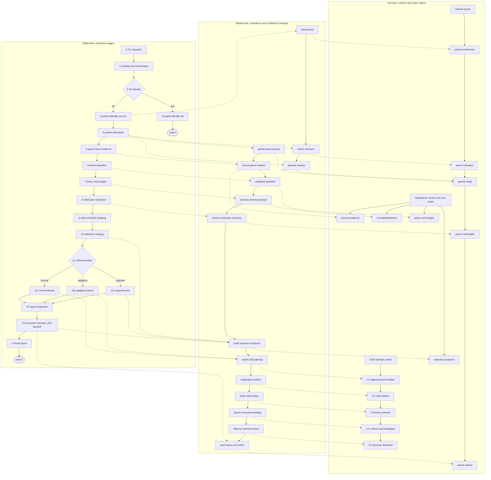

Annotations:

- The **best-modeled child attempt state** is inside `run_planned_child`: `ChildFiles -> C1 -> C2 -> C3 -> C4 -> C5`.
- The C1-C4 stages are concrete aliases of the same typestate carrier, `Prototype<Running, ArtifactWorld, ChildState, AckState>`. C5 wraps a `C4` plus terminal `ObservedChild` evidence.
- The **best-modeled parent admission state** is `Parent<Unchecked> -> Parent<Checked> -> Parent<Ready>` plus `Startup<Genesis | Predecessor>`.
- The **least-modeled parent-turn state** is the outer orchestration: turn coordinates, evidence scope, baseline readiness, child scheduling, and final report projection remain loose locals.
- The **bootstrap branch** is separate: `--init-parent-identity` commits identity and returns before parent startup, child planning, C1-C5, selection, or successor handoff.
- The **successor boundary** has important pieces (`SelectionSealMaterial`, `Prototype1ContinuationDecision`, `Parent<Selectable> -> Parent<Retired>`), but the caller still handles allowed/stopped continuation as ordinary branch logic.
