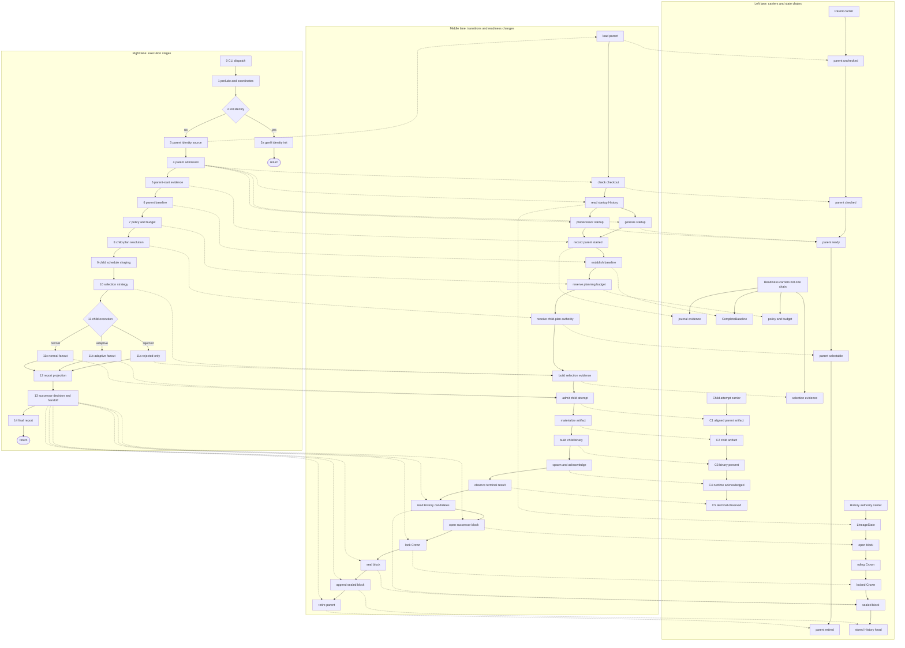

# `run_prototype1_state_turn` phase inventory

Date: 2026-06-15
Scope: live `loop prototype1-state` parent-turn path in `crates/ploke-eval/src/cli/prototype1_state/cli_facing.rs`, plus major delegated functions it calls.
Status: observation and organization only; not an implementation plan.

## Purpose

Break the live `prototype1-state` execution path into understandable sections:

- what each section currently does;
- which functions implement it;
- what state/inputs it needs;
- what it produces;
- which state is already modeled by existing types;
- where higher-level typestate/context carriers may be missing.

This is meant to support a later discussion about carrying the C1-C5 typestate discipline upward into the parent-turn setup/orchestration layer.

## Ground rule for this inventory

Do not say a path is live unless it is visibly called from the `prototype1-state` command path. Current source shows:

```text
LoopCommand::run
  -> LoopSubcommand::Prototype1State(cmd)
  -> Prototype1StateCommand::run
  -> run_prototype1_state_turn
```

The child-attempt path **does** use C1-C5 through `run_planned_child`, subject to early exits/stop-after modes.

## Phase map options

### Option A — sequence lanes with explicit requirements

This keeps the left/middle/right idea as lanes:

- left lane: available carriers / produced states;
- middle lane: checks, gates, and transitions;
- right lane: execution stages in temporal order.

```mermaid
sequenceDiagram
    participant C as Left: carriers and available state
    participant T as Middle: checks and transitions
    participant E as Right: execution stages

    Note over C: Parent carrier chain: unchecked -> checked -> ready -> selectable -> retired
    Note over C: Child carrier chain: C1 -> C2 -> C3 -> C4 -> C5
    Note over C: History authority chain: lineage state -> open block -> locked crown -> sealed block -> stored head
    Note over C: Readiness carriers: journal evidence, baseline, policy budget, selection evidence

    E->>E: 0 CLI dispatch / failure hook
    E->>C: input Prototype1StateCommand
    E->>E: 1 prelude and coordinates
    E->>T: resolve repo, campaign, manifest, run shape, config, journal
    T->>C: turn coordinate facts ready

    alt init parent identity
        E->>E: 2a gen0 identity init
        E->>T: create and commit parent identity
        T->>C: ParentIdentity committed in checkout
        E->>E: return after identity report
    else normal parent turn
        E->>E: 3 parent identity source
        E->>C: require repo root, campaign, manifest, optional handoff invocation
        E->>T: load checkout identity or successor invocation identity
        T->>C: ParentIdentity ready

        E->>E: 4 parent admission / startup
        E->>C: require ParentIdentity, checkout state, History state, optional SuccessorInvocation
        E->>T: load parent runtime
        T->>C: ParentIdentity -> unchecked parent

        alt genesis startup
            E->>T: validate checkout
            T->>C: unchecked parent -> checked parent
            E->>T: read History lineage state
            T->>C: require generation zero and absent History head
            E->>T: validate genesis startup
            T->>C: checked parent -> ready parent
        else predecessor startup
            E->>T: read sealed predecessor head
            T->>C: require sealed selected identity, artifact tree, and surface match
            E->>T: validate predecessor startup
            T->>C: unchecked parent -> ready parent
            E->>T: record successor ready
            T->>C: successor handoff acknowledged
        end

        E->>E: 5 parent-start evidence
        E->>T: append ParentStarted and resource sample
        T->>C: journal evidence recorded

        E->>E: 6 parent baseline
        E->>C: require ready parent and campaign config
        E->>T: establish baseline from closure or selected child report
        T->>C: CompleteBaseline ready

        E->>E: 7 policy and child budget
        E->>C: require run shape, parent generation, persisted node count
        E->>T: load policy and reserve child budget
        T->>C: planning policy and budget ready

        E->>E: 8 child-plan resolution
        E->>C: require ready parent, candidate generator, budget, repo scope
        E->>T: receive or create child plan
        T->>C: ready parent -> selectable parent
        T->>C: PlannedChildren ready

        E->>E: 9 child schedule shaping
        E->>T: choose runnable children, budget, schedule mode
        T->>C: child execution plan ready

        E->>E: 10 selection strategy setup
        E->>T: build traversal strategy
        T->>C: selection strategy ready

        alt rejected-only plan
            E->>E: 11a rejected-only plan
            E->>T: project rejected attempts into selection evidence
            T->>C: selection evidence updated
        else child fanout path
            E->>E: 11b adaptive fanout or 11c normal fanout
            E->>C: require selectable parent, baseline, children, journal path
            loop each runnable child
                E->>T: admit child attempt
                T->>C: ChildFiles -> C1
                E->>T: materialize child artifact
                T->>C: C1 -> C2
                E->>T: build child binary
                T->>C: C2 -> C3
                E->>T: spawn and observe ready acknowledgement
                T->>C: C3 -> C4
                E->>T: observe terminal child result
                T->>C: C4 -> C5
            end
            T->>C: child outcomes ready
        end

        E->>E: 12 report-child / outcome projection
        E->>T: select report child and assemble outcome projection
        T->>C: operator report facts ready

        E->>E: 13 successor selection / continuation / handoff
        E->>C: require selectable parent, child outcomes, policy, History candidates
        E->>T: select successor candidate
        T->>C: selection evidence and seal material ready
        E->>T: decide continuation
        T->>C: continuation allowed or stopped
        opt continuation allowed
            E->>T: open successor History block
            T->>C: LineageState -> open block
            E->>T: lock Crown with SealBlock
            T->>C: ruling Crown -> locked Crown
            E->>T: seal block
            T->>C: open block -> sealed block
            E->>T: append sealed block
            T->>C: StoredBlock advances History head
            E->>T: retire parent authority
            T->>C: selectable parent -> retired parent
            E->>T: spawn successor and wait ready
            T->>C: successor handoff recorded
        end

        E->>E: 14 final report / completion
        E->>T: append completion sample and print report
        T->>C: final projection emitted
        E->>E: return
    end
```



### Option B — three-lane flowchart with carriers, transitions, and execution stages

This is the flowchart-style version of the same idea as `diagram-alt.md`:

- left lane: carriers and their state chains;
- middle lane: transitions/readiness changes;
- right lane: execution stages;
- execution stages link leftward to the transition/readiness item they perform;
- transitions link leftward to the carrier state they produce or use.



Annotations:

- The **best-modeled child attempt state** is inside `run_planned_child`: `ChildFiles -> C1 -> C2 -> C3 -> C4 -> C5`.
- The C1-C4 stages are concrete aliases of the same typestate carrier, `Prototype<Running, ArtifactWorld, ChildState, AckState>`. C5 wraps a `C4` plus terminal `ObservedChild` evidence.
- The **best-modeled parent admission state** is `Parent<Unchecked> -> Parent<Checked> -> Parent<Ready>` plus `Startup<Genesis | Predecessor>`.
- The **least-modeled parent-turn state** is the outer orchestration: turn coordinates, evidence scope, baseline readiness, child scheduling, and final report projection remain loose locals.
- The **bootstrap branch** is separate: `--init-parent-identity` commits identity and returns before parent startup, child planning, C1-C5, selection, or successor handoff.
- The **successor boundary** has important pieces (`SelectionSealMaterial`, `Prototype1ContinuationDecision`, `Parent<Selectable> -> Parent<Retired>`), but the caller still handles allowed/stopped continuation as ordinary branch logic.

---

## State ledger by execution stage

This ledger records the state of each tracked carrier at each execution stage. It is intentionally descriptive, not yet a proposed API. The goal is to make the implicit global runtime state visible before designing a compile-time carrier for it.

Tracked state families:

- **Parent runtime:** `Parent<S>` states: absent, unchecked, checked, ready, selectable, retired.
- **Child attempt:** `ChildFiles`, then C1-C5 for each runnable child.
- **History authority:** lineage/head state, open/sealed blocks, Crown lock state, stored History head.
- **Readiness/evidence:** journal evidence, baseline readiness, planning policy/budget, selection evidence, report projection.
- **Continuation:** successor selection and continuation decision; currently value-level, not typestate.

### Stage 0 — CLI dispatch / failure hook

- Parent runtime: absent.
- Child attempt: absent.
- History authority: not read.
- Readiness/evidence: parsed `Prototype1StateCommand`; no parent-turn evidence yet.
- Continuation: absent.

### Stage 1 — Turn prelude / coordinates

- Parent runtime: absent.
- Child attempt: absent.
- History authority: not advanced; baseline closure state may be ensured, but this is not History authority.
- Readiness/evidence: turn coordinates are ready: repo root, campaign, manifest, run shape, resolved config, journal path/writer.
- Continuation: absent.

### Stage 2a — Gen0 identity init branch

This branch returns before the normal parent runtime path.

- Parent runtime: no `Parent<S>` value is admitted. A checkout-carried `ParentIdentity` is written and committed.
- Child attempt: absent.
- History authority: currently no genesis History block is sealed here. ADR 007 proposes changing that later.
- Readiness/evidence: committed parent identity and printed identity report.
- Continuation: absent.

### Stage 3 — Parent identity source

- Parent runtime: still absent; `ParentIdentity` is resolved.
- Child attempt: absent.
- History authority: in successor-invocation mode, `validate_prototype1_successor_continuation` may inspect sealed History successor facts before Stage 4. In checkout mode, History is not the identity source yet.
- Readiness/evidence: parent identity source is known: checkout identity or successor invocation.
- Continuation: absent.

### Stage 4 — Parent admission / startup

- Parent runtime:
  - starts from `ParentIdentity -> Parent<Unchecked>`;
  - genesis path: `Parent<Unchecked> -> Parent<Checked> -> Parent<Ready>`;
  - predecessor path: `Parent<Unchecked> -> Parent<Ready>` after predecessor startup validation.
- Child attempt: absent.
- History authority:
  - genesis path requires generation 0 and absent History head;
  - predecessor path requires sealed predecessor head and verifies selected parent identity, artifact tree, and surface.
- Readiness/evidence: optional successor invocation is acknowledged with `record_prototype1_successor_ready`.
- Continuation: absent.

### Stage 5 — Parent-start evidence

- Parent runtime: remains `Parent<Ready>`.
- Child attempt: absent.
- History authority: unchanged.
- Readiness/evidence: parent-start evidence is recorded: `ParentStartedEntry` plus parent-start resource sample.
- Continuation: absent.

### Stage 6 — Parent baseline

- Parent runtime: remains `Parent<Ready>`.
- Child attempt: absent.
- History authority: unchanged.
- Readiness/evidence: `CompleteBaseline` is ready.
  - generation 0 uses closure baseline;
  - later generations promote selected child baseline from branch evaluation report.
- Continuation: absent.

### Stage 7 — Policy and child budget

- Parent runtime: remains `Parent<Ready>`.
- Child attempt: absent.
- History authority: unchanged.
- Readiness/evidence: planning policy and child budget are ready.
  - complete mode uses admitted profile or scheduler fallback;
  - non-complete mode uses single-child inspection budget.
- Continuation: absent.

### Stage 8 — Child-plan resolution

- Parent runtime: `Parent<Ready> -> Parent<Selectable>` when child-plan authority is received/validated.
- Child attempt: `ChildFiles` are available for runnable children, but no C1 value exists yet.
- History authority: unchanged.
- Readiness/evidence: `PlannedChildren` is ready: selectable parent, received plan, children, rejected surface attempts.
- Continuation: absent.

### Stage 9 — Child schedule shaping

- Parent runtime: remains `Parent<Selectable>`.
- Child attempt: still `ChildFiles`; the runnable set may be truncated or shaped by schedule policy.
- History authority: unchanged.
- Readiness/evidence: child execution plan is effectively ready, but not currently represented as a typestate carrier.
- Continuation: absent.

This is one of the stages that appears to have real runtime meaning but no explicit typestate transition today.

### Stage 10 — Selection strategy setup

- Parent runtime: remains `Parent<Selectable>`.
- Child attempt: still `ChildFiles`; no child attempt has started.
- History authority: unchanged.
- Readiness/evidence: `ActiveSelectionStrategy` is ready; rejected-only condition can be evaluated.
- Continuation: absent.

### Stage 11 — Child execution branch

Rejected-only branch:

- Parent runtime: remains `Parent<Selectable>`.
- Child attempt: no C1-C5 path runs.
- History authority: unchanged.
- Readiness/evidence: rejected surface attempts are projected into selection evidence.
- Continuation: no successor decision yet.

Fanout branch, for each runnable child:

- Parent runtime: remains `Parent<Selectable>` while child attempts run.
- Child attempt:
  - `ChildFiles -> C1` admits the child attempt;
  - `C1 -> C2` materializes the child artifact world;
  - `C2 -> C3` builds/promotes the child binary;
  - `C3 -> C4` spawns the child and parent observes ready acknowledgement;
  - `C4 -> C5` observes terminal child result.
- History authority: unchanged by C1-C5 themselves.
- Readiness/evidence: `PlannedChildOutcome` values are produced. In complete mode, successful C5 observations are compared to the parent baseline and can produce selection input.
- Continuation: adaptive fanout may produce an early selection value, but continuation authorization is still later.

Stop-after modes cut the child typestate path short:

- `Materialize` stops after C2.
- `Build` stops after C3.
- `Spawn` stops after C4.
- `Complete` can reach C5 and parent comparison.

### Stage 12 — Report-child / outcome projection

- Parent runtime: remains `Parent<Selectable>` unless it has already been consumed later by handoff; at this stage it is still selectable.
- Child attempt: child outcomes are complete enough for the selected stop mode.
- History authority: unchanged.
- Readiness/evidence: report facts are projected: report child, outcome string, child runtime, fallback parent node.
- Continuation: selection may exist as a value, but allowed/stopped continuation is not yet produced here.

### Stage 13 — Successor selection / continuation / handoff

No selection or stopped continuation:

- Parent runtime: remains `Parent<Selectable>` until the function ends. There is no explicit `Parent<Stopped>` typestate.
- Child attempt: already observed or rejected-only.
- History authority: may be read for candidates, but no new block is sealed/appended.
- Readiness/evidence: successor stopped/none evidence may be recorded.
- Continuation: `Prototype1ContinuationDecision` exists as a value-level decision, not as an unforgeable `Continuation<Allowed | Stopped>` carrier.

Allowed successor handoff:

- Parent runtime: `Parent<Selectable> -> Parent<Retired>` inside `spawn_and_handoff_prototype1_successor`.
- Child attempt: selected child artifact is used as successor artifact input.
- History authority:
  - read candidate History projection;
  - open successor block from observed `LineageState`;
  - use `Crown<Ruling>` while admitting claims/selection entry;
  - lock Crown with `SealBlock` into `Crown<Locked>`;
  - seal `Block<Open> -> Block<Sealed>`;
  - append sealed block to `FsBlockStore`;
  - stored block advances local History head.
- Readiness/evidence: successor invocation and handoff records are written; successor may acknowledge ready or time out.
- Continuation: allowed/stopped is currently represented by `Prototype1ContinuationDecision.disposition`, not a typed gate token.

### Stage 14 — Final report / completion

- Parent runtime:
  - retired if allowed successor handoff consumed the selectable parent;
  - otherwise effectively ends/drops as selectable/stopped with no dedicated stopped typestate.
- Child attempt: no new child transition.
- History authority: unchanged at this stage; any append already happened in Stage 13.
- Readiness/evidence: final resource sample, `Prototype1StateReport`, CLI output, and optional successor-completion record.
- Continuation: no new continuation state.

This is the other stage that is mostly projection/evidence completion rather than a new typestate transition.

## Unified runtime-state sketch by execution stage

Working notation for this section only:

```text
RuntimeVector {
  exec:        where the execution path is,
  parent:      parent runtime authority state,
  child:       child-attempt state for the runnable set,
  history:     History/Crown/Block authority state,
  evidence:    accumulated readiness/evidence state,
  continuation: successor-selection/continuation state,
}
```

This is not a proposed Rust API yet. It is a compact way to view all current typestate islands as one global runtime state vector.

### S0 — CLI dispatch / failure hook

```text
RuntimeVector {
  exec: CliDispatch,
  parent: ParentAbsent,
  child: ChildAbsent,
  history: HistoryUnobserved,
  evidence: CommandParsed,
  continuation: ContinuationAbsent,
}
```

### S1 — Turn prelude / coordinates

```text
RuntimeVector {
  exec: TurnCoordinatesPrepared,
  parent: ParentAbsent,
  child: ChildAbsent,
  history: HistoryUnobservedByParentTurn,
  evidence: TurnScopeReady { repo_root, campaign, manifest, run_shape, config, journal },
  continuation: ContinuationAbsent,
}
```

### S2a — Gen0 identity init branch

```text
RuntimeVector {
  exec: GenesisIdentityInitialized,
  parent: ParentIdentityCommittedButRuntimeAbsent,
  child: ChildAbsent,
  history: GenesisHistoryBlockAbsentInCurrentImplementation,
  evidence: ParentIdentityWrittenCommittedAndReported,
  continuation: ContinuationAbsent,
}
```

This branch returns before normal parent admission. ADR 007 proposes replacing the `GenesisHistoryBlockAbsentInCurrentImplementation` part with a sealed genesis History block.

### S3 — Parent identity source

```text
RuntimeVector {
  exec: ParentIdentityResolved,
  parent: ParentIdentityReady { source: CheckoutIdentity | SuccessorInvocation },
  child: ChildAbsent,
  history: SuccessorContinuationPrechecked | HistoryNotYetReadForCheckoutEntry,
  evidence: ParentIdentitySourceKnown,
  continuation: ContinuationAbsent,
}
```

### S4 — Parent admission / startup

Genesis entry after successful startup:

```text
RuntimeVector {
  exec: ParentAdmitted,
  parent: ParentReady { path: UncheckedToCheckedToReady },
  child: ChildAbsent,
  history: StartupValidated { kind: Genesis, head: Absent },
  evidence: ParentCheckoutValidated,
  continuation: ContinuationAbsent,
}
```

Predecessor/successor-handoff entry after successful startup:

```text
RuntimeVector {
  exec: ParentAdmitted,
  parent: ParentReady { path: UncheckedToReadyFromPredecessor },
  child: ChildAbsent,
  history: StartupValidated { kind: Predecessor, head: SealedBlockVerified },
  evidence: SuccessorInvocationAcknowledgedReady,
  continuation: ContinuationAbsent,
}
```

### S5 — Parent-start evidence

```text
RuntimeVector {
  exec: ParentStartedEvidenceRecorded,
  parent: ParentReady,
  child: ChildAbsent,
  history: StartupValidated { kind: GenesisAbsent | PredecessorSealed },
  evidence: ParentStartedRecorded { journal_entry: ParentStarted, resource_sample: ParentStart },
  continuation: ContinuationAbsent,
}
```

### S6 — Parent baseline

```text
RuntimeVector {
  exec: BaselineEstablished,
  parent: ParentReady,
  child: ChildAbsent,
  history: StartupValidated { kind: GenesisAbsent | PredecessorSealed },
  evidence: BaselineReady { baseline: CompleteBaseline, source: Closure | SelectedChildReport },
  continuation: ContinuationAbsent,
}
```

### S7 — Policy and child budget

```text
RuntimeVector {
  exec: PlanningPolicyPrepared,
  parent: ParentReady,
  child: ChildAbsent,
  history: StartupValidated { kind: GenesisAbsent | PredecessorSealed },
  evidence: PlanningPolicyReady { search_policy, plan_child_budget },
  continuation: ContinuationAbsent,
}
```

### S8 — Child-plan resolution

```text
RuntimeVector {
  exec: ChildPlanResolved,
  parent: ParentSelectable,
  child: ChildPlanReady { plan: ReceivedChildPlan, runnable: ChildFilesSet, rejected_attempts },
  history: StartupValidated { kind: GenesisAbsent | PredecessorSealed },
  evidence: PlannedChildrenReady,
  continuation: ContinuationAbsent,
}
```

### S9 — Child schedule shaping

```text
RuntimeVector {
  exec: ChildExecutionPlanPrepared,
  parent: ParentSelectable,
  child: ChildExecutionPlanReady { runnable_children, child_budget, child_schedule_mode, stop_after },
  history: StartupValidated { kind: GenesisAbsent | PredecessorSealed },
  evidence: SchedulePolicyApplied,
  continuation: ContinuationAbsent,
}
```

This stage does not move an existing local typestate island like `Parent<S>` or C1-C5, but it still creates a meaningful global runtime state: the runnable child set is now execution-shaped.

### S10 — Selection strategy setup

```text
RuntimeVector {
  exec: SelectionStrategyPrepared,
  parent: ParentSelectable,
  child: ChildExecutionPlanReady { runnable_children, rejected_attempts },
  history: StartupValidated { kind: GenesisAbsent | PredecessorSealed },
  evidence: SelectionStrategyReady { seed, strategy, metrics_policy },
  continuation: ContinuationAbsent,
}
```

### S11a — Rejected-only child execution branch

```text
RuntimeVector {
  exec: RejectedOnlySelectionEvidenceProjected,
  parent: ParentSelectable,
  child: RejectedOnly { runnable_children: Empty, rejected_attempts },
  history: StartupValidated { kind: GenesisAbsent | PredecessorSealed },
  evidence: SelectionEvidenceReady { source: RejectedSurfaceAttemptsOnly },
  continuation: SelectionValueAbsent,
}
```

### S11b/S11c — Child fanout branch, after fanout returns

The post-stage child state depends on `stop_after`:

```text
RuntimeVector {
  exec: ChildFanoutCompleted,
  parent: ParentSelectable,
  child: ChildAttemptsCompleted {
    materialize_cut: Vec<C2Outcome>,
    build_cut:       Vec<C3Outcome>,
    spawn_cut:       Vec<C4Outcome>,
    complete_cut:    Vec<C5Outcome>,
  },
  history: StartupValidated { kind: GenesisAbsent | PredecessorSealed },
  evidence: PlannedChildOutcomesReady,
  continuation: SelectionValueOptionalButNotAuthorized,
}
```

Within the stage, each runnable child walks this local child-attempt vector:

```text
RuntimeVector.child:
  ChildFiles
    -> C1Admitted
    -> C2Materialized
    -> C3Built
    -> C4ReadyAcknowledged
    -> C5TerminalObserved
```

### S12 — Report-child / outcome projection

```text
RuntimeVector {
  exec: ReportProjectionPrepared,
  parent: ParentSelectable,
  child: ChildResultsAvailable { report_child, fallback_parent_node, child_runtime },
  history: StartupValidated { kind: GenesisAbsent | PredecessorSealed },
  evidence: OperatorReportFactsReady { outcome, node_status, workspace, binary },
  continuation: SelectionValueOptionalButNotAuthorized,
}
```

### S13 — Successor selection / continuation / handoff

Stopped/no-selection result:

```text
RuntimeVector {
  exec: SuccessorContinuationStopped,
  parent: ParentSelectableTerminalWithoutStoppedTypestate,
  child: ChildResultsAvailable,
  history: HistoryCandidatesMayBeReadButHeadNotAdvanced,
  evidence: SuccessorStoppedOrNoneRecorded,
  continuation: ContinuationStopped { decision: Prototype1ContinuationDecision },
}
```

Allowed handoff after History append and parent retirement:

```text
RuntimeVector {
  exec: SuccessorHandoffCommitted,
  parent: ParentRetired,
  child: SelectedChildArtifactConsumedForSuccessor,
  history: HistoryHeadAdvanced {
    lineage_state: ObservedExpectedState,
    block: BlockSealed,
    crown: CrownLockedThenConsumed,
    stored: StoredBlock,
  },
  evidence: SuccessorInvocationWrittenAndHandoffRecorded,
  continuation: ContinuationAllowed { decision: Prototype1ContinuationDecision },
}
```

Internal Stage 13 History/Crown vector:

```text
HistoryAuthority:
  LineageStateObserved
    -> BlockOpen
    -> CrownRulingWithOpenBlock
    -> CrownLockedWithSealBlock
    -> BlockSealed
    -> StoredBlockAppended
    -> HistoryHeadAdvanced
```

### S14 — Final report / completion

Stopped/no-selection terminal state:

```text
RuntimeVector {
  exec: FinalReportEmitted,
  parent: ParentSelectableTerminalWithoutStoppedTypestate,
  child: ChildResultsAvailable,
  history: HistoryHeadNotAdvancedForThisTurn,
  evidence: FinalReportPrintedAndCompletionSampleRecorded,
  continuation: ContinuationStoppedOrAbsent,
}
```

Allowed-handoff terminal state:

```text
RuntimeVector {
  exec: FinalReportEmitted,
  parent: ParentRetired,
  child: SelectedChildArtifactHandedOff,
  history: HistoryHeadAdvanced,
  evidence: FinalReportPrintedAndSuccessorCompletionRecordedIfApplicable,
  continuation: ContinuationAllowedAndHandoffAttempted,
}
```

Stage 14 does not create a new authority typestate. It projects and records the final state produced by earlier stages.

## Candidate global runtime-state pressure points

The ledger suggests that the local machines already exist, but they are not composed into a global runtime carrier.

Existing strong typestate islands:

- `Parent<S>` for parent runtime authority.
- `Prototype<Running, ArtifactWorld, ChildState, AckState>` / C1-C5 for child attempts.
- `Crown<S>` and `Block<S>` for History sealing authority.
- `Startup<S>` for genesis/predecessor startup validation.

State facts not currently modeled as one compile-time chain:

- turn coordinates ready;
- parent-start evidence recorded;
- baseline ready;
- planning budget ready;
- child execution plan ready;
- selection evidence ready;
- continuation allowed/stopped;
- final report facts ready.

These are the likely inputs to a future global runtime typestate design.

## Detailed phase inventory

### 0. CLI dispatch and failure hook

**Functions**

- `LoopCommand::run`
- `Prototype1StateCommand::run`
- `run_prototype1_state_turn`
- `record_failed_successor_turn` on failure with `--handoff-invocation`

**Contains**

- Dispatches `loop prototype1-state` into the parent-turn runner.
- Saves the handoff invocation path before consuming the command.
- If the turn fails and it was a successor handoff turn, records successor completion as failed.

**Needs**

- Parsed `Prototype1StateCommand`.
- Optional handoff invocation path for failure recording.

**Produces**

- `Result<(), PrepareError>` from the parent turn.
- Possible successor-failure journal side effect on error.

**Existing state carriers**

- `Prototype1StateCommand`.
- `SuccessorInvocation` once loaded later.

**Higher-level state question**

This layer is already small. It likely should remain CLI-facing dispatch/failure glue.

---

### 1. Turn prelude / coordinates

**Functions**

- `run_prototype1_state_turn`
- `current_dir_as_repo_root`
- `resolve_prototype1_state_campaign`
- `record_active_prototype1_monitor_target`
- campaign manifest/config helpers
- `Prototype1StateRunShape::resolve`
- `ensure_prototype1_baseline_closure_state`
- `PrototypeJournal::new`

**Contains**

Creates the broad coordinate system for the turn:

- active checkout root;
- campaign identity;
- monitor target file;
- campaign manifest path;
- normalized run shape/profile policy;
- resolved campaign config;
- verified/created baseline closure state;
- transition journal path and journal writer;
- tracing span for the parent turn.

**Needs**

- `command.repo_root` or current directory.
- `command.campaign` or checkout-carried parent identity for campaign inference.
- Campaign manifest and admitted profile, if present.
- Campaign closure state availability.

**Produces**

Loose locals:

- `repo_root`
- `campaign_id`
- `manifest_path`
- `run_shape`
- `resolved_campaign`
- `journal_path`
- `journal`

**Existing state carriers**

- `Prototype1StateRunShape` models normalized execution policy.
- `ResolvedCampaignConfig` models resolved campaign config.
- `PrototypeJournal` models append-only evidence sink.
- `ActivePrototype1MonitorTarget` models monitor pointer.

**Missing/maybe higher-level state**

A parent-turn coordinate carrier such as:

```text
TurnScope {
  command,
  repo_root,
  campaign/config scope,
  run_shape,
  evidence scope,
}
```

This would be analogous to C1-C5 carrying the child attempt’s campaign/node/request/resolved/artifact/binary state together instead of threading each piece separately.

---

### 2. Optional gen0 parent identity initialization

**Function**

- `initialize_prototype1_parent_identity`

**Contains**

Only runs when `command.init_parent_identity` is true.

Steps:

1. Resolve required generation-0 node id.
2. Require `--identity-branch`.
3. Require `--identity-instance`.
4. Check deterministic generation-0 node id from branch.
5. Checkout fresh parent branch through `GitWorktreeBackend`.
6. Build root bootstrap `ParentIdentity`.
7. Write parent identity to checkout.
8. Commit parent identity file.
9. Validate parent checkout.
10. Print identity and return from `run_prototype1_state_turn`.

**Needs**

- `Prototype1StateCommand` fields:
  - `node_id`
  - `identity_branch`
  - `identity_instance`
  - output format
- campaign id;
- manifest path;
- repo root;
- git backend.

**Produces**

- `ParentIdentity` written/committed in the active checkout.
- Printed JSON/table identity.
- Early return; no child planning or successor path.

**Existing state carriers**

- `ParentIdentity`.
- `GitWorktreeBackend`.

**Missing/maybe higher-level state**

This is a separate bootstrap mode, not a normal parent turn. If retained in this command, it likely wants its own path/state, e.g.:

```text
GenesisIdentityRequest -> ParentIdentityCommitted
```

The ADR direction says this authority should eventually move into genesis History rather than remain checkout-file authority.

---

### 3. Parent identity source resolution

**Functions**

- `invocation::load_executable`
- `validate_prototype1_successor_continuation`
- `resolve_prototype1_parent_identity`

**Contains**

Determines which parent identity this runtime is allowed to operate as.

Two branches:

1. With `--handoff-invocation`:
   - load executable invocation;
   - require successor invocation, not child invocation;
   - validate successor continuation against manifest/History;
   - return sealed/validated successor parent identity.

2. Without handoff:
   - load checkout-carried parent identity from repo root;
   - validate it against the requested campaign;
   - error if missing.

**Needs**

- Optional handoff invocation path.
- Manifest path for successor validation.
- Repo root for checkout identity.
- Campaign id for checkout identity validation.

**Produces**

- `ParentIdentity`.

**Existing state carriers**

- `ParentIdentity`.
- `InvocationAuthority::{Child, Successor}`.
- `SuccessorInvocation`.

**Missing/maybe higher-level state**

The source of authority is currently implicit in branch logic. A candidate carrier could preserve it explicitly:

```text
ResolvedParentIdentity {
  identity,
  source: Checkout | SuccessorInvocation(invocation_path/runtime_id),
}
```

That would keep later code from reloading the invocation to recover source metadata.

---

### 4. Parent runtime admission/startup

**Functions**

- `Parent::<Unchecked>::load`
- `Parent::<Unchecked>::load_with_runtime_id`
- `acknowledge_prototype1_state_handoff`
- `Parent::<Unchecked>::check`
- `Startup::<Genesis>::from_history`
- `Startup::<Predecessor>::from_history`
- `Parent<Checked>::ready`
- `Parent<Unchecked>::ready_from_predecessor_startup`
- `record_prototype1_successor_ready`

**Contains**

Moves parent runtime into a ready typestate.

No handoff branch:

```text
ParentIdentity
  -> Parent<Unchecked>
  -> backend checkout validation
  -> Parent<Checked>
  -> Startup<Genesis>::from_history
  -> Parent<Ready>
```

Handoff branch:

```text
ParentIdentity + SuccessorInvocation
  -> Parent<Unchecked> with runtime id
  -> invocation/identity/root checks
  -> validate sealed predecessor successor identity and artifact/surface
  -> Startup<Predecessor>::from_history
  -> Parent<Ready>
  -> record successor ready
```

**Needs**

- Parent identity.
- Manifest path.
- Repo root / active parent root.
- Optional successor invocation.
- Git backend for checkout/tree/surface validation.
- History block store for startup validation.

**Produces**

- `Parent<Ready>`.
- Optional `SuccessorInvocation` retained as `handoff_invocation`.

**Existing state carriers**

Strong local typestate already exists:

- `Parent<Unchecked>`
- `Parent<Checked>`
- `Parent<Ready>`
- `Startup<Genesis>`
- `Startup<Predecessor>`
- `Startup<Validated>`

**Missing/maybe higher-level state**

The typestate is strong inside `parent.rs`, but `run_prototype1_state_turn` immediately splits the ready parent back into:

- `parent`
- cloned `parent_identity`
- optional `handoff_invocation`

A higher-level phase carrier could keep these together:

```text
ReadyParentTurn {
  parent: Parent<Ready>,
  handoff: Option<SuccessorInvocation>,
  evidence_scope,
  campaign_scope,
}
```

---

### 5. Parent-start evidence

**Functions / records**

- `PrototypeJournal::append`
- `JournalEntry::ParentStarted`
- `ParentStartedEntry`
- `append_parent_target_sample`

**Contains**

Records that the parent turn has started:

- parent identity;
- repo root;
- handoff runtime id if any;
- process pid;
- resource sample for parent-start cargo target size.

**Needs**

- Journal writer/path.
- Campaign id.
- Parent identity.
- Repo root.
- Optional handoff invocation/runtime id.

**Produces**

- Durable journal entry.
- Resource sample journal entry.
- Logs/warnings if resource sampling fails.

**Existing state carriers**

- `ParentStartedEntry`.
- `journal::resource::Sample`.
- `PrototypeJournal`.

**Missing/maybe higher-level state**

An evidence scope could prevent repeated argument clusters:

```text
EvidenceScope {
  journal_path,
  journal,
}
```

and a parent-turn phase could know how to emit start/complete samples from the same carried state.

---

### 6. Parent baseline

**Functions**

- `establish_parent_baseline`
- `establish_initial_parent_baseline`
- `promote_selected_child_baseline`
- `complete_baseline_from_closure`
- `complete_baseline_from_selected_treatment`

**Contains**

Builds the parent baseline used to compare children.

Branches:

- generation 0:
  - advance/load eval closure;
  - advance/load protocol closure;
  - build complete baseline from closure.

- later generations:
  - load selected child branch evaluation report;
  - validate report campaign/branch against parent;
  - promote selected treatment metrics as new parent baseline.

Finally validates baseline for parent campaign/node/branch.

**Needs**

- Campaign id / resolved campaign config.
- Manifest path.
- Parent identity.
- Closure state and/or previous branch evaluation report.

**Produces**

- `CompleteBaseline`.

**Existing state carriers**

- `CompleteBaseline`.
- `ResolvedCampaignConfig`.
- `Prototype1BranchEvaluationReport`.

**Missing/maybe higher-level state**

This phase establishes a real precondition for child comparison, but the turn carries it as another loose local. Candidate phase:

```text
ParentTurn<BaselineReady> {
  parent: Parent<Ready>,
  baseline: CompleteBaseline,
  ...
}
```

---

### 7. Complete-run policy and child budget

**Functions**

- `profile::load_admitted_run_profile`
- `load_scheduler_state` fallback
- `CandidateGenerationConfig::ensure_live_complete_admitted`
- `persisted_prototype1_node_count`
- `reserve_complete_child_budget`

**Contains**

If `stop_after == Complete`:

- load search policy from admitted run profile, else scheduler fallback;
- require candidate-generation mode to be valid for live complete execution;
- enforce max generation before child planning;
- count persisted nodes;
- reserve child budget within total-node limit.

If not complete:

- use single-child inspection budget.

**Needs**

- Run shape.
- Manifest path.
- Parent generation.
- Search policy.
- Persisted node inventory.

**Produces**

- `complete_search_policy: Option<Prototype1SearchPolicy>`.
- `plan_child_budget: Prototype1ChildBudget`.

**Existing state carriers**

- `Prototype1StateRunShape`.
- `Prototype1SearchPolicy`.
- `Prototype1ChildBudget`.

**Missing/maybe higher-level state**

The policy/budget bundle is a phase fact for planning and continuation. Candidate:

```text
PlanningPolicy {
  run_shape,
  complete_search_policy,
  plan_child_budget,
}
```

---

### 8. Child-plan resolution

**Functions**

- `resolve_child_plan`
- `receive_existing_child_plan`
- `create_child_plan`
- `run_parent_target_selection`
- `run_legacy_parent_target_selection`
- `publish_broad_harness_child_plan_request`
- `run_pre_child_planning_review`
- `admit_broad_harness_batch`
- `publish_deterministic_tui_tools_child_plan`
- `validate_received_child_plan`

**Contains**

Creates or receives the parent-owned child plan.

Steps:

1. Build `ChildPlanEnv` from campaign/manifest/repo/broad TUI/route source.
2. Determine required child generation: parent generation + 1.
3. If child-plan file exists, receive existing plan.
4. Else create plan through selected candidate generator:
   - legacy target selection;
   - broad harness request/admission;
   - deterministic TUI tools.
5. Validate candidate-generation mode against received children.
6. If `--node-id` is set, filter to that child and validate it is a direct child at required generation.
7. Validate every selected child is in the received plan.
8. Return parent moved to selectable state plus plan/children/rejections.

**Needs**

- Campaign id.
- Manifest path.
- Repo root.
- `Parent<Ready>`.
- Candidate-generation config.
- Optional selected node id.
- Child budget.
- Broad TUI config.
- Route source.

**Produces**

```rust
PlannedChildren {
    parent: Parent<Selectable>,
    plan: Received<ChildPlan>,
    children: Vec<ChildFiles>,
    rejected_surface_attempts: Vec<surface_attempt::Evidence>,
}
```

**Existing state carriers**

- `ChildPlanEnv` carries part of the input context.
- `Parent<Ready>` -> `Parent<Selectable>` typestate exists.
- `PlannedChildren` is a useful phase result.
- `ChildFiles` carries child attempt input.

**Missing/maybe higher-level state**

Inputs are still a large positional cluster. Candidate phase:

```text
ParentTurn<ChildPlanReady> {
  parent: Parent<Selectable>,
  plan,
  children,
  rejected_surface_attempts,
  planning_policy,
  baseline,
}
```

---

### 9. Child schedule shaping

**Location**

- inline in `run_prototype1_state_turn` after `PlannedChildren` is destructured.

**Contains**

Determines the execution budget/mode for runnable children:

- complete mode uses admitted policy budget and schedule mode;
- non-complete modes use single-child debug/inspection budget;
- non-complete + explicit `--node-id` forces single child adaptive mode;
- absent `--node-id`, children are truncated to budget max.

**Needs**

- `complete_search_policy`.
- `plan_child_budget`.
- `run_shape.stop_after`.
- `command.node_id`.
- Planned children.

**Produces**

- `child_budget`.
- `child_schedule_mode`.
- possibly truncated `children`.

**Existing state carriers**

- `Prototype1ChildBudget`.
- `Prototype1ChildScheduleMode`.

**Missing/maybe higher-level state**

This is a child-execution plan distinct from child-plan authority:

```text
ChildExecutionPlan {
  children,
  budget,
  schedule_mode,
  stop_after,
}
```

---

### 10. Selection strategy setup

**Functions**

- `traversal_metric_inputs`
- `Prototype1SuccessorSelection::active_strategy`

**Contains**

Converts run-shape fields into an active successor-selection strategy:

- metric input family;
- oracle mode/evidence requirement;
- metrics policy;
- candidate scope/traversal strategy.

Also computes rejected-only-plan condition:

```text
Complete mode + no runnable children + rejected surface attempts exist
```

**Needs**

- `run_shape.successor_selection*` fields.
- Runnable children count.
- Rejected surface attempts.

**Produces**

- `ActiveSelectionStrategy`.
- `rejected_only_plan` bool.

**Existing state carriers**

- `ActiveSelectionStrategy`.
- `SelectionCandidateScope`.

**Missing/maybe higher-level state**

Selection policy is mostly modeled, but it is not carried with child execution result. Candidate:

```text
SelectionPolicy {
  seed,
  strategy,
}
```

---

### 11. Child execution and fanout

**Functions**

- `run_child_fanout`
- `run_adaptive_child_fanout`
- `run_planned_child`
- `stored_child_outcome`
- C1-C5 transitions:
  - `C1::from_child_plan`
  - `MaterializeBranch::transition` / `transition_with_harness`
  - `BuildChild::transition`
  - `SpawnChild::transition`
  - `ObserveChild::transition`
- `compare_observed_child_treatment`
- `selection_input_from_child_report`
- `cleanup_prototype1_child_build_products`

**Contains**

There are three parent-level branches:

1. **Rejected-only plan**
   - no child runtime;
   - project rejected attempts into current-generation selection payloads;
   - returns no child outcomes and no selection.

2. **Adaptive complete fanout**
   - split children into batches by fanout width;
   - call `run_child_fanout` for each batch;
   - after each batch, run parent selection;
   - stop early if adaptive selection accepts successor.

3. **Normal fanout**
   - call `run_child_fanout` once;
   - if complete mode, run parent selection after fanout.

`run_child_fanout`:

- requires non-empty children;
- computes fanout width;
- spawns blocking tasks for `run_planned_child`;
- collects/sorts outcomes by plan index;
- stops after first batch for non-complete modes.

`run_planned_child`:

- may return early from `stored_child_outcome` before C1;
- otherwise enters live C1-C5 child-attempt path:

```text
ChildFiles -> C1
C1 -> C2 materialize child artifact
C2 -> C3 build child runtime binary
C3 -> C4 spawn child runtime and observe ready acknowledgement
C4 -> C5 observe terminal child result
```

Stop-after gates:

- `Materialize` stops after C1->C2.
- `Build` stops after C2->C3.
- `Spawn` stops after C3->C4.
- `Complete` reaches C4->C5 and parent comparison if successful.

**Needs**

Parent/fanout context:

- campaign id;
- manifest path;
- repo root;
- journal path;
- parent identity;
- parent baseline;
- stop-after;
- stale-child timeout;
- schedule mode;
- child budget;
- plan index offset;
- children.

Per child:

- `ChildFiles` with node/request/resolved/surface/harness evidence.
- Parent baseline for comparison.
- Journal for C1-C5 records.

**Produces**

- `Vec<PlannedChildOutcome>`.
- Optional `(SuccessorDecision, SelectionSealMaterial)` from adaptive path.
- Optional rejected-attempt payload count for rejected-only path.

**Existing state carriers**

Strong inside one child attempt:

- `C1`, `C2`, `C3`, `C4`, `C5`.
- `Prototype<Running, ArtifactWorld, ChildState, AckState>`.
- `Artifact<L>`.
- `Binary<L, ChildState, AckState>`.

Fanout/result carriers:

- `PlannedChildOutcome`.
- `ObservedChild`.
- `SuccessfulObservation` / `FailedObservation`.

**Missing/maybe higher-level state**

The child attempt is typed; the fanout context is not. Candidate:

```text
ChildFanoutContext {
  turn scope,
  parent identity,
  baseline,
  journal path,
  stop_after,
  stale timeout,
  budget/schedule,
}
```

and result phase:

```text
ParentTurn<ChildrenObserved> {
  parent: Parent<Selectable>,
  child_outcomes,
  rejected_surface_attempts,
  maybe_selection,
}
```

---

### 12. Report-child and outcome projection

**Location / functions**

- inline in `run_prototype1_state_turn`
- `outcome_for_report`

**Contains**

Projects child/fanout result into operator-facing fields:

- choose fallback parent node;
- choose report child:
  - selected node’s child outcome if selection exists;
  - else last child outcome;
  - none for rejected-only path;
- assemble string outcome;
- extract child runtime.

**Needs**

- Parent node fallback.
- Child outcomes.
- Optional selection.
- Rejected-only payload count.
- Planned child count.

**Produces**

- `report_child`.
- mutable `outcome` string.
- `child_runtime`.

**Existing state carriers**

- `PlannedChildOutcome`.
- `Prototype1StateReport` later.

**Missing/maybe higher-level state**

This is projection, not authority. A candidate carrier could separate result facts from display string:

```text
ChildExecutionSummary {
  outcomes,
  selected_report_child,
  children_ran,
  children_planned,
  rejected_attempt_payloads,
}
```

---

### 13. Successor selection, continuation decision, and handoff

**Functions**

- `ParentSelection::new`
- `ParentSelection::current_generation_candidates`
- `ParentSelection::select_successor`
- `current_generation_candidate_evidence`
- `candidate_artifact_from_outcome`
- `live_successor_continuation_decision`
- `select_artifact_for_handoff`
- `spawn_and_handoff_prototype1_successor`

**Contains**

Selection:

- converts current-generation child outcomes and rejected attempts into selection payloads;
- loads admitted History candidates depending on strategy;
- excludes active parent candidate;
- runs traversal selection;
- returns `SuccessorDecision` plus `SelectionSealMaterial`.

Continuation decision:

- counts persisted nodes;
- checks historical traversal guard;
- checks selected branch presence;
- detects active-parent cycle;
- distinguishes current-generation direct child from historical traversal;
- enforces direct-child requirement for current-generation successor;
- enforces keep/rejected policy;
- enforces max generation and max total nodes;
- returns `Prototype1ContinuationDecision` with disposition.

Handoff preparation:

- select/hydrate artifact for handoff;
- validate selected node/branch/payload/surface consistency;
- if disposition allows successor, prepare selected artifact and selection entry.

Successor handoff:

- prepare active successor runtime/artifact;
- create History seal block;
- seal through parent/crown, retiring parent;
- append sealed History block;
- create successor invocation;
- write invocation;
- spawn successor process;
- wait for ready acknowledgement;
- return `Parent<Retired>` plus optional handoff details.

**Needs**

Selection/continuation inputs:

- manifest path;
- parent identity;
- child outcomes;
- rejected attempts;
- selection seed/strategy;
- complete search policy;
- selected node/material.

Handoff inputs:

- campaign id;
- selected artifact;
- active parent root;
- `Parent<Selectable>`;
- selection entry;
- handoff mode.

**Produces**

- optional `(SuccessorDecision, SelectionSealMaterial)`;
- `Prototype1ContinuationDecision`;
- successor journal records;
- if allowed, `(Parent<Retired>, Option<Prototype1SuccessorHandoff>)`;
- outcome string fragments.

**Existing state carriers**

- `ParentSelection<'a>`.
- `SuccessorDecision`.
- `SelectionSealMaterial`.
- `Prototype1ContinuationDecision`.
- `Prototype1ContinuationDisposition`.
- `Parent<Selectable>` -> `Parent<Retired>` in successor handoff.
- `SuccessorInvocation`.
- `Prototype1SuccessorHandoff`.

**Missing/maybe higher-level state**

The intended core shape in `run/mod.rs` names this boundary:

```text
SuccessorSelection<SealedEvidence>
  -> Continuation<Allowed | Stopped>
  -> Parent<Retired> | Parent<Ready>
```

The caller currently has a decision value plus `if decision.disposition.allows_successor()`. A stronger shape would prevent the spawn path from being called without an allowed continuation token.

---

### 14. Final parent-turn report and successor completion

**Functions / records**

- `append_parent_target_sample`
- `Prototype1StateReport`
- `record_prototype1_successor_completion`

**Contains**

Finishes parent-turn projection:

1. Record parent-complete resource sample.
2. Build `Prototype1StateReport` from accumulated values.
3. Print JSON or table output unless demo feature suppresses it.
4. If this runtime was itself started from a successor handoff, record successor completion as succeeded.

**Needs**

- Journal/evidence scope.
- Campaign id.
- Parent identity.
- Handoff invocation.
- Repo root.
- Report child or fallback parent node.
- Journal path.
- Run shape.
- Outcome string.
- Child/successor runtime details.
- Manifest path for completion recording.

**Produces**

- Resource sample journal entry.
- Operator output.
- Successor completion record if applicable.
- `Ok(())`.

**Existing state carriers**

- `Prototype1StateReport`.
- `SuccessorCompletionStatus`.

**Missing/maybe higher-level state**

The final report is a projection from a completed turn. Candidate:

```text
ParentTurn<Completed> -> Prototype1StateReport
```

This would keep projection separate from authority decisions.

---

## Existing typestate / carrier inventory

### Strong existing carriers

These already encode meaningful state and should be treated as assets:

- `Parent<Unchecked>`
- `Parent<Checked>`
- `Parent<Ready>`
- `Parent<Selectable>`
- `Parent<Retired>`
- `Startup<Genesis>`
- `Startup<Predecessor>`
- `Startup<Validated>`
- `C1`, `C2`, `C3`, `C4`, `C5`
- `Prototype<Running, ArtifactWorld, ChildState, AckState>`
- `ChildFiles`
- `PlannedChildren`
- `PlannedChildOutcome`
- `ParentSelection<'a>`
- `SelectionSealMaterial`
- `Prototype1ContinuationDecision`
- `PrototypeJournal` and typed journal entries

### Partial/loose carriers

These help, but do not fully model parent-turn phase state:

- `Prototype1StateRunShape` — good policy normalization, but later split into many args.
- `ChildPlanEnv` — useful local child-plan environment, but not the whole planning phase.
- `Prototype1LoopCampaign` — campaign/config bundle exists, but `run_prototype1_state_turn` does not use it as the main campaign scope.
- `Prototype1StateReport` — projection DTO, not authority state.

### Current gaps visible from this path

1. No parent-turn scope carrier for command + campaign/config + checkout + journal.
2. No explicit parent identity source carrier after resolving checkout vs successor invocation.
3. Parent typestate exists, but the outer turn immediately clones identity/handoff into loose locals.
4. Baseline readiness is not tied to parent readiness in a phase type.
5. Child-plan authority is modeled in `PlannedChildren`, but scheduling/fanout context is not.
6. C1-C5 model one child attempt well, but fanout over many attempts is not modeled similarly.
7. Continuation decision exists, but allowed/stopped continuation is not an unforgeable token at the caller.
8. Final reporting is assembled from far-apart locals instead of projected from a completed turn state.

## Possible higher-level state ladder to discuss later

Not a proposal to implement now; just names matching observed phase boundaries:

```text
StateCommand
  -> Turn<Prepared>
  -> Turn<ParentIdentityResolved>
  -> Turn<ParentReady>
  -> Turn<BaselineReady>
  -> Turn<ChildPlanReady>
  -> Turn<ChildExecutionPlanned>
  -> Turn<ChildrenObserved>
  -> Turn<SuccessorSelected | NoSuccessorSelection>
  -> Turn<ContinuationAllowed | ContinuationStopped>
  -> Turn<SuccessorHandedOff | ParentStopped>
  -> Turn<Reported>
```

Separate bootstrap branch:

```text
GenesisIdentityRequest
  -> ParentIdentityCommitted
  -> return/report
```

The key comparison to C1-C5:

- C1-C5 make one child attempt’s artifact/binary/runtime states explicit.
- The parent turn currently has equally real phases, but many are represented by loose locals and boolean/option branches.
- A higher-level model should not replace C1-C5; it should carry the parent/fanout/selection state that surrounds them.
