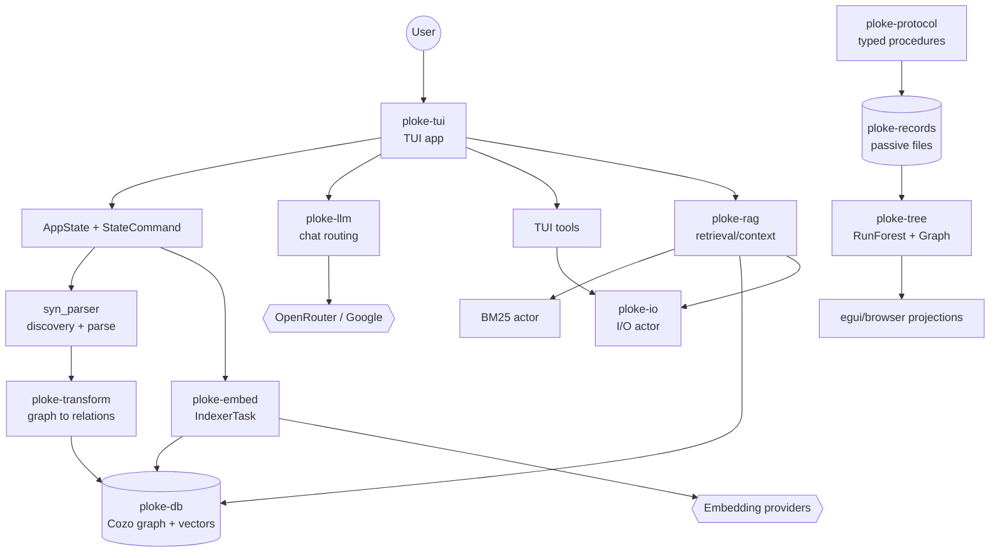

# Architecture Overview

> Imported from the generated Hermes code wiki at `~/.hermes/wikis/ploke` (generated `2026-06-03T03:55:43Z`, source commit `97b1a101b9363b88b8e41f1447cb36d76a3eb8a2`). Verify implementation details against current source before making changes.

Ploke is organized as a Rust workspace with a release-facing terminal UI and a set of supporting crates for ingestion, graph storage, retrieval, LLM routing, safe I/O, and eval/projection tooling. Runtime state starts in `ploke-tui`: `try_main` loads user config, constructs the database, embedding runtime, I/O actor, BM25 service, optional RAG service, event bus, and `AppState`, then runs the TUI.

The code-understanding pipeline is staged. `syn_parser` discovers Cargo targets and parses Rust source files into `ParsedCodeGraph` plus `ModuleTree`; `ploke-transform` turns those graph structures into Cozo relations; `ploke-db` owns schema initialization, query helpers, HNSW vector search, and BM25 index support. `ploke-embed` fills vector relations and tracks the active provider/model/dimension tuple. `ploke-rag` composes sparse and dense retrieval and fetches snippet text through `ploke-io` before producing `AssembledContext` for prompts/tools.

A second, read-side plane supports Prototype 1 evaluation and inspection. `ploke-protocol` defines typed steps/procedures/artifacts, `ploke-records` defines passive persisted record schemas, and `ploke-tree` loads those records into `RunForest`, `Graph`, playback, and artifact-tree projections. These projections are intentionally read-only: deserializing records is evidence, not authority to advance scheduler/history state.

## Components

- **TUI runtime** — [`crates/ploke-tui/src/lib.rs`](https://github.com/josephleblanc/ploke/blob/97b1a101b9363b88b8e41f1447cb36d76a3eb8a2/crates/ploke-tui/src/lib.rs) starts subsystems and wires channels, state, LLM routing, indexing, RAG, and I/O.
- **Command/state layer** — [`crates/ploke-tui/src/app_state/commands.rs`](https://github.com/josephleblanc/ploke/blob/97b1a101b9363b88b8e41f1447cb36d76a3eb8a2/crates/ploke-tui/src/app_state/commands.rs) defines `StateCommand`, the command boundary used by UI, tools, and background tasks.
- **Parser** — [`crates/ingest/syn_parser/src/lib.rs`](https://github.com/josephleblanc/ploke/blob/97b1a101b9363b88b8e41f1447cb36d76a3eb8a2/crates/ingest/syn_parser/src/lib.rs) performs workspace discovery, parallel parsing, and module-tree/graph assembly.
- **Graph transform** — [`crates/ingest/ploke-transform/src/transform/mod.rs`](https://github.com/josephleblanc/ploke/blob/97b1a101b9363b88b8e41f1447cb36d76a3eb8a2/crates/ingest/ploke-transform/src/transform/mod.rs) inserts parsed graph pieces into Cozo relations.
- **Database** — [`crates/ploke-db/src/database.rs`](https://github.com/josephleblanc/ploke/blob/97b1a101b9363b88b8e41f1447cb36d76a3eb8a2/crates/ploke-db/src/database.rs) wraps the in-memory Cozo handle and higher-level graph/vector query operations.
- **Embedding/indexing** — [`crates/ingest/ploke-embed/src/runtime.rs`](https://github.com/josephleblanc/ploke/blob/97b1a101b9363b88b8e41f1447cb36d76a3eb8a2/crates/ingest/ploke-embed/src/runtime.rs) and [`indexer/mod.rs`](https://github.com/josephleblanc/ploke/blob/97b1a101b9363b88b8e41f1447cb36d76a3eb8a2/crates/ingest/ploke-embed/src/indexer/mod.rs) manage active embeddings and background indexing.
- **RAG** — [`crates/ploke-rag/src/core/mod.rs`](https://github.com/josephleblanc/ploke/blob/97b1a101b9363b88b8e41f1447cb36d76a3eb8a2/crates/ploke-rag/src/core/mod.rs), [`fusion/mod.rs`](https://github.com/josephleblanc/ploke/blob/97b1a101b9363b88b8e41f1447cb36d76a3eb8a2/crates/ploke-rag/src/fusion/mod.rs), and [`context/mod.rs`](https://github.com/josephleblanc/ploke/blob/97b1a101b9363b88b8e41f1447cb36d76a3eb8a2/crates/ploke-rag/src/context/mod.rs) implement retrieval, fusion, and context assembly.
- **LLM routing** — [`crates/ploke-llm/src/manager/session.rs`](https://github.com/josephleblanc/ploke/blob/97b1a101b9363b88b8e41f1447cb36d76a3eb8a2/crates/ploke-llm/src/manager/session.rs) sends chat requests, records provider attempts, and parses outcomes.
- **I/O actor** — [`crates/ploke-io/src/actor.rs`](https://github.com/josephleblanc/ploke/blob/97b1a101b9363b88b8e41f1447cb36d76a3eb8a2/crates/ploke-io/src/actor.rs) and [`handle.rs`](https://github.com/josephleblanc/ploke/blob/97b1a101b9363b88b8e41f1447cb36d76a3eb8a2/crates/ploke-io/src/handle.rs) serialize file effects behind `IoManagerHandle`.
- **Protocol/tree projection** — [`crates/ploke-protocol/src/lib.rs`](https://github.com/josephleblanc/ploke/blob/97b1a101b9363b88b8e41f1447cb36d76a3eb8a2/crates/ploke-protocol/src/lib.rs) defines typed artifacts; [`crates/ploke-tree/src/lib.rs`](https://github.com/josephleblanc/ploke/blob/97b1a101b9363b88b8e41f1447cb36d76a3eb8a2/crates/ploke-tree/src/lib.rs) builds read-only graph/UI projections.

## System Diagram

## Data Flow

1. **Startup** — [`ploke-tui::try_main`](https://github.com/josephleblanc/ploke/blob/97b1a101b9363b88b8e41f1447cb36d76a3eb8a2/crates/ploke-tui/src/lib.rs) loads config, creates `EmbeddingRuntime`, calls `Database::init_with_schema`, sets up multi-embedding metadata, starts `IoManagerHandle`, BM25, `IndexerTask`, and `RagService`.
2. **Workspace parsing** — [`syn_parser::parse_workspace_with_config`](https://github.com/josephleblanc/ploke/blob/97b1a101b9363b88b8e41f1447cb36d76a3eb8a2/crates/ingest/syn_parser/src/lib.rs) parses workspace members selected by config/command and returns `ParsedWorkspace`.
3. **Graph insertion** — [`ploke-transform::transform_parsed_graph`](https://github.com/josephleblanc/ploke/blob/97b1a101b9363b88b8e41f1447cb36d76a3eb8a2/crates/ingest/ploke-transform/src/transform/mod.rs) resolves type relations when enabled and inserts types, functions, modules, imports, relations, and crate context rows.
4. **Indexing** — [`IndexerTask`](https://github.com/josephleblanc/ploke/blob/97b1a101b9363b88b8e41f1447cb36d76a3eb8a2/crates/ingest/ploke-embed/src/indexer/mod.rs) fetches unembedded nodes, batches snippets, calls the active `EmbeddingRuntime`, writes vector rows, and updates BM25 metadata.
5. **RAG retrieval** — [`RagService::get_context`](https://github.com/josephleblanc/ploke/blob/97b1a101b9363b88b8e41f1447cb36d76a3eb8a2/crates/ploke-rag/src/core/mod.rs) chooses dense/sparse/hybrid search, fuses results with RRF/MMR, expands type context when enabled, and calls [`assemble_context`](https://github.com/josephleblanc/ploke/blob/97b1a101b9363b88b8e41f1447cb36d76a3eb8a2/crates/ploke-rag/src/context/mod.rs).
6. **Chat turn** — [`run_chat_session`](https://github.com/josephleblanc/ploke/blob/97b1a101b9363b88b8e41f1447cb36d76a3eb8a2/crates/ploke-tui/src/llm/manager/session.rs) calls `ploke-llm::chat_step`, handles content vs tool-call outcomes, validates/sanitizes tool arguments, and updates chat messages through `StateCommand`.
7. **Tool I/O** — tool modules in [`crates/ploke-tui/src/tools`](https://github.com/josephleblanc/ploke/blob/97b1a101b9363b88b8e41f1447cb36d76a3eb8a2/crates/ploke-tui/src/tools/mod.rs) route read/edit/create/list operations through `ploke-io` so hash verification, path policy, and atomic writes remain centralized.
8. **Eval projection** — [`FsRunStore::load_record_set`](https://github.com/josephleblanc/ploke/blob/97b1a101b9363b88b8e41f1447cb36d76a3eb8a2/crates/ploke-tree/src/store/fs.rs) loads typed passive files; [`Graph::from_records`](https://github.com/josephleblanc/ploke/blob/97b1a101b9363b88b8e41f1447cb36d76a3eb8a2/crates/ploke-tree/src/graph/build.rs) builds read-only history/artifact/runtime projections.

## Key Design Decisions

- **State mutation is channeled** — UI and background tasks send `StateCommand` instead of mutating shared state arbitrarily.
- **Parsing and storage are separate** — `syn_parser` produces Rust semantic structures; `ploke-transform` handles Cozo relation shape; `ploke-db` handles query/search runtime concerns.
- **Embedding identity is explicit** — `EmbeddingRuntime` and `Database.active_embedding_set` share an `Arc<RwLock<EmbeddingSet>>`, avoiding silent vector-set mismatches during model swaps.
- **Sparse search is actor-backed** — BM25 runs behind a Tokio `mpsc` command service in `ploke-db`, and `ploke-rag` wraps it with timeout/retry behavior.
- **File edits go through one boundary** — `ploke-io` centralizes path normalization, hash checking, per-file serialization, and atomic write semantics.
- **Passive records are not authority** — `ploke-records` types and `ploke-tree` projections deliberately avoid promoting evidence into runtime state transitions.
