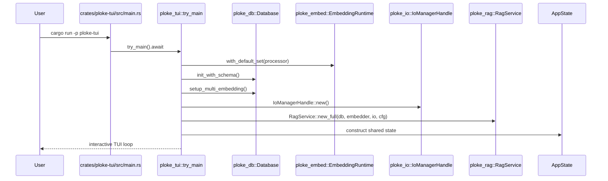
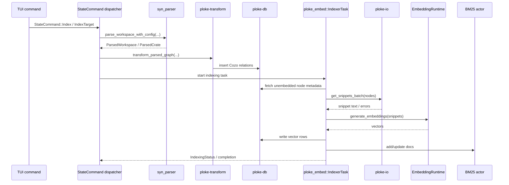
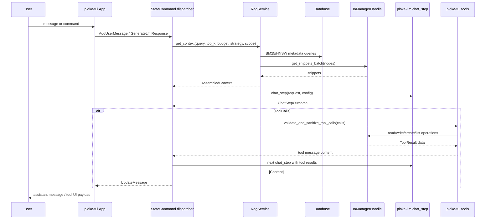
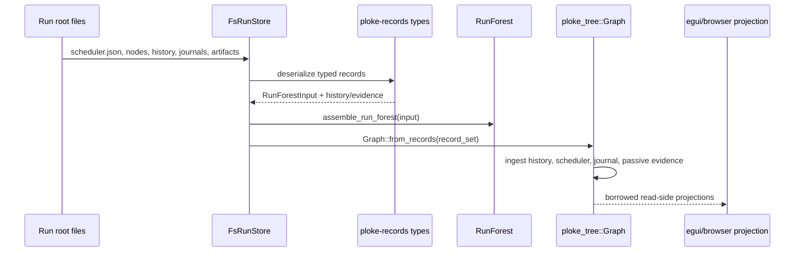

# Sequence Diagrams

> Imported from the generated Hermes code wiki at `~/.hermes/wikis/ploke` (generated `2026-06-03T03:55:43Z`, source commit `97b1a101b9363b88b8e41f1447cb36d76a3eb8a2`). Verify implementation details against current source before making changes.

## Workflow: Startup and Subsystem Wiring

The `ploke` binary initializes tracing and calls `try_main`, which builds the runtime services used by the TUI.

### Walkthrough

1. **Binary entry** — [`crates/ploke-tui/src/main.rs`](https://github.com/josephleblanc/ploke/blob/97b1a101b9363b88b8e41f1447cb36d76a3eb8a2/crates/ploke-tui/src/main.rs) calls `tracing_setup::init_tracing` then `try_main`.
2. **Config and embedding runtime** — [`crates/ploke-tui/src/lib.rs`](https://github.com/josephleblanc/ploke/blob/97b1a101b9363b88b8e41f1447cb36d76a3eb8a2/crates/ploke-tui/src/lib.rs) loads config and creates `EmbeddingRuntime`.
3. **Database and services** — the same bootstrap path initializes Cozo schema, multi-embedding metadata, I/O actor, BM25, indexer, and RAG.

## Workflow: Workspace Indexing

Indexing parses Rust source into graph relations, then fills sparse/dense retrieval structures.

### Walkthrough

1. **Command boundary** — [`StateCommand`](https://github.com/josephleblanc/ploke/blob/97b1a101b9363b88b8e41f1447cb36d76a3eb8a2/crates/ploke-tui/src/app_state/commands.rs) carries indexing requests.
2. **Parse** — [`syn_parser::parse_workspace_with_config`](https://github.com/josephleblanc/ploke/blob/97b1a101b9363b88b8e41f1447cb36d76a3eb8a2/crates/ingest/syn_parser/src/lib.rs) discovers and parses selected workspace members.
3. **Transform** — [`transform_parsed_graph`](https://github.com/josephleblanc/ploke/blob/97b1a101b9363b88b8e41f1447cb36d76a3eb8a2/crates/ingest/ploke-transform/src/transform/mod.rs) inserts graph facts.
4. **Embed** — [`IndexerTask`](https://github.com/josephleblanc/ploke/blob/97b1a101b9363b88b8e41f1447cb36d76a3eb8a2/crates/ingest/ploke-embed/src/indexer/mod.rs) reads snippets, generates embeddings, and updates DB/BM25 state.

## Workflow: Chat Turn with RAG and Tool Calls

A chat turn can retrieve code context, call an LLM route, validate tool calls, and execute tools through checked I/O.

### Walkthrough

1. **RAG context** — [`RagService::get_context`](https://github.com/josephleblanc/ploke/blob/97b1a101b9363b88b8e41f1447cb36d76a3eb8a2/crates/ploke-rag/src/core/mod.rs) resolves retrieval strategy and calls context assembly.
2. **LLM step** — [`ploke-llm::chat_step`](https://github.com/josephleblanc/ploke/blob/97b1a101b9363b88b8e41f1447cb36d76a3eb8a2/crates/ploke-llm/src/manager/session.rs) performs provider HTTP attempts and parses outcomes.
3. **TUI loop** — [`run_chat_session`](https://github.com/josephleblanc/ploke/blob/97b1a101b9363b88b8e41f1447cb36d76a3eb8a2/crates/ploke-tui/src/llm/manager/session.rs) controls retries, tool-chain limits, cancellation, and message updates.
4. **Tool safety** — [`tools/mod.rs`](https://github.com/josephleblanc/ploke/blob/97b1a101b9363b88b8e41f1447cb36d76a3eb8a2/crates/ploke-tui/src/tools/mod.rs) validates tool arguments; `ploke-io` performs filesystem effects.

## Workflow: Passive Records to Read-Side Graph

Prototype 1 run files are loaded as passive records and projected into read-only graph structures.

### Walkthrough

1. **Load files** — [`FsRunStore::load_record_set`](https://github.com/josephleblanc/ploke/blob/97b1a101b9363b88b8e41f1447cb36d76a3eb8a2/crates/ploke-tree/src/store/fs.rs) reads scheduler, node, history, journal, agent-turn, and passive evidence records.
2. **Forest projection** — [`RunForest::from_records`](https://github.com/josephleblanc/ploke/blob/97b1a101b9363b88b8e41f1447cb36d76a3eb8a2/crates/ploke-tree/src/lib.rs) merges scheduler/node data and attaches evidence/diagnostics.
3. **Graph projection** — [`Graph::from_records`](https://github.com/josephleblanc/ploke/blob/97b1a101b9363b88b8e41f1447cb36d76a3eb8a2/crates/ploke-tree/src/graph/build.rs) builds the immutable history/evidence graph.
4. **Boundary rule** — [`ploke-records`](https://github.com/josephleblanc/ploke/blob/97b1a101b9363b88b8e41f1447cb36d76a3eb8a2/crates/ploke-records/src/lib.rs) schemas deserialize known shapes but do not validate authority or advance runtime state.
