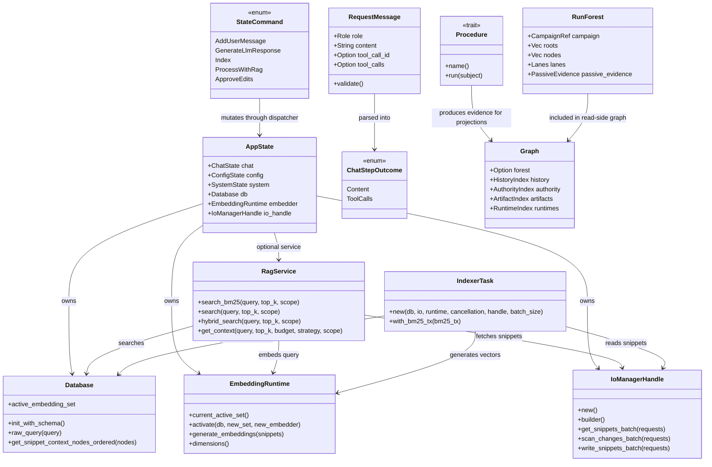

# Type Diagram

> Imported from the generated Hermes code wiki at `~/.hermes/wikis/ploke` (generated `2026-06-03T03:55:43Z`, source commit `97b1a101b9363b88b8e41f1447cb36d76a3eb8a2`). Verify implementation details against current source before making changes.

## Core Types

## Notes

- This is a Rust type diagram, not an inheritance hierarchy. Arrows show ownership/use relationships visible in the source.
- `Procedure` is a trait in `ploke-protocol`; concrete `Step`, `Sequence`, `FanOut`, and `Merge` implement or compose it.
- `RunForest` and `Graph` consume passive records through `ploke-tree`; they do not grant authority to mutate eval/runtime state.
