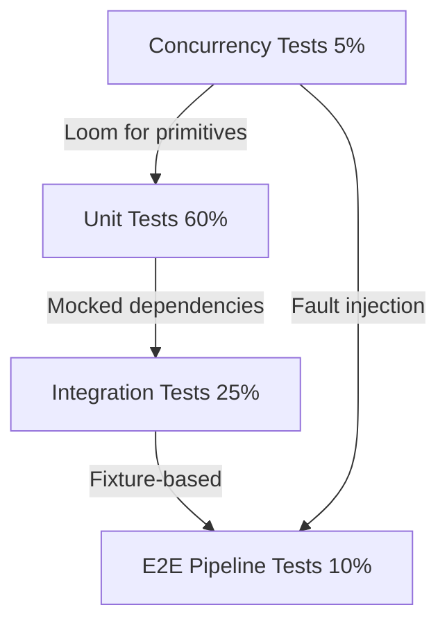
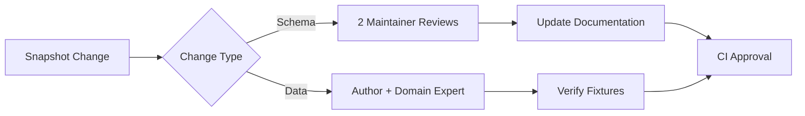

# Ploke Project Testing Strategy  
**Version 1.0**  
**Date:** Jul 6, 2025  

## 1. Introduction  
This document outlines a comprehensive testing strategy for Ploke, a mission-critical Rust project featuring:  
- AST-based code graph parsing  
- In-memory CozoDB knowledge graph transformation  
- Vector embedding generation  
- Terminal UI with complex concurrency model  

The strategy addresses unique challenges:  
1. Tightly-coupled pipeline stages  
2. Concurrency requirements  
3. Non-deterministic embedding outputs  
4. Integration of local LLMs  

**Primary Goals:**  
- Achieve >95% test coverage in critical path crates  
- Prevent regression in core functionality  
- Ensure concurrency safety  
- Validate embedding quality  
- Maintain test suite performance  

## 2. Testing Philosophy  
### 2.1. Layered Validation Approach  



### 2.2. Core Principles  
1. **Realistic over convenient:** Prefer fixture-based tests over mocks where practical  
2. **Concurrency-first:** Prioritize thread safety validation  
3. **Semantic validation:** Verify meaning, not just structure  
4. **Controlled non-determinism:** Handle probabilistic outputs  

## 3. Testing Layers  
### 3.1. Unit Testing (60%)  
**Scope:** Isolated functions and modules  

**Strategy:**  
```rust
// Example: Embedding service trait
trait EmbeddingService {
    fn generate(&self, snippets: &[Snippet]) -> Result<Vec<Embedding>>;
}

// Mock implementation
struct MockEmbedder {
    behavior: MockBehavior,
}

#[test]
fn test_embedding_error_handling() {
    let mock = MockEmbedder::new(MockBehavior::NetworkError);
    let result = process_embeddings(&mock, test_snippets());
    assert_matches!(result, Err(EmbeddingError::NetworkTimeout));
}
```

**Key Focus Areas:**  
- Database schema creation  
- AST node processing logic  
- Error handling paths  
- Concurrency primitives  

### 3.2. Integration Testing (25%)  
**Scope:** Crate-level functionality  

**Strategy:**  
```rust
#[test]
fn test_db_embedding_integration() {
    let db = TestDb::with_fixture("multi_file_project");
    let embedder = TestModel::new();
    
    let unembedded = db.get_unembedded_nodes().unwrap();
    let snippets = io::load_snippets(&unembedded).unwrap();
    let embeddings = embedder.generate(&snippets).unwrap();
    
    db.update_embeddings(embeddings).unwrap();
    
    // Verify no null embeddings remain
    assert_eq!(db.count_null_embeddings(), 0);
    
    // Spot-check specific node
    let node = db.get_node("important_function::v1");
    assert!(!node.embedding.is_empty());
}
```

**Validation Techniques:**  
1. **Embedding quality checks:**
   ```rust
   fn validate_embedding_semantics(embeddings: &[Embedding]) {
       let base = &embeddings[0];
       let similar = cosine_similarity(base, &embeddings[1]);
       let dissimilar = cosine_similarity(base, &embeddings[2]);
       
       assert!(similar > 0.7, "Similar snippets not clustered");
       assert!(dissimilar < 0.3, "Dissimilar snippets not separated");
   }
   ```
   
2. **Snapshot testing:**
   ```rust
   #[test]
   fn test_ast_parse_integration() {
       let graph = parse_fixture("tests/fixtures/attribute_heavy");
       insta::assert_yaml_snapshot!(graph.summary());
   }
   ```

### 3.3. End-to-End Pipeline Testing (10%)  
**Scope:** Full system workflows  

**Strategy:**  
```rust
#[test]
fn test_full_indexing_pipeline() {
    // 1. Setup
    let test_env = TestEnvironment::build()
        .with_project("realistic_app")
        .with_embedding_model("minilm-embedder")
        .initialize();
    
    // 2. Execute
    test_env.run_indexing();
    
    // 3. Validate
    assert_indexing_metrics(&test_env, Metrics {
        parsed_files: 42,
        embedded_nodes: 317,
        db_size_kb: 892,
    });
    
    // 4. Semantic checks
    validate_embedding_clustering(&test_env.db());
    
    // 5. State snapshot
    insta::assert_yaml_snapshot!(test_env.db_snapshot());
}
```

**Key Fixtures:**  
| Fixture Type          | Purpose                          | Complexity |
|-----------------------|----------------------------------|------------|
| `minimal`             | Basic sanity checks             | 1 file     |
| `attribute_heavy`     | `#[path]` and macro handling    | 3 files    |
| `multi_crate`         | Workspace resolution            | 2 crates   |
| `concurrency_stress`  | Thread contention verification  | 50 files   |

### 3.4. Concurrency Testing (5%)  
**Scope:** Thread safety and failure recovery  

**Precise Loom Application:**  
```rust
// Only for custom concurrency primitives
#[test]
fn test_custom_semaphore_under_loom() {
    loom::model(|| {
        let semaphore = Arc::new(CustomSemaphore::new(2));
        let mut handlers = vec![];
        
        for _ in 0..4 {
            let s = semaphore.clone();
            handlers.push(loom::thread::spawn(move || {
                let _guard = s.acquire();
                // Critical section
            }));
        }
        
        for h in handlers {
            h.join().unwrap();
        }
    });
}
```

**Higher-Level Strategies:**  
```rust
#[test]
fn test_indexer_concurrency_with_faults() {
    let fault_config = FaultConfig::new()
        .fail_db_after(3, DbError::Timeout)
        .fail_io_after(5, IoError::PermissionDenied);
        
    let test_env = TestEnvironment::with_faults(fault_config);
    
    let result = std::panic::catch_unwind(|| test_env.run_indexing());
    
    assert!(result.is_err());
    assert!(test_env.recovery_log().contains("Retry succeeded"));
    assert_eq!(test_env.retry_count(), 2);
}
```

## 4. Specialized Verification Strategies  
### 4.1. Embedding Quality Assurance  
**Validation Matrix:**  
| Test Type               | Method                          | Acceptance Criteria          |
|-------------------------|---------------------------------|------------------------------|
| Vector sanity           | Zero-vector check              | No all-zero embeddings       |
| Semantic similarity     | Cosine similarity (known pairs) | Δ > 0.7 for similar snippets |
| Semantic dissimilarity  | Cosine similarity (known pairs) | Δ < 0.3 for unrelated code   |
| Cluster consistency     | K-means silhouette score       | Score > 0.5                  |

### 4.2. Snapshot Management  
**Governance Policy:**  


**CI Enforcement:**  
```yaml
- name: Snapshot Review
  run: |
    cargo insta test
    if git diff --name-only | grep .snap; then
      cargo insta review --unreferenced=reject
      echo "Snapshot changes require approval!"
      exit 1
    fi
```

### 4.3. Concurrency Validation Scope  
**Tool Responsibility Matrix:**  
| Concern                     | Tool               | Scope                      |
|-----------------------------|--------------------|----------------------------|
| Primitive correctness       | Loom               | Custom semaphores/channels |
| Resource contention         | Criterion          | 95th percentile latency    |
| System-level deadlocks      | Timeout detection  | E2E tests                  |
| Error recovery              | Fault injection    | Integration tests          |
| Thread coordination         | Log analysis       | Event sequence validation  |

## 5. Tooling Infrastructure  
| Tool                | Purpose                                 | Coverage Target      |
|---------------------|-----------------------------------------|----------------------|
| `loom`              | Concurrency primitive verification      | 100% of custom sync  |
| `insta`             | Snapshot testing                        | Core data structures |
| `mockall`           | Dependency mocking                      | External services    |
| `criterion`         | Performance benchmarking                | Critical paths       |
| `testcontainers`    | Database integration                    | All DB operations    |
| `tarpaulin`         | Coverage reporting                      | 95%+ critical crates |

## 6. Implementation Roadmap  
### Phase 1: Foundation (2 Weeks)  
1. Implement `EmbeddingService` trait architecture  
2. Establish fixture hierarchy  
3. Setup snapshot CI workflow  
4. Create test harness framework  

### Phase 2: Concurrency Core (3 Weeks)  
1. Identify loom-critical primitives  
2. Implement fault injection framework  
3. Develop embedding semantic checks  
4. Create concurrency stress tests  

### Phase 3: Validation Suite (2 Weeks)  
1. Implement DB snapshot validator  
2. Build vector quality analysis toolkit  
3. Create real-world fixture projects  

### Phase 4: Maintenance Protocol  
1. Quarterly test audits  
2. Snapshot expiration schedule:  
   - AST snapshots: 6 months  
   - Embedding samples: Per-release  
   - DB schema: Never  
3. Flaky test quarantine process  

## 7. Quality Metrics  
| Metric                     | Target          | Measurement                 |
|----------------------------|-----------------|-----------------------------|
| Unit test coverage         | 95%             | `tarpaulin`                 |
| Integration test coverage  | 85%             | Manual path analysis        |
| E2E pass rate              | 100%            | CI history                  |
| Embedding quality score    | >0.9            | Semantic validation suite   |
| Concurrency bug density    | <0.1/kloc       | Production monitoring       |

## 8. Rationale and Justification  
### Why this strategy prevents critical failures:  
1. **Pipeline Dependencies:**  
   - Fixture-based testing validates real data flow between stages  
   - Semantic checks catch subtle integration errors  

2. **Concurrency Safety:**  
   - Precise loom usage targets actual risk areas  
   - Fault injection tests recovery logic  

3. **Embedding Validation:**  
   - Multi-dimensional checks prevent "dumb vector" failures  
   - Similarity tests validate model effectiveness  

4. **Maintainability:**  
   - Governed snapshots prevent silent regressions  
   - Tiered fixtures balance coverage and speed  

### Efficiency Tradeoffs:  
| Technique             | Cost Factor | Mitigation                  |
|-----------------------|-------------|-----------------------------|
| E2E tests             | 10x runtime | Parallel execution          |
| Loom tests            | 100x runtime | Scoped to critical sections |
| Embedding generation  | High CPU    | Test-specific tiny models   |
| DB validation         | Medium I/O  | In-memory databases         |

## 9. Conclusion  
This testing strategy provides a balanced approach to verifying Ploke's complex architecture while maintaining practical constraints. By combining:  
- Precise unit testing with strategic mocks  
- Semantic integration validation  
- Governed snapshot management  
- Targeted concurrency verification  

we achieve comprehensive coverage while avoiding common pitfalls of:  
- Over-mocking that hides integration issues  
- Brittle end-to-end tests  
- Unmaintainable snapshot drift  
- Impractical concurrency validation  

The phased implementation ensures immediate value delivery while building toward production-grade reliability standards required for our mission-critical system.
