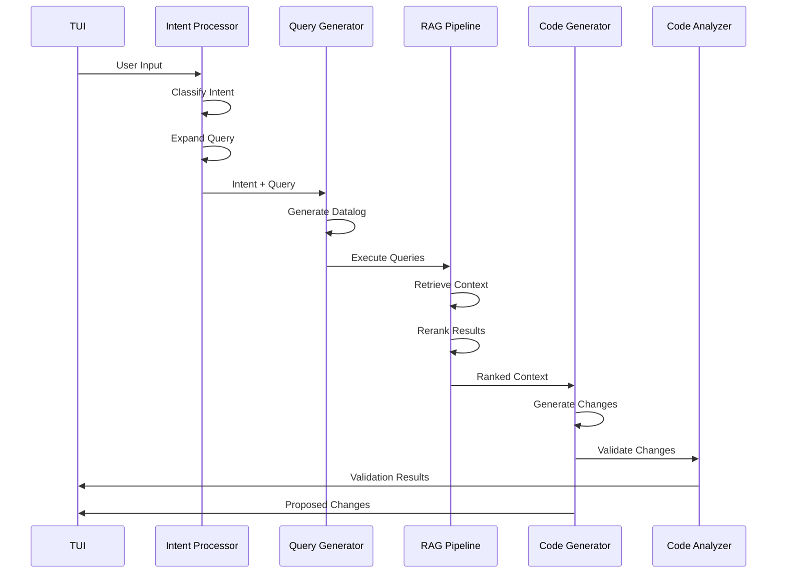
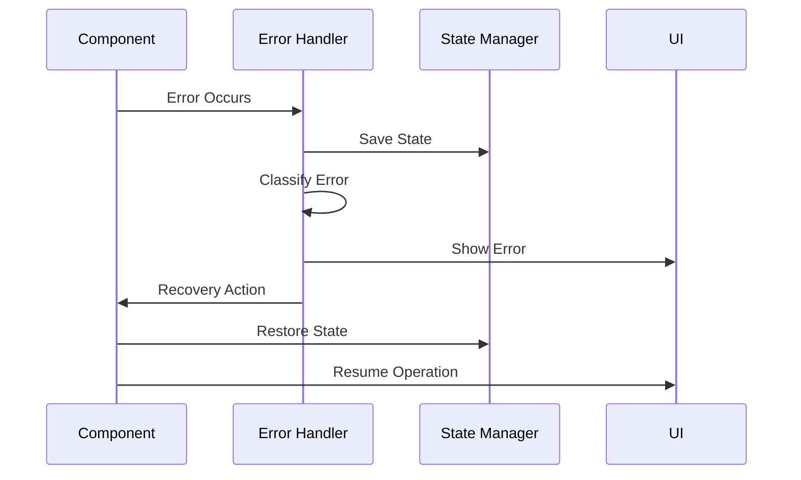

# Pipeline Architecture Details

## 1. Sequence Flow

### Main Processing Pipeline


### Error Recovery Flow


## 2. Error Handling Strategy

### Error Classification
- **User Input Errors**
  - Invalid commands
  - Malformed requests
  - Recovery: Prompt for correction
  
- **Processing Errors**
  - LLM API failures
  - Query execution failures
  - Context retrieval errors
  - Recovery: Retry with backoff

- **Resource Errors**
  - Memory limits
  - API rate limits
  - Recovery: Resource management

### Error Recovery Patterns
```rust
pub enum ErrorRecovery {
    Retry { max_attempts: u32, backoff: Duration },
    Fallback { alternative: Box<dyn Handler> },
    UserPrompt { message: String, options: Vec<String> },
    Abort { cleanup: Box<dyn FnOnce()> },
}
```

## 3. Component Communication

### Message Protocol
```rust
pub struct PipelineMessage {
    source: ComponentId,
    target: ComponentId,
    message_type: MessageType,
    payload: Box<dyn Any>,
    metadata: MessageMetadata,
}

pub struct MessageMetadata {
    timestamp: DateTime<Utc>,
    correlation_id: Uuid,
    retry_count: u32,
    priority: Priority,
}
```

### Communication Patterns
- **Request-Response**
  - Synchronous operations
  - Error propagation
  - Timeout handling

- **Event Broadcasting**
  - Status updates
  - Progress notifications
  - Error notifications

- **State Updates**
  - Component state changes
  - Pipeline stage completion
  - Resource usage updates

## 4. State Management

### Global State
```rust
pub struct GlobalState {
    // Pipeline State
    current_stage: PipelineStage,
    stage_progress: HashMap<PipelineStage, Progress>,
    
    // Resource State
    memory_usage: ResourceMetrics,
    api_quotas: QuotaTracker,
    
    // Error State
    error_counts: HashMap<ErrorType, u32>,
    recovery_attempts: u32,
    
    // Session State
    session_id: Uuid,
    start_time: DateTime<Utc>,
    user_preferences: UserPreferences,
}
```

### Component State
```rust
pub trait ComponentState: Send + Sync {
    fn snapshot(&self) -> Box<dyn StateSnapshot>;
    fn restore(&mut self, snapshot: Box<dyn StateSnapshot>);
    fn clear(&mut self);
}
```

### State Persistence
- In-memory state cache
- Disk-based recovery points
- State versioning for rollback

### State Synchronization
- Lock-free operations where possible
- Atomic state transitions
- Event-sourced state updates

## 5. Implementation Guidelines

### Component Implementation
```rust
pub trait PipelineComponent: Send + Sync {
    fn process(&mut self, input: PipelineMessage) -> Result<PipelineMessage, PipelineError>;
    fn handle_error(&mut self, error: PipelineError) -> ErrorRecovery;
    fn get_state(&self) -> Box<dyn ComponentState>;
}
```

### Testing Strategy
- Unit tests for each component
- Integration tests for pipeline flows
- Error injection testing
- State transition testing
- Performance benchmarks

### Monitoring Points
- Component health
- Pipeline throughput
- Error rates
- Resource usage
- State consistency

### Performance Considerations
- Async processing
- Resource pooling
- State caching
- Message batching
- Parallel execution where possible
