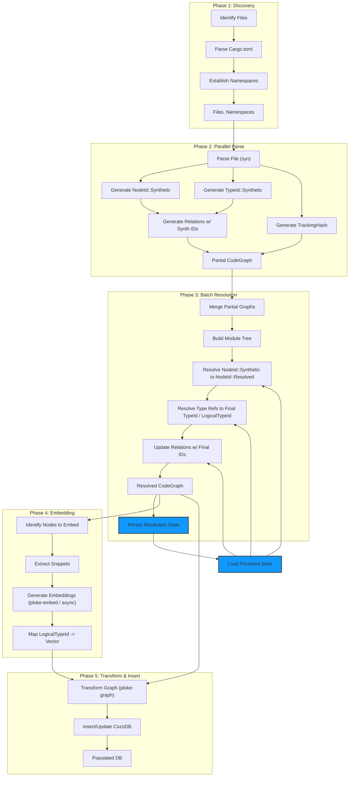
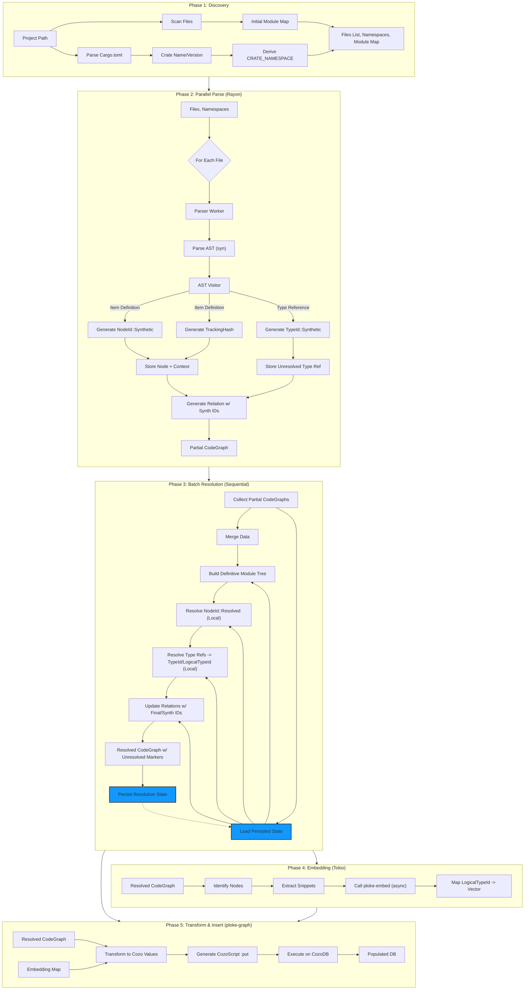

# Plan Overview: UUID Refactor using Multi-Phase Batch Processing

## 1. Goal

Refactor the `ploke` codebase, primarily `syn_parser`, to use stable, deterministic `uuid::Uuid` identifiers (`NodeId`, `TypeId`, `LogicalTypeId`) instead of `usize`. This enables reliable graph merging, parallel processing, and efficient incremental updates. This plan details the initial implementation using a multi-phase batch processing model, focusing on intra-crate resolution first (see [ADR-003](docs/design/adrs/accepted/ADR-003-Defer-Dependency-Resolution.md)).

## 2. Core Identifier Strategy (See ADR-001)

-   **Identifiers:** `NodeId` (Enum: `Resolved(Uuid)`/`Synthetic(Uuid)`), `TypeId` (Struct: `crate_id: Uuid`, `type_id: Uuid`), `LogicalTypeId` (Uuid), `TrackingHash` (Uuid).
    - Edit: `NodeId` variants now `Resolved(Uuid)`/`Synthetic(Uuid)`, previous `NodeId::Path(Uuid)` naming was found to be a source of confusion.
-   **Generation:** UUIDv5 based on hierarchical namespaces (`PROJECT -> CRATE -> ITEM/TYPE`).
-   **Storage:** Native `cozo::DataValue::Uuid` in CozoDB.
-   **Feature Flag:** `uuid_ids`.
-   **Scope:** Per [ADR-004](docs/design/adrs/proposed/ADR-004-Parser-Scope-Resolution.md), the `syn_parser` crate is responsible for Phases 1-3, delivering a resolved graph.

## 3. Multi-Phase Batch Processing Model

This model breaks down the parsing, resolution, and database insertion process into distinct, sequential phases, allowing for parallelism within specific phases. The initial focus is on resolving IDs for items defined *within* the parsed crates ([ADR-003](docs/design/adrs/accepted/ADR-003-Defer-Dependency-Resolution.md)).

### Phase 1: Discovery & Context Setup

-   **Input:** Project root path, list of target crates (workspace members + specified dependencies).
-   **Process:**
    1.  Identify all `.rs` files within target crates.
    2.  Parse `Cargo.toml` for each crate to determine `crate_name` and `crate_version`.
    3.  Perform a minimal scan (`lib.rs`, `main.rs`, `mod.rs`) to build an initial map of file paths to potential module segments (e.g., `src/module/file.rs` might belong to `crate::module`).
    4.  Define the global `PROJECT_NAMESPACE: Uuid`.
    5.  Derive `CRATE_NAMESPACE: Uuid` for each target crate using `PROJECT_NAMESPACE`, `crate_name`, and `crate_version`.
-   **Output:**
    -   List of `.rs` files to parse per crate.
    -   Map of `crate_name` -> `CRATE_NAMESPACE`.
    -   Initial (potentially incomplete) module structure map.
-   **Concurrency:** Can potentially parallelize file discovery and `Cargo.toml` parsing per crate.

### Phase 2: Parallel Parse & Provisional Graph Generation

-   **Input:** List of files per crate, `CRATE_NAMESPACE` for each crate.
-   **Process (Parallel per file using `rayon`):**
    1.  Each worker parses its assigned `.rs` file using `syn`.
    2.  A `VisitorState` tracks context *within the current file* (e.g., relative module path).
    3.  **`NodeId` Generation:**
        -   For defined items (functions, structs, etc.), generate a *temporary* `NodeId::Synthetic(Uuid)` using `CRATE_NAMESPACE`, file path, relative path/span, and item name. Store the context needed for final `Resolved` ID calculation (relative path, name) with the node.
    4.  **`TypeId` Generation:**
        -   When encountering type paths (`syn::TypePath`), attempt local resolution.
        -   If unresolved locally (e.g., it's an import `use other_crate::Foo;` or defined later in the crate), store the path string (e.g., `foo::Bar`, `other_crate::Foo`) as an unresolved reference marker within the node using it (e.g., field, parameter). Generate a *temporary* `TypeId::Synthetic(Uuid)` based on the unresolved string + `CRATE_NAMESPACE`. Ensure the synthetic ID or marker retains the original path string for later resolution attempts.
    5.  **`Relation` Generation:** Create `Relation` objects using the *temporary* `Synthetic` IDs. Store the original path string for type relations if the target `TypeId` is synthetic.
    6.  **`TrackingHash` Generation:** Calculate the `TrackingHash` based on AST tokens for relevant nodes.
-   **Output (per worker):** A partial `CodeGraph` containing:
    -   Full node details (`FunctionNode`, `StructNode`, etc.).
    -   Temporary `NodeId::Synthetic` and `TypeId::Synthetic` identifiers.
    -   Unresolved type reference markers (including the path string).
    -   `Relation`s using temporary IDs (and potentially unresolved path strings for types).
    -   `TrackingHash` values.
-   **Concurrency:** High degree of parallelism via `rayon` across files.

### Phase 3: Batch Resolution (Sequential)

-   **Input:** Collection of all partial `CodeGraph`s from Phase 2, initial module map and namespaces from Phase 1.
-   **Process (Single-threaded or coarse-grained locking if state is shared):**
    1.  **Merge Graphs:** Combine all partial `CodeGraph`s into a single, potentially large, in-memory representation (or use iterators/maps to avoid one giant structure if memory is a concern).
    2.  **Build Definitive Module Tree:** Use all parsed `mod` items and the initial map to construct the final, accurate module hierarchy (mapping absolute module paths to file locations and contained items).
    3.  **Finalize `NodeId`s:**
        -   Iterate through all nodes with temporary `Synthetic` IDs.
        -   Using the definitive module tree and the stored context (relative path, name), calculate the absolute item path.
        -   Generate the final `NodeId::Path(Uuid)`.
        -   Build and maintain a mapping: `TemporarySynthId -> FinalPathId`. Update the node's ID in the merged representation.
    4.  **Resolve Types & Finalize `TypeId`s (Intra-Crate Focus):**
        -   Create a lookup map for items defined *within the current batch*: `absolute_type_path_string -> (FinalPathId, FinalTypeId, FinalLogicalTypeId)`.
        -   Iteratively process nodes containing unresolved type references:
            *   Use `use` statements (parsed in Phase 2) and the module context to resolve the reference path string to an absolute path.
            *   **Attempt Resolution:** Look up the absolute path in the map of *locally defined* items.
            *   **If Found:** Generate the final `TypeId` (struct) and `LogicalTypeId` (Uuid). Replace the temporary `TypeId::Synthetic` and unresolved markers with the final IDs.
            *   **If Not Found (External/Unparsed Dependency):** The `TypeId` remains `Synthetic`. Ensure the unresolved path string is preserved alongside the synthetic ID for potential future use or analysis (per [ADR-003](docs/design/adrs/accepted/ADR-003-Defer-Dependency-Resolution.md)).
        -   Repeat resolution attempts until no further progress is made (handles dependency chains and cycles *within the parsed set*).
    5.  **Update Relations:** Iterate through all `Relation` objects. Use the `TemporarySynthId -> FinalPathId` map to replace temporary source/target IDs with final `NodeId::Path` or resolved `TypeId` values. For relations pointing to unresolved external types, retain the `Synthetic` `TypeId` and the associated path string. Do *not* discard relations just because the target is external/unresolved.
-   **Output:**
    -   A `CodeGraph` (or equivalent data structures) containing:
        -   Final `NodeId::Path` for locally defined items (or `Synthetic` for macros etc.).
        -   Final `TypeId`, `LogicalTypeId` for locally defined types.
        -   `Synthetic` `TypeId`s (with path strings) for references to external/unparsed types.
        -   `TrackingHash` values.
        -   `Relation`s using final IDs where possible, and `Synthetic` IDs where necessary.
    -   **Persisted State:** The definitive module tree and the `TemporarySynthId -> FinalPathId` maps *for the resolved items*.

### Phase 4: Embedding Generation (Async I/O)
- Note: Deferring Phase 4 in favor of establishing full pipeline for end-to-end testing.

-   **Input:** Resolved `CodeGraph` (specifically, nodes with code content and their `LogicalTypeId`).
-   **Process (using `tokio`):**
    1.  Identify nodes requiring embedding (e.g., functions, structs).
    2.  Extract relevant code text/snippets.
    3.  For each snippet, asynchronously call `ploke-embed` (which interfaces with external models like Ollama/Candle, involving network or IPC I/O) to generate a vector embedding. Use `async/await` to handle potentially many concurrent embedding requests efficiently without blocking threads.
    4.  Associate the generated vector with the node's `LogicalTypeId`.
-   **Output:** A map of `LogicalTypeId -> Vec<f32>`.
-   **Concurrency:** High degree of concurrency managed by the `tokio` runtime, suitable for I/O-bound embedding tasks. Throughput limited by the external embedding model/service.

### Phase 5: Transform & Insert (Database Interaction)

-   **Input:** Resolved `CodeGraph`, Map of `LogicalTypeId -> Vec<f32>`.
-   **Process (`ploke-graph` crate):**
    1.  Define CozoDB schema using native `Uuid`, `Vector`, etc. Create necessary indices (standard on IDs, HNSW on vectors).
    2.  Iterate through the resolved `CodeGraph` nodes and relations.
    3.  Transform Rust structs (`FunctionNode`, `Relation`, etc.) and associated embeddings into `cozo::DataValue` representations (using `DataValue::Uuid`, `DataValue::Vector`).
    4.  Generate CozoScript `:put` statements (upserts) for nodes, relations, and embeddings (linking embeddings via `LogicalTypeId`).
    5.  Execute CozoScript against the embedded CozoDB instance, likely in batches for efficiency. Handle potential transaction errors.
-   **Output:** Populated CozoDB instance.
-   **Concurrency:** Can potentially parallelize transformation and batch insertion into CozoDB (leveraging Cozo's MVCC).

## 4. Incremental Updates

-   When file changes are detected:
    1.  Load the **Persisted State** (module tree, ID maps) from the previous run.
    2.  Run **Phase 1** only if `Cargo.toml` or crate structure changed significantly.
    3.  Run **Phase 2** (Parallel Parse) only for the changed files and potentially directly dependent files/crates.
    4.  Run **Phase 3** (Batch Resolution), using the loaded state as a starting point. Only new/changed items need full resolution *within the parsed set*; existing IDs can be reused. Resolution attempts for external types might succeed if the dependency was parsed previously and its map is loaded. Update the persisted state.
    5.  Run **Phase 4** (Embed) only for items whose `TrackingHash` changed or are new, using `LogicalTypeId` (which should be generated even for unresolved types if possible, based on path string).
    6.  Run **Phase 5** (Transform/Insert) to update CozoDB with changes, ensuring the schema can handle potentially `Synthetic` IDs or store unresolved path information alongside relations.

This model provides a structured way to implement the UUID refactor while enabling parallelism and laying the groundwork for efficient incremental updates and future cross-crate resolution enhancements.

## 5. Identifier Definitions & Purpose

| Identifier      | Type Definition                               | Generation Basis                                                                 | Purpose                                                                                                |
| :-------------- | :-------------------------------------------- | :------------------------------------------------------------------------------- | :----------------------------------------------------------------------------------------------------- |
| `NodeId`        | `enum { Resolved(Uuid), Synthetic(Uuid) }`        | `Resolved`: `CRATE_NAMESPACE` + Absolute Item Resolved `Synthetic`: Contextual Info | Unique, stable (for `Resolved`) identifier for code elements (functions, structs, modules, etc.) in the graph. |
| `TypeId`        | `struct { crate_id: Uuid, type_id: Uuid }`    | `CRATE_NAMESPACE` + Canonical Type String                                        | Unique identifier for a specific type structure *within a specific crate version*.                       |
| `LogicalTypeId` | `Uuid`                                        | `PROJECT_NAMESPACE` + Crate Name + Type Path within Crate                        | Stable identifier for a type's logical identity across crate versions, primarily for linking embeddings. |
| `TrackingHash`  | `Uuid` (or `Bytes`/`u128`)                    | `CRATE_NAMESPACE` + File Path + AST Token Hash                                   | Detects meaningful content changes in a node, ignoring formatting, for incremental processing.         |
| `CRATE_NAMESPACE` | `Uuid`                                        | `PROJECT_NAMESPACE` + Crate Name + Crate Version                                 | Isolates identifiers within a specific version of a crate.                                             |
| `PROJECT_NAMESPACE` | `Uuid`                                        | Constant                                                                         | Root namespace for the entire `ploke` project.                                                         |

## 6. ID States During Processing Phases

This table outlines the expected state of identifiers at the *end* of each phase for different graph elements.

| Phase                 | Element Type        | `NodeId` State        | `TypeId` State        | `LogicalTypeId` State | `TrackingHash` State | `Relation` State (`source`/`target`) | Notes                                                                                                                               |
| :-------------------- | :------------------ | :-------------------- | :-------------------- | :-------------------- | :------------------- | :----------------------------------- | :---------------------------------------------------------------------------------------------------------------------------------- |
| **1: Discovery**      | Module Structure    | N/A                   | N/A                   | N/A                   | N/A                  | N/A                                  | Namespaces (`CRATE_NAMESPACE`) generated. Initial file-to-module mapping.                                                           |
| **2: Parallel Parse** | `FunctionNode`, etc | `Synthetic`           | N/A                   | N/A                   | Generated            | `Synthetic`                          | Nodes created with temporary IDs. Context for final ID stored. `TrackingHash` calculated. Relations use temporary IDs.              |
|                       | `TypeNode`          | N/A                   | `Synthetic`           | `Synthetic`           | N/A                  | `Synthetic`                          | Temporary `TypeId` based on unresolved string. `LogicalTypeId` generated based on available info.                                   |
|                       | `Relation`          | `Synthetic`           | `Synthetic`           | `Synthetic`           | N/A                  | `Synthetic`                          | Relations link temporary IDs. `Contains`, `Uses` might be resolvable if definition is in the same file, but generally use temp IDs. |
| **3: Batch Resolve**  | `FunctionNode`, etc | `Path` (or `Synthetic`) | N/A                   | N/A                   | (Unchanged)          | `Path` (or `Synthetic`)              | Temporary `NodeId`s resolved to `Path` IDs using module tree for *local* items. `Synthetic` IDs remain for macros, etc.             |
|                       | `TypeNode`          | N/A                   | Final (Struct) or `Synthetic` | Final (Uuid) or `Synthetic` | N/A                  | Final (Struct) or `Synthetic`        | *Local* `TypeId`s resolved to final struct/Uuid. *External/Unparsed* remain `Synthetic` (with path string). `LogicalTypeId` generated where possible. |
|                       | `Relation`          | `Path` (or `Synthetic`) | Final (Struct) or `Synthetic` | Final (Uuid) or `Synthetic` | N/A                  | `Path` / Final / `Synthetic`         | `source`/`target` IDs updated to final `NodeId::Path` or resolved `TypeId`. Relations to unresolved external types retain `Synthetic` `TypeId`. **Relations are NOT dropped if target is unresolved.** |
| **4: Embed**          | Embeddings          | N/A                   | N/A                   | Final (Uuid) or `Synthetic` | N/A                  | N/A                                  | Embeddings generated and associated with `LogicalTypeId` (final or synthetic).                                                    |
| **5: Transform/Insert** | Database Rows       | `Uuid` (`Path`/`Synth`) | `Uuid` (`type_id`) or Null/Marker | `Uuid` or Null/Marker | `Uuid`               | `Uuid` (`Path`/`Synth`/`type_id`) or Null/Marker | Data transformed. Schema must handle unresolved types (e.g., nullable foreign keys, storing path string). `TypeId` struct stored for resolved types. |

**Note on Relation Resolution Timing:**

-   **`Contains` (Module -> Item/Submodule):** Generated in Phase 2 using temporary IDs. Finalized in Phase 3 when parent/child `NodeId`s are finalized.
-   **`Uses` (Import -> Type):** Generated in Phase 2 using temporary IDs. Finalized in Phase 3 when the imported `TypeId` is resolved.
-   **`StructField`, `FunctionParameter`, `FunctionReturn`, etc.:** Generated in Phase 2 linking temporary `NodeId` (owner) to temporary `TypeId` (type). Finalized in Phase 3 when both owner `NodeId` and field/param/return `TypeId` are resolved.
-   **`ImplementsTrait`, `ImplementsFor`:** Generated in Phase 2 linking temporary `TypeId` (implementer) to temporary `TypeId` (trait). Finalized in Phase 3 when both `TypeId`s are resolved *if both are local*. If the trait is external/unparsed, the trait `TypeId` remains `Synthetic`.

## 7. Phase / ID Flow Diagram

## 8. Detailed Processing Flow Diagram (`syn_parser` Focus)

## 9. Testing & Risk Mitigation

-   **Feature Flag (`uuid_ids`):** This is the primary mitigation. All changes will be conditionally compiled under this flag, allowing the existing `usize`-based system to remain functional on the main branch until the refactor is complete and verified.
-   **Breaking Changes:** This is a fundamental change to core identifiers. It *will* break:
    -   All existing tests that assert specific `usize` IDs.
    -   Serialization formats (RON files generated with `usize` IDs will be incompatible).
    -   Database schema and stored data (CozoDB relations using `Int` for IDs must be migrated to `Uuid`).
    -   Any downstream code in `ploke-graph`, `ploke-db`, `test-utils` that expects `usize` IDs.
-   **Testing Strategy:**
    -   **Unit Tests:** Verify UUID generation logic (namespaces, path hashing, type string hashing, synthetic ID format). Test `NodeId`/`TypeId` struct/enum behavior.
    -   **Integration Tests (`syn_parser`):** Adapt existing fixture tests (`parse_fixture`) to work under the `uuid_ids` flag. Assertions will need to check for the *presence* and basic format of UUIDs rather than specific values initially. Add tests verifying that the same logical item gets the same `NodeId::Resolved` across different (simulated) runs or file orderings (using persisted state). Test `TrackingHash` generation and change detection.
    -   **Cross-Crate Tests:** Once `ploke-graph` and `ploke-db` are updated, integration tests spanning parsing, transformation, and database insertion/querying are crucial to verify the end-to-end flow with native `Uuid` types.
    -   **Migration:** Develop a strategy or script to migrate existing CozoDB data if necessary (likely involves dropping and recreating relations with the new schema). For RON files, consider them incompatible artifacts of the old system.
-   **Risk Areas & Mitigation:**
    -   **Resolution Logic Complexity (Phase 3):** High risk of bugs in module tree building, path resolution, `use` statement handling, and cyclic dependency resolution *within the parsed set*. Mitigation: Extensive unit testing of the resolution logic in isolation; clear separation of concerns. **Deferring full cross-crate resolution mitigates some initial complexity.**
    -   **Handling Unresolved Types:** Risk of downstream errors if code assumes all IDs are fully resolved. Mitigation: Explicitly design `CodeGraph`, `ploke-graph` transformations, and CozoDB schema to handle `Synthetic` IDs and unresolved markers ([ADR-003](docs/design/adrs/accepted/ADR-003-Defer-Dependency-Resolution.md)). Ensure `Synthetic` IDs store enough info (path string) for future resolution.
    -   **Canonical Type String:** Risk of inconsistencies leading to different `TypeId`s for the same logical type. Mitigation: Start simple (normalized `to_token_stream`), document limitations, plan for future enhancement. `LogicalTypeId` (based on crate name + type path) provides a more stable cross-version identifier, especially important for linking embeddings even if `TypeId` changes.
    -   **Performance:** Risk of slow UUID generation or resolution phase. Mitigation: Benchmarking; potential future optimization.
    -   **Persisted State Management:** Risk of corruption or inconsistency. Mitigation: Robust serialization/deserialization; checksums/versioning. State must include maps for *resolved* items.

## 10. Relation Generation Context

While `syn_parser` is responsible for generating relations directly derivable from the Rust AST during Phase 2 (using temporary IDs) and finalizing them in Phase 3, it is not the sole source of graph edges.

-   **Parser-Generated Relations (Examples):** `Contains`, `StructField`, `FunctionParameter`, `FunctionReturn`, `ImplementsTrait`, `ImplementsFor`, `Uses`.
-   **Future Relation Sources:** The system architecture anticipates that other components may add relations to the CozoDB graph later, using the stable `NodeId::Resolved` and `TypeId` identifiers generated by the parser. Examples:
    -   `ploke-lsp`: Could add relations representing "references" or "definition/declaration" links derived from LSP data.
    -   `ploke-analyze`: Could add relations representing control flow, data flow, or code quality metrics.
    -   `ploke-db` (or a dedicated service): Could infer relations based on database queries (e.g., "similar embedding").

The design using stable UUIDs ensures that these disparate sources can consistently refer to the same code elements within the graph stored in CozoDB. `ploke-graph` primarily handles the transformation of parser-generated data but the Cozo schema itself is open to extension.

## 11. Handling Primitives and Standard Library Types

Parsing the entire `std` library source code is impractical. To ensure consistent identification of primitive types (e.g., `u64`, `bool`) and common standard library types (e.g., `String`, `Vec`, `HashMap`) across the user's code and all parsed dependencies, a predefined identifier strategy will be used:

1.  **Dedicated Namespace:** A constant, well-known `Uuid` (e.g., `STD_NAMESPACE_UUID`) will serve as the namespace specifically for standard library and primitive types. This namespace is distinct from the `PROJECT_NAMESPACE_UUID` used for crate-specific namespaces.
2.  **Canonical Names:** The known, stable canonical paths or names of these types (e.g., `"u64"`, `"std::string::String"`, `"std::collections::HashMap"`) will be used as the "name" component for ID generation.
3.  **Direct Generation of Resolved IDs:** When the parser encounters a usage of these well-known types, instead of generating a `TypeId::Synthetic` based on the current parsing context, it will directly generate (or retrieve from a cache) a predefined, stable `TypeId::Resolved(Uuid)`. This ID is deterministically generated using the `STD_NAMESPACE_UUID` and the type's canonical name string (e.g., `Uuid::new_v5(&STD_NAMESPACE_UUID, b"std::string::String")`).
4.  **Consistency:** This approach guarantees that every reference to `String`, `u64`, `HashMap`, etc., receives the exact same `TypeId::Resolved` throughout the entire graph, regardless of which crate it appears in, without requiring `std` to be parsed.
5.  **Generics:** Generic standard library types like `Vec<T>` or `HashMap<K, V>` are handled compositionally. The `TypeNode` representing `Vec<String>` will reference the predefined `TypeId` for `Vec` and the predefined `TypeId` for `String`. Its own `TypeId` will likely be generated based on the base type's ID and the IDs of its generic arguments.
