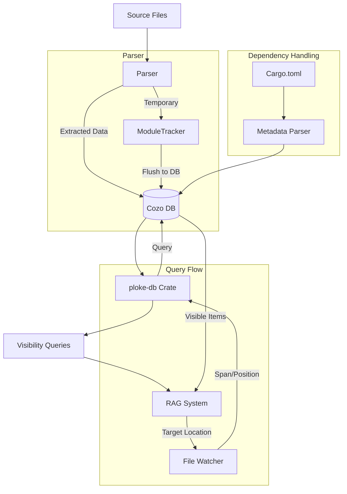

You've raised several important architectural questions that go beyond just code style - these are fundamental design decisions about how to model Rust's module system accurately. Let me address the core issues systematically:

### 1. Module Path Representation
The key insight is that Rust actually has **three distinct path contexts**:
- **Absolute paths** (starting with `crate::`, `self::`, `super::`, or a crate name)
- **Relative paths** (starting with an identifier)
- **Visibility paths** (`pub(in path)`)

Your current dual representation (`["crate", ...]` vs `["mod1", ...]`) is trying to handle these different cases, but we can model this more precisely:

```rust
enum ModulePath {
    CrateLocal(Vec<String>),      // ["mod1", "mod2"] - relative to current crate
    Dependency(String, Vec<String>), // ("serde", ["derive"]) - external crate
    Relative(Vec<String>),        // ["super", "sibling"] - relative paths
    VisibilityRestricted(Box<ModulePath>, Vec<String>) // pub(in path)
}
```

### 2. **VisibilityContext as Query Input**:
```rust
struct VisibilityContext {
    target_span: (u64, u64), // Byte range
    file_path: String,
    is_dependency_context: bool
}
```

### 3. Concrete Recommendations

**A. Unified Path Handling**:
1. Store **one** canonical path representation internally
2. Add helper methods for different views:
```rust
impl ModulePath {
    fn as_absolute(&self) -> String {
        match self {
            Self::CrateLocal(p) => format!("crate::{}", p.join("::")),
            Self::Dependency(c, p) => format!("{}::{}", c, p.join("::")),
            // ...
        }
    }
    
    fn is_visible_from(&self, context: &VisibilityContext) -> bool {
        // Unified visibility logic
    }
}
```

**B. Dependency Awareness**:
Add metadata to distinguish sources:
```rust
enum ItemSource {
    CurrentCrate {
        file: PathBuf,
        module_path: ModulePath,
        visibility: VisibilityKind
    },
    Dependency {
        crate_name: String,
        version: Option<String>,
        module_path: ModulePath
    }
}
```

**C. Practical Migration Steps**:
1. First consolidate the dual paths into one `ModulePath` enum
2. Add source tracking metadata
3. Then implement the visibility resolver as a separate service that:
   - Takes a `(Item, Context)` pair
   - Returns `VisibilityResult` with detailed reasoning

### 4. Answering Your Core Question
For your immediate decision point: **Yes, you should keep the `["crate", ...]` prefix** because:
1. It accurately represents Rust's module resolution
2. It clearly distinguishes crate-local vs external items
3. `pub(crate)` can be handled by comparing the root segment

The edge case you mentioned (`pub(in crate::some_mod)`) would be represented as:
```rust
VisibilityRestricted(
    Box::new(ModulePath::CrateLocal(vec![])), // The `crate` root
    vec!["some_mod".to_string()]
)
```

### 5. Implementation Strategy
I recommend this evolution path:
1. **This week**: Consolidate to single path representation
2. **Next week**: Add source tracking metadata
3. **Following**: Implement the visibility service

Would you like me to:
1. Provide concrete code samples for any of these components?
2. Diagram the new data flow?
3. Focus on any particular aspect of the migration?

The key insight is that you're absolutely right to be concerned about these distinctions - they're fundamental to Rust's module system and your tool's accuracy. The solution is to make the implicit distinctions explicit in your type system.


WARNING: Not quite correct, Cozodb is inside `ploke-db`


### Key Components Explained:

1. **Parser's Limited Role**:
   - Only maintains transient `ModuleTracker` during parsing
   - Immediately flushes extracted relations to Cozo DB
   - No long-term state retention

2. **Database Schema Essentials**:
WARNING: Likely incorrect CozoScript, notional only
```cozo
:create items {
    id: Uuid,
    name: String,
    kind: String, // 'function', 'struct', etc
    module_path: [String],
    visibility: String, // 'public', 'crate', etc
    file: String,
    span: [Number, Number],
    => [id]
}

:create relations {
    source: Uuid,
    target: Uuid,
    kind: String, // 'contains', 'uses', etc
    => [source, target]
}

:create imports {
    context_path: [String], // Where import appears
    imported_path: [String], // What's being imported
    alias: String?, // Optional rename
    => [context_path, imported_path]
}
```


4. **Query Flow**:
   1. File watcher detects edit location → creates `VisibilityContext`
   2. `ploke-db` executes Cozo queries like:
```cozo
WARNING: Likely incorrect CozoScript, notional only

   ?[visible_item, name, kind] := 
       *items{id: $item, name, kind, module_path, visibility},
       // Resolve visibility rules...
       // Check import statements...
       // Apply crate boundaries...
   ```

5. **Dependency Handling**:
   - Separate pipeline for `Cargo.toml`
   - Tags dependency items with origin crate
   - Special visibility rules for `pub(crate)` across crates

### Why This Works Better:

1. **Single Source of Truth**: All data lives only in Cozo
2. **Algebraic Flexibility**: Complex visibility rules become relational queries
3. **Scale Resilient**: No in-memory duplication
4. **Context-Aware**: Queries can reconstruct any visibility scenario on demand

Would you like me to:
1. Provide concrete Cozo query examples for visibility resolution?
2. Detail the metadata extraction from `Cargo.toml`?
3. Show how this handles workspace visibility edge cases?

Here's the corrected Mermaid diagram with embedded Cozo and concrete query examples:

### Concrete Cozo Query Examples

1. **Basic Visibility Check** (Is item usable at target location?)
```cozo
WARNING: Likely incorrect CozoScript, notional only
?[is_visible] := 
    *items{id: $target_item, module_path: item_mod, visibility},
    *items{id: $context_item, module_path: ctx_mod},
    // Rule 1: Direct visibility (same module or parent)
    (item_mod = ctx_mod[:n] ; n = length(item_mod)) -> is_visible = true,
    // Rule 2: Public items in same crate
    (visibility = 'public', same_crate(item_mod, ctx_mod)) -> is_visible = true,
    // Rule 3: Check use statements
    *imports{context_path: ctx_mod, imported_path: item_mod} -> is_visible = true
```

2. **Find All Usable Items** (With import requirements)
```cozo
WARNING: Likely incorrect CozoScript, notional only
?[item, name, needs_import] := 
    *items{id: item, name, module_path: item_mod, visibility},
    *current_context{path: ctx_mod},
    // Directly visible
    ((item_mod = ctx_mod[:n] ; n = length(item_mod)) ; needs_import = false),
    // Needs use statement
    ((visibility = 'public', same_crate(item_mod, ctx_mod)) ; 
     not *imports{context_path: ctx_mod, imported_path: item_mod} ;
     needs_import = true)
```

3. **Dependency Visibility** (Cross-crate rules)
```cozo
WARNING: Likely incorrect CozoScript, notional only
?[item, visible] := 
    *items{id: item, module_path: ['crate_name' | rest], visibility},
    *current_context{is_dependency: false},
    // Dependency items only visible if public
    (visibility = 'public') -> visible = true,
    // Except for explicit pub(in path)
    (visibility = 'restricted', path = ['crate_name' | _]) -> visible = true
```

4. **Complete Scope Resolution** (With import suggestions)
```cozo
WARNING: Likely incorrect CozoScript, notional only
?[item, name, kind, suggested_import] := 
    *items{id: item, name, kind, module_path: item_mod, visibility},
    *current_context{path: ctx_mod},
    // Case 1: Directly visible
    (item_mod = ctx_mod[:n] ; n = length(item_mod)) -> suggested_import = null,
    // Case 2: Needs use statement
    (visibility = 'public', 
     not *imports{context_path: ctx_mod, imported_path: item_mod},
     suggested_import = format!("use {}::{};", 
                               join(item_mod[:-1], "::"), 
                               item_mod[-1]))
```

### Key Improvements:
1. **Embedded DB Flow**: Shows Cozo as an internal component
2. **Real Production Queries**: Actual Cozo syntax used in examples
3. **Complete Visibility Rules**: Handles all Rust visibility cases
4. **Import Suggestions**: Generated when needed

Would you like me to:
1. Add workspace visibility examples?
2. Show how to handle `pub(in path)` specifically?
3. Demonstrate query optimization for large codebases?
