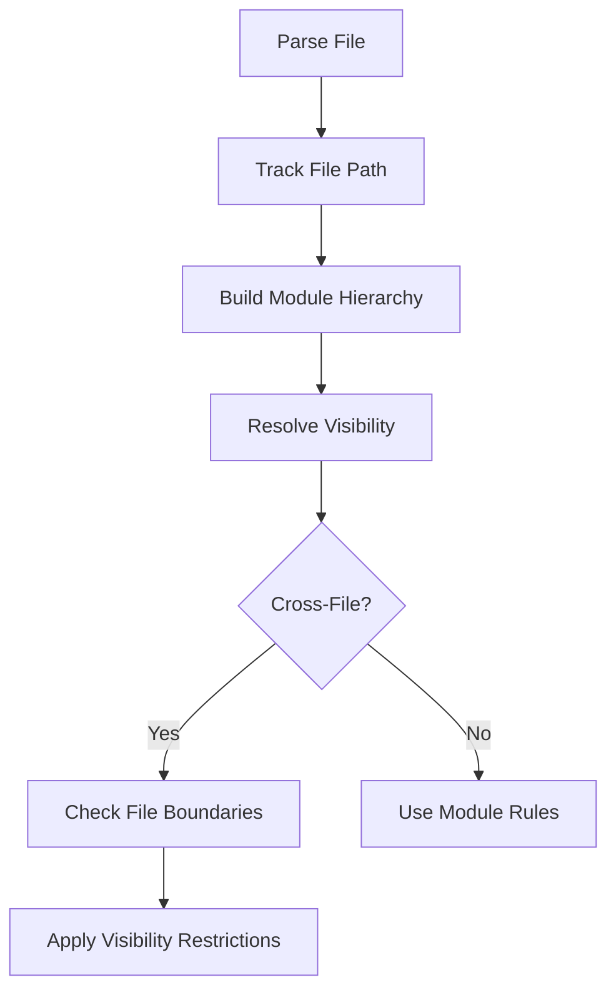

# Phase 4: File Path Tracking Implementation Plan

## Overview
This document outlines the integration of file path tracking into the existing visibility resolution system. The goal is to enable accurate cross-file visibility checks while maintaining the current module hierarchy and use statement tracking.

## Current System Analysis

### Key Components
1. **Module Tracking** (`state.rs`, `code_visitor.rs`)
   - Uses `current_module_path` stack in `VisitorState`
   - Builds module hierarchy via `Contains` relations
   ```rust
   // state.rs
   pub struct VisitorState {
       pub(crate) current_module_path: Vec<String>,
       // ...
   }
   ```

2. **Visibility Resolution** (`graph.rs`)
   - Checks `VisibilityKind` against module paths
   - Handles `pub(in path)` restrictions
   ```rust
   // graph.rs
   impl CodeGraph {
       pub fn resolve_visibility(&self, item_id: NodeId, context_module: &[String]) -> VisibilityResult
   }
   ```

3. **Use Statement Tracking** (`nodes.rs`)
   - Tracks import paths and visibility
   ```rust
   // nodes.rs
   pub struct UseStatement {
       pub path: Vec<String>,
       pub visible_name: String,
       // ...
   }
   ```

## Proposed Changes

### 1. File Origin Tracking

**Changes to `nodes.rs`:**
```rust
// Add to all node structs:
pub source_file: PathBuf  // Relative path from workspace root
```

**Changes to `state.rs`:**
```rust
pub struct VisitorState {
    pub current_file: PathBuf,
    pub file_relations: HashMap<PathBuf, Vec<NodeId>>,
    // ...
}
```

### 2. Enhanced Module System

**Changes to `code_visitor.rs`:**
```rust
fn visit_item_mod(&mut self, module: &'ast syn::ItemMod) {
    let module_node = ModuleNode {
        file_path: self.state.current_file.clone(),
        // ...
    };
}
```

### 3. Cross-File Visibility

**Changes to `graph.rs`:**
```rust
impl CodeGraph {
    pub fn resolve_visibility(
        &self,
        item_id: NodeId,
        context_file: &Path,
        context_module: &[String]
    ) -> VisibilityResult {
        // New logic:
        // 1. Check if same file
        // 2. Check crate boundaries
        // 3. Fall back to module rules
    }
}
```

## Integration Diagram



## Implementation Phases

### Phase 1: Basic File Tracking
1. Add `source_file` to all node types
2. Modify visitor to track current file
3. Update serialization formats

### Phase 2: Cross-File Resolution
1. Enhance `resolve_visibility` with file checks
2. Handle `mod.rs` and sibling files
3. Add file-based visibility tests

### Phase 3: Workspace Integration
1. Add directory traversal
2. Integrate with cargo metadata
3. Optimize multi-file parsing

## Rationale

1. **File Tracking First**:
   - Provides foundation for all other features
   - Minimal disruption to existing code
   - Enables incremental development

2. **Preserving Current System**:
   - Maintains module hierarchy benefits
   - Complements use statement tracking
   - Avoids visibility regression

3. **Performance Considerations**:
   - File metadata adds minimal memory overhead
   - Enables future optimizations (e.g., file-based caching)
   - Scales to large codebases
