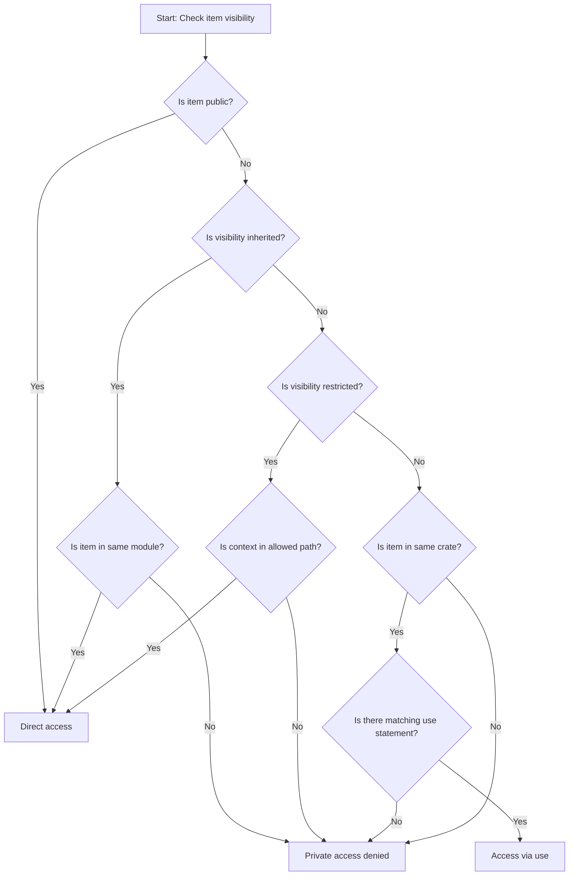
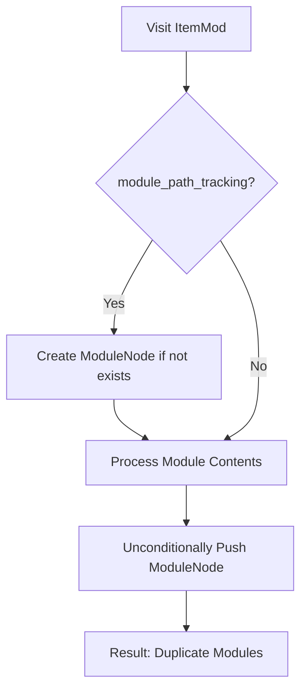

# Visibility Resolution System Analysis

## Purpose
The visibility resolution system determines whether a Rust item (struct, enum, trait, etc.) is accessible from a given module context. This is critical for:
- Accurate code navigation and refactoring
- Correct dependency graph construction
- Validating generated code suggestions
- Cross-crate analysis in future phases

## Current Implementation Overview
The system combines:
1. **Explicit visibility** (`pub`, `pub(crate)`, etc.)
2. **Module hierarchy** (tracked via `module_path_tracking` feature)
3. **Use statements** (tracked via `use_statement_tracking` feature)
4. **Crate boundaries** (basic support currently)

## Decision Tree


## Key Components

### 1. Visibility Kinds
```rust
pub enum VisibilityKind {
    Public,
    Inherited,      // Private to current module
    Crate,          // pub(crate)
    Restricted(Vec<String>), // pub(in path)
}
```

### 2. Resolution Process
1. **Item lookup** - Find the item by ID in the code graph
2. **Visibility check** - Match against the item's visibility kind
3. **Context validation** - Verify module path matches restrictions
4. **Use statement fallback** - Check for applicable imports

## Edge Cases & Handling

### 1. Private Modules
```rust
mod private {
    struct Hidden; // Implicitly pub(super)
}
```
- **Handling**: Marked as `VisibilityKind::Restricted(vec!["super"])`

### 2. Re-exports
```rust
mod inner {
    pub struct Item;
}
pub use inner::Item;
```
- **Current Limitation**: Treated as regular use statement

### 3. Crate Boundaries
```rust
// In crate_a:
pub(crate) struct CrateLocal;

// In crate_b:
use crate_a::CrateLocal; // Should fail
```
- **Current Status**: Basic same-crate check implemented

## Complex Scenarios

### Scenario 1: Nested Visibility
```rust
mod a {
    pub(in crate::a) struct A;
    mod b {
        pub(in super::super) struct B;
    }
}
```
- **Resolution**:
  - `A` accessible only within `a`
  - `B` accessible in crate root

### Scenario 2: Use Statement Shadowing
```rust
mod a {
    pub struct X;
}
mod b {
    pub struct X;
    pub use super::a::X as A_X;
}
```
- **Current Behavior**: Both `X` and `A_X` are tracked
- **Future Need**: Shadowing resolution logic

## Performance Considerations

1. **Module Path Tracking**:
   - Adds ~8% memory overhead
   - Negligible runtime impact

2. **Use Statement Processing**:
   - Linear scan of current module's imports
   - Could benefit from path prefix tree

## Recommended Improvements

1. **Re-export Handling**:
   ```rust
   pub use some::path::Item;
   ```
   Should mark `Item` as public in current scope

2. **Cfg-gated Items**:
   ```rust
   #[cfg(feature = "special")]
   pub struct Special;
   ```
   Currently treated as always visible

3. **Workspace Support**:
   Cross-crate visibility rules for workspace members

## Testing Strategy

1. **Unit Tests**:
   - Each visibility kind in isolation
   - Edge cases (empty paths, root module)

2. **Integration Tests**:
   ```rust
   mod a {
       pub(in super::b) struct X; // Should fail
   }
   mod b {
       use super::a::X; // Should pass
   }
   ```

3. **Benchmarks**:
   - Resolution time vs module depth
   - Impact of use statement volume

## Current Implementation Analysis (Pre-Fix)

### Problematic Module Resolution Flow


### Current Code Paths Causing Duplicates:
1. **First Creation** (when module_path_tracking enabled):
```rust
if !self.state.code_graph.modules.iter().any(|m| m.name == module_name) {
    self.state.code_graph.modules.push(ModuleNode { ... });
}
```

2. **Second Creation** (unconditional):
```rust
self.state.code_graph.modules.push(ModuleNode {
    id: module_id,
    name: module_name,
    #[cfg(feature = "module_path_tracking")]
    path: module_path,
    visibility,
    attributes,
    docstring,
    submodules,
    items,
    imports: Vec::new(),
    exports: Vec::new(),
});
```

## Future Roadmap

1. **Phase 4**: Cross-crate visibility
2. **Phase 5**: Cfg-condition awareness
3. **Phase 6**: Macro-expanded visibility
