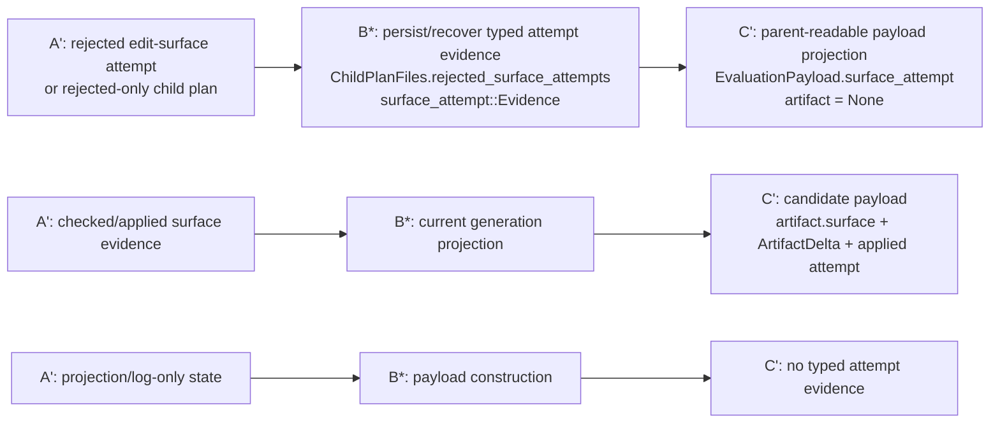

# Bounded Edit Surface Proof Index

Status: working proof index for the bounded edit-surface implementation plan.

This document records what each validation test proves, where the test lives,
why the proof is non-trivial, and how the proof maps back to the formal
surface/edit language in the plan.

If a test cannot be mapped to a formal object or judgment, treat that as a
design smell:

```text
either the formal representation is incomplete,
or the test is not proving a load-bearing property.
```

Related plan:

- [`2026-05-08-bounded-edit-harness-adapter-plan.md`](2026-05-08-bounded-edit-harness-adapter-plan.md)
- [`formal-edit-surface.md`](formal-edit-surface.md)

## Formal Reference

Core formal objects:

```text
Γ_a = (V_a, E_a, μ_a)
g = (R, W, F)
ρ_a(q) = (Q_r, Q_w)
g ⊢ q  iff  Q_r ⊆ R ∧ Q_w ⊆ W ∧ Q_w ∩ F = ∅
valid_a(q)
apply_a(q) = (a', δ)
H' = H ⋅ (a, Γ_a, g, q, ρ_a(q), δ, a')
```

Current implementation vocabulary used by these tests:

```text
history::surface_attempt::Evidence
history::surface_attempt::Outcome
EvaluationPayload.surface_attempt
SurfaceEvidence
ArtifactDelta
ChildPlanFiles.rejected_surface_attempts
ParentSelection::current_generation_candidates()
```

The first route concerns failed or rejected proposal/application attempts that
may not produce a derived Artifact:

```text
q rejected
  => no apply_a(q)
  => no a'
  => no δ
  => still record typed evidence that q was attempted/rejected
```

That rejected-attempt evidence is not the same as History admission of a
successful Artifact transition. It is parent-readable evidence used by later
diagnosis.

## Proof Flow



## Test Index

### `below_min_rejected_attempts_are_persisted_and_recoverable_from_existing_child_plan`

Location:

```text
crates/ploke-eval/src/cli/prototype1_state/cli_facing.rs:8854-8916
```

Run:

```bash
cargo test -p ploke-eval below_min_rejected_attempts_are_persisted_and_recoverable_from_existing_child_plan -- --nocapture
```

Splice:

```text
A': rejected-only / below-min child plan
B*: ChildPlanFiles persists and receive_existing_child_plan recovers attempt evidence
C': ParentSelection::current_generation_candidates projects EvaluationPayload.surface_attempt
```

Formal meaning:

```text
q rejected
  => no apply_a(q)
  => no a'
  => no δ
  => evidence(q rejected) survives persistence/recovery
  => later parent can read evidence(q rejected)
```

Why non-trivial:

- Crosses persistence, resume, and parent projection.
- Proves the rejected attempt is not only local runtime state.
- Proves no child Artifact is fabricated for a below-min failure.

Formal gap:

- The core formal model names successful admission:
  `H' = H ⋅ (a, Γ_a, g, q, ρ_a(q), δ, a')`.
- It should also name rejected-attempt evidence explicitly:

```text
H' = H ⋅ reject(a, Γ_a, g, q, ρ_a(q), reason)
```

or a similarly typed evidence event.

### `current_generation_candidates_include_edit_surface_evidence`

Location:

```text
crates/ploke-eval/src/cli/prototype1_state/cli_facing.rs:9282-9337
```

Run:

```bash
cargo test -p ploke-eval current_generation_candidates_include_edit_surface_evidence -- --nocapture
```

Splice:

```text
A': completed child outcome with checked surface evidence
B*: ParentSelection::current_generation_candidates
C': EvaluationPayload carries CandidateArtifact.surface, delta digest, and applied attempt evidence
```

Formal meaning:

```text
g ⊢ q
valid_a(q)
apply_a(q) = (a', δ)
H' includes evidence(a, Γ_a, g, q, ρ_a(q), δ, a')
```

Why non-trivial:

- Proves successful checked/apply evidence survives into the
  candidate/History-facing projection.
- Connects `SurfaceEvidence` and `ArtifactDelta` to the parent selection
  payload instead of leaving them in local edit code.

Formal gap:

- None for the positive transition path.

### `current_generation_candidates_include_rejected_edit_surface_attempt_payload`

Location:

```text
crates/ploke-eval/src/cli/prototype1_state/cli_facing.rs:9339-9388
```

Run:

```bash
cargo test -p ploke-eval current_generation_candidates_include_rejected_edit_surface_attempt_payload -- --nocapture
```

Splice:

```text
A': rejected surface attempt attached to current generation evidence
B*: ParentSelection::current_generation_candidates
C': rejected payload is parent-readable and has artifact = None
```

Formal meaning:

```text
q rejected
  => no apply_a(q)
  => artifact = None
  => evidence(q rejected) enters parent-readable payload projection
```

Why non-trivial:

- Proves rejected edit-surface attempts are visible to the parent even though
  they do not produce candidate Artifacts.
- Prevents the system from equating "no child" with "no useful evidence."

Formal gap:

- Same rejected-attempt evidence gap as above. The formal plan should name
  rejection evidence as a first-class non-transition event.

### `payload_surface_attempt_rejected_is_parent_readable_without_artifact`

Location:

```text
crates/ploke-eval/src/cli/prototype1_state/cli_facing.rs:9390-9425
```

Run:

```bash
cargo test -p ploke-eval payload_surface_attempt_rejected_is_parent_readable_without_artifact -- --nocapture
```

Splice:

```text
A': standalone rejected attempt evidence
B*: EvaluationPayload construction
C': has_parent_readable_surface_attempt() is true and artifact is absent
```

Formal meaning:

```text
evidence(q rejected) is not evidence(apply_a(q))
evidence(q rejected) does not imply ∃ a'. apply_a(q) = (a', δ)
```

Why non-trivial:

- Isolates payload semantics from runtime fanout and selection machinery.
- Proves parent-readable attempt evidence is not coupled to Artifact creation.

Formal gap:

- The formal representation should explicitly distinguish:

```text
AttemptEvidence(q, rejected)
ArtifactTransitionEvidence(a, q, a', δ)
```

### `payload_without_surface_attempt_is_not_parent_readable_attempt_evidence`

Location:

```text
crates/ploke-eval/src/cli/prototype1_state/cli_facing.rs:9428-9450
```

Run:

```bash
cargo test -p ploke-eval payload_without_surface_attempt_is_not_parent_readable_attempt_evidence -- --nocapture
```

Splice:

```text
A': payload has projection/log-like text but no typed attempt evidence
B*: EvaluationPayload construction
C': has_parent_readable_surface_attempt() is false
```

Formal meaning:

```text
projection/log/diagnostic text does not imply AttemptEvidence(q, outcome)
```

Why non-trivial:

- Guards the authority boundary.
- Prevents CLI output, logs, mutable reports, TUI-local state, or prose failure
  descriptions from becoming source truth.

Formal gap:

- The plan states this rule operationally, but the formal model should name the
  predicate:

```text
typed_attempt_evidence(e) iff e is admitted as structured attempt evidence
```

and the negative rule:

```text
projection(e) ∨ log(e) ∨ ui_state(e)
  does not imply typed_attempt_evidence(e)
```

### `tui_apply_evidence_is_all_applied_or_rejected`

Location:

```text
crates/ploke-eval/src/cli/prototype1_state/edit_surface/tests.rs:631-718
```

Run:

```bash
cargo test -p ploke-eval tui_apply_evidence_is_all_applied_or_rejected -- --nocapture
```

Splice:

```text
A': one applied write vs two applied writes after grant.check and proposal staging
B*: tui::Apply::from_results
C': full application reports applied; partial application reports rejected
```

Formal meaning:

```text
apply_a(q) is defined only for all checked writes
partial_apply(q) is not apply_a(q)
partial_apply(q) => rejected attempt evidence, not ArtifactDelta success
```

Why non-trivial:

- Distinguishes checked apply from outcome classification.
- Proves partial application is not admitted as success.
- Protects `ArtifactDelta` from being minted for incomplete writes.

Formal gap:

- The plan specifies "all-or-rejected semantics," but it should name the
  apply-outcome classification:

```text
ApplyOutcome(q) = Applied(a', δ) | Rejected(reason)
```

with:

```text
Applied(a', δ) iff apply_a(q) = (a', δ)
Rejected(reason) iff apply_a(q) is undefined or not total
```

## Current Formal Additions Needed

The tests are meaningful, but they expose that the formal notation should grow
slightly. The missing concepts are:

### Rejected Attempt Evidence

Current success-only admission notation:

```text
H' = H ⋅ (a, Γ_a, g, q, ρ_a(q), δ, a')
```

Needed rejected-attempt notation:

```text
H' = H ⋅ reject(a, Γ_a, g, q, ρ_a(q), reason)
```

or:

```text
AttemptEvidence = Applied(a', δ) | Rejected(reason)
```

with `Applied(a', δ)` linked to the successful Artifact transition and
`Rejected(reason)` explicitly not producing `a'`.

### Typed Evidence Predicate

Needed authority predicate:

```text
typed_attempt_evidence(e)
```

with:

```text
projection(e) ∨ log(e) ∨ ui_state(e)
  does not imply typed_attempt_evidence(e)
```

This is the formal counterpart of the operational rule that CLI output, logs,
mutable reports, monitor views, and TUI-local proposal state are not source
truth.

### Apply Outcome Classification

Needed outcome judgment:

```text
ApplyOutcome(q) =
  Applied(a', δ)
  | Rejected(reason)
```

with:

```text
Applied(a', δ) iff all checked writes apply and apply_a(q) = (a', δ)
Rejected(reason) iff no successful total apply exists
```

This is the formal counterpart of the all-or-rejected semantics used by the
TUI apply evidence test.

