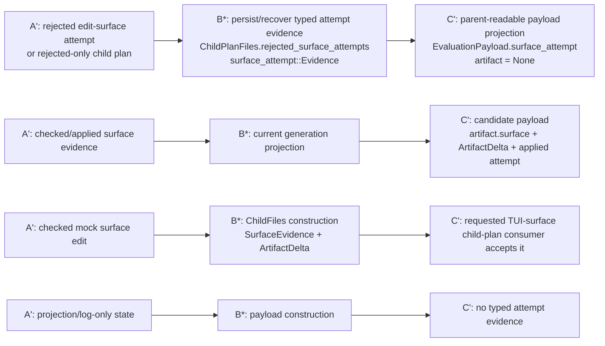

# Bounded Edit Surface Proof Index

Status: working proof index for the bounded edit-surface implementation plan.

This document records what each validation test proves, where the test lives,
why the proof is non-trivial, and how the proof maps back to the formal
surface/edit language in the plan.

If a test cannot be mapped to a formal object or judgment, treat that as a
design smell:

```text
either the formal representation is incomplete,
or the test is not proving a load-bearing property.
```

Related plan:

- [`harness-adapter-plan.md`](harness-adapter-plan.md)
- [`formal/edit-surface.md`](../formal/edit-surface.md)

## Formal Reference

Core formal objects:

```text
Γ_a = (V_a, E_a, μ_a)
g = (R, W, F)
ρ_a(q) = (Q_r, Q_w)
g ⊢ q  iff  Q_r ⊆ R ∧ Q_w ⊆ W ∧ Q_w ∩ F = ∅
valid_a(q)
apply_a(q) = (a', δ)
H' = H ⋅ (a, Γ_a, g, q, ρ_a(q), δ, a')
```

Observation/admission objects:

```text
event e
observation obs = observe(observer, e)
record rec = record(writer, obs)
evidence ev = admit_D(rec)
d ∈ inputs(D) iff admit_D(rec) = Some(ev)
```

where `D` is a decision domain such as `Diagnosis`, `Selection`,
`SurfaceCheck`, `HistoryAdmission`, or `OperatorProjection`.

A record can exist without being admissible evidence for a decision:

```text
record(rec) does not imply admissible_D(rec)

projection(rec) ∨ log(rec) ∨ ui_state(rec)
  does not imply admissible_D(rec)
```

unless an explicit admission rule for `D` says otherwise.

Surface-attempt admission:

```text
AttemptOutcome_a(q) =
    Applied(a', δ)
  | Rejected(reason)

H' = H ⋅ Attempt(a, Γ_a, g, q, ρ_a(q), AttemptOutcome_a(q))
```

The success-only notation
`H' = H ⋅ (a, Γ_a, g, q, ρ_a(q), δ, a')` is the `Applied(a', δ)`
case. `Rejected(reason)` produces no `a'` and no `δ`, but may still be
admitted as `AdmissibleEvidence<Diagnosis>`.

Current implementation vocabulary used by these tests:

```text
EditObjective
ProtectedCore
EditableSurface
surface::Grant
surface::Error::Forbidden
history::surface_attempt::Evidence
history::surface_attempt::Outcome
EvaluationPayload.surface_attempt
SurfaceEvidence
ArtifactDelta
ChildPlanFiles.rejected_surface_attempts
ParentSelection::current_generation_candidates()
```

The first route concerns failed or rejected proposal/application attempts that
may not produce a derived Artifact:

```text
q rejected
  => no apply_a(q)
  => no a'
  => no δ
  => H admits Attempt(..., Rejected(reason)) for the relevant decision domain
```

That rejected-attempt evidence is not the same as History admission of a
successful Artifact transition. It is parent-readable evidence used by later
diagnosis.

## Proof Flow



Partially covered request-policy receipt splice:

```text
A': parent artifact + router config + EditObjective
B*: Router-backed harness request construction
C': complete EffectiveRequestPolicyReceipt with stable client_policy_hash
```

For the current live 7.5.1 slice, `PayloadHash::Unknown` is admissible only
when the client explicitly sets it as the evidence state with a reason. It is
not a claim that complete replay receipt coverage exists.

Negative counterpart not yet fully covered:

```text
A': proposal from a material model call with no receipt or incomplete policy
B*: proposal admission
C': rejected before SurfaceCheck / candidate admission
```

Covered bounded generator-surface provenance splice:

```text
A': parent Artifact contains generator surface version T_a and EditObjective
B*: harness/proposal construction uses T_a
C': proposal provenance cites T_a as the used GeneratorSurface
```

Later descendant-fitness analysis, tracked separately, should consume the
provenance chain:

```text
ArtifactDelta δ modifies GeneratorSurface T
  -> later proposal cites modified T'
  -> descendant evaluation score changes
```

## Test Index

The current broad-surface tests prove local primitive behavior after their
inputs are already constructed. They should not be read as a completed `7.3`
route proof. The missing upstream splice is:

```text
A': real parent-time History/context evidence + graph projection +
    protected-core policy
B*: parent-side route/admission constructor
C': EditObjective + EditableSurface with evidence refs and broad Grant
```

Until that exists, the tests below prove only the local surface/admission layer:

```text
explicit EditObjective + explicit ProtectedCore + explicit Γ_a
  -> EditableSurface::broad
  -> Grant::check
```

### Broad Route Transition Proof Map

The first broad protected-core route should be tested as a chain of transition
proofs, not as one vague route test:

```text
T1 EvidenceAdmitted:
  A': replay-shaped History/context evidence
  B*: parent evidence/context admission
  C': admitted context refs usable by EditObjective construction

T2 ObjectiveConstructed:
  A': admitted context refs + broad ruling policy
  B*: EditObjective construction
  C': intent, evidence refs, constraints, and success criteria are recorded

T3 SurfaceBounded:
  A': EditObjective + graph projection Γ_a + ProtectedCore F
  B*: EditableSurface::broad / Grant construction
  C': W = Γ_a \ F and F is preserved for checks

T4 ProposalChecked:
  A': SurfaceGrant + proposed touches Q_r/Q_w
  B*: SurfaceCheck / Grant::check / checked proposal admission
  C': allowed writes pass and forbidden writes fail

T5 CandidateProduced:
  A': checked proposal + target Artifact
  B*: checked apply / ArtifactDelta construction
  C': candidate Artifact evidence is accepted downstream

T6 OutcomeSelectable:
  A': evaluated child candidate with candidate/proposal/surface evidence
  B*: parent selection evidence fold
  C': History-backed selection can compare and preserve provenance
```

Current coverage after 7.3 plus the 7.4 request carrier and narrow 7.5 splice:

```text
T2: local coverage from synthetic context refs.
T3: local coverage from explicit Γ_a and explicit F.
T4: local coverage for Grant::check on hand-built Draft touches.
T2/T3 route carrier: local coverage from SurfaceRequest into EditableSurface.
T5: local coverage for checked edit -> ArtifactDelta/SurfaceEvidence -> requested TUI-surface child-plan consumer acceptance.

T1: missing.
T2/T3 from replay-shaped History records or ploke-tui proposal/event receipts:
  missing.
T5 request-policy receipt, generator provenance, and live TUI adapter:
  missing.
T6: later slice.
```

That is enough for the local 7.3 primitive, but not enough for the full
parent-input route or live generation. Slice 7.4 is locally covered, the narrow
7.5 child-plan consumer splice is locally covered, and the bounded 7.5.2
generator-surface provenance splice is covered for deterministic/non-router
proposal evidence. Open work remains: the live Router-backed request-policy
receipt splice, live ploke-tui adapter execution, and T6 selection/outcome
selectability.

```text
A': replay-shaped parent-time evidence + graph projection + protected-core policy
B*: route/admission constructor
C': EditObjective + EditableSurface with evidence refs and broad Grant
```

### `replay_shaped_rejected_surface_attempt_admits_semantic_edit_surface_request`

Location:

```text
crates/ploke-eval/src/cli/prototype1_state/edit_surface/tests.rs:230
```

Run:

```bash
cargo test -p ploke-eval replay_shaped_rejected_surface_attempt_admits_semantic_edit_surface_request -- --nocapture
```

Local splice:

```text
A': replay-shaped rejected History surface-attempt evidence + graph projection +
    protected-core policy
B*: Diagnosis -> EditObjective -> SurfaceRequest route/admission constructor
C': EditObjective + EditableSurface with evidence refs and broad Grant;
    ordinary write passes and protected-core write fails
```

Formal meaning:

```text
admissible_D(EvaluationPayload.surface_attempt) -> Diagnosis
Diagnosis + Γ_a + F -> EditObjective + SurfaceRequest
SurfaceRequest.admit() -> EditableSurface
Q_w ⊆ W ∧ Q_w ∩ F = ∅ -> accepted
Q_w ∩ F ≠ ∅ -> rejected
```

Why non-trivial:

- Proves the parent-time route now starts from replay-shaped typed evidence
  instead of synthetic route-only refs.
- Keeps `Diagnosis` classifier-only while the route helper owns objective and
  request construction.
- Preserves evidence refs and machine-readable objective fields across the
  request boundary.

Residual gap:

- Backend/TUI proposal-touch extraction into `surface::Touch`/`Grant::check`
  is now covered locally; request-policy receipts and generator provenance
  remain future splices.

### `checked_edit_surface_candidate_is_accepted_by_tui_child_plan_consumer`

Location:

```text
crates/ploke-eval/src/cli/prototype1_state/cli_facing.rs:8457
```

Run:

```bash
cargo test -p ploke-eval checked_edit_surface_candidate_is_accepted_by_tui_child_plan_consumer -- --nocapture
```

Local splice:

```text
A': EditProposal checked by the bounded edit surface authority boundary
B*: CheckedSurfaceEdit::surface_evidence(...)
    + child_files_from_checked_edit(...)
C': validate_requested_tui_surface_child accepts ChildFiles with
    SurfaceEvidence and ArtifactDelta bound to the requested target
```

Formal meaning:

```text
g ⊢ q
valid_a(q)
apply_a(q) = (a', δ)
child_files(a', δ, evidence(a, Γ_a, g, q, ρ_a(q))) accepted by requested
TUI-surface child-plan consumer
```

Why non-trivial:

- Proves the narrow 7.5 downstream splice from checked edit evidence into
  child-plan consumer acceptance.
- Keeps the proof at the authority/consumer boundary without claiming live
  ploke-tui generation.
- Binds `ArtifactDelta` and `SurfaceEvidence` before the requested TUI child
  path accepts the candidate.

Residual gap:

- Does not prove live Router-backed request construction, live TUI adapter
  execution, or T6 selection/outcome selectability.

### `request_policy_receipt_hash_is_stable_for_equivalent_effective_provider_policy`

Location:

```text
crates/ploke-eval/src/cli/prototype1_state/edit_surface/request_policy.rs
```

Run:

```bash
cargo test -p ploke-eval request_policy_receipt_hash -- --nocapture
```

Local splice:

```text
A': equivalent effective Router/provider policy preimages
B*: EffectiveRequestPolicyReceipt canonical hash construction
C': same client_policy_hash
```

Why non-trivial:

- Proves the request-policy receipt hash is over the stable effective client
  policy, not over arbitrary response metadata or unordered provider fields.
- Establishes the local carrier needed before live Router-backed proposal
  admission can require receipts.

Residual gap:

- Does not prove a live proposal-producing Router request is built or that a
  Router-backed proposal reaches admission with the receipt attached.

### `request_policy_receipt_hash_changes_when_effective_policy_changes`

Location:

```text
crates/ploke-eval/src/cli/prototype1_state/edit_surface/request_policy.rs
```

Run:

```bash
cargo test -p ploke-eval request_policy_receipt_hash -- --nocapture
```

Local splice:

```text
A': effective Router/provider policy preimages that differ in one material
    client-policy field
B*: EffectiveRequestPolicyReceipt canonical hash construction
C': different client_policy_hash
```

Why non-trivial:

- Proves material client-policy changes are visible to the receipt hash.
- Keeps 7.5.1 honest as a policy-reconstruction carrier rather than a
  presence-only receipt flag.

### `edit_surface_bridge_rejects_mutated_generator_surface_provenance`

Location:

```text
crates/ploke-eval/src/cli/prototype1_state/backend.rs
```

Run:

```bash
cargo test -p ploke-eval edit_surface_bridge_rejects_mutated_generator_surface_provenance -- --nocapture
```

Local splice:

```text
A': EditProposal with forged/mutated generator_surface provenance
B*: GitWorktreeBackend::validate_edit_surface_candidate
C': rejected before CheckedSurfaceEdit / ArtifactDelta admission
```

Why non-trivial:

- Proves backend admission recomputes/checks generator-surface provenance
  instead of trusting proposal-provided metadata.
- Closes the backend-side negative for the bounded 7.5.2 provenance splice.

### `requested_tui_surface_child_rejects_router_backed_proposal_producer`

Location:

```text
crates/ploke-eval/src/cli/prototype1_state/cli_facing.rs
```

Run:

```bash
cargo test -p ploke-eval requested_tui_surface_child_rejects_router_backed_proposal_producer -- --nocapture
```

Local splice:

```text
A': requested deterministic/non-router TUI-surface child evidence cites a
    Router-backed proposal producer
B*: requested TUI child-plan validation
C': rejected before deterministic child acceptance
```

Why non-trivial:

- Proves the deterministic/non-router path cannot silently accept
  Router-backed provenance.
- Keeps 7.5.1 partial: Router-backed proposal evidence needs its own live
  receipt/admission splice instead of being smuggled through deterministic
  fixtures.

### `surface_request_admits_parent_context_into_broad_surface`

Location:

```text
crates/ploke-eval/src/cli/prototype1_state/edit_surface/tests.rs:212
```

Run:

```bash
cargo test -p ploke-eval surface_request_admits_parent_context_into_broad_surface -- --nocapture
```

Local splice:

```text
A': synthetic parent evidence/context refs + explicit graph bounds Γ_a +
    explicit ProtectedCore F
B*: SurfaceRequest::broad(...).admit()
C': EditObjective + EditableSurface with broad Grant; ordinary write passes
    and protected-core write fails
```

Formal meaning:

```text
admitted_context_refs -> EditObjective
EditObjective + Γ_a + F -> g = (R, W, F)
Q_w ⊆ W ∧ Q_w ∩ F = ∅ -> accepted
Q_w ∩ F ≠ ∅ -> rejected
```

Why non-trivial:

- Adds an eval-owned route/admission carrier above the executor boundary.
- Keeps `Harness` out of authority decisions while making parent context flow
  into the existing surface primitive.
- Gives later `ploke-tui` proposal/event evidence a stable place to enter
  before `SurfaceCheck`.

Residual gap:

- The parent evidence refs are still synthetic in the local parent-context
  slice. This does not yet prove extraction from real History records,
  ploke-tui proposal events, or backend `ProposedTouch` receipts.

### `broad_surface_admits_writable_touch_outside_protected_core`

Location:

```text
crates/ploke-eval/src/cli/prototype1_state/edit_surface/tests.rs:73
```

Run:

```bash
cargo test -p ploke-eval broad_surface_admits_writable_touch_outside_protected_core -- --nocapture
```

Local splice:

```text
A': explicit graph bounds Γ_a and explicit ProtectedCore F over one span
B*: EditableSurface::broad builds Grant with W = Γ_a \ F
C': Grant::check admits a Draft whose Q_w is outside F
```

Formal meaning:

```text
Q_w ⊆ W
Q_w ∩ F = ∅
g ⊢ q
```

Why non-trivial:

- Proves the broad-parent route is permissive outside the protected core.
- Prevents the broad surface from silently becoming a narrow route table.

Residual gap:

- This is a local surface/admission proof. It does not yet prove construction
  from live History context or a real `ploke-tui` proposal.

### `broad_surface_rejects_touch_inside_protected_core`

Location:

```text
crates/ploke-eval/src/cli/prototype1_state/edit_surface/tests.rs:122
```

Run:

```bash
cargo test -p ploke-eval broad_surface_rejects_touch_inside_protected_core -- --nocapture
```

Local splice:

```text
A': explicit graph bounds Γ_a and explicit ProtectedCore F over one span
B*: EditableSurface::broad builds Grant with F preserved
C': Grant::check rejects a Draft whose Q_w intersects F
```

Formal meaning:

```text
Q_w ∩ F ≠ ∅
g ⊬ q
```

Why non-trivial:

- Proves natural-language protected-core instructions are backed by checked
  surface authority rather than harness convention.
- Establishes the first code-level guard for preserving `Φ` while allowing
  broad changes to `Ω`.

Residual gap:

- `ProtectedCore` is still passed as explicit spans. Later slices must derive
  it from Crown/History/spawn/oracle/capability surfaces.

### `broad_surface_objective_records_context_without_diagnosis_specificity`

Location:

```text
crates/ploke-eval/src/cli/prototype1_state/edit_surface/tests.rs:165
```

Run:

```bash
cargo test -p ploke-eval broad_surface_objective_records_context_without_diagnosis_specificity -- --nocapture
```

Local splice:

```text
A': synthetic context/evidence refs without a narrow semantic-resolution Diagnosis
B*: EditObjective records broad intent, machine-readable spec fields, and context refs
C': EditableSurface carries objective alongside broad Grant
```

Formal meaning:

```text
Diagnosis is context, not write authority.
EditObjective may be constructed from admitted context refs without forcing a
narrow failure-to-surface route.
```

Why non-trivial:

- Aligns 7.3 with the broad ruling-parent direction instead of the older
  `Diagnosis -> one narrow SurfaceChoice` route.
- Preserves attribution hooks for what evidence/context justified the broad
  editable surface.

Residual gap:

- This does not yet record an `ObservationTrace` or prove progressive
  disclosure from real parent-time History records, so real History/TUI
  proposal extraction remains future work.

### `below_min_rejected_attempts_are_persisted_and_recoverable_from_existing_child_plan`

Location:

```text
crates/ploke-eval/src/cli/prototype1_state/cli_facing.rs:8854-8916
```

Run:

```bash
cargo test -p ploke-eval below_min_rejected_attempts_are_persisted_and_recoverable_from_existing_child_plan -- --nocapture
```

Splice:

```text
A': rejected-only / below-min child plan
B*: ChildPlanFiles persists and receive_existing_child_plan recovers attempt evidence
C': ParentSelection::current_generation_candidates projects EvaluationPayload.surface_attempt
```

Formal meaning:

```text
q rejected
  => no apply_a(q)
  => no a'
  => no δ
  => Attempt(..., Rejected(reason)) survives persistence/recovery
  => admit_Diagnosis(record) = Some(surface_attempt::Evidence)
```

Why non-trivial:

- Crosses persistence, resume, and parent projection.
- Proves the rejected attempt is not only local runtime state.
- Proves no child Artifact is fabricated for a below-min failure.

Formal gap:

- The core formal model now names rejected-attempt admission with
  `AttemptOutcome_a(q)`.
- The remaining gap is to make the code's admission rule explicit:

```text
admit_Diagnosis(record) = Some(surface_attempt::Evidence)
```

only for records from the authorized evaluation/payload path.

### `current_generation_candidates_include_edit_surface_evidence`

Location:

```text
crates/ploke-eval/src/cli/prototype1_state/cli_facing.rs:9282-9337
```

Run:

```bash
cargo test -p ploke-eval current_generation_candidates_include_edit_surface_evidence -- --nocapture
```

Splice:

```text
A': completed child outcome with checked surface evidence
B*: ParentSelection::current_generation_candidates
C': EvaluationPayload carries CandidateArtifact.surface, delta digest, and applied attempt evidence
```

Formal meaning:

```text
g ⊢ q
valid_a(q)
apply_a(q) = (a', δ)
H' includes evidence(a, Γ_a, g, q, ρ_a(q), δ, a')
```

Why non-trivial:

- Proves successful checked/apply evidence survives into the
  candidate/History-facing projection.
- Connects `SurfaceEvidence` and `ArtifactDelta` to the parent selection
  payload instead of leaving them in local edit code.

Formal gap:

- None for the positive transition path.

### `current_generation_candidates_include_rejected_edit_surface_attempt_payload`

Location:

```text
crates/ploke-eval/src/cli/prototype1_state/cli_facing.rs:9339-9388
```

Run:

```bash
cargo test -p ploke-eval current_generation_candidates_include_rejected_edit_surface_attempt_payload -- --nocapture
```

Splice:

```text
A': rejected surface attempt attached to current generation evidence
B*: ParentSelection::current_generation_candidates
C': rejected payload is parent-readable and has artifact = None
```

Formal meaning:

```text
q rejected
  => no apply_a(q)
  => artifact = None
  => Attempt(..., Rejected(reason)) enters parent-readable payload projection
  => admitted as Diagnosis input
```

Why non-trivial:

- Proves rejected edit-surface attempts are visible to the parent even though
  they do not produce candidate Artifacts.
- Prevents the system from equating "no child" with "no useful evidence."

Formal gap:

- Same admission-rule gap as above. The formal plan now names the rejected
  attempt event; implementation still needs explicit admission rules as more
  decision domains consume records.

### `payload_surface_attempt_rejected_is_parent_readable_without_artifact`

Location:

```text
crates/ploke-eval/src/cli/prototype1_state/cli_facing.rs:9390-9425
```

Run:

```bash
cargo test -p ploke-eval payload_surface_attempt_rejected_is_parent_readable_without_artifact -- --nocapture
```

Splice:

```text
A': standalone rejected attempt evidence
B*: EvaluationPayload construction
C': has_parent_readable_surface_attempt() is true and artifact is absent
```

Formal meaning:

```text
Attempt(..., Rejected(reason)) is not Attempt(..., Applied(a', δ))
Attempt(..., Rejected(reason)) does not imply ∃ a'. apply_a(q) = (a', δ)
```

Why non-trivial:

- Isolates payload semantics from runtime fanout and selection machinery.
- Proves parent-readable attempt evidence is not coupled to Artifact creation.

Formal gap:

- The formal representation now explicitly distinguishes:

```text
AttemptOutcome_a(q) = Applied(a', δ) | Rejected(reason)
```

The implementation still needs to preserve that distinction as more consumers
start reading the evidence.

### `payload_without_surface_attempt_is_not_parent_readable_attempt_evidence`

Location:

```text
crates/ploke-eval/src/cli/prototype1_state/cli_facing.rs:9428-9450
```

Run:

```bash
cargo test -p ploke-eval payload_without_surface_attempt_is_not_parent_readable_attempt_evidence -- --nocapture
```

Splice:

```text
A': payload has projection/log-like text but no typed attempt evidence
B*: EvaluationPayload construction
C': has_parent_readable_surface_attempt() is false
```

Formal meaning:

```text
projection/log/diagnostic text does not imply admissible_Diagnosis(record)
```

Why non-trivial:

- Guards the authority boundary.
- Prevents CLI output, logs, mutable reports, TUI-local state, or prose failure
  descriptions from becoming source truth.

Formal gap:

- The observation/admission model now names the predicate:

```text
admissible_D(record)
```

and the negative rule:

```text
projection(rec) ∨ log(rec) ∨ ui_state(rec)
  does not imply admissible_Diagnosis(rec)
```

### `classify_rejected_surface_attempt_without_artifact_as_semantic_edit_resolution`

Location:

```text
crates/ploke-eval/src/cli/prototype1_state/edit_surface/diagnosis.rs
```

Run:

```bash
cargo test -p ploke-eval classify_rejected_surface_attempt_without_artifact_as_semantic_edit_resolution -- --nocapture
```

Splice:

```text
A': payload with typed surface_attempt::Evidence::Rejected and artifact = None
B*: edit_surface::diagnosis::classify(&EvaluationPayload)
C': Diagnosis { limiter = invalid_candidate_generation, failure_kind = semantic_edit_resolution }
```

### `payload_without_surface_attempt_is_not_semantic_edit_resolution_diagnosis`

Location:

```text
crates/ploke-eval/src/cli/prototype1_state/edit_surface/diagnosis.rs
```

Run:

```bash
cargo test -p ploke-eval payload_without_surface_attempt_is_not_semantic_edit_resolution_diagnosis -- --nocapture
```

Splice:

```text
A': projection/log-like payload detail without typed surface_attempt evidence
B*: edit_surface::diagnosis::classify(&EvaluationPayload)
C': no semantic_edit_resolution diagnosis
```

### `tui_apply_evidence_is_all_applied_or_rejected`

Location:

```text
crates/ploke-eval/src/cli/prototype1_state/edit_surface/tests.rs:631-718
```

Run:

```bash
cargo test -p ploke-eval tui_apply_evidence_is_all_applied_or_rejected -- --nocapture
```

Splice:

```text
A': one applied write vs two applied writes after grant.check and proposal staging
B*: tui::Apply::from_results
C': full application reports applied; partial application reports rejected
```

Formal meaning:

```text
apply_a(q) is defined only for all checked writes
partial_apply(q) is not apply_a(q)
partial_apply(q) => rejected attempt evidence, not ArtifactDelta success
```

Why non-trivial:

- Distinguishes checked apply from outcome classification.
- Proves partial application is not admitted as success.
- Protects `ArtifactDelta` from being minted for incomplete writes.

Formal gap:

- The plan specifies "all-or-rejected semantics," but it should name the
  apply-outcome classification:

```text
ApplyOutcome(q) = Applied(a', δ) | Rejected(reason)
```

with:

```text
Applied(a', δ) iff apply_a(q) = (a', δ)
Rejected(reason) iff apply_a(q) is undefined or not total
```

### `real_tui_resolver_touch_is_checked_before_adapter_apply`

Location:

```text
crates/ploke-eval/src/cli/prototype1_state/edit_surface/tests.rs
```

Run:

```bash
cargo test -p ploke-eval real_tui_resolver_touch_is_checked_before_adapter_apply -- --nocapture
```

Local splice:

```text
A': independent fixture authority + canonical ApplyCodeEditRequest
B*: real ploke-tui resolver output lowers to per-write MaterialSpan / Touch
C': eval Grant::check gates checked ArtifactDelta evidence
```

Formal meaning:

```text
Γ_a, g, and valid_a authority are established independently of resolver output
ρ_a(q) = (Q_r, Q_w) is derived from real resolver evidence
g ⊢ q ∧ valid_a(q) is required before apply_a(q) = (a', δ)
```

Why non-trivial:

- Uses real `ploke-tui` semantic resolution, not a mock resolver.
- Checks resolver output against independently constructed fixture authority
  rather than letting the resolver define the authority it must satisfy.
- Preserves plural write structure by requiring one target binding per write.

Residual gap:

- This proves the resolver/check/apply seam, not a live model-generated
  proposal.

### `live_tui_router_staged_proposal_lowers_to_checked_artifact_delta`

Location:

```text
crates/ploke-eval/src/cli/prototype1_state/edit_surface/tests.rs
```

Run:

```bash
cargo test -p ploke-eval live_tui_router_staged_proposal_lowers_to_checked_artifact_delta -- --nocapture
PLOKE_RUN_LIVE_TESTS=1 cargo test -p ploke-eval live_tui_router_staged_proposal_lowers_to_checked_artifact_delta -- --nocapture
```

Live gate:

```text
feature: live_api_tests
credential lookup: ploke_tui::test_harness::openrouter_env()
strict mode: PLOKE_RUN_LIVE_TESTS=1 requires credentials
model/provider: x-ai/grok-4-fast / xai
```

Local splice:

```text
A': live ploke-tui TestRuntime + bounded fixture objective
B*: live OpenRouter/ploke-tui model-tool loop stages apply_code_edit proposal
C': staged WriteSnippetData lowers into eval touches; Grant::check gates
    checked ArtifactDelta evidence
```

Formal meaning:

```text
event e = live model/tool proposal generation
record rec = staged TUI proposal/write evidence
ρ_a(q) = (Q_r, Q_w) from staged WriteSnippetData
g ⊢ q ∧ valid_a(q) is required before apply_a(q) = (a', δ)
```

Why non-trivial:

- Proves the first live 7.6 adapter path: real Router call, real TUI tool loop,
  staged semantic edit proposal, eval-owned check, then checked delta evidence.
- Keeps TUI proposal state as evidence. `ploke-eval` still owns
  authorization through `Grant::check`.
- Confirms the preferred direction: live path first, then harden replay
  receipts against that actual path.

Residual gap:

- The test records only partial/current client-policy receipt evidence. It does
  not prove complete 7.5.1 outbound request, tool schema, provider route, or
  replay receipt coverage. Explicit `Unknown` payload hashes remain a deliberate
  client-side evidence state, not a complete replay claim.

## Current Formal Additions Needed

The tests are meaningful, but they expose that the formal notation should grow
slightly. The missing concepts are:

### Rejected Attempt Evidence

Current success-only admission notation:

```text
H' = H ⋅ (a, Γ_a, g, q, ρ_a(q), δ, a')
```

Needed rejected-attempt notation:

```text
AttemptOutcome_a(q) =
    Applied(a', δ)
  | Rejected(reason)

H' = H ⋅ Attempt(a, Γ_a, g, q, ρ_a(q), AttemptOutcome_a(q))
```

with `Applied(a', δ)` linked to the successful Artifact transition and
`Rejected(reason)` explicitly not producing `a'`.

### Observation And Admission

Needed authority chain:

```text
event e
observation obs = observe(observer, e)
record rec = record(writer, obs)
evidence ev = admit_D(rec)
d ∈ inputs(D) iff admit_D(rec) = Some(ev)
```

Decision domains include:

```text
Diagnosis
Selection
SurfaceCheck
HistoryAdmission
OperatorProjection
```

The authority predicate is decision-relative:

```text
admissible_D(rec)
```

with:

```text
projection(rec) ∨ log(rec) ∨ ui_state(rec)
  does not imply admissible_D(rec)
```

This is the formal counterpart of the operational rule that CLI output, logs,
mutable reports, monitor views, and TUI-local proposal state may be records,
but they are not automatically source truth for diagnosis, selection, or
checked apply.

### Apply Outcome Classification

Needed outcome judgment:

```text
ApplyOutcome(q) =
  Applied(a', δ)
  | Rejected(reason)
```

with:

```text
Applied(a', δ) iff all checked writes apply and apply_a(q) = (a', δ)
Rejected(reason) iff no successful total apply exists
```

This is the formal counterpart of the all-or-rejected semantics used by the
TUI apply evidence test.

### Effective Request Policy Receipt

Needed Router/proposal provenance judgment:

```text
AdmitProposal(q) =>
  ∀ call ∈ material_model_calls(q).
    ∃ receipt(call).
      complete_effective_policy(receipt)
```

`complete_effective_policy(receipt)` means the receipt reconstructs the
client-side policy used to build the request, including explicit/defaulted
parameter values, config source digests, prompt/schema/tool digests,
retry/fallback policy, request/response payload digests, and available external
provider receipt metadata.

The proof target is not deterministic model output. The proof target is:

```text
same parent code + same admitted inputs + same client-side request policy
```

External provider nondeterminism is allowed, but it must be represented as
external receipt metadata or explicit `unknown`, not silently dropped.
