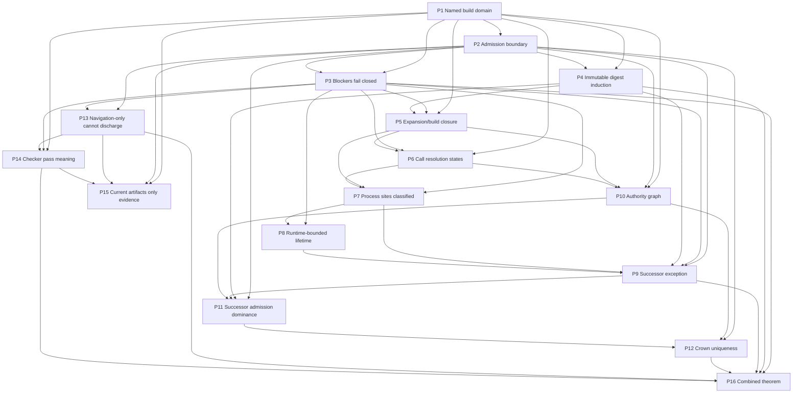

# Detached Process And Crown Formal Draft

Status: integrated formal draft, not yet discharged proof
Date: 2026-06-19
Depends on:
- `detached-process-callgraph-proof-target.md`
- `callgraph-implementation-design-for-detached-process-proof.md`
- `detached-process-crown-symbolic-invariant-outline.md`
- `detached-process-crown-proposition-sequence.md`
- `macro-buildrs-callgraph-sequencing-survey.md`
- `rustc-macro-expansion-backend-plan.md`
- `../../src/prototype1/invariant-ledger.md`
- `../../../../active/agents/2026-06-19_detached-process-crown-proof-spine/traceability.md`
- `../../../../active/agents/2026-06-19_detached-process-crown-proof-spine/formal-style-and-proof-context.md`

## Purpose

This draft integrates the proof-target survey, symbolic invariant outline, ordered proposition sequence, dependency graph, proof sketches, and adversarial gap analysis for the Ploke-loop detached-process and Crown-authority proof track.

It is deliberately self-contained enough to be read as the current formal statement of the proof spine. It is not a proof artifact and it is not a claim that the present repository already proves the theorem. The intended use is to guide implementation and review without losing the distinction between construction facts, admission rules, empirical evidence, and open obligations.

The strongest rule in this draft is negative:

```text
record(rec) does not imply admissible_D(rec)
projection(rec) ∨ log(rec) ∨ ui_state(rec) ∨ child_self_report(rec)
  does not imply admissible_D(rec)
```

Operator visibility, GraphRAG retrieval, fixture tests, run logs, and child self-reports may be useful evidence. They do not become proof authority unless a decision-domain admission rule converts them into admitted evidence for the relevant domain.

## Claim boundary

Use these labels throughout this draft:

```text
Construction fact CF:
  A fact emitted by an admitted construction step over a named input state.

Admissibility assumption AA:
  A trusted boundary or admission rule that lets a record count as evidence for a decision domain.

Empirical/evaluative claim EV:
  A test result, observed run result, repository survey count, model judgment, or human review.
```

A construction-backed claim is valid only relative to the named construction step, input artifact, build domain, policy version, checker version, evidence records, and History/Crown state. A claim can be "proved by construction" in this draft only when the construction mechanism and admission rule are themselves inside the named BuildDomain and proof policy.

Current repository artifacts are therefore classified as follows:

```text
DTO vocabulary                         = construction support, not proof
Fixture-level checker tests            = empirical/evaluative regression evidence
Fail-closed local checker code paths    = local construction facts only for the exact code/build domain
Traceability matrices and design docs   = review evidence and implementation routing
Full combined theorem                   = not yet proved
```

The proposition sequence below retains the earlier status labels, but this integrated draft treats `proved by construction` as a target interpretation unless the corresponding admission machinery has been formalized and checked. In particular, the admission-boundary propositions P2 and P13 are construction-shaped, but still have open formal obligations around `admit_D` and `EvidenceUse`.

## Universes and symbolic state

Let:

```text
A   = Artifacts
B   = BuildDomains
Γ   = normalized source/effect/lifetime/authority graphs
H   = sealed lineage-local History
L   = lineage identifiers
R   = Runtime instances
P   = operating-system process families
K   = Crown authority states
E   = evidence records
O   = proof obligations
X   = proof blockers
D   = decision domains
```

A Ploke-loop symbolic state is:

```text
S_n = (
  a_n,        // active Artifact
  b_n,        // named BuildDomain admitted for this transition
  Γ_n,        // normalized proof graph for b_n
  h_n,        // sealed History head for lineage L
  k_n,        // Crown state for lineage L
  r_n,        // active Runtime set
  p_n,        // process-family ownership/lifetime facts
  e_n,        // admitted evidence set
  o_n,        // open proof obligations
  x_n         // visible proof blockers
)
```

Interpretation:

- `a_n` is the material surface that can hydrate a Runtime.
- `b_n` is the build/proof boundary. A construction-backed claim without a named `b_n` is not meaningful.
- `Γ_n` is not just a caller/callee graph. It contains source, expansion, call, effect, lifetime, authority, and durable-evidence facts.
- `h_n` and `k_n` are the authority surfaces. Scheduler rows, reports, registries, logs, UI state, and GraphRAG indexes are projections unless admitted by an explicit `D`.
- `x_n` is part of the state. Unknown dangerous facts are blockers, not absences.

The relevant artifact carriers are:

```text
Artifact a = (Immutable, Mutated, Ambient, identity, surface_digest)
BuildDomain b = (
  cargo_metadata_hash,
  cargo_lock_hash,
  package_target,
  features,
  cfg_set,
  target_triple,
  host_triple,
  profile,
  rustc_identity,
  environment_policy,
  proof_policy_version,
  immutable_surface_digest,
  build_script_set,
  proc_macro_set,
  dependency_summary_ids
)
```

The current Prototype 1 surface partition is evidence for the intended induction shape, not the final universal partition:

```text
Immutable = crates/ploke-eval
Mutated   = all tool-description text files
Ambient   = empty declared surface
```

## Observation, evidence, and admission

The observation chain is:

```text
event q
observer o
observation obs = observe(o, q)
record rec = record(writer, obs)
evidence ev = admit_D(rec)
decision input d ∈ inputs(D) iff admit_D(rec) = Some(ev)
```

For this proof track, the principal decision domains are:

```text
BuildAdmission
ProofArtifactAdmission
HistoryAdmission
SuccessorAdmission
CrownTransition
OperatorProjection
```

Only the first five can feed the symbolic invariant. `OperatorProjection` can explain or inspect state, but it cannot grant authority or discharge a proof obligation by itself.

Evidence-producing steps create records that may become inputs to a decision domain only through `admit_D`:

```text
E1. write_build_domain_record(b) -> rec_b
E2. write_expansion_boundary_record(site, state, reason) -> rec_exp
E3. write_effect_fact(site, class, evidence_use) -> rec_eff
E4. write_authority_fact(edge, term, status) -> rec_auth
E5. write_process_lifetime_fact(site, lifetime, handoff?) -> rec_life
E6. write_proof_blocker(reason, scope) -> rec_blocker
E7. write_handoff_evidence(successor, predecessor, exactly_one) -> rec_handoff
E8. write_history_block(h, transition, evidence_refs) -> rec_history
E9. write_checker_report(result, findings, blockers) -> rec_report
```

Admission is explicit:

```text
ev_b       = admit_BuildAdmission(rec_b)
ev_report  = admit_ProofArtifactAdmission(rec_report)
ev_history = admit_HistoryAdmission(rec_history)
ev_succ    = admit_SuccessorAdmission(rec_handoff)
ev_crown   = admit_CrownTransition(rec_auth)
```

A report visible to GraphRAG or an operator is not enough:

```text
EvidenceUse(rec) = NavigationOnly -> rec ∉ inputs(ProofArtifactAdmission)
ObligationStatus(rec) ∈ {Blocked, Rejected} -> rec does not satisfy proof
ProcessLifetime(site) = Unknown -> DetachedProcessSafety blocked
```

## Construction track

Construction steps are the only steps allowed to create `CF` claims:

```text
C1. name_build_domain(a, policy) -> b
C2. extract_source_and_expansion(a, b) -> Γ_source
C3. resolve_calls(Γ_source, b) -> Γ_call ∪ blockers
C4. classify_effects(Γ_call, b) -> Γ_effect ∪ blockers
C5. derive_lifetimes(Γ_effect, b) -> Γ_life ∪ blockers
C6. derive_authority_graph(Γ_effect, h, k) -> Γ_auth ∪ blockers
C7. bind_durable_evidence(Γ_life, Γ_auth, h, e) -> Γ_ev ∪ blockers
C8. assemble_obligations(Γ_ev, policy) -> O
C9. check_π(b, Γ_ev, h, e, O) -> ProofResult
C10. record_proof_artifact(ProofResult) -> rec
```

Construction facts include:

```text
CF(BuildDomainNamed(b))
CF(ExpansionBoundaryRecorded(site, state, reason?))
CF(CallResolutionState(site, state))
CF(EffectClassified(site, class))
CF(ProcessLifetimeClassified(site, lifetime))
CF(AuthorityTransitionClassified(edge, class))
CF(EvidenceUseClassified(record, use))
CF(ProofResultRecorded(result, b, policy))
```

A construction step that encounters an unknown proof-critical condition must produce a blocker:

```text
proof_critical_unknown(u) -> X := Blocker(u)
```

The checker result shape is:

```text
check_π : (B, Γ, H, E, O) -> ProofResult

ProofResult = Pass(artifact_id)
            | Blocked(X)
            | Fail(finding)
```

For this draft, `Pass` means only that the checker accepted the normalized model for the named `B` under policy `π`. It does not mean the whole repository, all feature sets, all targets, or future protocol versions are proved.

## Ordinary transition system

The admitted loop transition relation is:

```text
S_n --τ--> S_{n+1}
```

where `τ` is one of the ordinary transition classes:

```text
ObserveAndRecord
ExtractNormalizeAndBlock
CheckProofArtifact
AdmitProofEvidence
RunChildEvaluation
AdmitChildEvidence
SelectSuccessor
SealHistoryBlock
RetirePredecessorAuthority
AdmitSuccessorRuntime
RejectOrBlock
```

A transition is ordinary only if:

```text
Ordinary(τ, S_n, S_{n+1}) iff
  NamedBuildDomain(S_n.b_n)
  ∧ ImmutablePolicyPreserved(S_n.a_n, S_{n+1}.a_{n+1})
  ∧ TransitionRecordAdmissible(τ, S_n, S_{n+1})
  ∧ BlockersFailClosed(S_{n+1}.x_{n+1})
```

Protocol upgrades, forks, new-lineage creation, manual operator repair, emergency state rewrites, and recovery after power loss are not ordinary transitions in this draft. They require separate admission rules and separate invariant statements.

## Invariant predicates

Core predicates:

```text
NamedBuildDomain(S) iff S.b names the exact Cargo/build/proof boundary.

ImmutableSurfaceDigestPreserved(S, S') iff
  digest(policy_surface(S.a)) = digest(policy_surface(S'.a)).

ProofArtifactMatchesSurface(S) iff
  S.b.immutable_surface_digest = digest(policy_surface(S.a)).

NoNavigationEvidenceForProof(S) iff
  ∀rec ∈ S.e. EvidenceUse(rec) = NavigationOnly -> rec ∉ inputs(ProofArtifactAdmission).

BlockersFailClosed(S) iff
  S.x = ∅ or check_π(S.b, S.Γ, S.h, S.e, S.o) = Blocked(S.x).

AllProcessSitesAccountedFor(S) iff
  every process-create/replace effect in the admitted build domain has a recorded effect fact
  or a recorded proof blocker.

NoUnresolvedDangerousProcessEdges(S) iff
  every process-affecting CandidateSet, Ambiguous, Unresolved, Blocked, or unaudited
  ExternallySummarized edge appears in S.x.

EveryNonSuccessorProcessRuntimeBounded(S) iff
  ∀site. OperatingSystemProcessCreate(site)
    ∧ ¬AdmittedSuccessorHandoff(site)
    -> RuntimeBounded(site).

SuccessorAdmissionDominatedByHistorySealAndSurfaceDigest(S, S') iff
  AdmittedSuccessor(S, S')
    -> SealedHistoryHeadValidated(S.h)
       ∧ ProofArtifactMatchesSurface(S)
       ∧ PredecessorAuthorityRetiredOrLocked(S, S')
       ∧ ExactlyOneAdmittedSuccessor(S, S').

AtMostOneRulerParentPerLineage(S) iff
  ∀L. |{ r ∈ S.r | ParentRuler(r, L) ∧ LivePermissioned(r) }| ≤ 1.
```

Interpretation:

- `EveryNonSuccessorProcessRuntimeBounded` is a lifetime property. It is not equivalent to searching for `.spawn()`.
- `AtMostOneRulerParentPerLineage` is an authority property. It is not equivalent to exactly one operating-system process.
- `BlockersFailClosed` is monotone: adding a proof-critical unknown can only preserve `Blocked` or move to `Fail`, never silently become `Pass`.

## Assumptions

Every assumption is scoped to a named `BuildDomain`, policy version, checker artifact, target platform, and admitted History/Crown storage model.

```text
A1 Compiler/provenance soundness:
  Source spans, macro expansion, cfg selection, build scripts, proc macros, and dependency summaries are represented for the admitted build domain or become blockers.

A2 Build-domain closure:
  No package, target, feature, cfg, profile, toolchain, or environment input outside the named BuildDomain can affect admitted runtime behavior without becoming a blocker.

A3 Policy-surface immutability:
  Checker code, proof policy, History/Crown transition code, surface partition code, Cargo/build policy, process containment wrappers, and admission rules are inside the immutable/protocol-upgrade boundary.

A4 History integrity:
  Sealed History blocks and Crown transition records are append-only or tamper-evident under the admitted storage policy.

A5 Typestate fidelity:
  Authority terms such as `Parent<Retired>`, `Crown<Ruling>`, `Crown<Locked>`, and `Startup<Validated>` cannot be forged outside admitted constructors for the named build domain.

A6 OS containment fidelity:
  Any operating-system containment primitive accepted by the lifetime graph actually enforces the stated process-family cleanup semantics on the target platform.

A7 External summary validity:
  External dependency, command, build-script, and proc-macro summaries are scoped, reviewable, and invalidated when artifact identity, policy, or environment changes.

A8 Logical transition ordering:
  Authority handoff is ordered by admitted History/Crown transition records, not by wall-clock timestamps or process ids.

A9 Checker kernel soundness:
  The proof checker faithfully implements the obligations assembled in C8, returns Blocked for proof-critical unknowns, and is itself version-committed by the admitted policy.
```

These are not meant to remain opaque trust blobs. The open obligations section lists the formalization work needed to replace or narrow them.

## Combined theorem target

```text
AdmittedLineageProcessAndCrownSafety:
  For every ordinary admitted descendant S_n of an admitted genesis state S_0,

  ImmutableSurfaceDigestInduction(S_0, S_n)
  ∧ DetachedProcessSuccessorException(S_n)
  ∧ CrownRulingLineageUniqueness(S_n)
  ∧ NoNavigationEvidenceForProof(S_n)
  ∧ BlockersFailClosed(S_n)
```

This is the normalized proof obligation the checker must eventually discharge. It is not a statement that the current Ploke repository already satisfies the theorem.

This theorem is lineage-local and admission-local. It does not claim that no external process can exist on the host. It claims that incompatible processes or authority terms cannot enter the admitted History/Crown mutation path for the lineage under ordinary transitions.

## Proposition sequence

The sequence is acyclic. Each proposition depends only on earlier propositions, named assumptions, and the construction/evidence mechanisms above.

| Id | Proposition | Claim status in sequence | Required assumptions | Dependencies | Proof-sketch summary | Boundary / blocker |
| --- | --- | --- | --- | --- | --- | --- |
| P1 | Named build domain bounds every proof claim. Any construction-backed proof claim admitted for a decision domain names a `BuildDomain b` and proof-policy version. | conditional on assumptions | A2, A3 | none | C1 constructs `b`; admission can require a `BuildDomainFact` before proof, History, successor, or Crown records become decision evidence. | Naming `b` does not prove completeness; A2 and later blockers do that work. |
| P2 | Records and projections do not become authority without admission. | proved by construction, but admission machinery still must be formalized | A4 for History/Crown-backed domains | P1 | The evidence mechanism separates `record(writer, obs)` from `admit_D(rec)`; C7 binds durable evidence only after admission. | This fixes the boundary, but concrete `admit_D` implementations still need schemas and reject rules. |
| P3 | Proof-critical unknowns are blockers, not omissions. | conditional on assumptions | A1, A9 | P1, P2 | C2-C7 may emit blockers; C8 includes open blockers in obligations; C9 returns `Blocked(X)` while proof-critical blockers remain. | The extractor must know the relevant proof-critical categories; silent missed sites violate A1. |
| P4 | Immutable policy-surface digest is preserved by ordinary transitions. | conditional on assumptions | A3, A8 | P1, P2 | Ordinary induction over transitions whose records preserve `digest(policy_surface(a))`. | The `policy_surface` function and digest boundary remain formal obligations. |
| P5 | Expansion and build closure are either represented or blocked. | conditional on assumptions | A1, A2, A7 | P1, P3, P4 when used across descendants | C2/C3 emit expansion, cfg, build-script, proc-macro, and dependency-summary facts or typed blockers. | Current `syn`-only graph does not prove this; rustc-backed or admitted summaries are required. |
| P6 | Every executable edge has a conservative resolution state. | conditional on assumptions | A1, A2, A7 | P1, P3, P5 | C3 records each proof-relevant executable edge as resolved, candidate, ambiguous, unresolved, externally summarized, or blocked. | Candidate sets are safe only when every feasible candidate is discharged or excluded. |
| P7 | Every process-affecting site is classified or blocks detached-process proof. | conditional on assumptions | A1, A6, A7 | P3, P5, P6 | C4 classifies process, async, command, and related effects; dangerous unclassified effects become blockers. | Searching for `.spawn()` is insufficient; macros, wrappers, FFI, build scripts, dependencies, and opaque commands matter. |
| P8 | Runtime-bounded process lifetime is established only by lifetime evidence. | conditional on assumptions | A6, A7 | P3, P7 | C5 derives ownership, wait/reap, kill/reap, containment, blocking-call, or external-summary evidence. | A pid, ready file, process group, or child self-report is not lifetime evidence by itself. |
| P9 | Successor handoff is the only admitted detached-process exception. | conditional on assumptions | A4, A8, A9 | P2, P3, P7, P8 | C7 binds lifetime, authority, History, and successor evidence; only `SuccessorAdmission` can convert handoff evidence into the exception. | This proves authority/lifetime handoff, not that OS processes never overlap. |
| P10 | Authority graph admits only construction-backed Crown and Parent transitions. | conditional on assumptions | A1, A5, A4 | P1, P2, P5, P6 | C6 represents constructors, move-only transitions, typestate markers, predecessor retirement, Crown lock, and successor gates. | Rust privacy alone is not a cross-process proof; serialization and hydration must be admitted. |
| P11 | Successor admission is dominated by History seal, surface digest, predecessor retirement, and exact-one successor evidence. | conditional on assumptions | A3, A4, A5, A8 | P2, P4, P9, P10 | C6/C7/C8/C9 reject or block missing gates; P4 supplies digest preservation; P9 supplies the detached-process exception; P10 supplies authority facts. | Ready files, pids, and transport acknowledgements are insufficient without sealed History and authority evidence. |
| P12 | At most one ruling parent exists per lineage in admitted ordinary states. | conditional on assumptions | A4, A5, A8 | P2, P10, P11 | P10 restricts authority creation to admitted constructors/transitions; P11 ensures successor admission retires or locks predecessor authority and admits exactly one successor. | This is lineage-scoped authority uniqueness, not distributed consensus or host-wide process uniqueness. |
| P13 | Navigation-only evidence cannot discharge proof obligations. | proved by construction, but evidence-use admission still must be formalized | A9 when C9 consumes obligations | P2, P3 | C7 classifies evidence use; C8 assembles proof obligations only from admitted proof evidence; P2 prevents projection records from becoming authority. | A record can be both useful and non-authoritative; mixed-use projections need per-claim provenance. |
| P14 | Checker pass implies all assembled proof obligations were discharged for the named domain. | conditional on assumptions | A3, A9 | P1, P3, P13 | C8 constructs `O`; under A9, C9 `Pass` means no remaining blockers, failures, or unsatisfied obligations in `O`. | This does not prove omitted obligations; obligation completeness is a separate open obligation. |
| P15 | Current repository artifacts are evidence for the sequence, not completion of the proof. | only evidenced | none for cautionary claim | P1, P2, P13, P14 | DTOs, fixture tests, fail-closed paths, traceability matrices, and design docs motivate the proof spine, but P2/P13/P14 prevent treating them as proof by visibility alone. | Fixture tests catch regressions but do not prove all build-domain-relevant cases are represented. |
| P16 | Combined admitted lineage process and Crown safety theorem. | conditional on assumptions | A1-A9 | P3, P4, P9, P12, P13, P14 | P4 gives surface induction; P9 gives the successor exception; P12 gives lineage authority uniqueness; P13/P3 give evidence-use and blocker boundaries; P14 gives checker-pass meaning. | Not discharged for the whole repository; excludes upgrades, forks, deliberate new lineages, emergency repair, and recovery cases. |

## Dependency graph

Adjacency list, with each edge pointing from a proposition to later propositions that depend on it:

```text
P1  -> P2, P3, P4, P5, P6, P10, P14, P15
P2  -> P3, P4, P9, P10, P11, P12, P13, P15
P3  -> P5, P6, P7, P8, P9, P13, P14, P16
P4  -> P5, P9, P11, P16
P5  -> P6, P7, P10
P6  -> P7, P10
P7  -> P8, P9
P8  -> P9
P9  -> P11, P16
P10 -> P11, P12
P11 -> P12
P12 -> P16
P13 -> P14, P15, P16
P14 -> P15, P16
P15 ->
P16 ->
```

Mermaid view:



P16 must report open blockers from its whole dependency cone, not only the six propositions it depends on directly. Build-domain completeness, admission semantics, extraction coverage, lifetime evidence, authority serialization, and checker obligation completeness are theorem-critical through transitive dependencies.

## Survey findings integrated into the proof draft

Current repository and VM survey findings are evidence for implementation planning, not proof discharge:

- Workspace build scripts: `cargo metadata --format-version 1 --no-deps` found no workspace packages with `custom-build` targets. Three in-repository files named `build.rs` were found, but the two under `crates/ploke-tree/src/...` are ordinary Rust module files, not Cargo build scripts.
- Dependency build scripts: full dependency metadata found many external custom-build packages; the earlier survey reported 148 all-dependency packages and 117 packages in the unified `ploke-eval` dependency closure with custom-build targets. These require locked summaries or blockers for construction-backed claims.
- Procedural macros: workspace metadata found four workspace proc-macro crates: `derive_test_helpers`, `ploke-db-derive`, `ploke-test-macros`, and `syn_parser_macros`. Source search found no direct process-spawn patterns in `proc_macros/`, but the dependency closure includes many external proc-macro packages.
- Declarative macro and cfg surface: source counts found `macro_rules!`, `include!`, `env!`, thousands of derive attributes, and many `cfg`/`cfg_attr` attributes. Macros and cfgs are therefore not a corner case.
- Current process/async surface: source scans found process command patterns, `.spawn(`, `.output(` / `.status(`, `Stdio::`, `tokio::spawn`, and `thread::spawn` across workspace files. A proof-grade graph must classify these by build domain, expansion provenance, effect class, lifetime evidence, and containment policy.
- Current proof vocabulary exists in `crates/ploke-records` and `crates/ploke-db`, including proof DTOs, effect and authority seed extractors, proof graph storage/query surfaces, and fixture-level invariant checker tests. These are evidence and scaffolding, not the combined theorem.

The implementation sequence recommended by the survey remains:

```text
BuildDomain + ExpansionBoundary first,
then CallGraph with unresolved/candidate/audited states,
then progressive expansion/resolution.
```

The rustc backend correction is:

```text
Ploke proof schema + BuildDomain/ExpansionBoundary
  backed by a pinned rustc extraction backend
  with cargo-expand/rust-analyzer/ploke-mbe used only as probes or partial fallbacks.
```

The schema is the stable contract. A rustc-backed extractor is the preferred future producer of compiler-grade expansion, HIR, and type-checking facts, but raw expanded source is not the proof artifact.

## Construction versus evidence examples

Examples that may be proved by construction once the relevant code, admission rule, and build domain are named:

- `EvidenceUse::can_satisfy_proof()` excludes `NavigationOnly` from proof satisfaction.
- `ObligationStatus::satisfies_proof()` accepts `Admitted` and rejects `Blocked`/`Rejected`.
- `ProcessLifetime::Unknown` blocks detached-process proof at the checker fact level.
- `HandoffEvidence::satisfies_detached_successor()` requires successor admitted, predecessor retired, and exactly-one successor.
- Authority DTO deserialization remains inert when authority constructors and admission gates do not grant runtime authority from record shape alone.

Examples that are only evidenced today:

- Fixture tests in `crates/ploke-db/tests/proof_invariant_checker.rs` exercise `Pass`, `Fail`, and `Blocked` outcomes for simplified fact sets.
- Source surveys count build scripts, macros, proc macros, process command patterns, async spawns, and related source features for one repository state.
- Traceability matrices and active proof-spine notes map intended invariants to implementation surfaces.

The line between those categories is domain admission. A fixture or survey record can be admitted evidence only if an explicit `admit_D` rule accepts it for the target decision domain.

## Critical and speculative review

Critical review:

1. Build-domain closure is the largest current proof risk. A proof for a narrow `BuildDomain` can be locally true but dangerously over-applied unless runtime admission checks domain-use compatibility.
2. Admission is named but not fully specified. P2 and P13 cannot be treated as discharged construction lemmas until `admit_D` schemas, reject conditions, freshness rules, conflict handling, and evidence-use typing are formalized.
3. Fail-closed behavior only handles known unknowns. Silent extractor misses are not blocked unless the extractor coverage theorem or capability inventory makes missing categories top-level blockers.
4. `policy_surface` is not yet a formal function with an immutable manifest or extensional definition. The surface digest induction depends on it.
5. Process-family containment needs platform-scoped semantics. A blocking call or child handle does not prove that grandchildren cannot escape.
6. Successor uniqueness must be a storage/admission invariant, not only a checker obligation over already assembled evidence. Concurrent or retried handoffs require compare-and-swap or equivalent uniqueness semantics.
7. Typestate fidelity must cross serialization, IPC, database replay, CLI invocation files, unsafe/FFI boundaries, and version changes. Rust private fields alone are insufficient.
8. C8 obligation completeness is doing the hard work behind P14. A checker can pass a too-small obligation set unless there is a proposition tying `O` to the theorem components.

Speculative review:

- Cross-machine successor handoff and deliberate new-lineage creation are plausible future capabilities, so the theorem should remain about admitted lineage authority rather than same-host process replacement.
- Compiler-grade extraction should likely be isolated from the stable Ploke workspace as a pinned rustc-backed producer of normalized proof facts. The Ploke-facing schema should stay small and stable even if rustc internals churn.
- GraphRAG projections can become excellent audit and diagnosis surfaces if they carry back-pointers to admitted source records and preserve claim status. They should not become proof authorities.
- Some assumptions can eventually be discharged by construction, while others may remain admitted trust roots. The draft should keep that distinction visible rather than pretending every operational boundary can be reduced to Rust code.

## Open formal obligations

The combined theorem remains open until at least these obligations are discharged or explicitly scoped out:

1. Define `BuildDomainWellFormed(b, a, policy)` with machine-readable inclusion rules for packages, targets, tests, examples, benches, features, cfgs, target triples, build scripts, proc macros, environment inputs, and dependency summaries.
2. Define domain-use compatibility: a proof artifact for `b` can justify a runtime transition only when the runtime admission path is within `b` or an admitted compatibility relation.
3. Define formal admission predicates for `BuildAdmission`, `ProofArtifactAdmission`, `HistoryAdmission`, `SuccessorAdmission`, and `CrownTransition`, including required fields, freshness, schema versioning, conflict rules, allowed evidence uses, and fail-closed behavior.
4. Define `policy_surface(a, policy)` either extensionally or through an immutable manifest whose interpretation is itself in the protected surface.
5. Prove or audit extractor coverage: every proof-relevant syntactic/semantic category is enumerated, externally summarized, or represented as a typed coverage blocker.
6. Define candidate-set discharge: process/authority-relevant `CandidateSet` and `Ambiguous` states pass only if every feasible candidate is classified and satisfies downstream obligations, or an admitted dispatch proof excludes unsafe candidates.
7. Define platform-scoped process-family semantics for wait/reap, kill/reap, process groups/sessions, cgroups/job objects, parent-death signals, shell commands, daemonization, inherited handles, and opaque external commands.
8. Define the ordinary transition relation with phases, pre/post-state fields, partial-failure cases, crash/retry semantics, and recovery boundaries.
9. Specify History/Crown storage semantics for exact-one successor: transition ids, idempotency keys, compare-and-swap or uniqueness constraints, conflict records, fork/new-lineage handling, and irreversible predecessor retirement evidence.
10. Split typestate fidelity into in-process constructor fidelity, serialization/hydration admission, unsafe/FFI boundary policy, cross-version schema validation, and authority revalidation on load.
11. Define `PolicyCompatibility` and `CheckerArtifactAdmitted` so stale proof artifacts cannot justify ordinary transitions after policy or checker changes unless an upgrade transition admits them.
12. Prove obligation completeness for C8: for the named theorem and policy, C8 emits exactly the obligations required by P3/P4/P9/P12/P13 plus domain-specific blockers for unsupported categories.
13. Define mixed-use evidence provenance: projection records may point at admitted proof records, but projections cannot change claim status or satisfy obligations by transformation.
14. State non-goals for panic=abort, SIGKILL/OOM, host reboot, distributed consensus, protocol upgrades, forks, deliberate new-lineage creation, and emergency repair unless later transition rules include them.

## Downstream use rules

- Treat P1-P14 as the proof-spine checklist for implementation tasks. If a task produces a fact family, name which proposition consumes it.
- Treat P15 as the guardrail against overclaiming current tests, DTOs, reports, or documents.
- Treat P16 as the theorem target, not current status.
- A future proof artifact must record the exact `BuildDomain`, policy version, checker artifact id, History head, evidence records, open blockers, proposition set version, and proof-obligation set used to interpret the result.
- Do not weaken blockers into permissive defaults to make a checker pass. A blocked proof artifact is still useful diagnostic evidence.

## Verification notes for this draft

These notes describe creation-time verification for this artifact and should be updated if the draft changes after 2026-06-19.

Files produced or changed:

```text
docs/workflow/evalnomicon/drafts/formal/detached-process-crown-final-formal-draft.md
docs/workflow/evalnomicon/drafts/formal/README.md
docs/active/agents/2026-06-19_detached-process-crown-proof-spine/README.md
```

Checks run:

```text
$ date +%F
2026-06-19

$ git diff --check -- docs/workflow/evalnomicon/drafts/formal/detached-process-crown-final-formal-draft.md docs/workflow/evalnomicon/drafts/formal/README.md docs/active/agents/2026-06-19_detached-process-crown-proof-spine/README.md
passed with no output

$ python3 - <<'PY' ... formal draft structural validation ... PY
formal_draft_validation=passed propositions=16 edges=47 required_sections=17 lines=603 dependency_links=passed
```

The validation checked that the draft contains the required formal sections, proposition ids P1-P16, construction/evidence status terminology, survey-sequencing language, explicit admission caveats, an acyclic forward-only dependency adjacency list, valid dependency links in the header, and no trailing whitespace.
