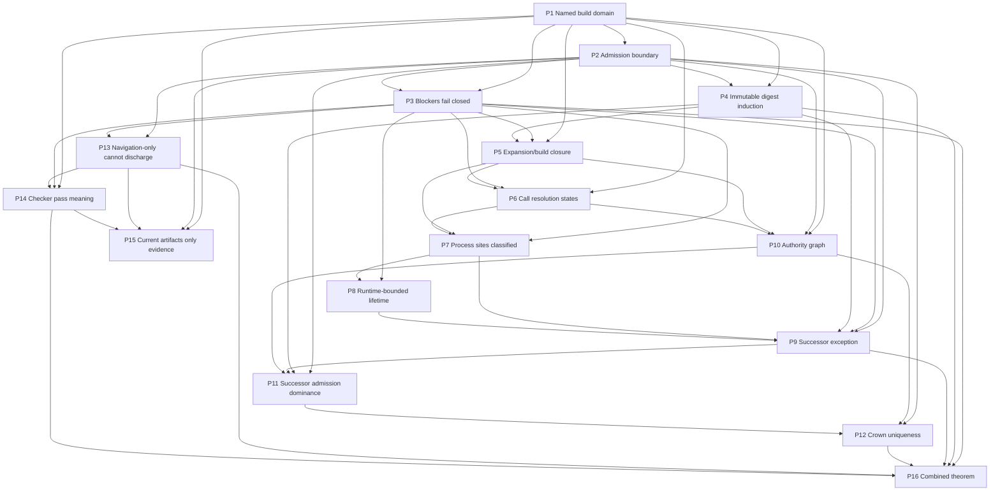

# Detached Process And Crown Proposition Sequence

Status: draft proof-sequence outline, not yet discharged proof
Date: 2026-06-19
Depends on:
- `detached-process-crown-symbolic-invariant-outline.md`
- `detached-process-callgraph-proof-target.md`
- `callgraph-implementation-design-for-detached-process-proof.md`
- `../../../src/prototype1/invariant-ledger.md`
- `../../../../active/agents/2026-06-19_detached-process-crown-proof-spine/traceability.md`

## Purpose

This note refines the symbolic invariant outline into an ordered sequence of propositions and lemmas for the Ploke-loop proof track. It keeps construction facts, admissibility assumptions, and empirical evidence separate. It is not a claim that the current repository already proves the combined theorem.

The sequence is intentionally acyclic: each proposition depends only on earlier propositions, named assumptions, and the construction/evidence mechanisms in `detached-process-crown-symbolic-invariant-outline.md`.

## Claim status labels

Each proposition carries one of these statuses:

```text
proved by construction:
  The proposition follows from the named construction mechanism once that mechanism is implemented and admitted for a named build domain.

conditional on assumptions:
  The proposition follows only if the listed assumptions and earlier propositions hold.

only evidenced:
  Current code, tests, or documents motivate the claim but do not discharge it as a construction-backed proof.
```

`proved by construction` still means construction-relative, not globally proved for every future repository state. The relevant build domain, policy version, artifact identity, and checker version must be named.

## Shared mechanisms and assumptions

Construction mechanisms referenced below use the names from the symbolic invariant outline:

```text
C1. name_build_domain(a, policy) -> b
C2. extract_source_and_expansion(a, b) -> Γ_source
C3. resolve_calls(Γ_source, b) -> Γ_call ∪ blockers
C4. classify_effects(Γ_call, b) -> Γ_effect ∪ blockers
C5. derive_lifetimes(Γ_effect, b) -> Γ_life ∪ blockers
C6. derive_authority_graph(Γ_effect, h, k) -> Γ_auth ∪ blockers
C7. bind_durable_evidence(Γ_life, Γ_auth, h, e) -> Γ_ev ∪ blockers
C8. assemble_obligations(Γ_ev, policy) -> O
C9. check_π(b, Γ_ev, h, e, O) -> ProofResult
C10. record_proof_artifact(ProofResult) -> rec
```

Evidence/admission mechanisms referenced below use:

```text
E1..E9. write_*_record(...) -> rec
admit_D : record -> Option(Evidence_D)
```

Named assumptions used in the propositions:

```text
A1 Compiler/provenance soundness:
  Source spans, macro expansion, cfg selection, build scripts, proc macros, and dependency summaries are represented for the admitted build domain or become blockers.

A2 Build-domain closure:
  No package, target, feature, cfg, profile, toolchain, or environment input outside the named BuildDomain can affect admitted runtime behavior without becoming a blocker.

A3 Policy-surface immutability:
  Checker code, proof policy, History/Crown transition code, surface partition code, Cargo/build policy, process containment wrappers, and admission rules are inside the immutable/protocol-upgrade boundary.

A4 History integrity:
  Sealed History blocks and Crown transition records are append-only or tamper-evident under the admitted storage policy.

A5 Typestate fidelity:
  Authority terms such as `Parent<Retired>`, `Crown<Ruling>`, `Crown<Locked>`, and `Startup<Validated>` cannot be forged outside admitted constructors for the named build domain.

A6 OS containment fidelity:
  Any operating-system containment primitive accepted by the lifetime graph actually enforces the stated process-family cleanup semantics on the target platform.

A7 External summary validity:
  External dependency, command, build-script, and proc-macro summaries are scoped, reviewable, and invalidated when artifact identity, policy, or environment changes.

A8 Logical transition ordering:
  Authority handoff is ordered by admitted History/Crown transition records, not by wall-clock timestamps or process ids.

A9 Checker kernel soundness:
  The proof checker faithfully implements the obligations assembled in C8, returns `Blocked` for proof-critical unknowns, and is itself version-committed by the admitted policy.
```

## Proposition sequence

### P1. Named build domain bounds every proof claim

Statement:

```text
For any construction-backed Ploke-loop proof claim Q, if Q is admitted as evidence for a decision domain D, then Q names a BuildDomain b produced by C1 and the relevant proof policy version.
```

Status: conditional on assumptions.

Required assumptions:

- A2 Build-domain closure.
- A3 Policy-surface immutability.

Dependencies: none.

Informal proof sketch:

C1 constructs `BuildDomain b` from artifact identity and policy inputs. The invariant mechanism `NamedBuildDomain(S)` requires `S.b` to name the exact Cargo/build/proof boundary. Admission through `admit_D` can then require a `BuildDomainFact` record before a proof artifact, history entry, successor handoff, or Crown transition record becomes decision evidence. If C1 is not run, or if a record omits `b`, the construction has no domain in which the claim is meaningful.

Unsupported leaps / blockers:

- This does not prove that the chosen `b` is complete; completeness depends on A2 and later propositions that turn missing inputs into blockers.
- A proof claim over one `b` does not automatically cover tests, examples, other feature sets, other targets, or future dependency versions.

### P2. Records and projections do not become authority without admission

Statement:

```text
For every record rec and decision domain D, record(rec), projection(rec), log(rec), ui_state(rec), and child_self_report(rec) do not imply admissible_D(rec). Only admit_D(rec) = Some(Evidence_D) can make rec a decision input for D.
```

Status: proved by construction.

Required assumptions:

- A4 History integrity for decision domains backed by History/Crown state.

Dependencies:

- P1, because admission must happen inside a named build/proof domain when the record is proof-relevant.

Informal proof sketch:

The evidence mechanism explicitly separates `record(writer, obs)` from `admit_D(rec)`. The invariant predicate `NoNavigationEvidenceForProof(S)` requires navigation-only records to stay out of `ProofArtifactAdmission`. C7 can bind durable evidence only after admission; C10 can record a proof result, but P2 prevents the record from becoming authority unless `admit_ProofArtifactAdmission`, `admit_HistoryAdmission`, `admit_SuccessorAdmission`, or `admit_CrownTransition` accepts it for the relevant domain.

Unsupported leaps / blockers:

- This proposition does not validate any concrete `admit_D` implementation. It fixes the boundary the implementation must enforce.
- GraphRAG visibility, dashboard visibility, or useful operator diagnostics remain non-authoritative unless a later admission rule says otherwise.

### P3. Proof-critical unknowns are blockers, not omissions

Statement:

```text
If a construction step encounters proof_critical_unknown(u), then the resulting state records Blocker(u), and check_π cannot return Pass while u remains an open proof-critical blocker.
```

Status: conditional on assumptions.

Required assumptions:

- A1 Compiler/provenance soundness.
- A9 Checker kernel soundness.

Dependencies:

- P1.
- P2.

Informal proof sketch:

The outline defines `proof_critical_unknown(u) -> X := Blocker(u)` and `BlockersFailClosed(S)`. C2 through C7 may emit blockers alongside graph facts; C8 assembles obligations including open blockers; C9 returns `Blocked(X)` rather than silently treating missing expansion, unresolved calls, unaudited external summaries, missing authority evidence, or missing lifetime evidence as safe. P2 prevents a diagnostic-only record from erasing the blocker unless the proper admission function accepts a resolving evidence record.

Unsupported leaps / blockers:

- The proposition assumes the extractor can recognize which unknowns are proof-critical. If the extractor misses a dangerous site entirely, A1 is violated and the combined theorem is not discharged.

### P4. Immutable policy-surface digest is preserved by ordinary transitions

Statement:

```text
Given an admitted genesis state S_0 with policy-surface digest D, if every transition from S_i to S_{i+1} is ordinary and preserves the immutable policy-bearing surface digest, then every admitted ordinary descendant S_n has digest(policy_surface(S_n.a_n)) = D.
```

Status: conditional on assumptions.

Required assumptions:

- A3 Policy-surface immutability.
- A8 Logical transition ordering.

Dependencies:

- P1.
- P2.

Informal proof sketch:

The invariant mechanism is `ImmutableSurfaceDigestPreserved(S, S')` plus `ProofArtifactMatchesSurface(S)`. C1 binds the build domain to the immutable surface digest; C7 binds durable evidence; successor or History admission accepts a transition only when the transition record is admissible and the digest matches. The proof is ordinary induction: the base state has digest `D`; the step uses the transition predicate `Ordinary(τ, S_i, S_{i+1})`, which requires the digest-preservation predicate; therefore every admitted ordinary descendant preserves `D`.

Unsupported leaps / blockers:

- Protocol upgrades, forks, new-lineage creation, manual repairs, and emergency rewrites are not ordinary transitions here.
- Collision resistance and the correctness of `policy_surface` partitioning remain assumptions, not construction facts in this document.

### P5. Expansion and build closure are either represented or blocked

Statement:

```text
For a named BuildDomain b, every build-domain-relevant macro expansion, proc-macro boundary, build-script effect, cfg branch, and external dependency summary needed by the proof graph is represented in Γ_source/Γ_call or appears as a typed blocker.
```

Status: conditional on assumptions.

Required assumptions:

- A1 Compiler/provenance soundness.
- A2 Build-domain closure.
- A7 External summary validity.

Dependencies:

- P1.
- P3.
- P4, when the closure claim is used across ordinary descendant transitions.

Informal proof sketch:

C2 extracts source and expansion facts for `b`; C3 resolves call edges and records resolution states. The construction fact `CF(ExpansionBoundaryRecorded(site, state, reason?))` makes macro/build/proc-macro/external boundaries visible. Missing expansion or summary evidence produces blockers such as `MacroExpansionNotAvailable`, `ProcMacroSummaryMissing`, `BuildScriptSummaryMissing`, `ExternalDependencySummaryMissing`, or `CfgDomainNotMaterialized`. P3 then prevents the checker from passing while those blockers remain proof-critical.

Unsupported leaps / blockers:

- This is not proved by the current `syn`-only graph. The target requires compiler-aligned extraction or admitted summaries.
- A complete source inventory for one repository state is only evidence until C2/C3 emit admitted construction facts for `b`.

### P6. Every executable edge has a conservative resolution state

Statement:

```text
For a named BuildDomain b, every executable edge relevant to process, durable evidence, History, or authority effects is represented in Γ_call with resolution state Resolved, CandidateSet, Ambiguous, Unresolved, ExternallySummarized, or Blocked.
```

Status: conditional on assumptions.

Required assumptions:

- A1 Compiler/provenance soundness.
- A2 Build-domain closure.
- A7 External summary validity.

Dependencies:

- P1.
- P3.
- P5.

Informal proof sketch:

C3 extends `Γ_source` into `Γ_call` and emits `CF(CallResolutionState(site, state))`. The construction mechanism preserves call-site provenance and expansion context, and dangerous non-resolved states remain visible. P3 gives the fail-closed rule: a process-affecting candidate set, ambiguous edge, unresolved edge, blocked edge, or unaudited external summary cannot be treated as absent.

Unsupported leaps / blockers:

- The proposition does not require all dynamic dispatch to be fully resolved. It requires unresolved or bounded-candidate cases to be explicit.
- It remains blocked if async poll/resume, drop, panic cleanup, trait-object dispatch, function pointers, or foreign calls are outside the extractor domain.

### P7. Every process-affecting site is classified or blocks detached-process proof

Statement:

```text
For a named BuildDomain b, every process-create, process-replace, async task spawn, process-family containment, and relevant external command effect in Γ_call is classified in Γ_effect or contributes a blocker that prevents DetachedProcessSuccessorException from passing.
```

Status: conditional on assumptions.

Required assumptions:

- A1 Compiler/provenance soundness.
- A6 OS containment fidelity for containment claims.
- A7 External summary validity for opaque commands or dependencies.

Dependencies:

- P3.
- P5.
- P6.

Informal proof sketch:

C4 consumes `Γ_call` and emits `CF(EffectClassified(site, class))` for effects such as `OperatingSystemProcessCreate`, `OperatingSystemProcessReplace`, and async/task boundaries. The invariant predicate `AllProcessSitesAccountedFor(S)` requires every process-create/replace site to have either an effect fact or a recorded proof blocker. The predicate `NoUnresolvedDangerousProcessEdges(S)` makes unresolved dangerous sites blockers rather than silently safe edges.

Unsupported leaps / blockers:

- Searching for `.spawn()` is insufficient; process effects hidden behind macros, shell commands, helper crates, build scripts, dependencies, or FFI must be represented or blocked.
- Blocking command forms such as `.output()` or `.status()` still need containment or external-summary evidence for subprocess families when that matters to the proof domain.

### P8. Runtime-bounded process lifetime is established only by lifetime evidence

Statement:

```text
For every non-successor process-affecting site in an admitted ordinary state, the site is runtime-bounded only if Γ_life contains admitted ownership, wait/reap, kill/reap, containment, blocking-call, or stricter external-summary evidence for the target platform and policy.
```

Status: conditional on assumptions.

Required assumptions:

- A6 OS containment fidelity.
- A7 External summary validity.

Dependencies:

- P3.
- P7.

Informal proof sketch:

C5 derives lifetime facts from classified process/effect sites and emits `CF(ProcessLifetimeClassified(site, lifetime))`. The invariant predicate `EveryNonSuccessorProcessRuntimeBounded(S)` requires every process-create site that is not an admitted successor handoff to have runtime-bounded lifetime evidence. If ownership, wait/reap, kill/reap, containment, blocking-call semantics, or an audited external summary is missing, C5 produces `ProcessLifetimeEvidenceMissing` or a more specific blocker, and P3 prevents proof success.

Unsupported leaps / blockers:

- A pid, process group id, ready file, detached stdio setup, or child self-report is not lifetime evidence by itself.
- The proposition does not prove the OS containment primitive; it assumes A6 or requires a separate platform proof.

### P9. Successor handoff is the only admitted detached-process exception

Statement:

```text
If an operating-system process family created by an admitted runtime may outlive that runtime, then the outliving process family must be part of an admitted successor/lineage handoff; otherwise the detached-process obligation is blocked or failed.
```

Status: conditional on assumptions.

Required assumptions:

- A4 History integrity.
- A8 Logical transition ordering.
- A9 Checker kernel soundness.

Dependencies:

- P2.
- P3.
- P7.
- P8.

Informal proof sketch:

The invariant mechanism is `DetachedProcessSuccessorException`, decomposed into `AllProcessSitesAccountedFor`, `NoUnresolvedDangerousProcessEdges`, and `EveryNonSuccessorProcessRuntimeBounded`. C7 binds lifetime facts, authority facts, History evidence, and successor evidence into `Γ_ev`. `SuccessorAdmission` is the only admission domain that can convert handoff evidence into an exception. P2 prevents ready acknowledgements, pids, invocation files, transport records, or child self-reports from becoming authority by themselves.

Unsupported leaps / blockers:

- The successor exception proves an authority/lifetime handoff, not that predecessor and successor OS processes never overlap.
- Future cross-machine migration, forks, and new-lineage creation require separate non-ordinary transition rules.

### P10. Authority graph admits only construction-backed Crown and Parent transitions

Statement:

```text
For a named BuildDomain b and lineage L, Γ_auth can treat a Parent/Crown term as authority-bearing only when the term is produced by admitted constructors and transitions represented in the authority graph; structurally similar records or projections are non-authoritative.
```

Status: conditional on assumptions.

Required assumptions:

- A1 Compiler/provenance soundness.
- A5 Typestate fidelity.
- A4 History integrity for durable authority records.

Dependencies:

- P1.
- P2.
- P5.
- P6.

Informal proof sketch:

C6 derives the authority graph from effects, History, and Crown state and emits `CF(AuthorityTransitionClassified(edge, class))`. It must represent private constructors, move-only transitions, typestate markers, predecessor retirement, Crown lock, and successor admission gates. P2 prevents passive DTOs, serialized mirrors, scheduler rows, GraphRAG projections, or structurally similar records from minting authority unless `admit_CrownTransition` accepts them.

Unsupported leaps / blockers:

- Rust private fields and typestate markers are useful construction mechanisms but not a complete cross-process proof unless serialization, invocation, History sealing, and bootstrap loaders are also represented.
- Current implementation correspondence is only evidence until C6 emits admitted authority facts for a named `b`.

### P11. Successor admission is dominated by History seal, surface digest, predecessor retirement, and exact-one successor evidence

Statement:

```text
For an ordinary transition S -> S', AdmittedSuccessor(S, S') implies SealedHistoryHeadValidated(S.h), ProofArtifactMatchesSurface(S), PredecessorAuthorityRetiredOrLocked(S, S'), and ExactlyOneAdmittedSuccessor(S, S').
```

Status: conditional on assumptions.

Required assumptions:

- A3 Policy-surface immutability.
- A4 History integrity.
- A5 Typestate fidelity.
- A8 Logical transition ordering.

Dependencies:

- P2.
- P4.
- P9.
- P10.

Informal proof sketch:

This proposition is the invariant predicate `SuccessorAdmissionDominatedByHistorySealAndSurfaceDigest(S, S')`. C6 classifies authority transitions; C7 binds History, successor, proof artifact, and digest evidence; C8 assembles the successor-admission obligations; C9 rejects or blocks if any gate is missing. P4 supplies the preserved policy-surface digest condition, P9 supplies the only detached-process exception path, and P10 supplies construction-backed authority transition facts.

Unsupported leaps / blockers:

- A successor ready file, pid, transport acknowledgement, or selected branch is not sufficient without the sealed History and authority evidence.
- Exactly-one successor is lineage-transition scoped; it does not rule out all other OS processes on the machine.

### P12. At most one ruling parent exists per lineage in admitted ordinary states

Statement:

```text
For every admitted ordinary state S and lineage L, |{ r ∈ S.r | ParentRuler(r, L) ∧ LivePermissioned(r) }| ≤ 1.
```

Status: conditional on assumptions.

Required assumptions:

- A4 History integrity.
- A5 Typestate fidelity.
- A8 Logical transition ordering.

Dependencies:

- P2.
- P10.
- P11.

Informal proof sketch:

The invariant mechanism is `AtMostOneRulerParentPerLineage(S)`. P10 ensures only admitted constructors/transitions can create authority-bearing `Parent`/`Crown` terms. P11 ensures successor admission is gated by sealed History, predecessor retirement or lock, proof-surface match, and exactly-one successor evidence. Therefore an ordinary transition cannot admit a new live permissioned ruler for lineage `L` while another remains live and permissioned in the same logical transition order.

Unsupported leaps / blockers:

- This is not global distributed consensus and not OS-process uniqueness. It is local lineage-scoped authority uniqueness under admitted History/Crown semantics.
- If History storage is not append-only or tamper-evident for the admitted domain, A4 fails and the proposition is blocked.

### P13. Navigation-only evidence cannot discharge proof obligations

Statement:

```text
For every state S and record rec in S.e, EvidenceUse(rec) = NavigationOnly implies rec is not an input to ProofArtifactAdmission and cannot satisfy an obligation in O.
```

Status: proved by construction.

Required assumptions:

- A9 Checker kernel soundness when C9 consumes obligations.

Dependencies:

- P2.
- P3.

Informal proof sketch:

The invariant predicate `NoNavigationEvidenceForProof(S)` is explicitly part of the combined theorem target. C7 classifies durable evidence use before binding records into `Γ_ev`; C8 assembles obligations over admitted proof evidence; C9 checks the obligations. A navigation-only GraphRAG or operator record may remain visible for diagnosis, but P2 and the `EvidenceUse` classification prevent it from satisfying `ProofArtifactAdmission`.

Unsupported leaps / blockers:

- A record can be both useful and non-authoritative. The proposition does not ban display or retrieval; it only blocks proof discharge by navigation-only records.

### P14. Checker pass implies all assembled proof obligations were discharged for the named domain

Statement:

```text
If check_π(b, Γ_ev, h, e, O) returns Pass(artifact_id), then every obligation in O assembled by C8 for BuildDomain b was either discharged by admitted construction/evidence facts or was outside O by an explicit policy rule.
```

Status: conditional on assumptions.

Required assumptions:

- A3 Policy-surface immutability.
- A9 Checker kernel soundness.

Dependencies:

- P1.
- P3.
- P13.

Informal proof sketch:

C8 constructs the obligation set from normalized facts and policy; C9 is the proof kernel over `(b, Γ_ev, h, e, O)`. P1 supplies the named domain, P3 ensures proof-critical unknowns remain blockers, and P13 ensures navigation-only evidence does not discharge obligations. Under A9, `Pass` means the checker found no remaining blockers, failures, or unsatisfied obligations in `O` for this exact domain and policy version.

Unsupported leaps / blockers:

- This does not prove obligations omitted from `O`. If C8 or policy under-specifies an obligation, A9 or the policy itself is wrong.
- `Pass` is domain-specific; it is not a repository-wide or future-version guarantee.

### P15. Current repository artifacts are evidence for the sequence, not completion of the proof

Statement:

```text
Current DTO vocabulary, fixture-level checker tests, fail-closed code paths, traceability matrices, and design documents may evidence the feasibility of P1-P14, but they do not by themselves discharge the combined theorem unless admitted construction artifacts exist for a named BuildDomain.
```

Status: only evidenced.

Required assumptions:

- None for the cautionary claim; construction-backed use would require P1-P14.

Dependencies:

- P1.
- P2.
- P13.
- P14.

Informal proof sketch:

The current implementation correspondence in the symbolic invariant outline lists proof DTOs, proof-effect extraction, proof-authority extraction, proof-graph storage, and fixture tests. These are useful evidence and vocabulary. P2 and P13 prevent them from being treated as authority or proof by visibility alone. P14 says only a checker `Pass` over assembled obligations for a named `b` would discharge the construction-backed claim.

Unsupported leaps / blockers:

- Fixture tests are empirical/evaluative evidence. They can catch regressions and demonstrate intended semantics, but they do not prove all build-domain-relevant cases are represented.
- A document, including this one, is not a proof artifact.

### P16. Combined admitted lineage process and Crown safety theorem

Statement:

```text
For every ordinary admitted descendant S_n of an admitted genesis state S_0:
  ImmutableSurfaceDigestInduction(S_0, S_n)
  ∧ DetachedProcessSuccessorException(S_n)
  ∧ CrownRulingLineageUniqueness(S_n)
  ∧ NoNavigationEvidenceForProof(S_n)
  ∧ BlockersFailClosed(S_n)
```

Status: conditional on assumptions.

Required assumptions:

- A1 through A9, each scoped to the named BuildDomain, policy version, platform, History store, and checker artifact.

Dependencies:

- P3.
- P4.
- P9.
- P12.
- P13.
- P14.

Informal proof sketch:

P4 supplies immutable surface digest induction over ordinary transitions. P9 supplies detached-process safety with the admitted successor handoff as the only exception. P12 supplies lineage-scoped Crown/Ruler uniqueness. P13 supplies the evidence-use boundary. P3 supplies fail-closed blocker treatment. P14 supplies the meaning of a checker pass over assembled obligations for the named domain. The conjunction is therefore available only for ordinary admitted descendants whose construction artifacts and checker results have been admitted under the named policy.

Unsupported leaps / blockers:

- The theorem is not currently discharged for the whole repository.
- It excludes protocol upgrades, forks, deliberate new-lineage creation, emergency repair, recovery after power loss, and distributed consensus unless those receive separate transition rules.
- It does not claim that no incompatible process can exist on the host; it claims incompatible processes cannot enter the admitted History/Crown mutation path for the lineage.

## Dependency graph

Adjacency list, with each edge pointing from a proposition to the later propositions that depend on it:

```text
P1  -> P2, P3, P4, P5, P6, P10, P14, P15
P2  -> P3, P4, P9, P10, P11, P12, P13, P15
P3  -> P5, P6, P7, P8, P9, P13, P14, P16
P4  -> P5, P9, P11, P16
P5  -> P6, P7, P10
P6  -> P7, P10
P7  -> P8, P9
P8  -> P9
P9  -> P11, P16
P10 -> P11, P12
P11 -> P12
P12 -> P16
P13 -> P14, P15, P16
P14 -> P15, P16
P15 ->
P16 ->
```

Mermaid view:



## Use notes for downstream proof work

- Treat P1 through P14 as the proof-spine checklist for implementation tasks. If a task produces a fact family, name which proposition consumes it.
- Treat P15 as a guardrail against overclaiming current tests, DTOs, reports, or documents.
- Treat P16 as the theorem target, not as a current status claim.
- A future proof artifact should record the exact `BuildDomain`, policy version, checker artifact id, History head, evidence records, open blockers, and proposition set version used to interpret the result.
