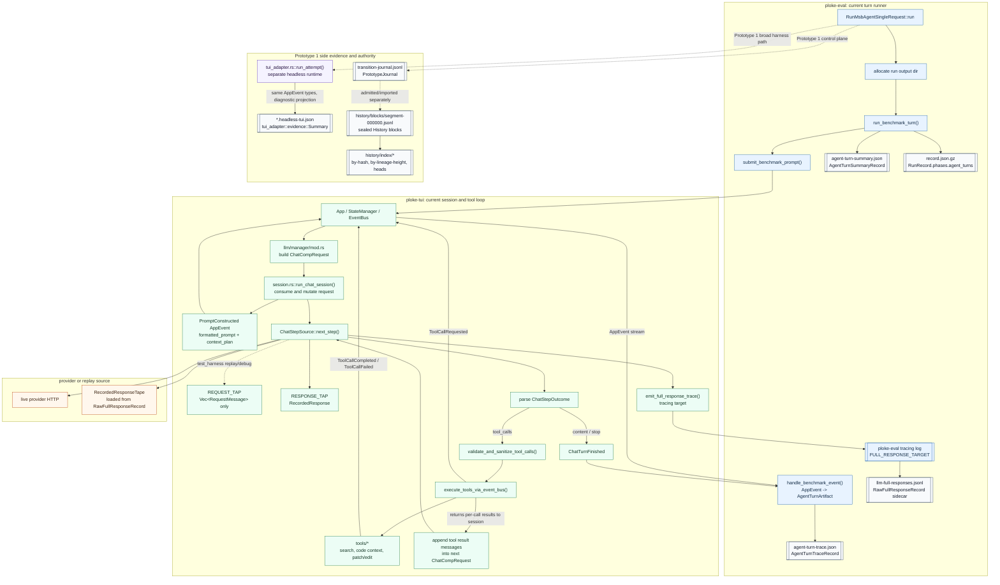

# Agent Turn Timeline Observability

Status: draft architecture target.

Parent design: [`Runtime Playback Observability`](README.md).

This note describes the durable shape we want for observing one agent turn as a
drilldown beneath `RuntimePlayback`: debugging historical/live replay, feeding
future `ploke-egui` detail panes, and eventually giving the patching model a
token-efficient tool for querying prior runs.

## Goal

Represent an agent turn as one typed, iterable timeline of what happened at the
model, tool, edit/proposal, adapter, and terminal boundaries.

The larger runtime playback model decides which turns matter for a lineage,
Artifact ancestry, Runtime, operation, attempt, procedure, chart, or UI frame.
This document defines the turn-level projection once a caller has selected one
of those turns.

An agent-turn timeline should therefore compose with a runtime playback cursor.
The runtime frame decides which turn is selected; the turn timeline provides the
nested sequence of model exchanges, tool executions, edit events, adapter
observations, and terminal events inside that selected runtime step. A UI may
let the operator step within the turn, but that nested cursor should stay
anchored to the parent `RuntimePlayback` cursor and source step.

The timeline should let us answer questions like:

- what exact request did the model see before response N;
- which tool definitions, tool choice, model, route, and request parameters were
  active for that request;
- what provider response produced each tool call;
- how each tool call moved through `ploke-tui` execution;
- what `ploke-eval::tui_adapter` observed or inferred from that execution;
- which edit proposals were created, staged, applied, rejected, or denied;
- what feedback was returned to the next model request;
- what bounded view is useful for CLI, egui, replay, or a future model-facing
  introspection tool.

This is not only a debugging artifact. It is the record/projection spine for the
agent-turn drilldown inside runtime playback.

## Reduction To Avoid

Do not solve this by adding another replay-probe-only snapshot.

A better `next-provider-request` view helps immediate CLI use, but it leaves the
real object split across `agent-turn` artifacts, `llm-full-responses.jsonl`,
`record.json.gz`, in-memory request taps, headless TUI evidence, and
`tui_adapter` summaries.

The durable turn-level object is an agent-turn timeline. Replay probes, CLI
views, egui panels, and model-facing query tools should be consumers of that
timeline.

## Current Fragmentation

Today, useful facts exist, but they live in several places:

- `agent-turn-trace.json` / `agent-turn-summary.json` store ordered observed
  events, the initial `llm_prompt`, final assistant state, patch artifact facts,
  and terminal outcome.
- `llm-full-responses.jsonl` stores normalized provider response envelopes for
  replay.
- `record.json.gz` stores compressed eval run records and nested turn/tool
  records.
- `ploke-tui` request/response taps can capture model-boundary data during
  replay, but the request tap currently keeps only request messages.
- `ploke-eval::tui_adapter` produces headless evidence summaries and tool/edit
  observations used by eval and replay.
- `ploke-tree` already loads agent-turn artifacts and exposes event-level
  playback cursors, but the underlying record is not yet rich enough to be the
  full model/tool/edit timeline.

The cleanup target is not to delete every existing artifact immediately. The
target is to make their relationship explicit and converge them toward a single
logical trace schema.

## Durable Trace Shape

The central persisted object should stay passive and records-owned:

```rust
AgentTurnTraceRecord {
    task_id,
    selected_model,
    issue_prompt,
    user_message_id,
    events: Vec<AgentTurnEventRecord>,
}

AgentTurnEventRecord {
    index,
    occurred_at,
    elapsed_since_turn_start,
    trace_scope_id,
    parent_trace_scope_id,
    source_component,
    observation_class,
    kind,
}

EventObservationClass {
    RuntimeObservation,
    PassiveEvidence,
    AdapterObservation,
    DiagnosticProjection,
    CompatibilityImport,
}

AgentTurnEventKind {
    Model(ModelEventRecord),
    Tool(ToolEventRecord),
    Edit(EditEventRecord),
    Adapter(AdapterEventRecord),
    Message(MessageEventRecord),
    Turn(TurnEventRecord),
}
```

The current `ploke_records::agent_turn::AgentTurnArtifactRecord` is close to
this envelope, but its model-boundary facts are incomplete: `llm_prompt` stores
only messages, and `llm_response` is a summary string, while the full response
envelope lives in `llm-full-responses.jsonl`.

The next schema evolution should add model exchange records rather than only
adding another top-level sidecar.

`observation_class` is part of the base event header, not a renderer-only label.
It distinguishes facts observed at the live runtime boundary, passive persisted
evidence, adapter observations, degraded diagnostics, and compatibility imports
from old artifacts. Consumers may filter or coarsen this field, but they must not
upgrade it.

## Formal Carrier

Do not make the passive record type carry every operation directly. The record
is the durable data shape; the read-side contract is the timeline projection.

The intended carrier split is:

- `ploke-records`
  Defines passive serde schemas and `Record` metadata:
  `AgentTurnTraceRecord`, `AgentTurnEventRecord`, model exchange records, tool
  lifecycle records, edit lifecycle records, and sidecar refs.

- `ploke-eval`
  Projects live observations into records-owned event records at the current
  writer boundary. It decides where records are written, but the schema remains
  records-owned.

- `ploke-tui`
  Executes the session, tools, and proposal lifecycle. It may emit session-local
  structured observations or tap snapshots, but it does not define or depend on
  persisted trace schema.

- `ploke-tree`
  Owns the read-side projection contract over loaded records. The runtime-level
  operator is `RuntimePlaybackRef`; the turn-level drilldown is:

```rust
pub trait AgentTurnGranularity {
    type Step;
    type StepRef<'a>
    where
        Self: 'a;
}

pub struct AgentTurnTimeline<G = TurnFine> {
    steps: Vec<G::Step>,
    _granularity: PhantomData<G>,
}

pub struct AgentTurnTimelineRef<'a, G = TurnFine> {
    trace: &'a AgentTurnTraceRecord,
    index: &'a AgentTurnIndex,
    _granularity: PhantomData<G>,
}
```

Possible granularity markers:

- `TurnFine`: every event in local causal order.
- `ModelExchange`: request/response pairs plus tool-call proposals.
- `ToolLifecycle`: requested/completed/failed calls grouped by tool call id.
- `EditLifecycle`: proposal, stage, apply, reject, deny, and failure states.
- `MessageFlow`: user/assistant/tool message transitions.
- `TimelineSpan`: derived spans for UI and profiling.

This follows the same direction as `RuntimePlaybackRef<'g, G>` and the existing
`RunPlayback<G>` pattern: granularity is a projection level, not an authority
level. The passive record stays simple enough to serialize and migrate; the
timeline projection supplies iteration, filtering, coarsening, replay prefixes,
and bounded views for CLI, egui, and model-facing query tools.

## Event Families

### Model

Model events describe provider-boundary exchanges.

Required facts:

- `exchange_id`;
- response index / sequence index;
- request snapshot reference or inline request snapshot;
- response envelope reference or inline response envelope;
- assistant message id;
- model id, provider/router, route metadata;
- request parameters, tool choice, tool definitions;
- token usage and finish reason when known.

The full request snapshot needs `ChatCompRequest`-level information, not only
`RequestMessage` values. Inspecting tool descriptions and parameter schemas is a
core use case.

### Tool

Tool events describe a tool call lifecycle.

Required facts:

- `tool_call_id`;
- originating `exchange_id`;
- tool name;
- decoded arguments when available;
- raw arguments for replay/debugging;
- current execution status;
- result payload or failure payload;
- result payload visibility to the model.

Tool request/result/failure events should be groupable by `tool_call_id` without
re-parsing strings.

### Edit

Edit events describe proposal and patch lifecycle.

Required facts:

- proposal id;
- creating tool call id;
- target paths;
- candidate edits or patch summary;
- stage/apply/reject/deny state;
- path-policy denial facts;
- workspace diff/hash facts when available;
- whether the model was told "staged", "applied", "rejected", or "failed".

This is where repeated same-file repair and staged-vs-applied confusion should
be visible without reading ad hoc logs.

### Adapter

Adapter events describe what `ploke-eval::tui_adapter` observed or projected
from the live TUI run.

Adapter facts are useful evidence, but they should not pretend to be the source
authority for model or tool execution. They explain the eval boundary:

- headless attempt setup;
- workspace/read-root/write-root policy;
- mapped tool events;
- evidence summary decisions;
- terminal classification;
- replay-probe breakpoint information.

### Message

Message events describe user/assistant/tool message state transitions when that
is useful separately from provider exchanges.

The detailed request view can be derived from model request snapshots, but
message events remain useful for chat history and UI drilldown.

### Turn

Turn events describe terminal turn facts:

- outcome;
- attempt count;
- final assistant message;
- terminal error or success;
- patch artifact summary;
- final workspace/change state when known.

## Link Keys

The schema should make joins cheap and explicit:

- `turn_id` or equivalent artifact identity for one agent turn;
- `assistant_message_id` for response tape and chat-history joins;
- planned `exchange_id` for request/response pairs;
- `response_index` for replay-prefix selection;
- `tool_call_id` for tool request/result/failure grouping;
- `proposal_id` for edit lifecycle grouping;
- `run_record_key` or run path reference for `record.json.gz` joins;
- artifact path and event index for stable cursor links.

Timestamps are audit facts, not ordering authority. Event index inside a turn is
the local ordering spine; sealed History and transition records remain the
larger run-ordering spine.

## Execution Flow Diagrams

These diagrams are intentionally record-oriented. They show where the current
system collects facts during one agent turn, then where the planned timeline
schema should collect the same facts after the refactor.

### Current Fragmented Capture



In the current system, the `agent-turn-*` files are the per-turn event surface,
`llm-full-responses.jsonl` is the replayable provider-response sidecar,
`record.json.gz` is the later compressed run packaging of the turn, and
`*.headless-tui.json` is a Prototype 1 diagnostic projection. The weak point is
the model request side: the replay/debug tap currently keeps only messages, not
the full request boundary.

### Planned Timeline Capture

```mermaid
flowchart TD
    classDef producer fill:#ecfdf5,stroke:#2f855a,color:#123524;
    classDef writer fill:#e8f3ff,stroke:#2b6cb0,color:#102a43;
    classDef timeline fill:#eef2ff,stroke:#4c51bf,color:#1f2251;
    classDef record fill:#f8fafc,stroke:#475569,color:#111827;
    classDef consumer fill:#fff7ed,stroke:#c05621,color:#3b2412;

    subgraph Producers["ploke-tui observations: live session/tool execution"]
        TurnStart["TurnStarted observation<br/>ids, task, model, timing"]
        RequestObs["ChatCompRequest snapshot observation<br/>model, route, params, tools,<br/>tool schemas, tool_choice, messages"]
        ResponseObs["provider response observation<br/>assistant id, exchange id,<br/>response index, usage, finish reason"]
        ToolReqObs["tool requested observation<br/>tool_call_id, raw args,<br/>decoded typed args when available"]
        ToolResultObs["tool completed / failed observation<br/>LLM replay content, UI payload,<br/>error, latency"]
        EditObs["edit lifecycle observation<br/>proposed, staged, applied,<br/>rejected, denied, failed"]
        MessageObs["message observation<br/>assistant/tool/chat message updates"]
        TurnEnd["TurnFinished observation<br/>outcome, attempts, terminal error"]
    end

    subgraph EvalWriter["ploke-eval writer boundary"]
        TraceWriter["AgentTurnTraceWriter / TimelineBuilder<br/>projects observations into records-owned events"]
        SummaryWriter["summary projection writer"]
        RunPackager["run-record packager"]
        AdapterProjection["tui_adapter observation projection<br/>compat diagnostics only"]
    end

    subgraph Timeline["ploke-records: canonical passive schema"]
        AgentTurnTrace["AgentTurnTraceRecord<br/>Vec&lt;AgentTurnEventRecord&gt;"]
        ModelFamily["AgentTurnEventKind::Model"]
        ToolFamily["AgentTurnEventKind::Tool"]
        EditFamily["AgentTurnEventKind::Edit"]
        AdapterFamily["AgentTurnEventKind::Adapter"]
        MessageFamily["AgentTurnEventKind::Message"]
        TurnFamily["AgentTurnEventKind::Turn"]
    end

    subgraph Artifacts["physical artifacts"]
        TraceFile[["agent-turn-trace.json<br/>primary timeline artifact"]]
        SummaryFile[["agent-turn-summary.json<br/>final same-shape sibling artifact"]]
        ResponseSidecar[["llm-full-responses.jsonl<br/>large provider envelope sidecar<br/>linked by assistant id + response index"]]
        RunRecordFile[["record.json.gz<br/>run-level package / joins"]]
        HeadlessFile[["*.headless-tui.json<br/>legacy evidence::Summary diagnostic"]]
        JournalFile[["transition-journal.jsonl<br/>Prototype 1 transition stream"]]
        HistoryBlocksFile[["history/blocks/segment-000000.jsonl<br/>sealed History authority"]]
        HistoryIndexFile[["history/index/*<br/>rebuildable History projections"]]
    end

    subgraph ReadSide["ploke-tree read side"]
        Load["load typed records once"]
        TimelineRef["AgentTurnTimelineRef<br/>borrowed projection"]
        Views["model_exchanges()<br/>request_messages()<br/>tool_executions()<br/>edit_proposals()<br/>replay_prefix()"]
        Consumers["CLI / ploke-egui /<br/>future model-facing query tool"]
    end

    TurnStart --> TraceWriter
    RequestObs --> TraceWriter
    ResponseObs --> TraceWriter
    ToolReqObs --> TraceWriter
    ToolResultObs --> TraceWriter
    EditObs --> TraceWriter
    MessageObs --> TraceWriter
    TurnEnd --> TraceWriter

    TraceWriter --> AgentTurnTrace
    AgentTurnTrace --> ModelFamily
    AgentTurnTrace --> ToolFamily
    AgentTurnTrace --> EditFamily
    AgentTurnTrace --> AdapterFamily
    AgentTurnTrace --> MessageFamily
    AgentTurnTrace --> TurnFamily

    AgentTurnTrace --> TraceFile
    TraceWriter --> SummaryWriter --> SummaryFile
    TraceWriter --> RunPackager --> RunRecordFile
    TraceWriter --> ResponseSidecar
    AdapterProjection --> HeadlessFile

    JournalFile --> HistoryBlocksFile --> HistoryIndexFile

    TraceFile --> Load
    SummaryFile --> Load
    ResponseSidecar --> Load
    RunRecordFile --> Load
    JournalFile --> Load
    HistoryBlocksFile --> Load
    HistoryIndexFile --> Load
    Load --> TimelineRef --> Views --> Consumers

    class TurnStart,RequestObs,ResponseObs,ToolReqObs,ToolResultObs,EditObs,MessageObs,TurnEnd producer
    class TraceWriter,SummaryWriter,RunPackager,AdapterProjection writer
    class AgentTurnTrace,ModelFamily,ToolFamily,EditFamily,AdapterFamily,MessageFamily,TurnFamily timeline
    class TraceFile,SummaryFile,ResponseSidecar,RunRecordFile,HeadlessFile,JournalFile,HistoryBlocksFile,HistoryIndexFile record
    class Load,TimelineRef,Views,Consumers consumer
```



The planned flow does not require one physical mega-file. It requires one
logical timeline object with explicit links to any sidecars. The CLI, egui, and
future model-facing query tool should consume `ploke-tree` projections over that
timeline instead of rediscovering files or reading replay-probe-only snapshots.
This is a planned read-side shape: today, `ploke-tree` loads agent-turn
trace/summary records and run evidence, while replay-specific full-response
sidecar loading still lives in `ploke-eval::replay::llm`.

### Current Overlap Map

The current artifacts do not merely complement each other. Several fact
families are copied, summarized, or projected into more than one place. This is
why a replay/debug reader can easily pick the wrong surface and miss either the
full payload or the authority-bearing record.

```mermaid
flowchart LR
    classDef fact fill:#fff7ed,stroke:#c05621,color:#3b2412;
    classDef primary fill:#e8f3ff,stroke:#2b6cb0,color:#102a43;
    classDef sidecar fill:#ecfdf5,stroke:#2f855a,color:#123524;
    classDef diagnostic fill:#f5f3ff,stroke:#6b46c1,color:#24113f;
    classDef evidence fill:#fefce8,stroke:#a16207,color:#3b2f0b;
    classDef authority fill:#fef2f2,stroke:#c53030,color:#3b1111;
    classDef projection fill:#f1f5f9,stroke:#64748b,color:#111827,stroke-dasharray: 4 4;
    classDef runtime fill:#f8fafc,stroke:#64748b,color:#111827;
    classDef missing fill:#ffffff,stroke:#94a3b8,color:#475569,stroke-dasharray: 5 5;

    subgraph Facts["tracked fact families"]
        TurnIdentity["turn identity<br/>task, prompt, model, user id"]
        RequestFacts["model request<br/>messages, params, tools, route"]
        ResponseFacts["model response<br/>content, usage, finish reason, envelope"]
        ToolRequestFacts["tool request<br/>call id, tool, raw args"]
        ToolResultFacts["tool result<br/>content/error, ui payload, latency"]
        EditFacts["edit/proposal state<br/>proposal id, files, applied/rejected"]
        TerminalFacts["terminal outcome<br/>attempts, summary, error"]
        HistoryFacts["run and lineage facts<br/>artifact, transition, selection"]
        EvalMetricFacts["evaluation metrics<br/>oracle, protocol, compared runs"]
    end

    subgraph CurrentSurfaces["current storage / observation surfaces"]
        Trace[["agent-turn-trace.json"]]
        Summary[["agent-turn-summary.json"]]
        FullResponses[["llm-full-responses.jsonl"]]
        RunRecord[["record.json.gz<br/>RunRecord"]]
        RequestTap[["REQUEST_TAP<br/>in-memory only"]]
        ResponseTap[["RESPONSE_TAP<br/>in-memory only"]]
        Headless[["*.headless-tui.json<br/>bounded diagnostic summary"]]
        Journal[["transition-journal.jsonl"]]
        HistoryBlocks[["history/blocks"]]
        HistoryIndex[["history/index"]]
        FutureRequest[["missing canonical<br/>request snapshot"]]
    end

    TurnIdentity -->|top-level fields| Trace
    TurnIdentity -->|same wire shape| Summary
    TurnIdentity -->|embedded turn artifact| RunRecord
    TurnIdentity -. prompt diagnostics .-> Headless

    RequestFacts -->|llm_prompt messages only| Trace
    RequestFacts -->|same wire shape| Summary
    RequestFacts -->|llm_request model + messages only| RunRecord
    RequestFacts -. messages only .-> RequestTap
    RequestFacts -. previews and counts .-> Headless
    RequestFacts -. route, params, tool schemas missing .-> FutureRequest

    ResponseFacts -->|LlmResponse event and llm_response text| Trace
    ResponseFacts -->|same wire shape| Summary
    ResponseFacts -->|TurnRecord.llm_response and embedded artifact| RunRecord
    ResponseFacts -->|full provider envelope| FullResponses
    ResponseFacts -. recorded response .-> ResponseTap

    ToolRequestFacts -->|ToolRequested event| Trace
    ToolRequestFacts -->|same wire shape| Summary
    ToolRequestFacts -->|ToolExecutionRecord.request and embedded artifact| RunRecord
    ToolRequestFacts -->|bounded Event::ToolRequest| Headless
    ToolRequestFacts -. raw provider tool_calls .-> FullResponses

    ToolResultFacts -->|ToolCompleted or ToolFailed event| Trace
    ToolResultFacts -->|same wire shape| Summary
    ToolResultFacts -->|ToolExecutionRecord.result and embedded artifact| RunRecord
    ToolResultFacts -->|bounded Event::Tool completed/failed| Headless

    EditFacts -->|patch_artifact and tool ui payload| Trace
    EditFacts -->|same wire shape| Summary
    EditFacts -->|PatchPhase and embedded artifact| RunRecord
    EditFacts -->|bounded Event::Proposal and attempts| Headless

    TerminalFacts -->|terminal_record and TurnFinished event| Trace
    TerminalFacts -->|same wire shape| Summary
    TerminalFacts -->|TurnOutcome and embedded artifact| RunRecord
    TerminalFacts -->|terminal and turn event| Headless
    TerminalFacts -. loop status transitions .-> Journal

    HistoryFacts -->|run artifact paths and package| RunRecord
    HistoryFacts -->|append-only transition evidence| Journal
    HistoryFacts -->|sealed lineage authority| HistoryBlocks
    HistoryFacts -->|rebuildable projection| HistoryIndex

    EvalMetricFacts -->|underlying run detail| RunRecord
    EvalMetricFacts -->|selected summaries and citations| HistoryBlocks

    class TurnIdentity,RequestFacts,ResponseFacts,ToolRequestFacts,ToolResultFacts,EditFacts,TerminalFacts,HistoryFacts,EvalMetricFacts fact
    class Trace,Summary,RunRecord primary
    class FullResponses sidecar
    class Headless diagnostic
    class Journal evidence
    class HistoryBlocks authority
    class HistoryIndex projection
    class RequestTap,ResponseTap runtime
    class FutureRequest missing
```



The highest-risk redundancy is not that the same fact is visible twice; some of
that is intentional packaging. The risk is that each copy is a different slice.
For example, `llm-full-responses.jsonl` has the full response envelope but no
request snapshot, while `agent-turn-trace.json` has request messages and
response summaries but not the full request boundary. The durable fix is to make
one timeline event own the identity and link the projections back to it.

Working cleanup posture:

- keep `agent-turn-summary.json`, `record.json.gz`, and `history/index/*` as
  explicit sibling artifacts, packages, or projections, not independent sources
  of new facts;
- preserve `llm-full-responses.jsonl` as a sidecar only when payload size makes
  that useful. Current joins are `assistant_message_id` and `response_index`;
  `exchange_id` becomes available only after model exchange records exist;
- replace the message-only request tap with a session-local request snapshot
  that captures model, route, params, tool definitions, tool choice, and
  messages, then project that snapshot into records-owned schema at the eval
  writer boundary;
- treat `*.headless-tui.json` as diagnostic evidence until its useful facts are
  represented as adapter/edit/tool events in the canonical timeline.

## File And Record Map

Use this map before adding another observability artifact.

### Persisted artifacts

- `agent-turn-trace.json`
  Current per-turn event artifact. Owned by
  `ploke_records::agent_turn::{AgentTurnTraceRecord, AgentTurnArtifactRecord}`.
  Loaded by `ploke-tree` into `AgentTurnRecordSet`.

- `agent-turn-summary.json`
  Same current wire shape as trace, used as the final sibling artifact rather
  than a compact schema. Owned by
  `ploke_records::agent_turn::AgentTurnSummaryRecord`.

- `llm-full-responses.jsonl`
  Provider response sidecar. Owned by
  `ploke_records::llm_response::RawFullResponseRecord`. Useful for replaying
  model output, but it does not contain request snapshots.

- `record.json.gz`
  Compressed eval run record. The active writer still uses the eval-side
  `crates/ploke-eval/src/record.rs::RunRecord`; the shared/read-side mirror is
  `ploke_records::run_record::RunRecord`. `RunRecord.phases.agent_turns` and
  `TurnRecord.tool_calls` are important evidence for branch/run output views,
  but the ownership boundary should converge on records-owned schema rather
  than letting the eval-side compatibility model keep growing. The current
  record also duplicates turn facts internally: extracted `llm_request`,
  `llm_response`, and `tool_calls` sit beside the embedded
  `agent_turn_artifact`.

- headless TUI result JSONs under Prototype 1 message/result directories
  Persist `ploke-eval`'s `tui_adapter::evidence::Summary` projection, including
  bounded events, terminal classification, and attempt summaries. Useful
  historical evidence for run reviews and replay regression discovery, but
  should not be the long-term primary timeline source.

### Runtime artifact locations

These are the locations to check before doing fresh filesystem archaeology:

- `~/.ploke-eval/instances/<instance>/runs/run-*/agent-turn-trace.json`
  Earlier standalone eval attempts.

- `~/.ploke-eval/instances/<instance>/runs/run-*/agent-turn-summary.json`
  Earlier standalone eval attempts.

- `~/.ploke-eval/instances/<instance>/runs/run-*/llm-full-responses.jsonl`
  Earlier standalone eval attempts.

- `~/.ploke-eval/instances/<instance>/runs/run-*/record.json.gz`
  Earlier standalone eval attempts.

- `~/.ploke-eval/instances/prototype1/<campaign>/treatments/<branch>/instances/<instance>/runs/run-*/agent-turn-trace.json`
  Prototype 1 instance run trace artifacts.

- `~/.ploke-eval/instances/prototype1/<campaign>/treatments/<branch>/instances/<instance>/runs/run-*/agent-turn-summary.json`
  Prototype 1 instance run summary artifacts.

- `~/.ploke-eval/instances/prototype1/<campaign>/treatments/<branch>/instances/<instance>/runs/run-*/llm-full-responses.jsonl`
  Prototype 1 instance provider-response sidecars.

- `~/.ploke-eval/instances/prototype1/<campaign>/treatments/<branch>/instances/<instance>/runs/run-*/record.json.gz`
  Prototype 1 compressed run records.

- `~/.ploke-eval/campaigns/<campaign>/prototype1/messages/edit-harness-result/*.headless-tui.json`
  Headless TUI result artifacts produced by older Prototype 1 harness paths.

- `~/.ploke-eval/campaigns/<campaign>/prototype1/transition-journal.jsonl`
  Prototype 1 transition journal. Query with bounded record/width caps only.

- `~/.ploke-eval/campaigns/<campaign>/prototype1/history/blocks/segment-*.jsonl`
  Sealed History block artifacts used as the strongest lineage authority.

- `~/.ploke-eval/campaigns/<campaign>/prototype1/history/index/*`
  Rebuildable History index projections used by run/playback reconstruction.

### Code ownership

- `crates/ploke-records/src/lib.rs`
  Records crate boundary and public module exports.

- `crates/ploke-records/src/agent_turn.rs`
  Passive persisted agent-turn schema. This is the natural home for timeline
  event records, request snapshot records, and model exchange records.

- `crates/ploke-records/src/llm_response.rs`
  Passive full-response sidecar schema. Keep this response-oriented unless the
  sidecar is explicitly replaced by a provider-exchange record.

- `crates/ploke-records/src/run_record.rs`
  Typed compressed run-record schema used by `ploke-tree` and egui-facing run
  record evidence.

- `crates/ploke-records/src/history/payload.rs`
  History payload records that reference run artifacts, including turn trace,
  turn summary, and full response trace paths.

- `crates/ploke-records/src/journal.rs`
  Shared passive Prototype 1 journal record mirror used by read-side loaders.

- `crates/ploke-eval/src/runner.rs`
  Current live-to-record writer boundary for `agent-turn-*` artifacts. It
  projects live `AgentTurnArtifact` into records-owned shapes.

- `crates/ploke-eval/src/record.rs`
  Older eval-side run record and replay/query compatibility model. Treat as a
  legacy/compatibility surface when adding new records-owned schemas.

- `crates/ploke-eval/src/cli/prototype1_state/edit_surface/tui_adapter.rs`
  Headless TUI adapter and replay regression surface. It observes TUI behavior
  and maps it into eval evidence. It should emit or project adapter facts, not
  own the canonical trace schema.

- `crates/ploke-eval/src/cli/prototype1_state/journal.rs`
  Current Prototype 1 transition journal writer/type owner for
  `PrototypeJournal` and live-side `JournalEntry` values.

- `crates/ploke-eval/src/inner/registry.rs`
  Run registration and artifact reference persistence.

- `crates/ploke-eval/src/replay/{turn,llm,probe,probe_text}.rs`
  Current replay CLI/library surface. This should become a consumer of
  `AgentTurnTimelineRef` / exchange projections, not the source of trace
  semantics.

- `crates/ploke-tui/src/llm/manager/session.rs`
  Model session loop, recorded response tape, request tap, response tap, and
  live-step replay boundary. The request tap currently emits only
  `Vec<RequestMessage>`; it should move toward a session-local request snapshot
  that eval can project into records-owned schema.

- `crates/ploke-tui/src/tools/*`
  Tool execution and UI/result payload sources. Tool result payloads should be
  projected into records-owned passive types at the eval/record boundary.

- `crates/ploke-llm/src/router_only/mod.rs`
  `ChatCompRequest<R>` definition, including messages, model key, common params,
  tools, tool choice, and router-specific fields.

- `crates/ploke-llm/src/manager/session.rs`
  In-memory replay primitives: `ResponseIndex`, `RecordedResponse`, and
  `RecordedResponseTape`.

- `crates/ploke-tree/src/store/{fs,evidence,record_set}.rs`
  File loading and read-only record carriers. `RunRecordSet` already carries
  `AgentTurnRecordSet`.

- `crates/ploke-tree/src/playback/turn.rs`
  Current event-level iterator over loaded agent-turn records. This is the
  right direction for cursors and borrowed event steps, but the underlying
  records need richer model exchange data.

- `crates/ploke-tree/src/playback/{coarse,fine}`
  Existing run-level playback projections. Agent-turn timeline playback should
  fit under this family rather than becoming a separate CLI-only iterator.

- `crates/ploke-tree/src/graph/{mod.rs,types.rs,build.rs}`
  Read-side semantic graph boundary and graph construction from `RunRecordSet`.

- `crates/ploke-tree/src/browser.rs`
  Renderer-neutral browser/playback DTOs. Useful for later CLI/egui projection
  experiments, but not source authority.

- `crates/ploke-egui/src/import/mod.rs`
  Imports typed `RunRecordSet` into `ploke-tree::Graph`.

- `crates/ploke-egui/src/ui/inspector.rs`
  Inspector projection model and run-record slots.

- `crates/ploke-egui/src/ui/app/{mod.rs,shell.rs}`
  App shell, graph load/render orchestration, and inspector rendering.

- `crates/ploke-egui/src/run_picker/mod.rs`
  Run-root picker model and diagnostics.

- `crates/ploke-egui/src/diagnostics/*`
  UI-facing diagnostics snapshots and default-view checks.

- `crates/ploke-egui/docs/model/*`
  UI model contracts and graph/source crosswalks.

### Related planning docs

- `docs/active/agents/2026-05-09_run-playback-typed-observability-plan.md`
  Run playback model, iterator shape, granularity, and crate boundary.

- `docs/active/agents/2026-05-12_agent-turn-record-projection-handoff.md`
  Current `agent-turn` record ownership and writer boundary.

- `docs/active/plans/self-improvement-loop/historical-replay-probe-workflow.md`
  Replay-probe operator workflow and current partial implementation.

- `docs/active/archaeology/ploke-tree-graph/run-record-branch-output.md`
  Current graph/egui run-record evidence chain for `record.json.gz`.

- `docs/workflow/evalnomicon/drafts/persistence/map-2026-05-03/*`
  Older persistence maps for campaign run records and protocol/tool evidence.

- `docs/active/agents/ploke-tree-graph-ingestion/*`
  Loader/graph ingestion handoffs and persisted surface surveys.

## Crate Boundary

- `ploke-records`
  Own passive schemas: timeline events, request snapshots, model exchanges,
  tool payload records, edit/proposal records, and `Record` metadata.

- `ploke-eval`
  Assemble and write records at the current live boundary. Use typed projection
  code from live artifacts into records-owned shapes.

- `ploke-tui`
  Execute sessions, tools, and proposals. Emit enough structured runtime events
  or tap snapshots for eval to record. Do not own persisted schema.

- `ploke-tree`
  Load records and build borrowed/owned playback projections:
  graph-backed `RuntimePlaybackRef`, `RuntimePlayback`, turn-level
  `AgentTurnTimelineRef`, and `AgentTurnTimeline`.

- CLI, egui, and model-facing tools
  Render or query projections. They do not infer source truth from filenames,
  logs, or CLI text.

## Iterator And View Model

The timeline should support narrow views without losing the full trace:

```rust
timeline.steps()
timeline.model_exchanges()
timeline.request_messages()
timeline.tool_executions()
timeline.edit_proposals()
timeline.adapter_events()
timeline.replay_prefix(selector)
timeline.model_facing_summary(query, budget)
```

These should be projections over the same loaded record set. Bounded CLI output
and egui detail panes should select from these views rather than introducing new
record fragments.

When the timeline is entered from `RuntimePlayback`, these iterators should also
preserve the parent runtime step or cursor identity. That lets an LLM
request/response pane, tool-call table, edit lifecycle view, artifact graph, and
cost chart all point at the same parent playback position while showing
different nested detail.

## Timeline Spans

Events are the source facts. Spans are derived projections over those facts.

For example:

- a model exchange span joins request snapshot, provider response, response
  sidecar reference, and any provider error/timeout facts;
- a tool execution span joins the requested/completed/failed events for one
  `tool_call_id`;
- an edit lifecycle span joins proposal, stage, apply, reject, deny, and failure
  events for one `proposal_id`;
- an adapter attempt span joins headless setup, observed events, evidence
  summary, and terminal classification.

The read-side shape should look roughly like:

```rust
TimelineSpanRef {
    span_id,
    parent_span_id,
    kind,
    source_event_range,
    causal_order,
    started_at,
    finished_at,
    elapsed,
    weakest_observation_class,
}
```

This gives `ploke-egui` and CLI replay a compact timeline/Gantt view without
turning the span model into the persisted authority. `span_id` and
`parent_span_id` are projection ids derived from event ranges, join keys, and any
runtime trace scope ids; they are not the same as persisted event ids. If span
derivation cannot join a lifecycle cleanly, the projection should emit a warning
or partial span rather than pretending the trace is complete.

## Persistence Strategy

Prefer one logical trace schema over one physical mega-file.

Acceptable storage shapes:

- inline compact records for ordinary timeline events;
- sidecar blobs for large raw request/response bodies if needed;
- stable content hashes or ids linking sidecars back to timeline events;
- compatibility readers for existing `agent-turn-*`, `llm-full-responses.jsonl`,
  and `record.json.gz` until old runs age out.

The rule is that the loaded `AgentTurnTimelineRef` should not require manual
filesystem archaeology by the caller.

## Capture And Timing

Most timeline persistence should be expressible through structured `tracing`
events whose fields are session-local observations or values that project
directly into the records-owned serde types used for durable artifacts.

The capture path should preserve two levels:

- structured trace events for live observability, logs, and low-friction
  instrumentation;
- records-owned serialized artifacts for replay, graph ingestion, CLI, egui,
  and future model-facing queries.

Do not let tracing field names become the only schema. The durable schema lives
in `ploke-records`; `ploke-eval` owns the current conversion from live
observations into those records.

Every event should include timing fields:

- event index inside the agent turn;
- wall-clock timestamp for operator inspection and cross-artifact correlation;
- monotonic elapsed time since turn/session start for profiling;
- optional trace scope id / parent trace scope id when the runtime emits nested
  execution scope data;
- source component, for example model session, tool executor, edit proposal,
  adapter, or replay harness;
- observation class, for example runtime observation, passive evidence, adapter
  observation, diagnostic projection, or compatibility import.

Wall-clock timestamps are useful for profiling and correlation, but they should
not define causal playback order. Event index and typed parent/child links
should carry order; timestamps can flag drift, latency, and surprising gaps.

## Future-Facing Notes

- Schema version every persisted trace shape. Add compatibility readers for old
  `agent-turn-*`, `llm-full-responses.jsonl`, and `record.json.gz` artifacts.

- Align event `observation_class` with playback evidence strength and UI
  authority labels. Coarsening, rendering, and model-facing summaries must
  preserve the weakest relevant observation class rather than presenting mixed
  evidence as if it were all runtime authority.

- Add compatibility readers that can assign observation classes to old
  `agent-turn-*`, response sidecar, run-record, and headless TUI artifacts.

- Keep raw payload size under control. Use bounded previews for default views,
  content hashes or sidecars for large request/response bodies, and explicit
  truncation metadata.

- Redact secrets before persistence. Provider request snapshots must not store
  API keys, auth headers, or environment-derived secrets.

- Preserve full tool definitions and parameter schemas at the model boundary.
  Bad tool descriptions and mismatched validators are first-class failure modes.

- Preserve both raw and decoded forms where useful: raw model arguments for
  replay/debugging, decoded typed arguments for inspection and joins.

- Treat proposal/edit lifecycle as its own event family. Staged, applied,
  rejected, denied, and failed are different states and should not collapse into
  one terminal tool result.

- Make model-facing query tools consume `ploke-tree` projections, not raw files.
  The eventual tool should ask for a bounded view of a timeline, not parse
  `~/.ploke-eval` directly.

- Keep UI performance in mind now: `ploke-egui` should use borrowed projections
  and cache keys instead of rebuilding large timeline strings each frame.

- Make trace writing nonblocking or backpressure-aware. Observability should not
  materially alter loop behavior under load.

## Implementation Gotchas

Keep these current-state constraints visible when starting the next code slice:

- `REQUEST_TAP` is still a test-harness/debug tap over
  `Vec<RequestMessage>`. It does not preserve the full `ChatCompRequest`
  boundary: model key, provider route, params, tool definitions, tool choice,
  and tool schemas are missing.

- `llm-full-responses.jsonl` is not written directly by `ploke-tui`.
  `session.rs` emits a JSON `FullResponseTraceRecord` to the tracing target,
  then `ploke-eval::runner` slices the active tracing log into the run-local
  sidecar. The refactor should either keep that indirection explicit or replace
  it deliberately.

- `ploke-tree` does not currently load the full-response sidecar as part of a
  unified agent-turn timeline. Replay-specific sidecar loading lives in
  `ploke-eval::replay::llm`, while `ploke-tree` loads agent-turn
  trace/summary records and run evidence.

- `record.json.gz` is not yet purely records-owned at the write boundary. The
  active writer still uses `crates/ploke-eval/src/record.rs::RunRecord`; the
  `ploke_records::run_record::RunRecord` shape is the shared/read-side mirror.
  Avoid growing the eval-side compatibility model while adding timeline facts.

- `ploke-eval::tui_adapter` observes a separate headless TUI runtime. It uses
  the same `AppEvent` types as the benchmark runner path, but it is not
  observing the same live event stream. Adapter events should therefore be
  recorded as adapter observations, not as direct session authority.

- `*.headless-tui.json` overlaps tool/edit facts but is bounded and lossy. It
  is useful diagnostic evidence for run reviews and replay discovery, not the
  canonical timeline source.

## First Implementation Slice

The first slice should establish the missing model-boundary structure without
trying to build the whole UI/tooling stack.

1. Add the minimal event header fields: event index, elapsed time, optional trace
   scope ids, source component, and observation class.
2. Add the read-side `AgentTurnTimelineRef` / granularity contract in
   `ploke-tree` without giving it filesystem or CLI authority.
3. Add records-owned request snapshot and provider exchange records.
4. Change the TUI request tap from `Vec<RequestMessage>` to a session-local
   request snapshot that preserves model, params, route, tools, tool choice, and
   messages, then project it to the records-owned request snapshot at the eval
   boundary.
5. Preserve the current response sidecar for replay, but link it to exchange
   records by assistant message id and response index.
6. Add `ploke-tree` borrowed projections for model exchanges and request
   messages over one agent turn.
7. Move replay-probe `next-provider-request` output to render the exchange /
   request projection.
8. Add one synthetic test proving request snapshot, response envelope, tool
   request/result, and next-request tool feedback join into one ordered
   timeline.
9. Add one bounded real-run smoke check over an existing run root that prints
   counts and warnings only.

Stop after this slice. Do not expand directly into egui or the model-facing
query tool until the trace carrier is stable.

## Design Checks

Before adding a new artifact or record:

- Which event family owns this fact?
- What stable id links it to model exchange, tool call, proposal, or turn?
- What source component and observation class does it carry?
- Does any projection preserve the weakest relevant observation class instead of
  upgrading evidence authority?
- Can `ploke-tree` load it into a borrowed projection without parsing CLI text?
- Can CLI, egui, replay, and model-facing tools all consume the same projection?
- Does this reduce the current fragmentation, or add another special case?
