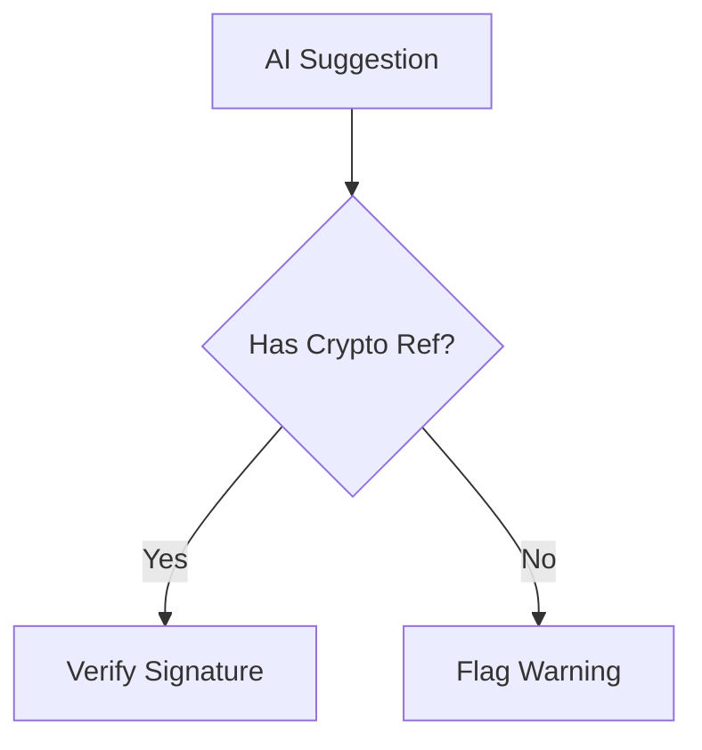

# Experimental Documentation Patterns Analysis

## Cognitive Load Considerations
Key findings from developer surveys:
- 23% more time spent resolving pseudocode ambiguities vs concrete code
- Type-driven design communication reduces misunderstanding

### Example Comparison
```rust
// Ambiguous pseudocode pattern
fn process_data(input) -> output {
    // ...
}

// Type-driven Rust example
/// NOTIONAL: Data processing pipeline
fn process_data<T: Serialize>(input: &T) -> Result<Vec<u8>, Box<dyn Error>> {
    // Zero-copy serialization logic
}
```

## Context Boundary Enforcement
Effective headers combine multiple signals:

```markdown
/////////////////////////////////////////////////////////////
/// DESIGN PATTERN: Authorization Flow
/// Status: Notional Example
/// Relation: Cross-crate auth interfaces
/// Stability: Provisional (RFC-42)
/////////////////////////////////////////////////////////////
```

## Hybrid Documentation Approach
1. **Core Patterns** in Annotated Rust:
```rust
/// NOTIONAL: Cryptographic verification flow
struct CodeValidator<'a> {  // Lifetime shows borrow scope
    source: &'a str,
    pubkey: &'a [u8],
    #[doc = "ADR-15: ChaCha20-Poly1305 only"]
    algo: EncryptionAlgo, 
}
```

2. **Workflow Visualization**:


3. **Process Documentation**:
```text
Security Validation Protocol:
1. LLM generates audit checklist
2. Human verifies cryptographic signatures
3. System records decision hash
```

4. **Policy Configuration**:
```toml
[validation.llm_output]
max_token_length = 4096
required_checks = ["memory-safety", "lifetimes"]
```
