# File Editing Tool System Audit Report

## Executive Summary

This comprehensive audit examines Ploke's file editing system, tracing the complete end-to-end process from LLM tool invocation through actual file modifications. The system demonstrates sophisticated safety mechanisms, strong type safety, and a well-architected multi-layer approach with human-in-the-loop approval workflows.

**Key Findings:**
- ✅ Strong safety-first design with hash verification and atomic operations
- ✅ Comprehensive error handling and idempotency guarantees  
- ✅ Well-structured component architecture with clear separation of concerns
- ✅ Good test coverage in I/O layer, moderate coverage in tool layer
- ⚠️ Limited integration testing across the complete pipeline
- ⚠️ No tests specifically for the RAG processing and proposal generation

## System Architecture Overview

The file editing system consists of 6 main layers:

1. **Tool Interface Layer** - Type-safe LLM tool integration
2. **Processing Layer** - Database resolution and staging logic  
3. **Proposal System** - Human-in-the-loop approval workflow
4. **Command & Event System** - User interaction and system coordination
5. **Execution Layer** - Edit approval/denial handlers
6. **I/O Layer** - Safe atomic file operations

## End-to-End Process Flow

```mermaid
graph TB
    %% External inputs
    LLM[LLM Tool Call] --> |JSON Parameters| GatTool[GatCodeEdit Tool]
    User[User Command] --> |edit approve/deny| Parser[Command Parser]
    
    %% Tool Interface Layer
    subgraph "Tool Interface Layer"
        GatTool --> |Deserialize| Params[CodeEditParams]
        Params --> |Validation| Owned[CodeEditParamsOwned]
        Owned --> |into_owned| Convert[Parameter Conversion]
    end
    
    %% Processing Layer
    subgraph "Processing Layer"
        Convert --> |ApplyCodeEditRequest| ToolFunc[apply_code_edit_tool]
        ToolFunc --> |Idempotency Check| DupCheck{Already Processed?}
        DupCheck --> |Yes| FailFast[Tool Call Failed]
        DupCheck --> |No| ParseEdits[Parse Edit Requests]
        
        ParseEdits --> |Canonical Mode| CanonResolve[Canonical Path Resolution]
        ParseEdits --> |Splice Mode| SpliceValidate[Direct Splice Validation]
        
        CanonResolve --> |DB Query| NodeLookup[(Database Node Lookup)]
        NodeLookup --> |EmbeddingData| WriteSnip[WriteSnippetData Generation]
        SpliceValidate --> WriteSnip
    end
    
    %% Preview Generation
    subgraph "Preview Generation"
        WriteSnip --> FileRead[Read Current File Content]
        FileRead --> |Hash Verification| HashCheck{Hash Matches?}
        HashCheck --> |No| ContentMismatch[Content Mismatch Error]
        HashCheck --> |Yes| InMemoryEdit[In-Memory Edit Application]
        InMemoryEdit --> Preview[Generate Preview]
        Preview --> |Diff Mode| UnifiedDiff[Unified Diff]
        Preview --> |Code Mode| CodeBlocks[Before/After Code Blocks]
    end
    
    %% Proposal System
    subgraph "Proposal System"
        UnifiedDiff --> PropGen[EditProposal Creation]
        CodeBlocks --> PropGen
        PropGen --> |Status: Pending| Registry[(Proposal Registry)]
        Registry --> |Persist| PropStore[Proposal Storage]
        PropGen --> |System Message| UserNotif[User Notification]
        PropGen --> |Tool Completed Event| LLMResponse[LLM Response]
        
        %% Auto-approve path
        PropGen --> |Auto-approve?| AutoCheck{Auto Confirm Enabled?}
        AutoCheck --> |Yes| AutoApprove[Spawn approve_edits]
        AutoCheck --> |No| WaitUser[Wait for User Input]
    end
    
    %% Command Processing
    subgraph "Command & Event System"
        Parser --> |EditApprove| StateCmd[StateCommand::ApproveEdits]
        Parser --> |EditDeny| StateCmdDeny[StateCommand::DenyEdits]
        StateCmd --> |Event Bus| Dispatcher[State Dispatcher]
        StateCmdDeny --> Dispatcher
    end
    
    %% Execution Layer
    subgraph "Execution Layer"
        Dispatcher --> ApproveFunc[approve_edits function]
        Dispatcher --> DenyFunc[deny_edits function]
        AutoApprove --> ApproveFunc
        
        ApproveFunc --> |Status Check| StatusValid{Status Valid?}
        StatusValid --> |No| StatusError[Status Error Message]
        StatusValid --> |Yes| IoCall[Call IoManager.write_snippets_batch]
        
        DenyFunc --> |Mark Denied| PropUpdate[Update Proposal Status]
    end
    
    %% I/O Layer - Atomic Operations
    subgraph "I/O Layer - Atomic File Operations"
        IoCall --> |Per-file Lock| FileLock[Acquire File Lock]
        FileLock --> ReadCurrent[Read Current Content]
        ReadCurrent --> VerifyHash[Verify Expected Hash]
        VerifyHash --> |Hash Mismatch| HashError[Content Mismatch Error]
        VerifyHash --> |Hash Match| ValidateRange[Validate Byte Ranges]
        ValidateRange --> |Invalid| RangeError[Out of Range Error]
        ValidateRange --> |Valid| CharBounds[Check UTF-8 Boundaries]
        CharBounds --> |Invalid| BoundaryError[Invalid Char Boundary Error]
        CharBounds --> |Valid| Splice[Splice Edit Content]
        
        Splice --> NewHash[Calculate New Hash]
        NewHash --> TempFile[Create Temp File]
        TempFile --> WriteTemp[Write to Temp File]
        WriteTemp --> Sync[fsync Temp File]
        Sync --> Rename[Atomic Rename]
        Rename --> DirSync[fsync Parent Directory]
        DirSync --> Success[Return WriteResult]
    end
    
    %% Results and Events
    Success --> |WriteResult| ApplyResult[Apply Results Collection]
    ApplyResult --> |Update Status| StatusApplied[Status: Applied]
    StatusApplied --> |Tool Completed Event| ToolCompleted[Tool Call Completed Event]
    StatusApplied --> |Success Message| UserSuccess[User Success Message]
    StatusApplied --> |Trigger Rescan| Rescan[Schedule Workspace Rescan]
    
    %% Error Paths
    HashError --> FailureHandler[Update Status: Failed]
    RangeError --> FailureHandler
    BoundaryError --> FailureHandler
    ContentMismatch --> FailureHandler
    FailureHandler --> |Tool Failed Event| ToolFailed[Tool Call Failed Event]
    FailureHandler --> |Error Message| UserError[User Error Message]
    
    %% State Persistence
    StatusApplied --> SaveProp[Save Proposals to Disk]
    FailureHandler --> SaveProp
    PropUpdate --> SaveProp
    
    classDef safetyMechanism fill:#e1f5fe
    classDef errorHandling fill:#ffebee
    classDef userInteraction fill:#f3e5f5
    classDef persistence fill:#e8f5e8
    classDef atomicOp fill:#fff3e0
    
    class HashCheck,VerifyHash,ValidateRange,CharBounds,FileLock safetyMechanism
    class FailFast,ContentMismatch,HashError,RangeError,BoundaryError,FailureHandler errorHandling
    class Parser,UserNotif,WaitUser,UserSuccess,UserError userInteraction
    class Registry,PropStore,SaveProp persistence
    class TempFile,Sync,Rename,DirSync atomicOp
```



## Detailed Component Analysis

### 1. Tool Interface Layer (`crates/ploke-tui/src/tools/code_edit.rs`)

**Key Components:**
- `GatCodeEdit`: Main tool implementation implementing the `Tool` trait
- `CodeEditParams<'a>`: Zero-copy deserialization with borrowed data
- `CanonicalEditBorrowed<'a>` / `CanonicalEditOwned`: Memory-efficient parameter handling

**Architecture Strengths:**
- ✅ Strong type safety with compile-time parameter validation
- ✅ Zero-copy deserialization using `Cow<'a, str>` for efficiency
- ✅ Clear separation between borrowed and owned parameter types
- ✅ JSON schema validation for LLM tool calls

**Data Structures:**
```rust
pub struct CodeEditParams<'a> {
    pub edits: Vec<CanonicalEditBorrowed<'a>>,  // Zero-copy edit requests
    pub confidence: Option<f32>,                // Optional confidence score
}

pub struct CanonicalEditBorrowed<'a> {
    pub file: Cow<'a, str>,        // File path (borrowed from JSON)
    pub canon: Cow<'a, str>,       // Canonical path (e.g., "crate::module::function")
    pub node_type: NodeType,       // AST node type for resolution
    pub code: Cow<'a, str>,        // Replacement code
}
```

### 2. Processing Layer (`crates/ploke-tui/src/rag/tools.rs`)

**Key Function:** `apply_code_edit_tool` (460 lines)

**Core Responsibilities:**
1. **Idempotency Control**: Prevents duplicate request processing via proposal registry
2. **Request Validation**: Type-safe deserialization and parameter validation
3. **Database Resolution**: Converts canonical paths to file locations using CozoDB
4. **Preview Generation**: Creates diff or code-block previews for user review
5. **Proposal Staging**: Stores edit proposals in registry for approval workflow

**Safety Mechanisms:**
- ✅ Duplicate request detection using request IDs
- ✅ Empty edit validation with early returns
- ✅ Path canonicalization and validation
- ✅ Database transaction safety for node resolution

**Edit Resolution Process:**
1. **Canonical Mode**: Uses database to resolve `crate::module::function` → file location + byte range
2. **Splice Mode**: Direct byte-range editing with explicit file paths and hashes

### 3. Proposal System (`crates/ploke-tui/src/app_state/core.rs`)

**Core Data Structure:**
```rust
pub struct EditProposal {
    pub request_id: Uuid,
    pub parent_id: Uuid,
    pub call_id: ArcStr,
    pub proposed_at_ms: i64,
    pub edits: Vec<WriteSnippetData>,  // Resolved edit operations
    pub files: Vec<PathBuf>,           // Affected files
    pub preview: DiffPreview,          // User-friendly preview
    pub status: EditProposalStatus,    // State machine status
}

pub enum EditProposalStatus {
    Pending,        // Awaiting user approval
    Approved,       // User approved, not yet applied
    Denied,         // User denied, will not apply
    Applied,        // Successfully applied to files
    Failed(String), // Application failed with error
}
```

**Human-in-the-Loop Workflow:**
- ✅ All edits require explicit approval unless auto-confirm is enabled
- ✅ Rich preview generation (unified diff or before/after code blocks)
- ✅ Persistent proposal storage across application restarts
- ✅ Clear status tracking through the approval lifecycle

### 4. Command & Event System

**Command Processing Flow:**
```
User Input: "edit approve <uuid>"
  ↓ Parser (crates/ploke-tui/src/app/commands/parser.rs)
  ↓ Command::EditApprove(uuid)
  ↓ Executor (crates/ploke-tui/src/app/commands/exec.rs)
  ↓ StateCommand::ApproveEdits { request_id }
  ↓ Dispatcher (crates/ploke-tui/src/app_state/dispatcher.rs)
  ↓ approve_edits() function call
```

**Event System:**
- `SystemEvent::ToolCallRequested`: Initiated when LLM calls tool
- `SystemEvent::ToolCallCompleted`: Success with structured result
- `SystemEvent::ToolCallFailed`: Failure with error message

### 5. Execution Layer (`crates/ploke-tui/src/rag/editing.rs`)

**Key Functions:**
- `approve_edits()`: Validates status, calls IoManager, handles results
- `deny_edits()`: Updates proposal status to denied

**State Machine Validation:**
```rust
match proposal.status {
    EditProposalStatus::Pending => { /* proceed */ }
    EditProposalStatus::Applied => return, // Already applied
    EditProposalStatus::Denied => return,  // Already denied
    EditProposalStatus::Approved => { /* retry allowed */ }
    EditProposalStatus::Failed(_) => { /* retry allowed */ }
}
```

### 6. I/O Layer (`crates/ploke-io/src/write.rs`)

**Atomic Write Operation:** `process_one_write()` (150 lines)

**Safety Mechanisms:**
1. **File Locking**: Per-file async mutexes prevent concurrent modifications
2. **Hash Verification**: Ensures file hasn't changed since indexing
3. **Boundary Validation**: Verifies UTF-8 character boundaries for splice operations
4. **Atomic Operations**: Temp file + fsync + atomic rename pattern
5. **Directory Synchronization**: Best-effort parent directory fsync for durability

**Error Handling:**
```rust
pub enum IoError {
    ContentMismatch { /* file changed since indexing */ },
    OutOfRange { /* invalid byte range */ },
    InvalidCharBoundary { /* UTF-8 boundary violation */ },
    FileOperation { /* underlying I/O error */ },
    // ... other variants
}
```

## Safety Analysis

### Hash-Based Content Verification
- **TrackingHash**: UUIDs generated from file content + metadata
- **Verification Points**: Before any file modification operation
- **Protection**: Prevents editing stale or modified files

### Atomic File Operations
- **Write Process**: Create temp file → write content → fsync → atomic rename
- **Rollback**: Failed operations leave original files untouched
- **Durability**: Directory fsync ensures metadata persistence

### Concurrency Safety
- **File-Level Locking**: Async mutexes prevent race conditions
- **Request Deduplication**: Idempotency via request ID tracking
- **State Machine**: EditProposalStatus prevents invalid state transitions

### Input Validation
- **JSON Schema**: Strong typing for all LLM tool parameters
- **Path Validation**: Canonical path resolution with sandboxing support
- **Range Validation**: UTF-8 boundary and file size checking

## Testing Analysis

### Test Coverage by Component

**Tool Interface Layer** (`code_edit.rs`):
- ✅ 5 unit tests covering parameter deserialization, schema validation, and tool execution
- ✅ Tests cover error cases (missing proposals, invalid parameters)
- ⚠️ No integration tests with actual database or file operations

**I/O Layer** (`ploke-io`):
- ✅ Comprehensive test suite: 3 write-specific tests, 20+ read tests, 10+ integration tests
- ✅ Tests cover atomic operations, hash verification, error conditions
- ✅ Real file system testing with temporary directories

**Processing Layer** (`rag/tools.rs`):
- ❌ No dedicated test suite for `apply_code_edit_tool`
- ❌ No tests for database resolution logic
- ❌ No tests for preview generation

**Proposal System** (`app_state/core.rs`):
- ❌ No tests for EditProposal state machine
- ❌ No tests for proposal persistence
- ⚠️ Integration testing only through end-to-end scenarios

**Command System**:
- ✅ Parser tests exist for command parsing
- ❌ No tests for command execution flow
- ❌ No tests for event handling

### Testing Gaps Identified

1. **Missing Integration Tests**:
   - No tests covering complete tool call → file modification pipeline
   - No tests verifying database resolution with real data
   - No tests for preview generation accuracy

2. **Missing Unit Tests**:
   - RAG processing logic (`apply_code_edit_tool`)
   - Proposal state machine transitions
   - Error handling in approval/denial flow

3. **Limited Error Scenario Coverage**:
   - Database resolution failures
   - Invalid canonical paths
   - Network/system failures during approval

## Error Handling Analysis

### Error Propagation Strategy

The system uses a layered error handling approach:

1. **Tool Layer**: Returns `Result<ToolResult, ploke_error::Error>`
2. **Processing Layer**: Uses `tool_call_failed()` for LLM communication
3. **I/O Layer**: Comprehensive `IoError` enum with detailed context
4. **User Layer**: Human-readable messages via system events

### Error Categories

**Input Validation Errors:**
- Invalid JSON parameters
- Missing required fields
- Invalid canonical paths

**System State Errors:**
- File content mismatches (hash verification failures)
- Concurrent modification attempts
- Invalid proposal status transitions

**I/O Errors:**
- File system permission issues
- Disk space exhaustion
- Network interruptions (for remote file systems)

**Database Errors:**
- Node resolution failures
- Database connectivity issues
- Query timeout conditions

### Recovery Mechanisms

- **Idempotency**: Safe retry for failed operations
- **Rollback**: Atomic operations leave files unchanged on failure
- **User Notification**: Clear error messages with actionable guidance
- **State Persistence**: Proposals saved across application restarts

## Performance Analysis

### Memory Efficiency
- ✅ Zero-copy deserialization with `Cow<'a, str>` types
- ✅ Streaming file operations (no full file loading for small edits)
- ✅ Efficient string handling with `ArcStr` for shared data

### I/O Optimization
- ✅ Per-file locking (allows concurrent edits to different files)
- ✅ Atomic operations minimize file system stress
- ✅ Batch processing for multiple edits

### Database Efficiency
- ✅ Indexed lookups for canonical path resolution
- ✅ Lazy loading of file content only when needed
- ⚠️ No caching layer for repeated node lookups

## Recommendations

### Critical Improvements

1. **Add Integration Test Suite**:
   ```
   Priority: High
   Scope: Create tests covering complete tool call → file write pipeline
   Impact: Catch regressions in multi-component interactions
   ```

2. **Enhance Error Recovery**:
   ```
   Priority: Medium
   Scope: Add retry mechanisms for transient failures
   Impact: Improve reliability in production environments
   ```

3. **Add Performance Monitoring**:
   ```
   Priority: Medium  
   Scope: Instrument critical paths with metrics
   Impact: Enable performance regression detection
   ```

### Minor Improvements

4. **Expand Unit Test Coverage**:
   - Add tests for `apply_code_edit_tool` function
   - Test proposal state machine transitions
   - Add negative test cases for edge conditions

5. **Improve Documentation**:
   - Document the complete edit lifecycle
   - Add architectural decision records (ADRs)
   - Create troubleshooting guides

6. **Performance Optimizations**:
   - Consider caching for frequently accessed nodes
   - Add metrics for operation timing
   - Optimize memory usage in large edit batches

## Conclusion

Ploke's file editing system demonstrates sophisticated engineering with strong safety guarantees, comprehensive error handling, and a well-architected multi-layer design. The system successfully balances automation with human oversight through its proposal-based approval workflow.

**Strengths:**
- Robust safety mechanisms prevent data corruption
- Clear separation of concerns across architectural layers  
- Strong type safety eliminates entire classes of runtime errors
- Comprehensive error handling with good user experience

**Areas for Improvement:**
- Integration test coverage needs expansion
- Some components lack unit tests entirely
- Performance monitoring would help identify bottlenecks

The system is production-ready for controlled environments but would benefit from enhanced testing and monitoring before broader deployment.

---

**Audit Conducted**: 2025-09-03  
**Auditor**: Claude Code AI Assistant  
**Scope**: Complete end-to-end file editing system  
**Methodology**: Static code analysis, architectural review, test coverage assessment