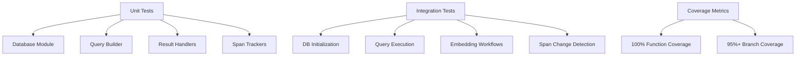

# Ploke-DB Test Coverage Plan

## Test Strategy Overview


## Test Implementation Checklist

### 1. Database Module
- [ ] **Initialization**
  - Test schema creation success
  - Test HNSW index initialization
  - Test re-initialization handling
- [ ] **Query Execution**
  - Test `raw_query()` with valid/invalid scripts
  - Test query result conversions
- [ ] **Embedding Workflows**
  - Test batch embedding updates
  - Test node retrieval for embeddings
  - Test pending embedding counts

### 2. Query Builder
- [ ] **Builder Patterns**
  - Test node type selection
  - Test field validation
  - Test custom LHS fields
- [ ] **Query Generation**
  - Test LHS/RHS string output
  - Test relationship constraints
  - Test invalid field handling

### 3. Result Handlers
- [ ] **Snippet Conversion**
  - Test valid/invalid DB rows
  - Test missing column handling
- [ ] **Formatters**
  - Test plain text output
  - Test JSON serialization
  - Test markdown formatting

### 4. Span Trackers
- [ ] **Version Tracking**
  - Test version recording
  - Test span change detection
  - Test hash collision handling
- [ ] **Edge Cases**
  - Test empty file handling
  - Test single-byte spans
  - Test malformed position data

## Test Execution Commands
```bash
# Run all tests
cargo test

# Generate coverage report (requires cargo-tarpaulin)
cargo tarpaulin --run-types Tests --all-targets --ignore-tests --output-dir target --report-dir coverage

# View HTML coverage report
open target/coverage/tarpaulin-report.html
```

## Required Test Data
1. Sample database schemas
2. Mock embedding vectors
3. File change scenarios for span tracking
4. Malformed query cases

## Coverage Validation
- All error variants must be triggered
- Boundary cases for numeric values
- Null handling in database operations
- Concurrency stress tests
